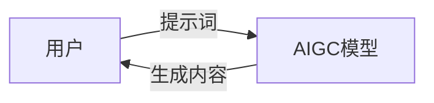
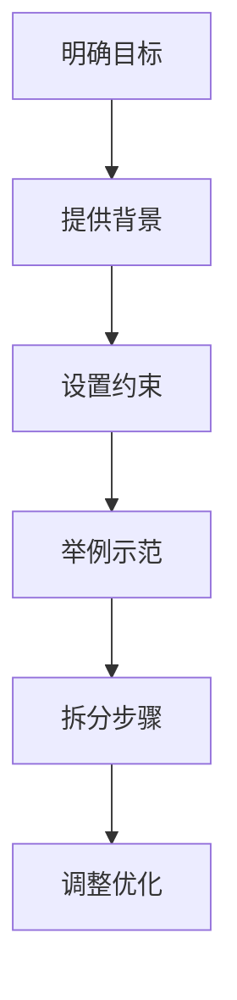

# AIGC从入门到实战：ChatGPT 需要懂得写提示词的人

## 1. 背景介绍
### 1.1 AIGC的兴起
人工智能生成内容（AIGC, Artificial Intelligence Generated Content）正在迅速崛起，成为科技界和内容创作领域的热门话题。AIGC利用人工智能技术，特别是自然语言处理和机器学习，自动生成各种形式的内容，如文本、图像、音频和视频等。

### 1.2 AIGC的代表：ChatGPT
在众多AIGC应用中，ChatGPT无疑是最引人注目的代表之一。ChatGPT是由OpenAI开发的大型语言模型，它能够通过对海量文本数据的学习，生成高质量、连贯、符合上下文的文本内容。ChatGPT的出现，让更多人意识到AI在内容创作方面的巨大潜力。

### 1.3 提示词的重要性
然而，要充分发挥ChatGPT等AIGC工具的能力，仅仅依靠模型本身是不够的。用户需要掌握如何有效地与AI模型交互，而这就涉及到一个关键因素：提示词（Prompt）。提示词是用户输入给AI模型的指令或问题，它决定了AI生成内容的方向和质量。因此，懂得写出优质提示词的人，将在AIGC时代拥有更大的优势。

## 2. 核心概念与联系
### 2.1 提示词的定义
提示词是用户与AI模型交互时使用的自然语言输入，用于指导AI生成所需的内容。它可以是一个问题、一条指令、一段背景信息，或者是这些元素的组合。提示词的目的是为AI提供上下文和方向，使其能够生成符合用户期望的内容。

### 2.2 提示词与AIGC的关系
提示词是AIGC过程中不可或缺的一环。AI模型虽然经过了大量数据的训练，但它们并不具备完全自主创作的能力。用户需要通过提示词来引导AI，告诉它应该生成什么样的内容。提示词的质量直接影响到AIGC的效果，优质的提示词能够激发AI的创造力，生成更加精准、丰富、有价值的内容。

### 2.3 提示词的类型
提示词可以分为几种类型，包括：
- 开放式提示词：给AI一个宽泛的主题或方向，让其自由发挥，如"写一篇关于春天的诗"。
- 特定式提示词：给AI明确的指令和要求，如"用500字总结《红楼梦》的主要情节"。
- 示例式提示词：给AI一个示例，让其模仿或延续，如"以'我爱你，中国'为开头写一段演讲稿"。
- 多步式提示词：通过多个步骤引导AI完成任务，如"1.列出5个热门旅游城市；2.选择其中一个城市，写一篇旅游攻略"。



## 3. 核心算法原理与具体操作步骤
### 3.1 AIGC的核心算法
AIGC的核心算法主要基于深度学习中的Transformer模型。Transformer通过自注意力机制和前馈神经网络，能够处理序列数据，捕捉上下文信息。GPT（Generative Pre-trained Transformer）系列模型，如GPT-2、GPT-3，就是基于Transformer架构，并在大规模语料上进行预训练，从而具备了强大的语言理解和生成能力。

### 3.2 AIGC的训练过程
AIGC模型的训练过程通常包括以下步骤：
1. 数据准备：收集和清洗大量高质量的文本数据，作为训练语料。
2. 预处理：对文本数据进行标记化、编码等预处理操作，转换为模型可以接受的输入格式。
3. 预训练：使用无监督学习方法，在大规模语料上训练模型，让其学习语言的通用特征和规律。
4. 微调：根据具体任务，在预训练模型的基础上进行监督学习，使模型适应特定领域或场景。
5. 生成：给定提示词，使用训练好的模型生成相应的文本内容。

### 3.3 提示词的构建步骤
写出优质提示词的具体操作步骤如下：
1. 明确目标：确定你希望AI生成的内容类型、主题、风格等。
2. 提供背景：给AI必要的上下文信息，帮助它理解任务。
3. 设置约束：给AI明确的指令和要求，如字数、格式、关键词等。
4. 举例示范：可以给AI一个示例，作为参考和启发。
5. 拆分步骤：对于复杂任务，可以将其拆分为多个步骤，逐步引导AI完成。
6. 调整优化：根据AI生成的内容，调整和优化提示词，直到达到满意的效果。



## 4. 数学模型与公式详解
### 4.1 Transformer的数学原理
Transformer的核心是自注意力机制（Self-Attention），它允许模型在处理某个词时，考虑到序列中其他位置的词的影响。具体来说，对于输入序列 $X=(x_1,x_2,...,x_n)$，自注意力机制计算每个位置的表示 $z_i$：

$$
z_i = \sum_{j=1}^n \alpha_{ij} (x_jW^V)
$$

其中，$\alpha_{ij}$ 是位置 $i$ 对位置 $j$ 的注意力权重，通过查询向量 $q_i$、键向量 $k_j$ 和值向量 $v_j$ 的计算得出：

$$
\alpha_{ij} = \frac{\exp(q_i k_j^T / \sqrt{d_k})}{\sum_{j=1}^n \exp(q_i k_j^T / \sqrt{d_k})}
$$

$q_i = x_iW^Q$，$k_j = x_jW^K$，$v_j = x_jW^V$，$W^Q$、$W^K$、$W^V$ 是可学习的参数矩阵，$d_k$ 是键向量的维度。

### 4.2 GPT的生成过程
GPT模型在生成文本时，通过最大化下一个词的条件概率来选择最优的词。给定前面的词 $w_1,w_2,...,w_{t-1}$，GPT计算下一个词 $w_t$ 的条件概率：

$$
P(w_t|w_1,w_2,...,w_{t-1}) = \frac{\exp(e(w_t))}{\sum_{w' \in V} \exp(e(w'))}
$$

其中，$e(w_t)$ 是词 $w_t$ 的嵌入向量，$V$ 是整个词表。GPT通过贪心搜索或束搜索等策略，选择条件概率最大的词作为生成的结果。

### 4.3 提示词的嵌入表示
为了让AIGC模型更好地理解和响应提示词，需要将提示词转换为连续的向量表示，即提示词嵌入（Prompt Embedding）。一种常见的方法是利用预训练的词嵌入模型，如Word2Vec或GloVe，将提示词中的每个词映射为低维稠密向量，然后通过平均或加权等方式，将这些词向量聚合为整个提示词的嵌入向量 $p$：

$$
p = \frac{1}{m} \sum_{i=1}^m e(w_i)
$$

其中，$m$ 是提示词中词的数量，$e(w_i)$ 是词 $w_i$ 的嵌入向量。获得提示词嵌入后，可以将其作为AIGC模型的附加输入，指导模型生成与提示词相关的内容。

## 5. 项目实践：代码实例与详解
下面以Python和Transformers库为例，演示如何使用GPT-2模型进行文本生成。

```python
from transformers import GPT2LMHeadModel, GPT2Tokenizer

# 加载预训练的GPT-2模型和分词器
model = GPT2LMHeadModel.from_pretrained('gpt2')
tokenizer = GPT2Tokenizer.from_pretrained('gpt2')

# 定义提示词
prompt = "Once upon a time, in a faraway land, there was a"

# 对提示词进行编码
input_ids = tokenizer.encode(prompt, return_tensors='pt')

# 使用模型生成文本
output = model.generate(input_ids, 
                        max_length=100, 
                        num_beams=5, 
                        no_repeat_ngram_size=2, 
                        early_stopping=True)

# 解码生成的文本
generated_text = tokenizer.decode(output[0], skip_special_tokens=True)

print(generated_text)
```

代码解释：
1. 首先加载预训练的GPT-2模型和对应的分词器。
2. 定义提示词，这里以"Once upon a time, in a faraway land, there was a"为例。
3. 使用分词器对提示词进行编码，转换为模型可接受的输入格式。
4. 调用模型的generate方法生成文本，设置最大长度、束搜索数量、n-gram重复惩罚和早停等参数。
5. 对生成的文本进行解码，去除特殊标记，得到最终的生成结果。

通过调整提示词和生成参数，可以控制生成文本的内容和风格。

## 6. 实际应用场景
AIGC和提示词技术有广泛的应用场景，包括：
- 文案创作：自动生成营销文案、产品描述、新闻稿等。
- 对话系统：构建智能客服、聊天机器人等对话型应用。
- 教育培训：生成教学材料、试题、反馈等教育内容。
- 创意灵感：为写作、设计、编程等创意任务提供灵感和素材。
- 个性化推荐：根据用户画像和偏好，生成个性化的推荐内容。
- 数据增强：自动生成大量样本数据，用于机器学习模型的训练。

## 7. 工具与资源推荐
- OpenAI API：提供强大的语言模型，如GPT-3，可用于各种AIGC任务。
- Hugging Face：开源的Transformer库，提供多种预训练模型和工具。
- Prompt Engineering：专门研究提示词技术的学术领域，有许多相关论文和资源。
- AIPrompt：分享和探索优质提示词的社区平台。
- Prompt Base：提供多个领域的提示词模板和示例。

## 8. 总结：未来发展趋势与挑战
AIGC和提示词技术正在快速发展，未来有望在更多领域得到应用。同时，也面临一些挑战：
- 提高生成内容的真实性和可靠性，避免假信息和偏见。
- 开发更加智能和灵活的提示词技术，适应不同任务和场景。
- 探索人机协作的新模式，发挥人工智能和人类智慧的互补优势。
- 建立AIGC内容的评估和管理机制，确保其合法合规。

总之，AIGC和提示词技术为内容创作带来了革命性的变化。掌握写出优质提示词的技能，将成为未来AIGC时代的必备能力。让我们共同探索这个充满可能性的领域，用AI赋能内容创作，开启智能化内容生产的新纪元。

## 9. 附录：常见问题与解答
### 9.1 提示词的长度对生成效果有影响吗？
提示词的长度会影响生成内容的质量和相关性。一般来说，较长的提示词可以提供更多背景信息，有助于生成更加具体和连贯的内容。但过长的提示词也可能会限制模型的创造力。因此，需要根据任务的需求，选择合适的提示词长度。

### 9.2 如何避免生成的内容出现偏见或不恰当的信息？
为了减少生成内容的偏见和不恰当信息，可以采取以下措施：
- 在提示词中明确说明要避免偏见和不恰当内容。
- 对训练数据进行筛选和清洗，去除含有偏见和不当信息的样本。
- 在生成过程中设置内容过滤器，过滤掉敏感词和不适宜的表达。
- 对生成的内容进行人工审核和编辑，确保其合规性和适当性。

### 9.3 AIGC生成