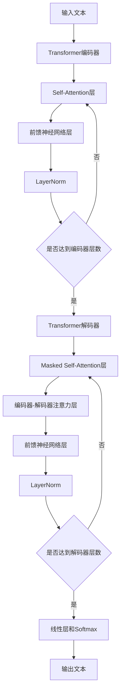

# AIGC从入门到实战：探究：ChatGPT 的原理和成本

## 1. 背景介绍
### 1.1 AIGC的兴起
#### 1.1.1 人工智能的发展历程
#### 1.1.2 AIGC的定义和特点
#### 1.1.3 AIGC的应用前景

### 1.2 ChatGPT的诞生
#### 1.2.1 OpenAI的研究进展
#### 1.2.2 GPT系列模型的演进
#### 1.2.3 ChatGPT的推出和影响

## 2. 核心概念与联系
### 2.1 Transformer架构
#### 2.1.1 Attention机制
#### 2.1.2 Self-Attention
#### 2.1.3 Multi-Head Attention

### 2.2 预训练语言模型
#### 2.2.1 无监督预训练
#### 2.2.2 Masked Language Modeling(MLM)
#### 2.2.3 Next Sentence Prediction(NSP)

### 2.3 微调与迁移学习
#### 2.3.1 微调的概念和作用
#### 2.3.2 迁移学习的优势
#### 2.3.3 ChatGPT中的微调和迁移学习

## 3. 核心算法原理具体操作步骤
### 3.1 Transformer的编码器
#### 3.1.1 输入嵌入
#### 3.1.2 位置编码
#### 3.1.3 编码器层的计算过程

### 3.2 Transformer的解码器  
#### 3.2.1 Masked Multi-Head Attention
#### 3.2.2 编码器-解码器注意力机制
#### 3.2.3 解码器层的计算过程

### 3.3 Beam Search解码策略
#### 3.3.1 Beam Search的基本原理
#### 3.3.2 长度惩罚和重复惩罚
#### 3.3.3 Beam Search在ChatGPT中的应用

## 4. 数学模型和公式详细讲解举例说明
### 4.1 Attention的数学表示
#### 4.1.1 查询、键、值的计算
#### 4.1.2 注意力权重的计算
#### 4.1.3 注意力输出的计算

### 4.2 LayerNorm的数学表示
#### 4.2.1 均值和方差的计算
#### 4.2.2 归一化和缩放平移
#### 4.2.3 LayerNorm在Transformer中的作用

### 4.3 损失函数的数学表示
#### 4.3.1 交叉熵损失
#### 4.3.2 MLM的损失计算
#### 4.3.3 NSP的损失计算

## 5. 项目实践：代码实例和详细解释说明
### 5.1 数据预处理
#### 5.1.1 文本数据的清洗和标记化
#### 5.1.2 构建词汇表
#### 5.1.3 数据集的划分和批处理

### 5.2 模型构建与训练
#### 5.2.1 Transformer模型的代码实现
#### 5.2.2 模型的初始化和加载预训练权重
#### 5.2.3 模型的训练过程和超参数设置

### 5.3 模型推理与评估
#### 5.3.1 模型推理的代码实现
#### 5.3.2 生成文本的策略和技巧
#### 5.3.3 模型评估指标和方法

## 6. 实际应用场景
### 6.1 智能客服
#### 6.1.1 客户问题的理解和分类
#### 6.1.2 个性化回复的生成
#### 6.1.3 客服系统的架构设计

### 6.2 内容创作
#### 6.2.1 文章和新闻的自动生成
#### 6.2.2 广告文案和产品描述的撰写
#### 6.2.3 创意灵感的激发和辅助

### 6.3 教育与培训
#### 6.3.1 智能导师和教学助手
#### 6.3.2 个性化学习路径的规划
#### 6.3.3 互动式教学内容的生成

## 7. 工具和资源推荐 
### 7.1 开源框架和库
#### 7.1.1 Transformers库
#### 7.1.2 FairSeq框架
#### 7.1.3 TensorFlow和PyTorch

### 7.2 预训练模型和数据集
#### 7.2.1 BERT和GPT系列模型
#### 7.2.2 Common Crawl和Wikipedia数据集
#### 7.2.3 领域特定的预训练模型和数据集

### 7.3 开发工具和平台
#### 7.3.1 Google Colab和Jupyter Notebook
#### 7.3.2 云计算平台和GPU资源
#### 7.3.3 可视化和调试工具

## 8. 总结：未来发展趋势与挑战
### 8.1 AIGC的发展趋势
#### 8.1.1 模型的进一步优化和创新
#### 8.1.2 多模态AIGC的探索
#### 8.1.3 AIGC与其他AI技术的融合

### 8.2 ChatGPT的局限性和挑战
#### 8.2.1 数据偏见和伦理问题
#### 8.2.2 推理能力和常识推理的限制
#### 8.2.3 可解释性和可控性的挑战

### 8.3 未来研究方向和展望
#### 8.3.1 更大规模和更高效的预训练方法
#### 8.3.2 人机协作和交互式AIGC
#### 8.3.3 AIGC在垂直领域的深入应用

## 9. 附录：常见问题与解答
### 9.1 ChatGPT的训练成本和资源需求
### 9.2 如何微调和定制ChatGPT模型
### 9.3 ChatGPT生成内容的版权和所有权问题
### 9.4 ChatGPT在实际应用中的部署和集成策略
### 9.5 ChatGPT的安全性和隐私保护措施

ChatGPT是一种基于Transformer架构的大规模语言模型,其核心是利用自注意力机制和前馈神经网络来建模文本序列之间的长距离依赖关系。ChatGPT采用了无监督的预训练方式,在海量的文本数据上进行训练,学习到了丰富的语言知识和生成能力。

在训练过程中,ChatGPT使用了Masked Language Modeling(MLM)和Next Sentence Prediction(NSP)两种预训练任务。MLM任务随机遮挡输入序列中的一部分token,然后让模型预测被遮挡的token;NSP任务则让模型判断两个句子是否前后相邻。通过这两种任务,ChatGPT学习到了文本的上下文信息和句子之间的关系。

ChatGPT的编码器由多个编码器层组成,每个编码器层包括一个Self-Attention层和一个前馈神经网络层。Self-Attention层能够捕捉输入序列中不同位置之间的关联,前馈神经网络层则对Self-Attention的输出进行非线性变换。多个编码器层的堆叠能够建模更加复杂的语言模式。

解码器的结构与编码器类似,但在Self-Attention层之前多了一个Masked Self-Attention层,用于避免在生成过程中看到未来的信息。此外,解码器还引入了编码器-解码器注意力机制,让解码器能够根据编码器的输出动态地调整对输入序列的关注。

在生成文本时,ChatGPT采用了Beam Search解码策略。Beam Search维护了一个大小为$k$的候选集合,每一步都选择概率最高的$k$个候选结果进行扩展,直到生成完整的句子。Beam Search能够在一定程度上平衡生成质量和效率。

ChatGPT的训练成本非常高,需要大量的计算资源和时间。据估计,训练一个GPT-3规模的模型需要数百万美元的成本。为了提高训练效率,通常采用分布式训练和混合精度训练等优化技术。同时,也需要大规模的高质量文本数据来支撑模型的训练。

尽管ChatGPT展现出了惊人的语言理解和生成能力,但它仍然存在一些局限性和挑战。例如,ChatGPT可能会生成有偏见或不恰当的内容,对于一些需要常识推理的任务也难以胜任。此外,ChatGPT生成的内容缺乏可解释性,难以对其决策过程进行解释和控制。

未来,AIGC技术将向着更大规模、更高效、更智能的方向发展。研究人员将探索更先进的预训练方法,如增量学习和对比学习;同时,也将致力于提高模型的可解释性和可控性,实现人机协作的AIGC系统。AIGC技术有望在智能客服、内容创作、教育培训等领域得到广泛应用,为人类创造更多价值。

常见问题:  
1. ChatGPT的训练成本和资源需求非常高,需要大规模的计算资源和数据支持。  
2. 微调ChatGPT需要准备特定领域的数据,选择合适的微调策略,并进行充分的训练和调优。
3. ChatGPT生成的内容版权归模型所有者所有,但具体的所有权界定还有待法律和伦理的进一步明确。
4. 在实际应用中部署ChatGPT需要考虑模型的推理效率、可扩展性、安全性等因素,并与现有系统进行适配和集成。
5. 需要采取数据脱敏、访问控制、输出过滤等措施来保护用户隐私和数据安全,防止模型被恶意利用。

作者：禅与计算机程序设计艺术 / Zen and the Art of Computer Programming