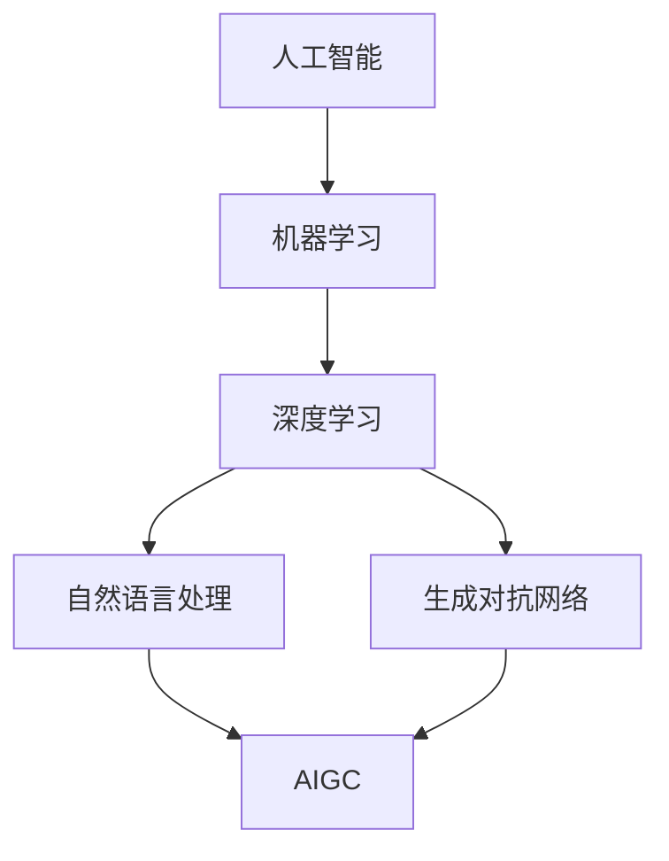

# AIGC从入门到实战：超强的"理科状元"

## 1.背景介绍

人工智能生成内容(AIGC, AI-Generated Content)是指利用人工智能技术自动生成各种形式的内容,如文本、图像、音频、视频等。随着人工智能技术的快速发展,尤其是深度学习和自然语言处理领域的突破,AIGC已经成为当前最热门、最具颠覆性的技术之一。

AIGC的出现正在重塑内容创作的方式,为各行各业带来革命性的变化。传统的内容创作依赖人工,成本高、周期长、产量有限。而AIGC可以在极短时间内生成海量高质量内容,极大提升内容生产效率,降低创作门槛。

目前AIGC已经在多个领域崭露头角,如AI写作、AI绘画、AI音乐、AI视频等,为教育、新闻、娱乐、营销等行业带来巨大的创新机会。未来,AIGC有望彻底改变人类的信息生产和传播方式,成为数字内容领域的"理科状元"。

### 1.1 AIGC的发展历程

#### 1.1.1 AIGC的起源与发展
#### 1.1.2 AIGC发展的里程碑事件
#### 1.1.3 AIGC的未来趋势展望

### 1.2 AIGC的社会影响

#### 1.2.1 AIGC对传统内容行业的冲击
#### 1.2.2 AIGC带来的就业机会转变
#### 1.2.3 AIGC引发的伦理道德问题

## 2.核心概念与联系

要理解AIGC的工作原理,需要了解以下几个核心概念:

### 2.1 人工智能(AI)

人工智能是指由人制造出来的机器所表现出来的智能。其核心是让机器能够像人一样感知、思考、学习和解决问题。目前主流的AI技术包括机器学习、深度学习、自然语言处理等。

### 2.2 机器学习(Machine Learning)

机器学习是实现人工智能的一种方法。其本质是通过算法,让机器从大量数据中自动学习规律,不断优化自身性能。常见的机器学习算法有监督学习、无监督学习、强化学习等。

### 2.3 深度学习(Deep Learning) 

深度学习是机器学习的一个分支,其特点是使用多层神经网络对数据进行建模。相比传统机器学习,深度学习能够处理更加复杂的数据,在语音识别、图像识别、自然语言处理等领域取得了突破性进展。

### 2.4 自然语言处理(NLP)

自然语言处理是人工智能的一个重要分支,旨在让机器能够理解、生成和处理人类语言。NLP涉及语法分析、语义理解、信息抽取、机器翻译、对话系统等多个方向。近年来,以Transformer为代表的预训练语言模型极大地提升了NLP的效果。

### 2.5 生成对抗网络(GAN)

生成对抗网络由生成器和判别器两部分组成,通过二者的博弈学习,可以生成逼真的图像、文本等内容。GAN是AIGC的重要技术手段之一。

以上概念之间的关系如下图所示:



AIGC是以AI为基础,综合运用机器学习、深度学习、自然语言处理、生成对抗网络等多种技术,实现内容的自动生成。理解这些概念之间的联系,有助于我们系统地学习AIGC的原理和应用。

## 3.核心算法原理具体操作步骤

AIGC的核心算法主要包括基于规则的生成方法和基于深度学习的生成方法两大类。下面以文本生成为例,介绍主要算法的原理和操作步骤。

### 3.1 基于规则的文本生成

#### 3.1.1 模板生成法
1. 定义句子的语法结构模板
2. 为模板中的槽位定义可选词表
3. 随机地从词表中抽取词语填充模板
4. 根据需要对生成的句子进行校验和修正

#### 3.1.2 语法生成法
1. 定义语法规则,如CFG文法
2. 从起始符号出发,随机地选择匹配的语法规则进行推导
3. 重复步骤2,直到所有非终结符号被替换为终结符号
4. 输出推导过程生成的句子

### 3.2 基于深度学习的文本生成

#### 3.2.1 RNN文本生成
1. 准备大量文本数据,并进行预处理
2. 搭建RNN语言模型,如LSTM、GRU等
3. 使用训练数据对RNN模型进行训练,优化模型参数
4. 给定起始文本,用训练好的模型进行递归预测,生成后续文本

#### 3.2.2 Transformer文本生成
1. 在大规模语料上预训练Transformer语言模型,如GPT系列
2. 根据任务对预训练模型进行微调,如指定生成主题、风格等
3. 输入提示信息,用微调后的模型进行文本生成
4. 根据需要对生成的文本进行后处理,如去重、过滤等

#### 3.2.3 BERT文本生成
1. 在大规模语料上预训练BERT模型
2. 在下游任务数据上对BERT进行微调,如Seq2Seq生成任务
3. 将输入文本编码为BERT向量,作为Decoder的输入
4. Decoder根据输入向量和之前生成的文本,预测下一个单词
5. 重复步骤4,直到生成完整的文本

以上是AIGC常用的文本生成算法,通过设计合理的网络结构和训练方法,可以生成流畅、连贯、符合特定要求的文本内容。在实际应用中,往往需要针对任务对算法进行改进和优化。

## 4.数学模型和公式详细讲解举例说明

AIGC用到的数学模型和公式较多,这里主要介绍几个典型的例子。

### 4.1 语言模型

语言模型用于刻画单词序列的概率分布,是许多NLP任务的基础。给定单词序列 $w_1, w_2, \dots, w_T$,语言模型的目标是估计该序列的概率:

$$P(w_1, w_2, \dots, w_T) = \prod_{t=1}^T P(w_t | w_1, \dots, w_{t-1})$$

其中 $P(w_t | w_1, \dots, w_{t-1})$ 表示在给定前 $t-1$ 个单词的条件下,第 $t$ 个单词为 $w_t$ 的条件概率。

以 RNN 语言模型为例,设第 $t$ 个单词 $w_t$ 的词向量为 $x_t$,RNN 单元的隐状态为 $h_t$,则有:

$$h_t = f(x_t, h_{t-1})$$

$$P(w_t | w_1, \dots, w_{t-1}) = \text{softmax}(W h_t + b)$$

其中 $f$ 为 RNN 单元的计算函数,如 LSTM、GRU 等;$W$ 和 $b$ 为可学习的参数矩阵和偏置。

训练时,最小化语言模型在训练数据上的交叉熵损失:

$$L = -\sum_{t=1}^T \log P(w_t | w_1, \dots, w_{t-1})$$

预测时,给定起始单词,用语言模型递归地预测后续单词,直到生成完整的句子。

### 4.2 Seq2Seq 模型

Seq2Seq 模型常用于机器翻译、摘要生成等任务,由编码器和解码器两部分组成。

编码器将输入序列 $x_1, x_2, \dots, x_S$ 编码为上下文向量 $c$:

$$h_t = f_{\text{enc}}(x_t, h_{t-1})$$

$$c = q(\{h_1, \dots, h_S\})$$

其中 $f_{\text{enc}}$ 为编码器 RNN 单元的计算函数,$q$ 为上下文向量的计算函数,如取最后一个隐状态,或对所有隐状态做加权求和等。

解码器根据上下文向量 $c$ 和之前生成的单词,预测下一个单词:

$$s_t = f_{\text{dec}}(y_{t-1}, s_{t-1}, c)$$

$$P(y_t | y_1, \dots, y_{t-1}, c) = \text{softmax}(W s_t + b)$$

其中 $f_{\text{dec}}$ 为解码器 RNN 单元的计算函数,$y_t$ 为解码器在 $t$ 时刻生成的单词。

训练时,最小化解码器在训练数据上的交叉熵损失:

$$L = -\sum_{t=1}^T \log P(y_t | y_1, \dots, y_{t-1}, c)$$

预测时,给定输入序列,用编码器将其编码为上下文向量,再用解码器根据上下文向量生成目标序列。

### 4.3 注意力机制

注意力机制能够让模型动态地聚焦于输入数据中的重要部分,提高了模型的表达能力。以 Seq2Seq 模型中的注意力机制为例:

$$e_{ti} = v^\top \tanh(W_s s_t + W_h h_i)$$

$$\alpha_{ti} = \text{softmax}(e_{ti})$$

$$c_t = \sum_{i=1}^S \alpha_{ti} h_i$$

其中 $e_{ti}$ 为解码器在 $t$ 时刻对编码器第 $i$ 个隐状态的注意力分数,$\alpha_{ti}$ 为归一化后的注意力权重,$c_t$ 为 $t$ 时刻的注意力上下文向量。解码器根据 $c_t$ 和 $s_t$ 来预测下一个单词。

注意力机制的引入,使得解码器可以在生成每个单词时,自适应地分配对输入序列中各个部分的注意力,从而更好地利用输入信息。

### 4.4 生成对抗网络

GAN 由生成器 $G$ 和判别器 $D$ 组成,两者互为对抗,最终达到纳什均衡。以文本生成为例:

生成器 $G$ 以随机噪声 $z$ 为输入,生成文本序列 $\tilde{x} = G(z)$。判别器 $D$ 以文本序列 $x$ 为输入,输出其为真实样本的概率 $D(x)$。

训练时,生成器 $G$ 试图生成接近真实样本的文本,最大化 $D(G(z))$;判别器 $D$ 试图区分真实样本和生成样本,最大化 $\mathbb{E}_{x \sim p_{\text{data}}} [\log D(x)]$ 和 $\mathbb{E}_{z \sim p_z} [\log (1 - D(G(z)))]$。

GAN 的目标函数可以表示为:

$$\min_G \max_D V(D, G) = \mathbb{E}_{x \sim p_{\text{data}}} [\log D(x)] + \mathbb{E}_{z \sim p_z} [\log (1 - D(G(z)))]$$

通过生成器和判别器的反复博弈,最终生成器可以生成接近真实样本的文本。

以上是 AIGC 中几个常见的数学模型和公式,通过合理地设计模型结构和目标函数,并用大规模数据进行训练,可以实现高质量的内容生成。在实践中,还需要考虑模型的可解释性、鲁棒性、公平性等因素。

## 5.项目实践：代码实例和详细解释说明

下面以 PyTorch 为例,演示如何实现一个基于 LSTM 的文本生成模型。

### 5.1 数据准备

首先,我们需要准备一个文本数据集,并将其划分为训练集和验证集。这里以莎士比亚作品集为例:

```python
import os
from torch.utils.data import Dataset, DataLoader

class ShakespeareDataset(Dataset):
    def __init__(self, data_dir, tokenizer):
        self.data_dir = data_dir
        self.tokenizer = tokenizer
        self.texts = []
        
        for file in os.listdir(data_dir):
            with open(os.path.join(data_dir, file), 'r', encoding='utf-8') as f:
                self.texts.append(f.read())
        
        self.encoded_texts = [tokenizer.encode(text) for text in self.texts]
    
    