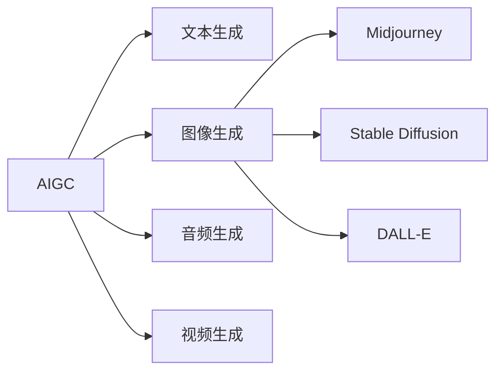
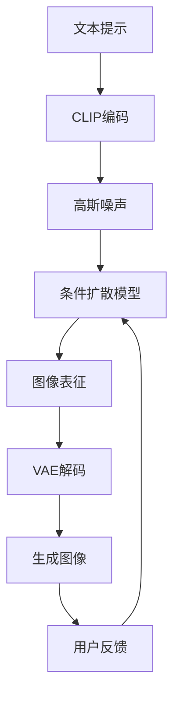

# AIGC从入门到实战：跟着我学习 Midjourney 的使用

## 1. 背景介绍

### 1.1 AIGC的兴起与发展
近年来,人工智能生成内容(AIGC)技术得到了飞速发展。从OpenAI推出的GPT系列语言模型,到Stable Diffusion、DALL-E等图像生成模型,再到最近大火的Midjourney,AIGC正在深刻改变我们创作和获取内容的方式。

### 1.2 Midjourney简介
Midjourney是一个基于Discord的AI绘图工具,通过简单的文本描述,就能生成栩栩如生的图像。它由Midjourney公司开发,于2022年推出Beta版本,迅速吸引了大量用户。Midjourney以其强大的生成能力和独特的艺术风格,成为了AIGC领域的一颗新星。

### 1.3 本文的目的与结构
本文旨在为读者提供一份全面的Midjourney入门与实战指南。我们将从Midjourney的基本概念出发,详细讲解其背后的算法原理,并通过丰富的案例演示Midjourney的实际应用。同时,本文还将介绍相关工具和资源,帮助读者进一步探索AIGC的世界。

## 2. 核心概念与联系

### 2.1 AIGC的定义与分类
AIGC泛指利用人工智能技术自动或半自动生成各类内容(如文本、图像、音视频等)的方法和系统。根据生成内容的类型,AIGC可分为文本生成、图像生成、音频生成、视频生成等子领域。

### 2.2 Midjourney的定位与特点
Midjourney是一款图像生成类AIGC工具,它基于扩散模型(Diffusion Model)实现从文本到图像的跨模态生成。与同类产品相比,Midjourney的优势在于:
1. 生成图像质量高,细节丰富,艺术感强
2. 支持多种参数调节,可控性强
3. 基于Discord,交互便捷,社区活跃

### 2.3 AIGC与传统内容创作的区别
与传统内容创作相比,AIGC具有以下特点:
1. 生成速度快,可批量化生产
2. 成本低,不受时间地点限制 
3. 创意来源于海量数据,有利于激发灵感
4. 仍需人工参与编辑和审核,确保内容质量



## 3. 核心算法原理与操作步骤

### 3.1 扩散模型(Diffusion Model)简介
扩散模型是一类生成模型,通过迭代式的去噪过程,将随机噪声逐步转化为清晰图像。其基本思想是:将复杂的数据分布(如图像)转化为简单的先验分布(高斯分布),再通过逆向迭代还原原始数据。

### 3.2 Midjourney的训练流程
Midjourney的训练流程可概括为以下步骤:
1. 收集大规模图文对齐数据集
2. 对图像进行VAE编码,提取压缩表征
3. 训练条件扩散模型,学习噪声与图像的映射
4. 训练CLIP模型,实现文本-图像的跨模态对齐

### 3.3 Midjourney的生成流程
给定文本提示,Midjourney的图像生成流程如下:
1. 将文本提示编码为语义向量
2. 随机采样高斯噪声,作为初始输入
3. 通过扩散模型迭代去噪,生成图像表征
4. 用VAE解码器将图像表征还原为像素图像
5. 根据用户反馈,调整模型参数,优化生成结果



## 4. 数学模型与公式详解

### 4.1 VAE(变分自编码器)
VAE由编码器$q_\phi(z|x)$和解码器$p_\theta(x|z)$组成,其中$z$为隐变量。VAE的目标是最大化边际似然:

$$\log p_\theta(x) \geq \mathbb{E}_{q_\phi(z|x)}[\log p_\theta(x|z)] - D_{KL}(q_\phi(z|x)||p(z))$$

其中$D_{KL}$为KL散度,用于衡量$q_\phi(z|x)$与先验$p(z)$的差异。

### 4.2 扩散模型
扩散模型通过马尔可夫链$q(x_{1:T}|x_0)$将数据$x_0$逐步添加噪声,得到含噪声的数据序列$x_{1:T}$。其中每一步噪声添加过程为:

$$q(x_t|x_{t-1}) := \mathcal{N}(x_t; \sqrt{1-\beta_t} x_{t-1}, \beta_t \mathbf{I})$$

其中$\beta_t$为噪声强度,随时间步$t$增大而增大。

反向去噪过程通过学习逆转条件概率$p_\theta(x_{t-1}|x_t)$实现,其目标是最大化似然:

$$p_\theta(x_0) := \int p_\theta(x_{0:T}) dx_{1:T} = \int p(x_T) \prod_{t=1}^T p_\theta(x_{t-1}|x_t) dx_{1:T}$$

### 4.3 CLIP(对比语言-图像预训练)
CLIP通过对比学习,将文本和图像映射到同一语义空间,使得它们的内积相似度反映语义相关性:

$$\mathcal{L} = \mathbb{E}_{(x,y) \sim D} [\log \frac{\exp(f(x)^\top g(y))}{\sum_{(x',y') \sim D} \exp(f(x)^\top g(y'))}]$$

其中$f$和$g$分别为图像编码器和文本编码器,$D$为图文对齐数据集。

## 5. 项目实践：代码实例与详解

下面我们通过Python代码,演示如何调用Midjourney API实现AI绘图。

### 5.1 安装依赖库
首先安装必要的Python库,包括`discord`、`requests`等:

```bash
pip install discord requests
```

### 5.2 导入Midjourney API
导入Midjourney API相关模块:

```python
import discord
import requests
import json

client = discord.Client()
```

### 5.3 设置API密钥
在代码中配置Midjourney API密钥:

```python
API_URL = "https://api.midjourney.com/v1/jobs"
API_KEY = "your_api_key"
```

将`your_api_key`替换为你的实际API密钥。

### 5.4 定义生成函数
定义`generate_image`函数,用于向Midjourney发送图像生成请求:

```python
async def generate_image(prompt):
    headers = {
        "Content-Type": "application/json",
        "Authorization": f"Bearer {API_KEY}"
    }
    data = {
        "prompt": prompt,
        "width": 512,
        "height": 512,
        "num_images": 1
    }
    response = requests.post(API_URL, headers=headers, data=json.dumps(data))
    
    if response.status_code == 200:
        result = response.json()
        image_url = result["result"][0]["image"]
        return image_url
    else:
        return None
```

### 5.5 接收Discord消息事件
监听Discord消息事件,当收到`!imagine`命令时触发图像生成:

```python
@client.event
async def on_message(message):
    if message.content.startswith("!imagine"):
        prompt = message.content[8:].strip()
        if prompt:
            image_url = await generate_image(prompt)
            if image_url:
                await message.channel.send(image_url)
            else:
                await message.channel.send("图像生成失败,请稍后重试。")
```

### 5.6 运行Discord机器人
启动Discord机器人,开始接收消息:

```python
client.run("your_discord_bot_token")
```

将`your_discord_bot_token`替换为你的实际Discord机器人令牌。

至此,一个基于Midjourney API的AI绘图机器人就开发完成了。用户可以在Discord中使用`!imagine`命令,跟随文本提示生成相应的图像。

## 6. 实际应用场景

Midjourney所生成的图像可以应用于多种场景,例如:

### 6.1 设计创意
利用Midjourney生成各类设计素材,如海报、封面、插画等,为设计师提供灵感和参考。

### 6.2 艺术创作
Midjourney能生成风格多样的艺术图像,可用于绘画、摄影等艺术创作领域,激发艺术家的想象力。

### 6.3 游戏开发
利用Midjourney快速生成游戏场景、角色、道具等概念图,加速游戏开发流程。

### 6.4 影视制作
Midjourney可用于生成电影、动画的分镜头、概念设计图,为影视制作提供视觉参考。

### 6.5 广告营销
结合Midjourney生成的图像制作广告、宣传材料,提升视觉吸引力和传播效果。

## 7. 工具和资源推荐

### 7.1 官方网站
- [Midjourney官网](https://www.midjourney.com/)
- [Discord社区](https://discord.gg/midjourney)

### 7.2 教程与课程
- [Midjourney Prompt指南](https://docs.midjourney.com/docs/prompts)
- [Midjourney参数手册](https://docs.midjourney.com/docs/parameter-list)
- [AIGC原理与实践课程](https://www.example.com/aigc-course)

### 7.3 开源项目
- [Stable Diffusion](https://github.com/CompVis/stable-diffusion)
- [DALL-E Mini](https://github.com/borisdayma/dalle-mini)
- [CLIP](https://github.com/openai/CLIP)

### 7.4 其他AIGC工具
- [ChatGPT](https://chat.openai.com/)：自然语言对话模型
- [Whisper](https://openai.com/blog/whisper/)：语音识别模型
- [Runway](https://runwayml.com/)：视频编辑与特效工具

## 8. 总结：未来发展趋势与挑战

### 8.1 AIGC的发展趋势
- 多模态融合:文本、图像、音频、视频等多种形式的内容生成将进一步结合,实现更自然、更丰富的人机交互。
- 个性化定制:AIGC模型将根据用户画像和反馈进行个性化调优,生成更符合用户需求的内容。
- 实时交互:AIGC技术与增强/虚拟现实等技术结合,实现实时的内容生成和交互体验。

### 8.2 AIGC面临的挑战
- 版权与伦理:AIGC生成的内容是否侵犯原作者版权,如何规范AIGC的使用范围,是亟待解决的伦理问题。
- 生成质量控制:如何评估和保证AIGC生成内容的质量,避免假信息、有害内容的产生和传播。
- 人机协作:如何设计更好的人机协作方式,发挥人工智能的同时,也发挥人类的创造力和判断力。

AIGC技术正在蓬勃发展,以Midjourney为代表的图像生成工具为内容创作开辟了新的可能性。展望未来,AIGC将与更多领域深度融合,不断突破技术瓶颈,创造更多惊喜。同时,我们也要审慎对待AIGC带来的挑战,在发展技术的同时,兼顾伦理、法律等因素,让AIGC造福社会。

## 9. 附录：常见问题与解答

### 9.1 Midjourney的使用是否收费?
目前Midjourney提供25次的免费试用额度,超出后需要购买订阅计划。订阅价格为每月10美元(标准版)或30美元(专业版)。

### 9.2 Midjourney生成的图像可以商用吗?
根据Midjourney的服务条款,用户拥有生成图像的全部权利,可以用于商业用途。但是,由于训练数据的版权问题,建议谨慎使用,必要时咨询法律意见。

### 9.3 在Discord上使用Midjourney需要注意什么?
加入Midjourney的Discord社区后,