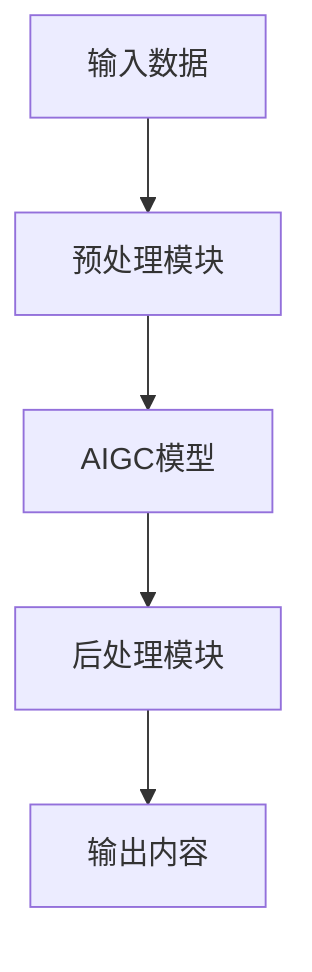
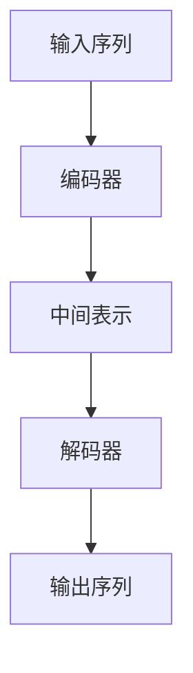
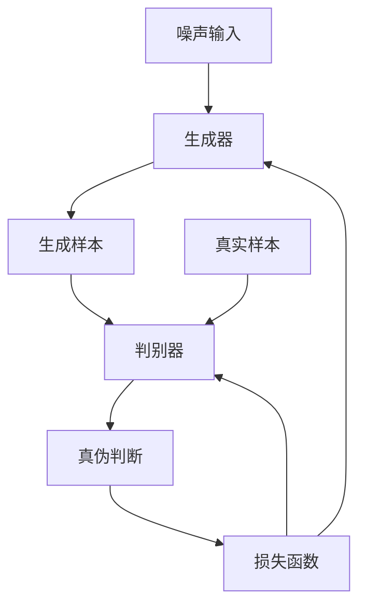
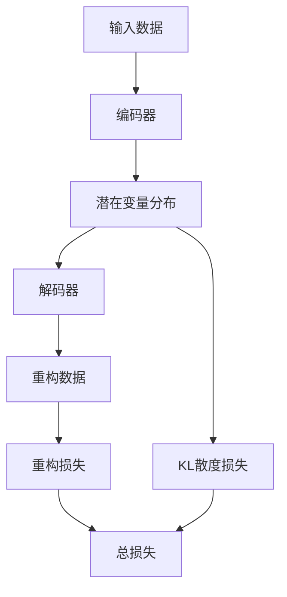

# AIGC从入门到实战：进行硬件部署和运行工程源码

## 1.背景介绍

### 1.1 AIGC的兴起

人工智能生成内容(AIGC)是一种利用人工智能技术生成文本、图像、音频、视频等各种形式内容的新兴技术。近年来,AIGC技术取得了长足进步,在各个领域都有广泛应用,引起了全球关注。

### 1.2 AIGC的重要性

AIGC技术可以极大提高内容生产效率,降低成本,为创作者提供强有力的辅助工具。同时,AIGC也可应用于内容审核、智能问答、个性化推荐等多个场景,对提升用户体验有重要作用。

### 1.3 硬件部署的必要性 

要高效运行AIGC模型,需要强大的计算能力支持。常规CPU已无法满足要求,因此需要在GPU、TPU等硬件加速器上部署和运行AIGC模型。硬件部署对于发挥AIGC的全部潜力至关重要。

## 2.核心概念与联系

### 2.1 AIGC核心技术

AIGC的核心技术包括:

- 自然语言处理(NLP)
- 计算机视觉(CV) 
- 生成式对抗网络(GAN)
- 变分自动编码器(VAE)
- transformer模型
- 大型语言模型(GPT、BERT等)

这些技术相互关联,共同推动了AIGC的发展。

### 2.2 AIGC系统架构

一个典型的AIGC系统架构包括:



其中预处理和后处理模块负责数据处理,AIGC模型是核心部分,完成实际的内容生成任务。

### 2.3 硬件部署要素

硬件部署需要考虑以下几个方面:

- 计算能力(GPU/TPU数量)
- 内存容量
- 网络带宽
- 存储空间
- 冷却系统
- 供电系统

这些因素共同决定了硬件部署的性能和成本。

## 3.核心算法原理具体操作步骤  

### 3.1 Transformer模型

Transformer是AIGC中常用的序列到序列模型,包括编码器和解码器两部分。编码器将输入序列编码为中间表示,解码器则根据中间表示生成输出序列。

Transformer的核心是多头注意力机制,可并行计算输入序列中每个元素与其他元素的关系,大大提高了效率。



### 3.2 生成式对抗网络

生成式对抗网络(GAN)包括生成器和判别器两部分。生成器从噪声输入生成样本,判别器判断样本是真实数据还是生成数据。两者相互对抗训练,最终使生成器能生成逼真的样本。

GAN常用于图像、视频等连续数据的生成。



### 3.3 变分自动编码器

变分自动编码器(VAE)是一种生成模型,由编码器和解码器组成。编码器将输入数据编码为潜在变量的分布,解码器则从潜在变量重构原始数据。

VAE通过最小化重构损失和KL散度损失进行训练,可以学习数据的潜在表示,并生成新样本。



## 4.数学模型和公式详细讲解举例说明

### 4.1 Transformer注意力机制

Transformer使用了多头注意力机制,可以并行捕捉输入序列中元素之间的关系。对于长度为n的查询序列Q、键序列K和值序列V,注意力计算公式为:

$$\mathrm{Attention}(Q, K, V) = \mathrm{softmax}(\frac{QK^T}{\sqrt{d_k}})V$$

其中$d_k$是缩放因子,用于防止内积过大导致梯度消失。多头注意力则是将注意力分成多个头,分别计算后拼接结果:

$$\mathrm{MultiHead}(Q, K, V) = \mathrm{Concat}(head_1, ..., head_h)W^O$$
$$\text{where } head_i = \mathrm{Attention}(QW_i^Q, KW_i^K, VW_i^V)$$

这种并行计算方式大大提高了效率。

### 4.2 GAN损失函数

GAN的目标是最小化生成器和判别器之间的对抗损失。对于生成器G和判别器D,损失函数定义为:

$$\min\limits_G \max\limits_D V(D,G) = \mathbb{E}_{x\sim p_{\text{data}}(x)}[\log D(x)] + \mathbb{E}_{z\sim p_z(z)}[\log(1-D(G(z)))]$$

其中$p_{\text{data}}$是真实数据分布,$p_z$是噪声分布。生成器G试图最小化$\log(1-D(G(z)))$,使生成样本G(z)尽可能逼真;判别器D则试图最大化$\log D(x)$和$\log(1-D(G(z)))$,以正确区分真实数据和生成数据。

### 4.3 VAE损失函数

VAE的目标是最大化输入数据x的边缘对数似然$\log p(x)$。由于直接最大化困难,VAE采用变分推断,引入潜在变量z,最大化证据下界(ELBO):

$$\mathbb{E}_{q(z|x)}[\log p(x|z)] - D_{KL}(q(z|x)||p(z))$$

其中$q(z|x)$是近似后验分布,$p(z)$是先验分布。第一项是重构损失,第二项是KL散度损失,用于约束潜在变量分布接近先验分布。通过重参数技巧,可以对ELBO进行端到端优化。

## 5.项目实践: 代码实例和详细解释说明

### 5.1 Transformer实现

以下是使用PyTorch实现Transformer编码器的示例代码:

```python
import torch
import torch.nn as nn

class TransformerEncoder(nn.Module):
    def __init__(self, input_dim, hidden_dim, num_heads, num_layers, dropout=0.1):
        super().__init__()
        self.embedding = nn.Embedding(input_dim, hidden_dim)
        self.pos_encoder = PositionalEncoding(hidden_dim, dropout)
        encoder_layer = nn.TransformerEncoderLayer(hidden_dim, num_heads, hidden_dim*4, dropout)
        self.encoder = nn.TransformerEncoder(encoder_layer, num_layers)
        
    def forward(self, x):
        x = self.embedding(x)
        x = self.pos_encoder(x)
        x = self.encoder(x)
        return x
```

这个实现包括embedding层、位置编码层和Transformer编码器层。输入是一个序列,输出是对应的编码表示。

### 5.2 GAN实现

以下是使用PyTorch实现DCGAN(深度卷积GAN)的示例代码:

```python
import torch
import torch.nn as nn

# 生成器
class Generator(nn.Module):
    def __init__(self, z_dim, img_channels):
        super().__init__()
        self.net = nn.Sequential(
            nn.ConvTranspose2d(z_dim, 512, 4, 1, 0, bias=False),
            nn.BatchNorm2d(512),
            nn.ReLU(True),
            ...  # 更多层
            nn.ConvTranspose2d(64, img_channels, 4, 2, 1, bias=False),
            nn.Tanh()
        )
        
    def forward(self, z):
        return self.net(z)
        
# 判别器        
class Discriminator(nn.Module):
    def __init__(self, img_channels):
        super().__init__()
        self.net = nn.Sequential(
            nn.Conv2d(img_channels, 64, 4, 2, 1, bias=False),
            nn.LeakyReLU(0.2, inplace=True),
            ...  # 更多层
            nn.Conv2d(512, 1, 4, 1, 0, bias=False),
            nn.Sigmoid()
        )
        
    def forward(self, x):
        return self.net(x)
```

生成器将噪声编码为图像,判别器则判断输入图像是真是假。通过对抗训练,生成器可以生成逼真的图像。

### 5.3 VAE实现  

以下是使用PyTorch实现VAE的示例代码:

```python
import torch
import torch.nn as nn
from torch.distributions import Normal

class VAE(nn.Module):
    def __init__(self, input_dim, hidden_dim, latent_dim):
        super().__init__()
        self.encoder = nn.Sequential(
            nn.Linear(input_dim, hidden_dim),
            nn.ReLU(),
            nn.Linear(hidden_dim, latent_dim*2)
        )
        self.decoder = nn.Sequential(
            nn.Linear(latent_dim, hidden_dim),
            nn.ReLU(),
            nn.Linear(hidden_dim, input_dim)
        )
        
    def reparameterize(self, mu, logvar):
        std = torch.exp(0.5*logvar)
        eps = torch.randn_like(std)
        return mu + eps*std
        
    def forward(self, x):
        mu, logvar = self.encoder(x).chunk(2, dim=-1)
        z = self.reparameterize(mu, logvar)
        return self.decoder(z), mu, logvar
```

编码器将输入编码为均值mu和方差logvar,通过重参数技巧从mu和logvar采样潜在变量z。解码器则从z重构原始输入。通过最小化重构损失和KL散度损失进行训练。

## 6.实际应用场景

AIGC技术在以下场景有广泛应用:

### 6.1 内容创作

- 文本生成(新闻、小说、剧本等)
- 图像/视频生成(概念艺术、动画等)
- 音频生成(音乐、有声读物等)

### 6.2 内容增强

- 自动文本摘要
- 图像/视频上色、修复、超分辨率
- 语音增强(降噪、声码器等)

### 6.3 智能辅助

- 智能写作助手
- 智能问答系统
- 个性化推荐系统

### 6.4 其他应用

- 医疗影像分析
- 金融风险预测
- 虚拟人物创建
- 游戏内容生成

AIGC可广泛应用于提高生产力、优化用户体验、创新产品等多个领域。

## 7.工具和资源推荐

以下是一些流行的AIGC工具和资源:

### 7.1 开源框架

- TensorFlow/PyTorch: 主流深度学习框架
- Hugging Face Transformers: 提供多种预训练Transformer模型
- Stable Diffusion: 一种高性能文本到图像生成模型

### 7.2 商业工具

- OpenAI GPT: 大型语言模型,可生成逼真文本
- DALL-E: OpenAI开发的文本到图像生成模型
- PaddlePaddle: 百度自主研发的深度学习框架

### 7.3 在线服务

- ChatGPT: OpenAI推出的对话式AI助手
- Midjourney: 一款基于AI生成艺术创作的工具
- Synthesia: 一款AI视频生成工具

### 7.4 数据集

- ImageNet: 大型图像数据集
- LibriSpeech: 用于语音识别的语音数据集
- BookCorpus: 用于语言模型训练的文本数据集

## 8.总结: 未来发展趋势与挑战

### 8.1 发展趋势

- 模型能力持续提升,生成内容质量不断改善
- 多模态AIGC模型兴起,实现跨模态内容生成
- AIGC与其他AI技术(如计算机视觉、自然语言处理等)深度融合
- AIGC工具和服务更加普及,应用场景不断扩展

### 8.2 面临挑战

- 版权和知识产权问题需要解决
- 内容安全性和可控性仍需加强
- 缺乏对AIGC系统的解释和可解释性
- 算力需求持续增长,需要更强硬件支持
- AIGC系统的可