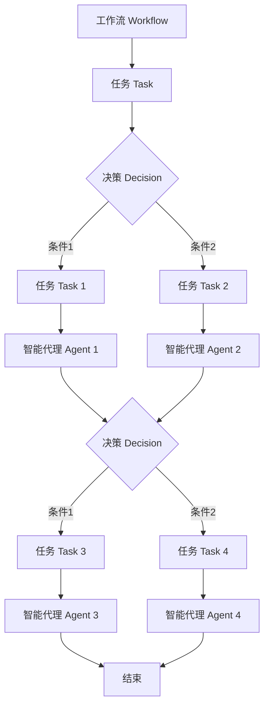

# AI人工智能代理工作流 AI Agent WorkFlow：在人力资源管理中的应用

## 1. 背景介绍

人工智能（AI）技术的快速发展正在深刻影响着各个行业，人力资源管理领域也不例外。AI代理工作流（AI Agent Workflow）作为一种新兴的技术范式，通过将AI技术与工作流管理相结合，为人力资源管理带来了新的机遇和挑战。本文将深入探讨AI代理工作流在人力资源管理中的应用，分析其核心概念、算法原理、数学模型、实际应用场景以及未来发展趋势与挑战。

### 1.1 人力资源管理的现状与挑战

人力资源管理是企业运营中至关重要的一环，涉及员工招聘、培训、绩效考核、薪酬管理等多个方面。传统的人力资源管理方式面临着诸多挑战，如：

- 招聘流程耗时耗力，筛选简历效率低下
- 员工培训缺乏个性化和针对性
- 绩效考核主观性强，缺乏量化指标
- 薪酬管理缺乏灵活性和公平性

### 1.2 AI技术在人力资源管理中的应用前景

AI技术的发展为解决上述挑战提供了新的思路。通过将AI技术应用于人力资源管理，可以实现：

- 智能化招聘，提高简历筛选效率
- 个性化培训，提升员工技能水平
- 客观公正的绩效考核，促进员工发展
- 灵活多样的薪酬管理，提高员工满意度

### 1.3 AI代理工作流的概念与优势

AI代理工作流是一种将AI技术与工作流管理相结合的新型技术范式。它通过引入智能代理（Agent）的概念，将工作流中的各个任务环节进行智能化处理，从而提高工作效率和质量。相比传统的工作流管理，AI代理工作流具有以下优势：

- 自主性：智能代理可以根据设定的规则和目标自主完成任务，减少人工干预
- 适应性：智能代理可以根据环境变化动态调整工作流，提高灵活性
- 协作性：多个智能代理可以协同工作，完成复杂任务
- 优化性：通过机器学习算法不断优化工作流，提高效率和质量

## 2. 核心概念与联系

为了更好地理解AI代理工作流在人力资源管理中的应用，我们需要了解其核心概念以及它们之间的联系。

### 2.1 智能代理（Agent）

智能代理是AI代理工作流的核心概念之一。它是一种能够感知环境、自主决策并执行任务的软件实体。在人力资源管理中，智能代理可以扮演不同的角色，如招聘助理、培训导师、绩效评估员等。

### 2.2 工作流（Workflow）

工作流是指完成某个业务目标所需的一系列任务及其执行顺序。在人力资源管理中，常见的工作流包括招聘流程、培训流程、绩效考核流程等。AI代理工作流通过将智能代理引入工作流中，实现工作流的自动化和智能化。

### 2.3 任务（Task）

任务是工作流中的基本单元，代表了一个具体的工作内容。在AI代理工作流中，任务可以由智能代理自主完成，也可以由人工和智能代理协同完成。

### 2.4 决策（Decision）

决策是指在工作流执行过程中，根据当前状态和环境信息做出选择的过程。在AI代理工作流中，决策通常由智能代理根据预设的规则或机器学习模型自主完成。

### 2.5 环境（Environment）

环境是指工作流执行过程中所处的外部条件和上下文信息。在人力资源管理中，环境可以包括企业文化、员工特点、市场状况等因素。智能代理需要感知并适应环境的变化。

### 2.6 核心概念之间的联系

下图使用Mermaid流程图展示了AI代理工作流中核心概念之间的联系：

从图中可以看出，工作流由多个任务组成，任务之间通过决策进行流转。每个任务可以由一个或多个智能代理完成，智能代理根据环境信息和决策规则自主执行任务。整个工作流在智能代理的协同下高效完成。

## 3. 核心算法原理具体操作步骤

AI代理工作流的实现离不开智能算法的支持。下面我们将介绍几种常用的核心算法原理及其具体操作步骤。

### 3.1 强化学习（Reinforcement Learning）

强化学习是一种通过智能体（Agent）与环境交互，根据反馈不断优化决策策略的机器学习方法。在AI代理工作流中，强化学习可以用于优化工作流执行路径、提高任务完成质量等。其基本步骤如下：

1. 定义状态空间和动作空间，即智能代理可能处于的状态以及可以采取的行动。
2. 设计奖励函数，用于评估智能代理的决策效果。
3. 初始化智能代理的决策策略（Policy）。
4. 智能代理根据当前状态选择动作，执行动作后环境进入新的状态，同时智能代理获得奖励反馈。
5. 根据奖励反馈更新决策策略，使得智能代理在相似状态下倾向于选择能获得更高奖励的动作。
6. 重复步骤4-5，直到决策策略收敛或达到预设的训练次数。

常用的强化学习算法包括Q-Learning、SARSA、Policy Gradient等。

### 3.2 启发式搜索（Heuristic Search）

启发式搜索是一种利用问题领域知识指导搜索过程的方法，可以有效缩小搜索范围、提高搜索效率。在AI代理工作流中，启发式搜索可以用于任务调度、资源分配等问题。以A*搜索算法为例，其基本步骤如下：

1. 将起始状态加入开放列表（Open List），计算其启发函数值f(n)=g(n)+h(n)，其中g(n)为起点到当前状态的实际代价，h(n)为当前状态到目标状态的估计代价。
2. 从开放列表中选择f(n)最小的状态n，将其移至关闭列表（Closed List）。
3. 扩展状态n，生成其所有子状态，计算每个子状态的f(n)值。
4. 对于每个子状态，如果它已经在开放列表中，比较其原有f(n)值与新计算的f(n)值，取较小者更新状态；如果它已经在关闭列表中，不做任何操作；如果它不在开放列表和关闭列表中，将其加入开放列表。
5. 重复步骤2-4，直到目标状态出现在开放列表的首位，或者开放列表为空（无解）。

启发函数的设计是启发式搜索的关键，需要根据问题领域知识进行定制。

### 3.3 遗传算法（Genetic Algorithm）

遗传算法是一种模拟生物进化过程的优化算法，通过对候选解进行选择、交叉、变异等操作，不断优化解的质量。在AI代理工作流中，遗传算法可以用于工作流结构优化、参数调优等问题。其基本步骤如下：

1. 随机生成一组候选解作为初始种群。
2. 计算每个候选解的适应度（Fitness），适应度越高表示解的质量越好。
3. 根据适应度对候选解进行选择，适应度高的解被选中的概率更大。
4. 对选中的候选解进行交叉操作，生成新的候选解。
5. 对新生成的候选解进行变异操作，引入新的搜索空间。
6. 将新生成的候选解加入种群，重复步骤2-5，直到达到预设的迭代次数或满足终止条件。

遗传算法的关键在于适应度函数的设计以及交叉、变异算子的选择，需要根据具体问题进行调整。

## 4. 数学模型和公式详细讲解举例说明

为了更好地理解AI代理工作流中的核心算法，下面我们通过数学模型和公式进行详细讲解，并给出具体的例子。

### 4.1 马尔可夫决策过程（Markov Decision Process）

马尔可夫决策过程（MDP）是强化学习的理论基础，用于描述智能代理与环境交互的过程。一个MDP由以下元素组成：

- 状态集合 $S$
- 动作集合 $A$
- 状态转移概率函数 $P(s'|s,a)$，表示在状态 $s$ 下执行动作 $a$ 后转移到状态 $s'$ 的概率
- 奖励函数 $R(s,a)$，表示在状态 $s$ 下执行动作 $a$ 获得的即时奖励

智能代理的目标是找到一个最优策略 $\pi^*$，使得在该策略下获得的累积奖励最大化：

$$\pi^* = \arg\max_\pi E\left[\sum_{t=0}^{\infty} \gamma^t R(s_t,a_t)\right]$$

其中，$\gamma \in [0,1]$ 为折扣因子，用于平衡即时奖励和长期奖励。

举例来说，假设我们要优化一个员工绩效考核流程，状态集合 $S$ 可以包括"员工提交工作总结"、"主管评审"、"绩效面谈"等，动作集合 $A$ 可以包括"通过"、"打回修改"、"安排面谈"等，奖励函数 $R$ 可以根据绩效考核的准确性和效率来设计。智能代理的目标就是找到一个最优的绩效考核策略，使得考核质量和效率最大化。

### 4.2 Q-Learning算法

Q-Learning是一种常用的无模型强化学习算法，用于估计状态-动作值函数 $Q(s,a)$，表示在状态 $s$ 下执行动作 $a$ 的长期价值。Q-Learning的更新公式如下：

$$Q(s_t,a_t) \leftarrow Q(s_t,a_t) + \alpha \left[R(s_t,a_t) + \gamma \max_a Q(s_{t+1},a) - Q(s_t,a_t)\right]$$

其中，$\alpha \in (0,1]$ 为学习率，控制每次更新的幅度。

举例来说，假设我们要优化一个员工培训流程，状态集合 $S$ 可以包括"新员工入职"、"完成基础培训"、"完成进阶培训"等，动作集合 $A$ 可以包括"安排基础培训"、"安排进阶培训"、"结束培训"等，奖励函数 $R$ 可以根据员工培训后的工作表现来设计。通过Q-Learning算法，智能代理可以不断尝试不同的培训策略，并根据反馈调整策略，最终找到一个最优的员工培训方案。

### 4.3 A*搜索算法

A*搜索算法是一种启发式搜索算法，常用于寻找最优路径。其核心思想是使用启发函数 $h(n)$ 估计当前状态 $n$ 到目标状态的代价，并将其与起点到当前状态的实际代价 $g(n)$ 相加，作为评估状态优劣的标准。A*搜索的评估函数为：

$$f(n) = g(n) + h(n)$$

其中，$h(n)$ 需要满足两个条件：

1. $h(n)$ 不大于从状态 $n$ 到目标状态的实际代价（即 $h(n)$ 是乐观估计）。
2. 对于任意两个状态 $n1$ 和 $n2$，如果 $n2$ 是 $n1$ 的子状态，则有 $h(n1) \leq c(n1,n2) + h