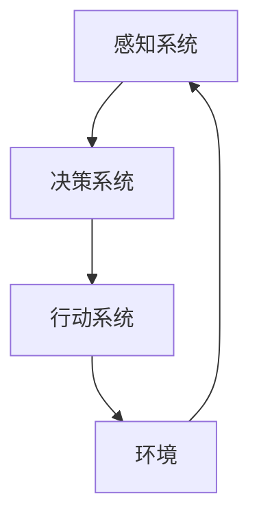
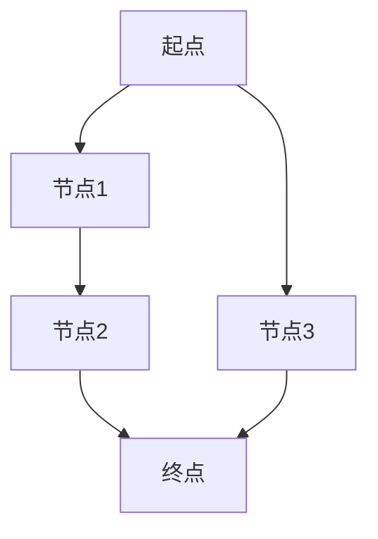

# AI人工智能代理工作流 AI Agent WorkFlow：在游戏设计中的应用

## 1.背景介绍

在现代游戏设计中，人工智能（AI）技术的应用已经成为不可或缺的一部分。AI不仅提升了游戏的智能化和互动性，还极大地丰富了玩家的体验。AI代理（Agent）作为AI技术的核心组件之一，负责在游戏中模拟智能行为和决策过程。本文将深入探讨AI代理工作流在游戏设计中的应用，揭示其核心概念、算法原理、数学模型、实际应用场景以及未来发展趋势。

## 2.核心概念与联系

### 2.1 AI代理的定义

AI代理是一个能够感知环境并采取行动以实现特定目标的自主实体。在游戏中，AI代理通常用于控制非玩家角色（NPC），使其表现出智能行为。

### 2.2 工作流概述

AI代理工作流是指从设计、开发到部署AI代理的全过程。这个工作流包括以下几个关键步骤：
1. 需求分析
2. 设计与建模
3. 算法实现
4. 测试与优化
5. 部署与维护

### 2.3 核心组件

AI代理工作流的核心组件包括感知系统、决策系统和行动系统。感知系统负责收集环境信息，决策系统根据感知信息做出决策，行动系统执行决策。



## 3.核心算法原理具体操作步骤

### 3.1 感知系统

感知系统是AI代理的“眼睛”和“耳朵”，负责收集环境中的信息。常用的感知技术包括：
- 视觉感知：通过图像处理技术识别环境中的物体和事件。
- 听觉感知：通过音频处理技术识别声音来源和内容。
- 触觉感知：通过物理传感器感知接触和碰撞。

### 3.2 决策系统

决策系统是AI代理的“大脑”，负责根据感知信息做出决策。常用的决策算法包括：
- 状态机：通过预定义的状态和转移规则实现简单的决策逻辑。
- 行为树：通过层次化的行为节点实现复杂的决策逻辑。
- 强化学习：通过与环境的交互学习最优策略。

### 3.3 行动系统

行动系统是AI代理的“手脚”，负责执行决策。常用的行动技术包括：
- 路径规划：通过算法计算最优路径。
- 动作控制：通过物理引擎实现角色的动作和行为。

## 4.数学模型和公式详细讲解举例说明

### 4.1 强化学习模型

强化学习是AI代理决策系统中的一种重要方法。其核心思想是通过与环境的交互，学习一个策略，使得在长期内获得最大的累积奖励。强化学习的数学模型包括状态空间、动作空间、奖励函数和策略函数。

#### 4.1.1 状态空间

状态空间 $S$ 是环境中所有可能状态的集合。每个状态 $s \in S$ 表示环境在某一时刻的具体情况。

#### 4.1.2 动作空间

动作空间 $A$ 是AI代理可以采取的所有可能动作的集合。每个动作 $a \in A$ 表示AI代理在某一状态下可以执行的具体操作。

#### 4.1.3 奖励函数

奖励函数 $R(s, a)$ 表示AI代理在状态 $s$ 执行动作 $a$ 后获得的即时奖励。奖励函数的目标是引导AI代理朝着有利的方向行动。

#### 4.1.4 策略函数

策略函数 $\pi(s)$ 表示AI代理在状态 $s$ 下选择动作的概率分布。策略函数的目标是最大化累积奖励。

$$
\pi(s) = \arg\max_{a \in A} \mathbb{E}[R(s, a) + \gamma \sum_{s'} P(s'|s, a) V(s')]
$$

其中，$\gamma$ 是折扣因子，$P(s'|s, a)$ 是状态转移概率，$V(s)$ 是状态价值函数。

### 4.2 路径规划算法

路径规划是AI代理行动系统中的一个重要问题。常用的路径规划算法包括A*算法和Dijkstra算法。

#### 4.2.1 A*算法

A*算法是一种启发式搜索算法，用于在图中找到从起点到终点的最短路径。其核心思想是通过估计函数 $f(n) = g(n) + h(n)$ 选择最优路径，其中 $g(n)$ 是起点到节点 $n$ 的实际代价，$h(n)$ 是节点 $n$ 到终点的估计代价。



## 5.项目实践：代码实例和详细解释说明

### 5.1 强化学习代码实例

以下是一个简单的强化学习代码实例，使用Python和TensorFlow实现Q-learning算法。

```python
import numpy as np
import tensorflow as tf

# 环境参数
state_size = 4
action_size = 2
learning_rate = 0.01
gamma = 0.95

# 构建Q网络
model = tf.keras.Sequential([
    tf.keras.layers.Dense(24, input_dim=state_size, activation='relu'),
    tf.keras.layers.Dense(24, activation='relu'),
    tf.keras.layers.Dense(action_size, activation='linear')
])
model.compile(optimizer=tf.keras.optimizers.Adam(learning_rate), loss='mse')

# Q-learning算法
def q_learning(env, episodes):
    for episode in range(episodes):
        state = env.reset()
        done = False
        while not done:
            action = np.argmax(model.predict(state.reshape(1, -1)))
            next_state, reward, done, _ = env.step(action)
            target = reward + gamma * np.max(model.predict(next_state.reshape(1, -1)))
            target_f = model.predict(state.reshape(1, -1))
            target_f[0][action] = target
            model.fit(state.reshape(1, -1), target_f, epochs=1, verbose=0)
            state = next_state

# 运行Q-learning算法
import gym
env = gym.make('CartPole-v1')
q_learning(env, 1000)
```

### 5.2 路径规划代码实例

以下是一个简单的A*算法代码实例，使用Python实现。

```python
import heapq

def a_star(graph, start, goal):
    open_list = []
    heapq.heappush(open_list, (0, start))
    came_from = {}
    g_score = {start: 0}
    f_score = {start: heuristic(start, goal)}

    while open_list:
        _, current = heapq.heappop(open_list)
        if current == goal:
            return reconstruct_path(came_from, current)

        for neighbor in graph.neighbors(current):
            tentative_g_score = g_score[current] + graph.cost(current, neighbor)
            if neighbor not in g_score or tentative_g_score < g_score[neighbor]:
                came_from[neighbor] = current
                g_score[neighbor] = tentative_g_score
                f_score[neighbor] = g_score[neighbor] + heuristic(neighbor, goal)
                heapq.heappush(open_list, (f_score[neighbor], neighbor))

    return None

def heuristic(a, b):
    return abs(a[0] - b[0]) + abs(a[1] - b[1])

def reconstruct_path(came_from, current):
    path = [current]
    while current in came_from:
        current = came_from[current]
        path.append(current)
    return path[::-1]

# 示例图
graph = {
    (0, 0): [(0, 1), (1, 0)],
    (0, 1): [(0, 0), (1, 1)],
    (1, 0): [(0, 0), (1, 1)],
    (1, 1): [(0, 1), (1, 0)]
}

# 运行A*算法
start = (0, 0)
goal = (1, 1)
path = a_star(graph, start, goal)
print("Path:", path)
```

## 6.实际应用场景

### 6.1 NPC行为控制

AI代理广泛应用于游戏中的NPC行为控制，使其表现出智能化的行为。例如，在角色扮演游戏（RPG）中，NPC可以根据玩家的行为做出相应的反应，如攻击、防御、逃跑等。

### 6.2 动态难度调整

AI代理可以用于动态调整游戏难度，以适应不同玩家的技能水平。例如，在射击游戏中，AI代理可以根据玩家的表现调整敌人的数量和攻击强度。

### 6.3 自动化测试

AI代理可以用于游戏的自动化测试，通过模拟玩家行为来发现游戏中的漏洞和问题。例如，在大型多人在线游戏（MMO）中，AI代理可以模拟大量玩家的行为，测试服务器的负载能力和稳定性。

## 7.工具和资源推荐

### 7.1 开发工具

- Unity：一款流行的游戏开发引擎，支持AI代理的开发和集成。
- Unreal Engine：另一款流行的游戏开发引擎，提供强大的AI工具和插件。

### 7.2 AI框架

- TensorFlow：一个开源的机器学习框架，支持强化学习和深度学习算法的实现。
- PyTorch：另一个流行的机器学习框架，提供灵活的模型定义和训练接口。

### 7.3 资源推荐

- 《人工智能：一种现代方法》：一本经典的AI教材，涵盖了AI代理的基本概念和算法。
- 《强化学习：原理与实践》：一本专注于强化学习的书籍，详细介绍了强化学习的理论和应用。

## 8.总结：未来发展趋势与挑战

AI代理在游戏设计中的应用前景广阔，但也面临一些挑战。未来的发展趋势包括：
- 更加智能化的AI代理：通过深度学习和强化学习技术，AI代理将表现出更加智能和复杂的行为。
- 更加个性化的游戏体验：通过AI代理，游戏将能够根据玩家的行为和偏好，提供更加个性化的游戏体验。
- 更加高效的开发流程：通过自动化工具和平台，AI代理的开发和集成将变得更加高效和便捷。

然而，AI代理在游戏设计中的应用也面临一些挑战，如计算资源的消耗、算法的复杂性和数据的获取等。解决这些挑战需要不断的技术创新和实践探索。

## 9.附录：常见问题与解答

### 9.1 AI代理在游戏中的作用是什么？

AI代理在游戏中主要用于控制NPC的行为，使其表现出智能化的行为，从而提升游戏的互动性和趣味性。

### 9.2 如何选择合适的AI算法？

选择合适的AI算法需要根据具体的应用场景和需求。例如，对于简单的决策逻辑，可以使用状态机或行为树；对于复杂的决策问题，可以使用强化学习或深度学习算法。

### 9.3 AI代理的开发流程是什么？

AI代理的开发流程包括需求分析、设计与建模、算法实现、测试与优化、部署与维护等步骤。

### 9.4 AI代理在游戏中的应用前景如何？

AI代理在游戏中的应用前景广阔，未来将能够提供更加智能化和个性化的游戏体验。

---

作者：禅与计算机程序设计艺术 / Zen and the Art of Computer Programming