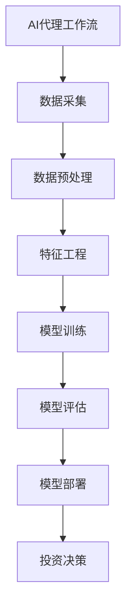

# AI人工智能代理工作流 AI Agent Workflow：在股票市场预测中的应用

## 1.背景介绍

### 1.1 股票市场预测的重要性

股票市场一直是金融领域中最活跃和动态的部分之一。准确预测股票价格走势对于投资者和交易员来说至关重要,可以帮助他们做出明智的投资决策,最大化收益,最小化风险。然而,由于影响股票价格的因素错综复杂,包括公司基本面、宏观经济形势、投资者情绪等,准确预测股票价格一直是一个极具挑战性的任务。

### 1.2 人工智能在金融领域的应用

随着人工智能(AI)和机器学习(ML)技术的不断发展,AI已经在金融领域得到了广泛应用,尤其是在股票市场预测方面。传统的统计模型和技术分析方法已经难以满足当前复杂多变的市场环境,而AI则展现出了强大的数据处理和模式识别能力,为股票市场预测提供了新的解决方案。

### 1.3 AI代理工作流介绍

AI代理工作流(AI Agent Workflow)是一种将AI技术与业务流程相结合的方法,旨在提高AI系统的效率、可靠性和可解释性。在股票市场预测领域,AI代理工作流可以帮助投资者和交易员更好地管理和优化整个预测过程,从数据采集、特征工程到模型训练和部署,实现更高的预测准确性和投资回报。

## 2.核心概念与联系

### 2.1 AI代理

AI代理(AI Agent)是指能够感知环境、处理信息、做出决策并采取行动的智能系统。在股票市场预测中,AI代理可以被视为一个虚拟的投资顾问或交易员,它能够收集和分析各种市场数据,并根据预测结果提供投资建议或执行自动化交易。

### 2.2 工作流

工作流(Workflow)是指将一系列任务或活动按照特定顺序组织起来的过程。在股票市场预测中,工作流可以包括数据采集、数据预处理、特征工程、模型训练、模型评估、模型部署等多个环节。

### 2.3 AI代理工作流

AI代理工作流将AI代理与工作流相结合,旨在优化和自动化整个预测过程。它通过将AI技术与业务流程无缝集成,提高了预测的效率、可靠性和可解释性。在股票市场预测中,AI代理工作流可以帮助投资者和交易员更好地管理和控制预测过程,从而做出更明智的投资决策。

## 3.核心算法原理具体操作步骤

### 3.1 数据采集

数据采集是AI代理工作流的第一步,也是整个预测过程的基础。在股票市场预测中,需要收集各种相关数据,包括历史股票价格数据、公司财务数据、新闻事件数据、社交媒体情绪数据等。这些数据可以来自不同的来源,如证券交易所、金融数据提供商、网络爬虫等。

数据采集过程可以分为以下步骤:

1. **确定数据来源**:根据预测目标和需求,确定需要采集哪些数据以及从何处获取。
2. **建立数据连接**:使用相应的API或数据接口与数据源建立连接,获取数据。
3. **数据存储**:将采集到的数据存储在适当的数据库或文件系统中,以备后续处理。
4. **数据更新**:定期更新数据,确保预测模型使用最新的数据。

### 3.2 数据预处理

由于原始数据通常存在噪声、缺失值、异常值等问题,因此需要进行数据预处理,以提高数据质量并为后续的特征工程和模型训练做好准备。数据预处理通常包括以下步骤:

1. **数据清洗**:处理缺失值、异常值和重复数据。
2. **数据规范化**:将数据转换为统一的格式和单位。
3. **数据去噪**:消除数据中的噪声和无关信息。
4. **数据分割**:将数据集划分为训练集、验证集和测试集。

### 3.3 特征工程

特征工程是机器学习中一个至关重要的步骤,旨在从原始数据中提取有价值的特征,以供模型训练和预测使用。在股票市场预测中,常见的特征包括技术指标(如移动平均线、相对强弱指数等)、基本面指标(如市盈率、市净率等)、情绪指标(如新闻情绪分数、社交媒体情绪分数等)等。

特征工程过程可以分为以下步骤:

1. **特征选择**:根据领域知识和经验,选择与预测目标相关的特征。
2. **特征构造**:从原始数据中构造新的特征,如技术指标、文本特征等。
3. **特征缩放**:将特征值缩放到一个合适的范围,以防止某些特征对模型的影响过大。
4. **特征选择**:使用特征选择算法(如递归特征消除、主成分分析等)选择最有价值的特征子集。

### 3.4 模型训练

模型训练是AI代理工作流中的核心环节,旨在根据历史数据构建一个能够准确预测未来股票价格走势的机器学习模型。常见的机器学习模型包括线性回归、决策树、随机森林、支持向量机、神经网络等。

模型训练过程可以分为以下步骤:

1. **选择模型架构**:根据问题的特点和数据的性质,选择合适的机器学习模型架构。
2. **模型初始化**:设置模型的初始参数。
3. **模型训练**:使用训练数据集训练模型,优化模型参数。
4. **模型评估**:使用验证数据集评估模型的性能,如准确率、均方根误差等。
5. **模型调优**:根据评估结果,调整模型参数或特征,以提高模型性能。
6. **模型保存**:将训练好的模型保存,以备后续部署和使用。

### 3.5 模型评估

模型评估是AI代理工作流中的关键步骤,旨在评估模型在未见过的数据上的性能,从而确保模型的泛化能力和可靠性。常见的评估指标包括均方根误差(RMSE)、平均绝对误差(MAE)、决定系数(R^2)等。

模型评估过程可以分为以下步骤:

1. **准备测试数据集**:从原始数据中划分出一个独立的测试数据集。
2. **选择评估指标**:根据预测目标和业务需求,选择合适的评估指标。
3. **模型预测**:使用训练好的模型对测试数据集进行预测。
4. **计算评估指标**:将模型预测结果与测试数据集的真实值进行比较,计算评估指标。
5. **结果分析**:分析评估结果,识别模型的优缺点和改进空间。

### 3.6 模型部署

模型部署是将训练好的模型投入实际使用的过程。在股票市场预测中,模型部署可以采取多种形式,如提供投资建议、执行自动化交易等。

模型部署过程可以分为以下步骤:

1. **选择部署环境**:根据业务需求和技术约束,选择合适的部署环境,如云平台、本地服务器等。
2. **模型封装**:将训练好的模型封装为可部署的格式,如Web服务、Docker容器等。
3. **部署模型**:将封装好的模型部署到选定的环境中。
4. **集成测试**:测试部署后的模型是否正常工作,并与其他系统进行集成测试。
5. **监控和维护**:持续监控模型的性能,并根据需要进行模型更新和维护。

### 3.7 投资决策

投资决策是AI代理工作流的最终目标,旨在根据模型预测结果做出明智的投资决策,实现最大化收益。投资决策可以由人工投资顾问或自动化交易系统完成。

投资决策过程可以分为以下步骤:

1. **预测结果解释**:解释模型预测结果的含义和可信度。
2. **风险评估**:评估投资决策的潜在风险和收益。
3. **决策制定**:根据预测结果和风险评估,制定具体的投资决策,如买入、卖出或持有。
4. **执行交易**:执行投资决策,进行实际的股票交易。
5. **决策评估**:评估投资决策的效果,作为未来决策的参考。

## 4.数学模型和公式详细讲解举例说明

在股票市场预测中,常用的数学模型和公式包括线性回归、时间序列模型、随机过程模型等。下面将详细介绍其中的一些常见模型和公式。

### 4.1 线性回归模型

线性回归模型是一种广泛使用的机器学习模型,它试图找到一个最佳拟合线,使得数据点到该直线的距离之和最小。在股票市场预测中,线性回归模型可以用于预测未来的股票价格。

线性回归模型的数学表达式如下:

$$y = \beta_0 + \beta_1x_1 + \beta_2x_2 + \cdots + \beta_nx_n + \epsilon$$

其中:
- $y$是因变量(即待预测的股票价格)
- $x_1, x_2, \cdots, x_n$是自变量(即影响股票价格的特征)
- $\beta_0, \beta_1, \cdots, \beta_n$是回归系数
- $\epsilon$是随机误差项

通过最小二乘法或其他优化算法,可以估计出回归系数$\beta_0, \beta_1, \cdots, \beta_n$,从而得到最佳拟合线。

例如,假设我们有一个包含三个特征的数据集,其中$x_1$是公司的市盈率,$x_2$是相对强弱指数,$x_3$是新闻情绪分数。我们可以构建如下线性回归模型来预测股票价格$y$:

$$y = \beta_0 + \beta_1x_1 + \beta_2x_2 + \beta_3x_3 + \epsilon$$

通过训练数据,我们可以估计出$\beta_0, \beta_1, \beta_2, \beta_3$的值,从而得到预测模型。

### 4.2 时间序列模型

时间序列模型是一种用于预测未来数据点的模型,它利用了时间序列数据的自相关性和趋势性。在股票市场预测中,时间序列模型可以用于预测未来的股票价格走势。

常见的时间序列模型包括自回归移动平均模型(ARMA)、自回归综合移动平均模型(ARIMA)、指数平滑模型等。

#### 4.2.1 ARMA模型

ARMA模型由自回归(AR)部分和移动平均(MA)部分组成,其数学表达式如下:

$$y_t = c + \phi_1y_{t-1} + \phi_2y_{t-2} + \cdots + \phi_py_{t-p} + \epsilon_t + \theta_1\epsilon_{t-1} + \theta_2\epsilon_{t-2} + \cdots + \theta_q\epsilon_{t-q}$$

其中:
- $y_t$是时间$t$时的观测值
- $c$是常数项
- $\phi_1, \phi_2, \cdots, \phi_p$是自回归系数
- $\theta_1, \theta_2, \cdots, \theta_q$是移动平均系数
- $\epsilon_t$是时间$t$时的白噪声误差项

通过估计自回归系数和移动平均系数,我们可以得到ARMA模型,并用于预测未来的股票价格。

#### 4.2.2 ARIMA模型

ARIMA模型是ARMA模型的扩展,它能够处理非平稳时间序列数据。ARIMA模型的数学表达式如下:

$$y_t' = c + \phi_1y_{t-1}' + \phi_2y_{t-2}' + \cdots + \phi_py_{t-p}' + \epsilon_t + \theta_1\epsilon_{t-1} + \theta_2\epsilon_{t-2} + \cdots + \theta_q\epsilon_{t