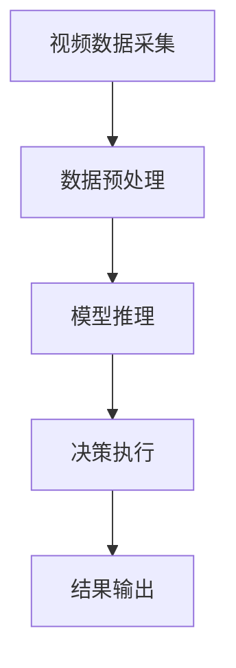
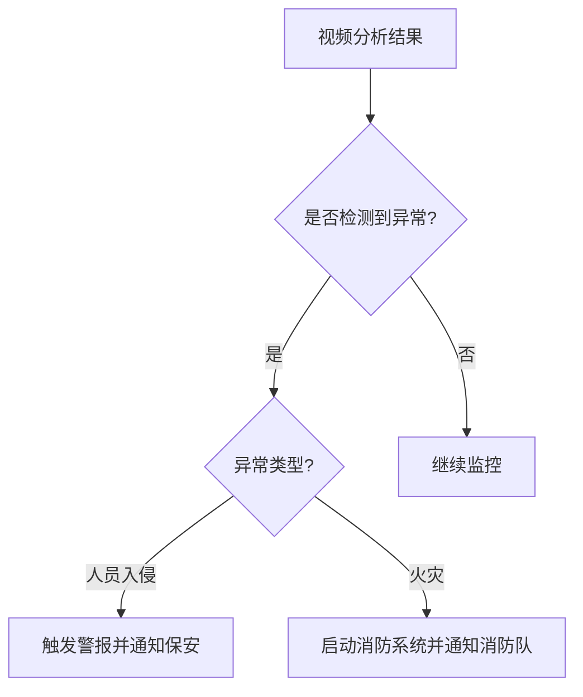

# AI人工智能代理工作流 AI Agent WorkFlow：在视频监控中的应用

## 1.背景介绍

随着人工智能技术的飞速发展,视频监控系统正在经历一场革命性的变革。传统的视频监控系统主要依赖人工观察和分析,存在着效率低下、疏漏率高等诸多缺陷。而AI人工智能代理工作流程(AI Agent Workflow)的引入,为视频监控系统带来了全新的发展契机。

AI代理工作流是一种基于人工智能技术的自动化流程,它可以自主执行各种复杂的视频分析和决策任务,大幅提高了视频监控的智能化水平。通过深度学习、计算机视觉等技术,AI代理可以实时检测和识别视频画面中的目标物体、人物行为、异常情况等,并根据预设的规则和策略作出相应的响应。

### 1.1 视频监控的重要性

视频监控在当今社会扮演着越来越重要的角色,广泛应用于公共安全、交通管理、工业生产等多个领域。它不仅能够有效预防和遏制犯罪活动,还可以监测生产流程,确保工厂运营的高效和安全。然而,传统的视频监控系统存在诸多不足,亟需通过AI技术实现智能化升级。

### 1.2 AI代理工作流的优势

相比传统的视频监控方式,AI代理工作流具有以下显著优势:

1. **自动化程度高**: AI代理可以自主完成大量繁重的视频分析和决策工作,极大减轻了人工的工作负担。

2. **实时响应能力强**: AI代理能够实时处理视频数据,快速发现异常情况并作出反应,提高了监控的时效性。

3. **准确性和可靠性高**: 基于深度学习等先进算法,AI代理的识别和判断能力远超人工,降低了疏漏率。

4. **可扩展性强**: AI代理工作流可以轻松扩展到更大规模的视频监控系统中,满足不断增长的业务需求。

5. **节省人力成本**: 由于AI代理可以自主执行大量任务,因此可以显著降低人力投入,从而节省运营成本。

## 2.核心概念与联系

在探讨AI代理工作流的具体细节之前,我们需要先了解一些核心概念及其之间的联系。

### 2.1 AI代理(AI Agent)

AI代理是指具有一定智能和自主性的软件实体,能够感知环境、分析数据、做出决策并采取行动。在视频监控领域,AI代理通常由计算机视觉、模式识别、决策引擎等多个模块组成,用于实现目标检测、行为分析、异常识别等功能。

### 2.2 工作流(Workflow)

工作流描述了一系列有序的任务步骤,定义了AI代理在不同情况下应该执行哪些操作。它是AI代理实现自动化和智能化的关键。一个完整的工作流通常包括数据采集、预处理、模型推理、决策执行等多个环节。

### 2.3 规则引擎(Rule Engine)

规则引擎是工作流的核心部分,它根据预定义的一系列规则和策略,对AI代理的行为进行控制和调度。规则引擎接收来自视频分析模块的结果,并结合其他数据源(如历史记录、环境信息等),确定AI代理应该采取何种行动。

### 2.4 决策树(Decision Tree)

决策树是一种常用的机器学习模型,在AI代理工作流中发挥着重要作用。它通过一系列条件判断,将复杂的决策问题分解为一系列简单的二叉决策,最终得出行动方案。决策树不仅可解释性强,而且训练和推理效率都很高,非常适合视频监控等实时性要求较高的场景。

### 2.5 模型管理(Model Management)

由于视频监控场景的多样性,AI代理工作流通常需要集成多种视觉模型,如目标检测、行为识别、人脸识别等。模型管理系统负责管理这些模型的生命周期,包括模型训练、评估、部署、更新等环节,确保AI代理始终使用最新、最优的模型。

上述核心概念相互关联、相互作用,共同构建了AI代理工作流的整体框架。接下来,我们将详细探讨工作流在视频监控中的具体应用。

## 3.核心算法原理具体操作步骤  

AI代理工作流在视频监控中的应用,核心是通过计算机视觉和模式识别算法实现对视频画面的智能分析。这些算法的工作原理和具体操作步骤如下:

### 3.1 目标检测(Object Detection)

目标检测算法用于在视频画面中定位并识别感兴趣的目标物体,如人、车辆、包裹等。它是视频分析的基础,为后续的行为识别等高级任务奠定了基础。

**算法原理**:

目标检测算法通常基于深度卷积神经网络,如YOLO、Faster R-CNN等。这些算法将图像划分为多个区域,并对每个区域进行目标分类和边界框回归,最终输出目标类别及其在图像中的位置。

**操作步骤**:

1. 对视频帧进行预处理,如调整大小、归一化等,以满足模型输入要求。

2. 将预处理后的图像输入到目标检测模型,获得目标类别及其边界框坐标。

3. 对检测结果进行非极大值抑制(NMS),去除重叠的冗余边界框。

4. 基于置信度阈值过滤掉低置信度的检测结果。

5. 将最终结果输出或传递给后续的视频分析模块。

### 3.2 行为识别(Action Recognition)

行为识别算法能够识别视频画面中人物或物体的动作行为,如跌倒、打架、偷盗等,是视频监控的核心功能之一。

**算法原理**:

行为识别常用的是基于3D卷积的动作识别网络,如I3D、SlowFast等。这些网络能够从视频序列中提取时空特征,对动作进行分类。另一种方法是基于人体姿态估计,通过跟踪人体关键点的运动轨迹来推断动作类型。

**操作步骤**:

1. 从视频流中采样一段视频片段,进行预处理,如裁剪、归一化等。

2. 将预处理后的视频片段输入到行为识别模型,获得动作类别的概率分布。

3. 基于置信度阈值过滤掉低置信度的识别结果。

4. 将识别结果与其他上下文信息(如目标检测结果)结合,输出到决策模块。

### 3.3 异常检测(Anomaly Detection)

异常检测算法旨在发现视频画面中的异常情况,如火灾、入侵、拥堵等,是确保安全和高效运营的关键。

**算法原理**:

异常检测常用的是基于重构的自编码器模型,如自编码卷积神经网络、变分自编码器等。这些模型被训练用于重构正常的视频帧,当输入为异常帧时,重构误差会显著增大。另一种方法是基于时序建模,利用递归神经网络等模型对视频序列进行预测,与实际情况差异较大时即为异常。

**操作步骤**:

1. 对视频帧进行预处理,满足模型输入要求。

2. 将预处理后的视频帧输入到异常检测模型,获得重构误差或时序预测误差。

3. 基于误差阈值对异常情况进行检测和分类。

4. 将检测结果输出到决策模块,用于触发相应的警报或行动。

以上三种核心算法紧密协作,共同实现了对视频画面的全面分析和理解,为AI代理工作流的决策提供了重要支撑。

## 4.数学模型和公式详细讲解举例说明

在AI代理工作流的视频分析算法中,涉及了多种数学模型和公式,下面将详细介绍其中的几个关键模型。

### 4.1 目标检测中的锚框回归(Anchor Box Regression)

目标检测算法中常用的一种技术是锚框回归,它通过回归的方式精确预测目标物体的边界框位置和尺寸。公式如下:

$$
b_x = p_x - a_x \\
b_y = p_y - a_y \\
b_w = \log(p_w / a_w) \\
b_h = \log(p_h / a_h)
$$

其中:
- $(p_x, p_y, p_w, p_h)$表示预测的边界框坐标和宽高
- $(a_x, a_y, a_w, a_h)$表示锚框的坐标和宽高
- $(b_x, b_y, b_w, b_h)$是模型需要学习的回归目标

通过这种参数化方式,模型可以基于预先设定的锚框,学习预测物体的精确位置和尺度,从而提高检测精度。

### 4.2 行为识别中的时序建模

行为识别算法常用递归神经网络(如LSTM)对视频序列进行时序建模,捕捉动作的时间演化规律。其中,LSTM单元的更新公式如下:

$$
\begin{aligned}
f_t &= \sigma(W_f \cdot [h_{t-1}, x_t] + b_f) \\
i_t &= \sigma(W_i \cdot [h_{t-1}, x_t] + b_i) \\
\tilde{C}_t &= \tanh(W_C \cdot [h_{t-1}, x_t] + b_C) \\
C_t &= f_t \odot C_{t-1} + i_t \odot \tilde{C}_t \\
o_t &= \sigma(W_o \cdot [h_{t-1}, x_t] + b_o) \\
h_t &= o_t \odot \tanh(C_t)
\end{aligned}
$$

其中:
- $f_t$是遗忘门,控制遗忘上一时刻的状态
- $i_t$是输入门,控制增加新的状态
- $\tilde{C}_t$是候选状态值
- $C_t$是最终的记忆状态
- $o_t$是输出门,控制输出部分状态用于当前时刻
- $h_t$是最终的输出

通过门控机制,LSTM能够有效地对长期依赖信息进行建模,捕捉视频序列中的动作模式,是行为识别的核心技术之一。

### 4.3 异常检测中的重构误差

基于重构的异常检测算法通常利用自编码器模型,将正常的视频帧重构为自身,当输入为异常帧时,重构误差会显著增大。重构误差常用的度量是均方误差(MSE):

$$
\text{MSE}(X, X') = \frac{1}{n}\sum_{i=1}^n(X_i - X'_i)^2
$$

其中:
- $X$是原始输入视频帧
- $X'$是自编码器的重构输出
- $n$是像素个数

当MSE超过预先设定的阈值时,即可判定为异常情况。通过监控重构误差的变化趋势,还可以对异常进行分类,如火灾、入侵等。

以上数学模型和公式体现了AI代理工作流视频分析算法的核心思想,为实现精准的目标检测、行为识别和异常检测提供了理论基础。在实际应用中,这些模型还需要通过大量数据和深度学习技术进行训练和优化,以获得良好的性能表现。

## 5.项目实践:代码实例和详细解释说明

为了更好地理解AI代理工作流在视频监控中的应用,我们将通过一个基于PyTorch的项目实践来演示其核心功能和代码实现。

### 5.1 项目概述

本项目旨在构建一个基于深度学习的视频智能分析系统,能够实现目标检测、行为识别和异常检测等功能。系统的输