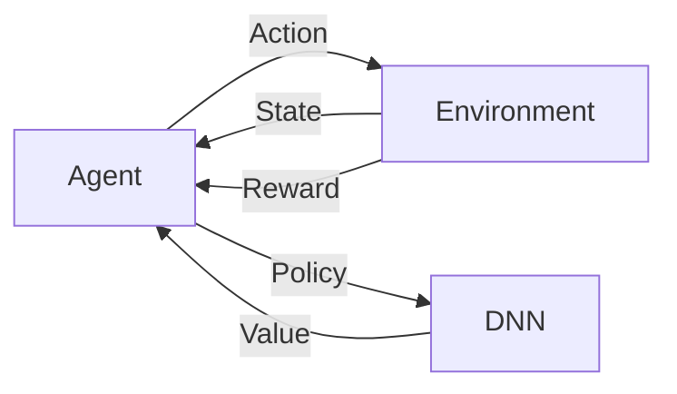

# AI人工智能代理工作流AI Agent WorkFlow：AI代理的深度强化学习策略

## 1. 背景介绍

随着人工智能技术的飞速发展,AI代理(Agent)在各个领域得到了广泛应用。AI代理可以执行复杂的任务,如自动驾驶、智能客服、金融投资等。为了使AI代理能够高效、准确地完成任务,我们需要设计合理的工作流程,并采用先进的机器学习算法对其进行训练优化。

深度强化学习(Deep Reinforcement Learning,DRL)是一种强大的机器学习范式,它结合了深度学习和强化学习的优点。DRL通过神经网络逼近值函数或策略函数,使得智能体能够从海量的状态-行动数据中学习到最优策略,在复杂的决策问题上取得了重大突破。将DRL应用到AI代理的工作流程优化中,可以极大地提升系统性能。

本文将详细阐述AI代理工作流的核心概念,介绍DRL的基本原理和常用算法,并通过数学推导和代码实例深入讲解如何利用DRL优化AI代理策略。此外,我们还将探讨AI代理工作流在实际场景中的应用,分享一些实用的工具和学习资源,展望该领域的未来发展趋势和面临的挑战。

## 2. 核心概念与联系

要理解AI代理工作流和DRL,首先需要掌握以下几个核心概念:

### 2.1 智能体(Agent)

智能体是一个可以感知环境状态,根据策略选择行动,通过与环境交互获得奖励反馈,不断优化自身策略以获得最大累积奖励的自主实体。在AI代理工作流中,智能体就是负责完成特定任务的AI程序。

### 2.2 环境(Environment)

环境是智能体所处的世界,它接收智能体的行动,并返回下一个状态和奖励。环境可以是真实的物理世界,也可以是虚拟的仿真系统。工作流环境定义了AI代理需要完成的任务目标和约束条件。

### 2.3 状态(State)

状态是对智能体所处环境的完整描述,它包含了智能体在某个时刻可以观测到的所有信息。在工作流场景下,状态可以表示为任务完成的进度、资源的使用情况等。

### 2.4 行动(Action)

行动是智能体与环境交互的方式,通过执行一定的行动,智能体可以改变环境状态,并获得相应的奖励反馈。对于AI代理来说,行动可以是调用某个API、执行某项子任务等。

### 2.5 策略(Policy)

策略定义了智能体在每个状态下应该采取的行动,它将状态空间映射到行动空间。策略可以是确定性的,即给定状态总是生成固定的行动;也可以是随机性的,即给定状态生成行动的概率分布。AI代理的决策逻辑就蕴含在策略函数中。

### 2.6 奖励(Reward)

奖励是量化智能体行动优劣的指标,它反映了执行某个行动对完成任务目标的贡献度。通过最大化累积奖励,智能体可以学习到最优策略。在工作流设计时,需要根据任务需求合理设置奖励函数。

### 2.7 价值(Value)

价值表示智能体从某状态开始到终止状态所能获得的期望累积奖励,它体现了该状态的长期价值。价值函数可以帮助智能体在行动选择时权衡短期和长期利益。

### 2.8 深度神经网络(DNN)

DNN是一种多层的人工神经网络,通过逐层提取输入数据的高级特征,可以很好地拟合复杂的非线性函数。DRL利用DNN逼近值函数或策略函数,从而实现端到端的策略学习。

了解了这些概念,我们可以清晰地看出它们之间的联系:
- AI代理作为智能体,通过策略与环境交互,执行工作流任务;
- 环境定义了任务目标和约束,提供状态信息和奖励反馈;
- 代理根据当前状态,用策略选择最优行动;
- 环境根据行动更新状态,返回新的状态和奖励;
- 价值函数评估状态的长期价值,指导策略学习;
- DNN逼近复杂的策略和价值函数,实现端到端学习。

下图展示了这些概念在AI代理工作流中的相互作用:



## 3. 核心算法原理具体操作步骤

DRL的核心思想是通过不断与环境交互,利用获得的奖励信号,优化策略函数,使得智能体的决策能够最大化累积奖励。经典的DRL算法主要包括值函数方法(如DQN)、策略梯度方法(如REINFORCE)和Actor-Critic方法(如A3C)。下面我们重点介绍DQN算法的工作原理和实现步骤。

DQN(Deep Q-Network)结合了Q学习和深度神经网络,其核心是使用DNN逼近最优行动价值函数Q*(s,a)。Q函数表示在状态s下采取行动a,然后遵循最优策略可以获得的期望累积奖励。DQN的目标是最小化TD误差,即当前Q值估计和Q学习目标值之间的均方差:

$$L(\theta) = \mathbb{E}_{(s,a,r,s')\sim D}[(r + \gamma \max_{a'}Q(s',a';\theta^-) - Q(s,a;\theta))^2]$$

其中,$\theta$是Q网络的参数,$\theta^-$是目标网络的参数,D是经验回放池。DQN的具体操作步骤如下:

1. 初始化Q网络参数$\theta$,目标网络参数$\theta^-=\theta$,经验回放池D。

2. 重复以下步骤,直到收敛:
   
   a. 初始化环境状态s,t=0。
   
   b. 重复以下步骤,直到回合结束:
      
      i. 根据$\epsilon$-贪婪策略选择行动a,即以概率$\epsilon$随机选择行动,否则选择Q值最大的行动。
      
      ii. 执行行动a,观察奖励r和下一状态s'。
      
      iii. 将转移样本(s,a,r,s')存入D。
      
      iv. 从D中随机采样一个批次的转移样本。
      
      v. 对每个样本,计算Q学习目标值:
         
         $$y=\begin{cases}
         r & 若s'是终止状态\\
         r+\gamma \max\limits_{a'}Q(s',a';\theta^-) & 否则
         \end{cases}$$
      
      vi. 通过最小化损失函数L更新Q网络参数$\theta$。
      
      vii. 每隔C步,将目标网络参数$\theta^-$更新为$\theta$。
      
      viii. s=s', t=t+1。
   
   c. 更新$\epsilon$,$\epsilon=\max(\epsilon_{min},\epsilon_{decay}\epsilon)$。

3. 返回学习到的策略$\pi(s)=\arg\max_a Q(s,a;\theta)$。

DQN引入了两个重要的技巧来提高训练稳定性:经验回放和目标网络。经验回放将转移样本存入缓冲区,打破了样本之间的相关性;目标网络用于计算Q学习目标,其参数固定一段时间再与Q网络同步,减少了目标值的振荡。

## 4. 数学模型和公式详细讲解举例说明

为了更好地理解DQN算法,这里我们通过一个简单的例子来推导其数学模型。考虑一个网格世界环境,智能体的目标是从起点走到终点。状态空间为网格的坐标(x,y),行动空间为{上,下,左,右},奖励函数定义为:到达终点得1分,其余不得分。

令智能体在状态s=(x,y)下采取行动a,然后转移到状态s',获得奖励r。根据Q学习的贝尔曼最优方程,最优行动价值函数满足:

$$Q^*(s,a)=\mathbb{E}_{s'\sim P(\cdot|s,a)}[r+\gamma \max_{a'} Q^*(s',a')]$$

其中,P是环境动力学模型,即状态转移概率分布。我们用神经网络$Q(s,a;\theta)$来逼近$Q^*$,则优化目标是最小化TD误差:

$$J(\theta)=\mathbb{E}_{(s,a,r,s')\sim D}[(r+\gamma \max_{a'}Q(s',a';\theta^-)-Q(s,a;\theta))^2]$$

假设在状态s=(2,3)下执行向右的行动,转移到状态s'=(3,3),获得奖励r=0,则TD目标值为:

$$y=r+\gamma \max_{a'}Q(s',a';\theta^-)=0+0.9\times \max(Q((3,3),\uparrow),Q((3,3),\downarrow),Q((3,3),\leftarrow),Q((3,3),\rightarrow))$$

假设$\gamma=0.9$,Q网络输出$Q((3,3),\uparrow)=-0.2,Q((3,3),\downarrow)=-0.3,Q((3,3),\leftarrow)=-0.1,Q((3,3),\rightarrow)=0.5$,则

$$y=0+0.9\times 0.5=0.45$$

再假设Q网络在状态动作对(s,a)上的输出为$Q((2,3),\rightarrow)=0.4$,则该转移样本的均方TD误差为:

$$(y-Q((2,3),\rightarrow))^2=(0.45-0.4)^2=0.0025$$

DQN的目标就是最小化所有转移样本的均方TD误差之和,即最小化损失函数J。我们可以使用随机梯度下降等优化算法,通过反向传播不断调整Q网络参数$\theta$,使其逼近最优行动价值函数$Q^*$。

## 5. 项目实践：代码实例和详细解释说明

下面我们使用PyTorch实现DQN算法,并在CartPole环境中进行测试。CartPole是一个经典的强化学习控制问题,目标是通过左右移动小车,使得杆尽量长时间地保持平衡。

首先,定义Q网络结构:

```python
import torch
import torch.nn as nn
import torch.optim as optim

class QNet(nn.Module):
    def __init__(self, state_dim, action_dim):
        super(QNet, self).__init__()
        self.fc1 = nn.Linear(state_dim, 64)
        self.fc2 = nn.Linear(64, 64)
        self.fc3 = nn.Linear(64, action_dim)
        
    def forward(self, x):
        x = torch.relu(self.fc1(x))
        x = torch.relu(self.fc2(x))
        return self.fc3(x)
```

然后,实现DQN智能体:

```python
import random
from collections import deque

class DQNAgent:
    def __init__(self, state_dim, action_dim, cfg):
        self.state_dim = state_dim
        self.action_dim = action_dim
        self.gamma = cfg.gamma
        self.epsilon = cfg.epsilon
        self.epsilon_min = cfg.epsilon_min
        self.epsilon_decay = cfg.epsilon_decay
        self.batch_size = cfg.batch_size
        self.memory = deque(maxlen=cfg.memory_capacity)
        self.device = cfg.device
        
        self.q_net = QNet(state_dim, action_dim).to(self.device)
        self.target_q_net = QNet(state_dim, action_dim).to(self.device)
        self.optimizer = optim.Adam(self.q_net.parameters(), lr=cfg.lr)
        self.loss_func = nn.MSELoss()
        
    def choose_action(self, state):
        if random.random() < self.epsilon:
            action = random.randint(0, self.action_dim - 1)
        else:
            state = torch.tensor(state, dtype=torch.float).to(self.device)
            action = self.q_net(state).argmax().item()
        return action
        
    def memorize(self, state, action, reward, next_state, done):
        self.memory.append((state, action, reward, next_state, done))
        
    def update(self):
        if len(self.memory) < self.batch_size:
            return
        
        samples = random.sample(self.memory, self.batch_size)
        states, actions, rewards, next_states, dones = zip(*samples)
        states = torch.tensor(states, dtype=torch.float).to(self.device)
        actions = torch.tensor(actions).unsqueeze(1).to(self.device)
        rewards = torch.tensor(rewards, dtype=torch.float).unsqueeze(1).to(self.device)
        next_states = torch.tensor(next