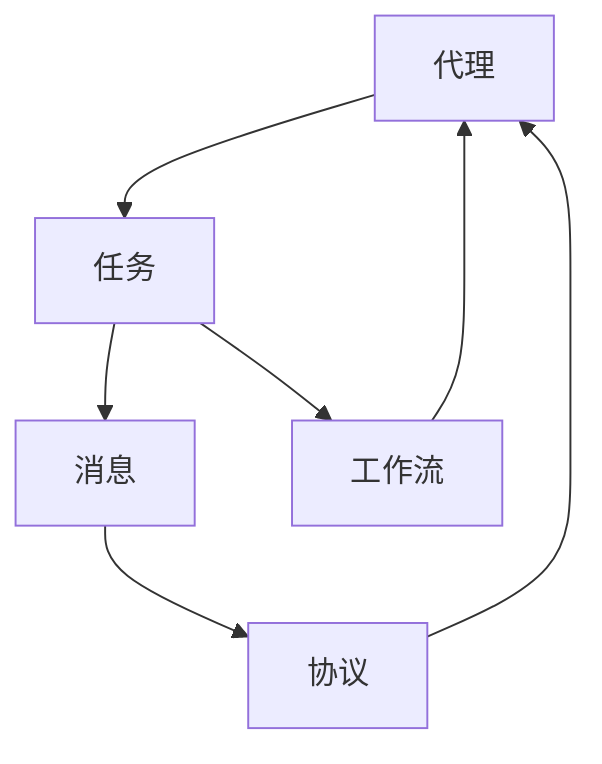

## 1. 背景介绍

随着人工智能技术的不断发展，越来越多的应用场景需要多个智能代理之间进行协作和通信。AI Agent WorkFlow（AI代理工作流）是一种用于描述智能代理之间协作和通信的模型。该模型可以帮助我们更好地理解智能代理之间的交互方式，从而更好地设计和实现智能代理系统。

## 2. 核心概念与联系

AI Agent WorkFlow模型中的核心概念包括代理、任务、消息、协议和工作流。其中，代理是指具有自主决策能力的智能体，任务是指代理需要完成的工作，消息是指代理之间传递的信息，协议是指代理之间进行通信和协作的规则，工作流是指代理完成任务的流程。

这些概念之间的联系如下图所示：

## 3. 核心算法原理具体操作步骤

AI Agent WorkFlow模型中的核心算法原理包括代理决策、消息传递和协议执行。具体操作步骤如下：

1. 代理决策：每个代理根据自身的知识和目标，决定自己需要完成的任务，并将任务添加到自己的工作流中。

2. 消息传递：代理之间通过消息传递来协作完成任务。当一个代理需要与其他代理通信时，它会发送一条消息，其他代理收到消息后，根据协议执行相应的操作。

3. 协议执行：代理之间通过协议来规范通信和协作的方式。协议包括消息格式、消息传递方式、消息处理方式等。当一个代理收到消息时，它会根据协议执行相应的操作。

## 4. 数学模型和公式详细讲解举例说明

AI Agent WorkFlow模型中的数学模型和公式包括任务分配模型、消息传递模型和协议执行模型。具体举例说明如下：

1. 任务分配模型：假设有n个代理和m个任务，每个任务需要完成的时间为ti，每个代理完成任务需要的时间为aij。任务分配模型的目标是最小化完成所有任务所需的时间。该模型可以表示为以下数学公式：

$$
\min \sum_{i=1}^{m}t_i \\
s.t. \sum_{j=1}^{n}a_{ij}=t_i, a_{ij} \geq 0
$$

2. 消息传递模型：假设有n个代理，每个代理可以向其他代理发送消息，每个代理收到消息后需要执行相应的操作。消息传递模型的目标是最小化消息传递的时间。该模型可以表示为以下数学公式：

$$
\min \sum_{i=1}^{n}\sum_{j=1}^{n}d_{ij}x_{ij} \\
s.t. \sum_{j=1}^{n}x_{ij}-\sum_{j=1}^{n}x_{ji}=b_i, x_{ij} \geq 0
$$

其中，dij表示从代理i到代理j传递消息的时间，xij表示从代理i到代理j是否传递消息，bi表示代理i需要发送的消息数量。

3. 协议执行模型：假设有n个代理，每个代理收到消息后需要根据协议执行相应的操作。协议执行模型的目标是最小化协议执行的时间。该模型可以表示为以下数学公式：

$$
\min \sum_{i=1}^{n}\sum_{j=1}^{n}c_{ij}x_{ij} \\
s.t. \sum_{j=1}^{n}x_{ij}-\sum_{j=1}^{n}x_{ji}=b_i, x_{ij} \in \{0,1\}
$$

其中，cij表示从代理i到代理j执行协议的时间，xij表示从代理i到代理j是否执行协议，bi表示代理i需要执行的协议数量。

## 5. 项目实践：代码实例和详细解释说明

AI Agent WorkFlow模型的实现需要涉及到多个方面，包括代理决策、消息传递和协议执行等。下面以一个简单的任务分配场景为例，介绍如何使用AI Agent WorkFlow模型来实现代理之间的协作和通信。

假设有3个代理和3个任务，每个代理需要完成一个任务。任务分别为A、B、C，代理分别为X、Y、Z。每个代理完成任务需要的时间如下表所示：

| 代理 | 任务A | 任务B | 任务C |
| --- | --- | --- | --- |
| X | 2 | 3 | 1 |
| Y | 1 | 2 | 3 |
| Z | 3 | 1 | 2 |

任务分配的过程如下：

1. 代理X决定完成任务A，将任务A添加到自己的工作流中。

2. 代理Y决定完成任务B，将任务B添加到自己的工作流中。

3. 代理Z决定完成任务C，将任务C添加到自己的工作流中。

4. 代理X向代理Y发送消息，请求代理Y完成任务B。

5. 代理Y收到消息后，根据协议执行相应的操作，决定完成任务B，并将任务B添加到自己的工作流中。

6. 代理Y向代理Z发送消息，请求代理Z完成任务C。

7. 代理Z收到消息后，根据协议执行相应的操作，决定完成任务C，并将任务C添加到自己的工作流中。

8. 代理Z向代理X发送消息，请求代理X完成任务B。

9. 代理X收到消息后，根据协议执行相应的操作，决定完成任务B，并将任务B添加到自己的工作流中。

10. 代理X向代理Y发送消息，请求代理Y完成任务A。

11. 代理Y收到消息后，根据协议执行相应的操作，决定完成任务A，并将任务A添加到自己的工作流中。

12. 代理Y向代理Z发送消息，请求代理Z完成任务A。

13. 代理Z收到消息后，根据协议执行相应的操作，决定完成任务A，并将任务A添加到自己的工作流中。

最终，每个代理完成了一个任务，任务分配的时间为8个单位时间。

## 6. 实际应用场景

AI Agent WorkFlow模型可以应用于多个领域，例如智能制造、智能交通、智能医疗等。下面以智能制造为例，介绍AI Agent WorkFlow模型的应用场景。

在智能制造中，多个智能代理之间需要协作完成生产任务。例如，在汽车生产线上，多个机器人需要协作完成汽车的组装。每个机器人负责完成一部分工作，需要与其他机器人进行通信和协作。AI Agent WorkFlow模型可以帮助我们更好地描述机器人之间的交互方式，从而更好地设计和实现智能制造系统。

## 7. 工具和资源推荐

AI Agent WorkFlow模型的实现需要涉及到多个方面，包括代理决策、消息传递和协议执行等。下面推荐一些工具和资源，可以帮助我们更好地实现AI Agent WorkFlow模型。

1. JADE：一个Java开发的智能代理开发框架，提供了代理通信和协作的支持。

2. FIPA：一个智能代理通信和协作的标准组织，提供了协议和消息格式的规范。

3. Multi-Agent Systems: Algorithmic, Game-Theoretic, and Logical Foundations：一本关于多智能代理系统的书籍，介绍了多智能代理系统的算法、协议和应用。

## 8. 总结：未来发展趋势与挑战

AI Agent WorkFlow模型是一种用于描述智能代理之间协作和通信的模型。随着人工智能技术的不断发展，AI Agent WorkFlow模型将会在更多的领域得到应用。未来，我们需要进一步研究和发展AI Agent WorkFlow模型，以更好地支持智能代理之间的协作和通信。

## 9. 附录：常见问题与解答

Q: AI Agent WorkFlow模型适用于哪些场景？

A: AI Agent WorkFlow模型适用于多个领域，例如智能制造、智能交通、智能医疗等。

Q: 如何实现AI Agent WorkFlow模型？

A: 实现AI Agent WorkFlow模型需要涉及到多个方面，包括代理决策、消息传递和协议执行等。可以使用JADE等智能代理开发框架来实现。

Q: AI Agent WorkFlow模型的未来发展趋势是什么？

A: 随着人工智能技术的不断发展，AI Agent WorkFlow模型将会在更多的领域得到应用。未来，我们需要进一步研究和发展AI Agent WorkFlow模型，以更好地支持智能代理之间的协作和通信。

作者：禅与计算机程序设计艺术 / Zen and the Art of Computer Programming