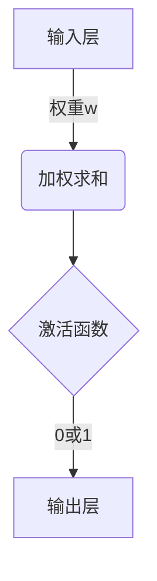

# AI人工智能核心算法原理与代码实例讲解：感知器

## 1.背景介绍

在人工智能和机器学习的发展历程中,感知器(Perceptron)是最早被提出和研究的算法模型之一。它是一种简单的线性二分类模型,被认为是第一代神经网络的基础。尽管感知器的结构相对简单,但它揭示了使用加权求和的方式对输入数据进行处理,并通过激活函数对结果进行二分类的基本思想,为后来的神经网络奠定了基础。

感知器由加拿大心理学家FrankRosenblatt于1957年在康奈尔航空实验室提出。它的灵感来源于人脑中神经元的工作原理。感知器旨在模拟生物神经元对输入信号进行加权求和,并根据阈值激活的过程。尽管感知器的功能非常有限,但它展示了机器可以通过学习对输入数据进行分类,这是人工智能发展的一个重要里程碑。

### 1.1 感知器的发展历程

感知器的提出引发了人工智能领域的第一次热潮。在20世纪60年代初期,人们对感知器的能力抱有很高的期望,认为它可以解决各种复杂的模式识别问题。然而,1969年,马文·明斯基(Marvin Minsky)和西摩尔·帕珀特(Seymour Papert)发表了著名的书籍"感知器(Perceptrons)",指出感知器存在一些根本性的局限性,例如无法解决异或(XOR)问题等。这一发现导致人工智能研究进入了一个低谷时期。

尽管如此,感知器对于机器学习和神经网络的发展做出了重要贡献。它为后来的多层感知器(Multilayer Perceptron)和反向传播算法(Backpropagation)奠定了基础。随着计算能力的提高和新算法的出现,神经网络的能力得到了极大的提升,并在各个领域取得了突破性的进展。

### 1.2 感知器在现代人工智能中的地位

虽然感知器本身的能力有限,但它所体现的基本思想在现代人工智能中仍然扮演着重要的角色。许多机器学习算法,如支持向量机(SVM)、逻辑回归等,都可以看作是感知器的扩展和推广。此外,神经网络的基本单元也可以看作是一种加权求和和激活函数的组合,与感知器的工作原理类似。

因此,虽然感知器算法本身已经不再被广泛使用,但它所体现的基本思想和原理在现代人工智能中仍然具有重要的理论和实践意义。研究和理解感知器的工作原理,有助于我们更好地理解机器学习和神经网络的本质,为设计和优化新的算法模型提供启发和借鉴。

## 2.核心概念与联系

### 2.1 感知器的结构和工作原理

感知器是一种二分类线性模型,它的基本结构如下图所示:

感知器的工作流程可以概括为以下几个步骤:

1. **输入层**:接收输入数据,通常表示为一个向量 $\mathbf{x} = (x_1, x_2, \dots, x_n)$,其中 $n$ 是输入特征的维数。
2. **加权求和**:将输入数据与对应的权重 $\mathbf{w} = (w_1, w_2, \dots, w_n)$ 进行点乘,得到加权和 $z = \mathbf{w}^T\mathbf{x} + b$,其中 $b$ 是偏置项(bias)。
3. **激活函数**:将加权和 $z$ 输入到激活函数中,得到输出结果 $y$。感知器使用的是阶跃函数(Heaviside Step Function)作为激活函数,定义如下:

$$
y = \begin{cases}
1, & \text{if } z \geq 0 \\
0, & \text{if } z < 0
\end{cases}
$$

4. **输出层**:根据激活函数的输出结果 $y$,将输入数据划分为两个类别中的一个。

感知器的核心思想是通过学习合适的权重 $\mathbf{w}$ 和偏置 $b$,从而找到一个超平面(在二维空间中表现为一条直线)来将不同类别的数据点分开。这个超平面由权重向量 $\mathbf{w}$ 和偏置 $b$ 确定,方程为 $\mathbf{w}^T\mathbf{x} + b = 0$。

### 2.2 感知器与其他机器学习模型的联系

虽然感知器是一个相对简单的模型,但它与其他一些著名的机器学习模型存在密切的联系:

1. **逻辑回归(Logistic Regression)**:逻辑回归是一种广泛使用的分类模型,它使用 Sigmoid 函数作为激活函数,而不是感知器中的阶跃函数。逻辑回归可以看作是感知器的推广,它输出的是一个概率值,而不是严格的 0 或 1。
2. **支持向量机(Support Vector Machine, SVM)**:支持向量机是另一种流行的分类模型,它的目标是找到一个最大间隔超平面来分隔不同类别的数据点。感知器可以看作是支持向量机的一个特殊情况,其中间隔被固定为 1,并且使用硬间隔(hard margin)而不是软间隔(soft margin)。
3. **神经网络(Neural Network)**:虽然感知器本身只是一个简单的线性模型,但它的思想为后来的神经网络奠定了基础。神经网络可以看作是多个感知器的组合,通过多层结构和非线性激活函数,可以拟合更加复杂的函数。

总的来说,感知器虽然功能有限,但它所体现的基本思想,如加权求和、激活函数和学习算法等,在现代机器学习中扮演着重要的角色。理解感知器的工作原理,有助于我们更好地理解和掌握其他更加复杂的机器学习模型。

## 3.核心算法原理具体操作步骤

感知器算法的核心思想是通过迭代调整权重和偏置,使得模型能够正确分类训练数据。具体的操作步骤如下:

1. **初始化权重和偏置**:随机初始化权重向量 $\mathbf{w}$ 和偏置 $b$。
2. **对每个训练样本进行迭代**:
   a. 计算加权和 $z = \mathbf{w}^T\mathbf{x} + b$,其中 $\mathbf{x}$ 是当前样本的输入向量。
   b. 应用激活函数,得到预测输出 $y$。
   c. 计算预测输出 $y$ 与实际标签 $t$ 之间的误差 $e = t - y$。
   d. 如果 $e \neq 0$,则更新权重和偏置:
      - $\mathbf{w} = \mathbf{w} + \eta e\mathbf{x}$
      - $b = b + \eta e$
      其中 $\eta$ 是学习率(learning rate),控制了每次更新的步长。
3. **重复步骤 2,直到所有训练样本都被正确分类,或者达到最大迭代次数**。

这个算法的关键在于通过不断调整权重和偏置,使得模型能够正确分类训练数据。当一个样本被错误分类时,算法会根据误差调整权重和偏置,使得下次对该样本的预测更接近正确的标签。

需要注意的是,感知器算法只能解决线性可分的问题,即存在一个超平面能够将不同类别的数据点完全分开。对于一些非线性问题,如异或(XOR)问题,感知器无法找到一个合适的超平面进行分类。

### 3.1 感知器算法的收敛性

感知器算法的收敛性是一个重要的理论问题。具体来说,如果训练数据是线性可分的,感知器算法是否一定能够收敛到一个将所有样本正确分类的解?

1957年,Rosenblatt证明了感知器算法在一定条件下是收敛的,即如果训练数据是线性可分的,并且使用合适的学习率,感知器算法一定能够收敛到一个将所有样本正确分类的解。这个结果被称为"感知器收敛定理"(Perceptron Convergence Theorem)。

感知器收敛定理的证明思路如下:

1. 定义一个函数 $\Phi(\mathbf{w}, b) = \sum_{i=1}^{N} \max(0, -t_i(\mathbf{w}^T\mathbf{x}_i + b))$,其中 $N$ 是训练样本的数量,$(x_i, t_i)$ 是第 $i$ 个训练样本及其标签。
2. 证明每次更新权重和偏置后,函数 $\Phi(\mathbf{w}, b)$ 都会严格减小,除非所有样本都被正确分类。
3. 由于 $\Phi(\mathbf{w}, b)$ 是非负的,并且在每次迭代中都会减小,因此算法一定会在有限步骤内收敛到一个将所有样本正确分类的解,或者达到无法进一步减小 $\Phi(\mathbf{w}, b)$ 的情况(这种情况只会发生在训练数据不是线性可分的时候)。

需要注意的是,感知器收敛定理只适用于线性可分的情况。对于一些非线性问题,感知器算法可能无法收敛到一个将所有样本正确分类的解。

### 3.2 感知器算法的优缺点

感知器算法虽然简单,但也存在一些优缺点:

**优点**:

1. **简单性**:感知器算法的思想和实现都非常简单,易于理解和编码。
2. **高效性**:对于线性可分的问题,感知器算法能够快速收敛,计算效率较高。
3. **可解释性**:感知器算法的决策边界是一个超平面,具有很好的可解释性。

**缺点**:

1. **线性可分性限制**:感知器算法只能解决线性可分的问题,对于非线性问题无能为力。
2. **数据敏感性**:感知器算法对异常值和噪声数据比较敏感,可能导致模型性能下降。
3. **缺乏泛化能力**:由于感知器算法是一种简单的线性模型,它的泛化能力有限,可能无法很好地拟合复杂的数据分布。

尽管感知器算法存在一些局限性,但它的思想和原理对于后续的机器学习和神经网络发展起到了重要的启发作用。在实际应用中,我们通常会使用更加复杂和强大的模型,如支持向量机、神经网络等,来解决更加广泛的问题。

## 4.数学模型和公式详细讲解举例说明

在本节中,我们将详细讨论感知器算法的数学模型和公式,并通过具体的例子来说明它们的含义和应用。

### 4.1 感知器的数学模型

感知器的数学模型可以表示为:

$$
y = \begin{cases}
1, & \text{if } \mathbf{w}^T\mathbf{x} + b \geq 0 \\
0, & \text{if } \mathbf{w}^T\mathbf{x} + b < 0
\end{cases}
$$

其中:

- $\mathbf{x} = (x_1, x_2, \dots, x_n)$ 是输入向量,表示样本的特征。
- $\mathbf{w} = (w_1, w_2, \dots, w_n)$ 是权重向量,用于对输入特征进行加权。
- $b$ 是偏置项(bias),用于调整决策边界的位置。
- $\mathbf{w}^T\mathbf{x} + b$ 是加权和,表示输入样本在超平面上的投影。
- $y \in \{0, 1\}$ 是感知器的输出,表示样本被分类为正类(1)或负类(0)。

感知器的目标是通过学习合适的权重 $\mathbf{w}$ 和偏置 $b$,找到一个超平面(在二维空间中表现为一条直线)来将不同类别的数据点分开。这个超平面由方程 $\mathbf{w}^T\mathbf{x} + b = 