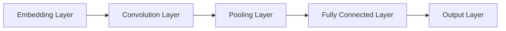
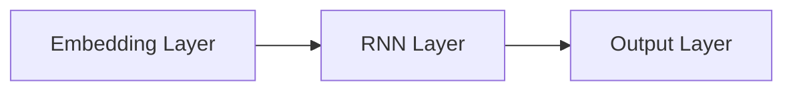
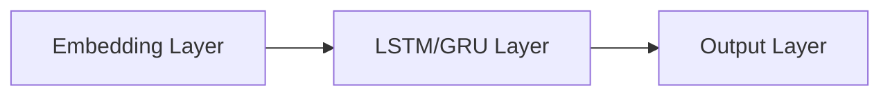
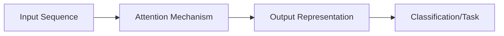
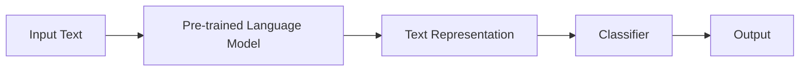

# AI人工智能深度学习算法：在垃圾短信检测中的应用

## 1.背景介绍

### 1.1 垃圾短信的危害

随着移动通信技术的快速发展,垃圾短信已经成为一个严重的社会问题。垃圾短信不仅骚扰用户,还可能传播病毒、诈骗信息等,给用户的隐私和财产安全带来严重威胁。因此,有效地检测和过滤垃圾短信已经成为当前亟待解决的重要问题。

### 1.2 传统垃圾短信检测方法的局限性

传统的垃圾短信检测方法主要基于关键词匹配、发送规则等手工制定的规则,这种方法的主要缺陷是:

- 规则的制定需要大量的人工经验,成本高且适应性差
- 难以有效应对不断变化的垃圾短信内容和策略
- 对于隐蔽性较强的垃圾短信,检测效果不佳

因此,需要一种更加智能和有效的垃圾短信检测方法来解决这一问题。

## 2.核心概念与联系  

### 2.1 深度学习概述

深度学习(Deep Learning)是机器学习的一个新的领域,它模仿人脑的机制来解释数据,通过组合低层次特征形成更加抽象的高层次模式类别或特征,以发现数据的分布式特征表示。与传统的机器学习方法相比,深度学习具有以下优势:

- 自动从数据中学习特征表示,无需人工设计特征
- 能够学习多层次的抽象特征表示,发现数据的内在分布式规律
- 在处理高维、非线性复杂数据时表现出色

深度学习已在计算机视觉、自然语言处理、语音识别等领域取得了突破性的进展,展现出巨大的应用潜力。

### 2.2 文本分类任务

垃圾短信检测本质上是一个文本分类任务,即根据短信的文本内容将其分类为垃圾短信或正常短信。文本分类是自然语言处理中的一个核心任务,传统的文本分类方法通常基于统计机器学习模型,如朴素贝叶斯、支持向量机等。这些方法需要人工设计文本特征,如词袋(Bag-of-Words)、N-gram等,存在一定的局限性。

### 2.3 深度学习在文本分类中的应用

近年来,深度学习在自然语言处理领域取得了突破性进展,尤其是在文本分类任务中表现优异。将深度学习应用于垃圾短信检测,可以克服传统方法的缺陷,自动学习文本的高层次语义特征表示,提高分类的准确性和泛化能力。常用的深度学习模型包括:

- 卷积神经网络(CNN)
- 循环神经网络(RNN)
- 长短期记忆网络(LSTM)
- 门控循环单元网络(GRU)
- 注意力机制(Attention Mechanism)
- 预训练语言模型(Pre-trained Language Models),如BERT、GPT等

这些模型能够从大规模语料中学习到文本的分布式语义表示,并在下游的文本分类任务中发挥出色的性能。

### 2.4 核心概念总结

垃圾短信检测是一个典型的文本分类任务。传统的基于规则的方法存在诸多局限性,而深度学习能够自动学习文本的高层次语义特征表示,为垃圾短信检测任务提供了新的解决思路和方法。将深度学习模型应用于垃圾短信检测,可以提高检测的准确性和泛化能力,从而更好地解决这一重要问题。

## 3.核心算法原理具体操作步骤

### 3.1 数据预处理

在应用深度学习模型进行垃圾短信检测之前,需要对原始文本数据进行适当的预处理,以消除噪声和无关信息,提高模型的效果。常见的文本预处理步骤包括:

1. **分词(Tokenization)**: 将文本按照一定的规则(如空格、标点符号等)分割成一个个单词(token)序列。
2. **去除停用词(Stop Words Removal)**: 移除一些高频但无实际意义的词语,如"的"、"了"、"是"等。
3. **词干提取(Stemming)和词形还原(Lemmatization)**: 将单词简化为词根或原形,以减少数据的稀疏性。
4. **特殊字符处理**: 移除或替换文本中的特殊字符、数字、URL等无关信息。
5. **数据清洗(Data Cleaning)**: 处理缺失值、异常值等脏数据问题。
6. **编码(Encoding)**: 将文本转换为模型可以接受的数值表示,如One-Hot编码、Word Embedding等。

经过预处理后的文本数据更加规范和简洁,有利于模型的训练和预测。

### 3.2 embedding层

在深度学习模型中,通常需要将文本转换为数值向量的形式作为模型的输入。常用的文本表示方法是Word Embedding,即将每个单词映射为一个固定长度的密集向量,这些向量能够捕捉单词之间的语义和语法关系。

Word Embedding可以通过预训练的方式获得,如Word2Vec、GloVe等;也可以在模型训练过程中直接学习得到,称为End-to-End的方式。除了Word Embedding,还可以使用更高层次的表示,如字符级别的Embedding、子词(Subword)Embedding等。

通过Embedding层,原始的文本数据被转换为密集的向量表示,为后续的深度学习模型提供了合适的输入格式。

### 3.3 卷积神经网络(CNN)

卷积神经网络(Convolutional Neural Network, CNN)是一种常用的深度学习模型,最早被成功应用于计算机视觉领域。CNN也可以应用于自然语言处理任务,尤其是文本分类。

对于文本分类任务,CNN的工作原理如下:

1. **输入层**:接收embedding向量序列作为输入。
2. **卷积层**:使用多个不同尺寸的卷积核(kernel),在embedding序列上滑动,捕捉不同尺度的局部特征。
3. **池化层**:对卷积特征图进行下采样,保留最重要的特征,减少参数数量。
4. **全连接层**:将池化后的特征展平,输入到全连接层进行高层次特征的组合和分类。
5. **输出层**:根据任务需求输出相应的结果,如二分类(垃圾/正常短信)或多分类。

CNN能够自动学习文本的局部特征模式,如词语、短语等,并通过层次结构组合成更高层次的语义表示,从而完成文本分类任务。相比传统方法,CNN无需人工设计复杂的特征工程,能够自动从数据中学习到有效的特征表示。

### 3.4 循环神经网络(RNN)

循环神经网络(Recurrent Neural Network, RNN)是另一种常用的深度学习模型,擅长处理序列数据。由于文本数据本身就是一种序列结构,RNN在自然语言处理任务中有着广泛的应用。

RNN的工作原理如下:

1. **输入层**:接收embedding向量序列作为输入。
2. **隐藏层**:包含一系列循环神经元,每个神经元不仅接收当前时间步的输入,还会接收上一个时间步的隐藏状态,从而捕捉序列数据的上下文信息。
3. **输出层**:根据隐藏层的状态输出相应的结果,如文本分类的标签。

与CNN不同,RNN能够有效地捕捉文本序列中的长期依赖关系,更好地理解语义上下文。但是,传统的RNN存在梯度消失或爆炸的问题,难以学习到很长的依赖关系。

### 3.5 长短期记忆网络(LSTM)和门控循环单元(GRU)

为了解决RNN的长期依赖问题,研究者提出了长短期记忆网络(Long Short-Term Memory, LSTM)和门控循环单元(Gated Recurrent Unit, GRU)等改进的循环神经网络结构。

LSTM和GRU的核心思想是引入门控机制,通过不同的门来控制信息的流动,从而更好地捕捉长期依赖关系。LSTM包含遗忘门、输入门和输出门,而GRU则是一种更简化的变体。

这些改进的RNN变体在许多自然语言处理任务中表现出色,包括文本分类、机器翻译、问答系统等。它们能够更好地捕捉文本序列中的上下文语义信息,提高模型的性能。

### 3.6 注意力机制(Attention Mechanism)

注意力机制(Attention Mechanism)是近年来在深度学习领域取得突破性进展的一种技术,它能够赋予模型"注意力"能力,专注于输入序列中的关键部分,从而提高模型的性能和解释能力。

在文本分类任务中,注意力机制可以应用于CNN、RNN等模型,使模型能够自动学习到对于分类任务而言最重要的词语或短语,从而更好地捕捉文本的关键语义信息。

注意力机制的工作原理如下:

1. 计算查询向量(query)和键向量(key)之间的相似性得分
2. 根据相似性得分,对值向量(value)进行加权求和,得到注意力向量
3. 将注意力向量与模型的其他部分(如RNN隐藏状态)进行融合,得到最终的特征表示
4. 基于融合后的特征表示进行文本分类或其他任务

注意力机制赋予了深度学习模型"选择性关注"的能力,使其能够更好地理解文本的语义,提高了模型的性能和可解释性。

### 3.7 预训练语言模型(Pre-trained Language Models)

预训练语言模型(Pre-trained Language Models)是近年来自然语言处理领域的一个重大突破。这种方法通过在大规模无监督语料上预训练一个通用的语言模型,捕捉语言的深层次语义和上下文信息,然后将预训练的模型迁移到下游的各种自然语言处理任务上,如文本分类、机器翻译等,显著提高了这些任务的性能。

著名的预训练语言模型包括BERT、GPT、XLNet等。这些模型通过自监督学习的方式,在海量语料上学习到丰富的语义知识,能够生成上下文相关、语义连贯的文本表示,为下游任务提供强大的语义增强。

在垃圾短信检测任务中,可以将预训练语言模型作为编码器(encoder),对输入的短信文本进行编码,得到其语义表示;然后将编码后的表示输入到分类器(classifier)中,完成垃圾短信与正常短信的二分类。

通过利用预训练语言模型的强大语义表示能力,能够显著提高垃圾短信检测的准确性和泛化能力。

## 4.数学模型和公式详细讲解举例说明

在深度学习模型中,通常会使用一些数学模型和公式来描述和优化模型的结构和行为。以下是一些在垃圾短信检测任务中常用的数学模型和公式:

### 4.1 词嵌入(Word Embedding)

词嵌入是将单词映射为固定长度的密集向量表示,这些向量能够捕捉单词之间的语义和语法关系。常用的词嵌入方法包括Word2Vec、GloVe等。

Word2Vec是一种基于神经网络的词嵌入方法,它包含两种模型:连续词袋模型(CBOW)和Skip-Gram模型。

**Skip-Gram模型**的目标是给定一个中心词 $w_