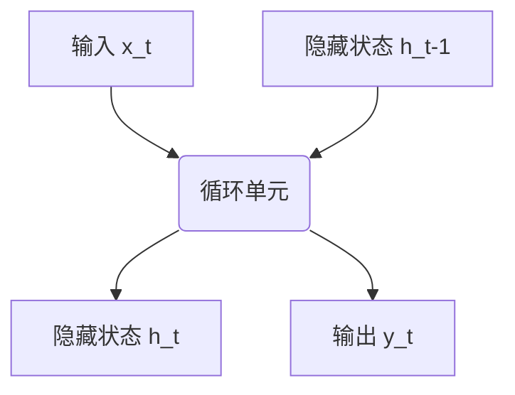

# AI人工智能深度学习算法：循环神经网络的理解与使用

## 1. 背景介绍

### 1.1 人工智能的发展历程

人工智能(Artificial Intelligence, AI)是当代科技发展的热点领域之一,近年来取得了长足进步。从最初的专家系统、机器学习算法,到如今的深度学习技术,AI不断突破自身的局限,在语音识别、图像处理、自然语言处理等领域展现出了令人惊叹的能力。

### 1.2 神经网络与深度学习

深度学习(Deep Learning)是机器学习的一个新的研究热点,它是一种模仿人脑结构和功能的神经网络算法。与传统的机器学习算法相比,深度学习能自动从数据中学习出特征表示,无需人工设计特征,从而在语音识别、图像分类等领域取得了突破性的进展。

### 1.3 循环神经网络的重要性

在深度学习领域,循环神经网络(Recurrent Neural Network, RNN)是一种处理序列数据的有力工具。与前馈神经网络不同,RNN能够很好地捕捉序列数据中的时序信息,因此在自然语言处理、语音识别等领域有着广泛的应用。本文将重点介绍RNN的基本原理、训练算法以及在实际项目中的应用。

## 2. 核心概念与联系

### 2.1 循环神经网络的基本结构

循环神经网络的核心结构是一个循环单元,它接收当前时刻的输入,并将上一时刻的隐藏状态作为额外的输入,从而捕捉序列数据中的时序信息。



### 2.2 循环神经网络与前馈神经网络的区别

与传统的前馈神经网络不同,循环神经网络引入了循环连接,使得网络能够处理序列数据。前馈神经网络在处理序列数据时,需要将序列展开为多个独立的样本,而循环神经网络则能够直接对整个序列进行建模。

### 2.3 循环神经网络的应用场景

循环神经网络在处理序列数据方面具有独特的优势,因此在自然语言处理、语音识别、时序预测等领域有着广泛的应用。例如:

- 语言模型: 根据上文预测下一个词
- 机器翻译: 将一种语言的句子翻译成另一种语言
- 语音识别: 将语音信号转录为文本
- 时序预测: 预测股票走势、天气变化等

## 3. 核心算法原理具体操作步骤

### 3.1 循环神经网络的前向传播

循环神经网络的前向传播过程可以表示为:

$$h_t = \tanh(W_{hh}h_{t-1} + W_{xh}x_t + b_h)$$
$$y_t = W_{hy}h_t + b_y$$

其中:
- $x_t$是当前时刻的输入
- $h_{t-1}$是上一时刻的隐藏状态
- $W_{hh}$、$W_{xh}$、$W_{hy}$分别是隐藏层到隐藏层、输入到隐藏层、隐藏层到输出层的权重矩阵
- $b_h$、$b_y$分别是隐藏层和输出层的偏置项

这个过程将当前输入$x_t$和上一时刻的隐藏状态$h_{t-1}$综合起来,计算出当前时刻的隐藏状态$h_t$,并基于$h_t$计算输出$y_t$。

### 3.2 循环神经网络的反向传播

循环神经网络的反向传播算法是基于BP算法的一种变体,需要计算隐藏状态对误差的梯度:

$$\frac{\partial E_t}{\partial h_t} = \frac{\partial E_t}{\partial y_t}\frac{\partial y_t}{\partial h_t} + \frac{\partial E_{t+1}}{\partial h_{t+1}}\frac{\partial h_{t+1}}{\partial h_t}$$

其中$\frac{\partial E_t}{\partial y_t}$和$\frac{\partial y_t}{\partial h_t}$的计算方式与前馈神经网络相同,而$\frac{\partial E_{t+1}}{\partial h_{t+1}}$和$\frac{\partial h_{t+1}}{\partial h_t}$则需要通过反向传播算法计算得到。

由于循环神经网络存在循环连接,因此反向传播时需要展开计算图,并使用动态规划的方法高效地计算梯度。

### 3.3 长期依赖问题与门控循环单元

虽然循环神经网络能够捕捉序列数据中的时序信息,但在实践中发现,它难以有效地捕捉长期的依赖关系。这是由于在反向传播过程中,梯度会出现衰减或爆炸的现象,导致无法有效地更新远离输出的权重。

为了解决这个问题,研究人员提出了门控循环单元(Gated Recurrent Unit, GRU)和长短期记忆网络(Long Short-Term Memory, LSTM)等变体结构。这些结构通过引入门控机制,能够更好地捕捉长期依赖关系。

## 4. 数学模型和公式详细讲解举例说明

### 4.1 循环神经网络的数学模型

循环神经网络的数学模型可以表示为:

$$h_t = f(W_{hh}h_{t-1} + W_{xh}x_t + b_h)$$
$$y_t = g(W_{hy}h_t + b_y)$$

其中:
- $x_t$是当前时刻的输入
- $h_{t-1}$是上一时刻的隐藏状态
- $W_{hh}$、$W_{xh}$、$W_{hy}$分别是隐藏层到隐藏层、输入到隐藏层、隐藏层到输出层的权重矩阵
- $b_h$、$b_y$分别是隐藏层和输出层的偏置项
- $f$和$g$分别是隐藏层和输出层的激活函数,通常使用tanh或ReLU等非线性函数

这个模型将当前输入$x_t$和上一时刻的隐藏状态$h_{t-1}$综合起来,计算出当前时刻的隐藏状态$h_t$,并基于$h_t$计算输出$y_t$。

### 4.2 循环神经网络的损失函数

在训练循环神经网络时,我们需要定义一个损失函数来衡量模型的预测结果与真实标签之间的差异。常用的损失函数包括:

- 对于回归任务,可以使用均方误差(Mean Squared Error, MSE):

$$J(\theta) = \frac{1}{n}\sum_{i=1}^n(y_i - \hat{y}_i)^2$$

- 对于分类任务,可以使用交叉熵损失函数(Cross Entropy Loss):

$$J(\theta) = -\frac{1}{n}\sum_{i=1}^n\sum_{j=1}^Cy_{ij}\log(\hat{y}_{ij})$$

其中$y_i$和$\hat{y}_i$分别表示第$i$个样本的真实标签和模型预测值,$C$是类别数量。

### 4.3 循环神经网络的优化算法

在训练循环神经网络时,我们需要使用优化算法来更新网络的参数,从而最小化损失函数。常用的优化算法包括:

- 梯度下降法(Gradient Descent)
- 动量法(Momentum)
- RMSProp
- Adam等

这些优化算法通过计算损失函数对参数的梯度,并沿着梯度的反方向更新参数,从而逐步减小损失函数的值。

以Adam优化算法为例,它的更新规则为:

$$m_t = \beta_1m_{t-1} + (1-\beta_1)g_t$$
$$v_t = \beta_2v_{t-1} + (1-\beta_2)g_t^2$$
$$\hat{m}_t = \frac{m_t}{1-\beta_1^t}$$
$$\hat{v}_t = \frac{v_t}{1-\beta_2^t}$$
$$\theta_{t+1} = \theta_t - \frac{\alpha}{\sqrt{\hat{v}_t}+\epsilon}\hat{m}_t$$

其中$m_t$和$v_t$分别是一阶矩估计和二阶矩估计,$\beta_1$和$\beta_2$是相应的指数衰减率,$\alpha$是学习率,$\epsilon$是一个很小的常数,用于避免除以0。

通过适当选择优化算法和超参数,我们可以加快循环神经网络的训练过程,提高模型的性能。

## 5. 项目实践:代码实例和详细解释说明

在这一部分,我们将通过一个实际项目来演示如何使用Python中的深度学习框架(如PyTorch或TensorFlow)构建和训练循环神经网络模型。我们将使用一个文本生成任务作为示例,目标是根据给定的文本前缀,生成新的文本序列。

### 5.1 数据准备

首先,我们需要准备训练数据。在本例中,我们将使用一些经典文学作品的文本作为训练数据。我们需要对原始文本进行预处理,包括分词、构建词表、将文本转换为数字序列等步骤。

```python
import re
import collections

def preprocess_data(text):
    # 去除特殊字符和数字
    text = re.sub(r'[^a-zA-Z\s]', '', text)
    
    # 转换为小写
    text = text.lower()
    
    # 分词
    words = text.split()
    
    # 构建词表
    word_counts = collections.Counter(words)
    vocab = sorted(word_counts, key=word_counts.get, reverse=True)
    word_to_idx = {word: idx for idx, word in enumerate(vocab)}
    
    # 将文本转换为数字序列
    encoded_text = [word_to_idx[word] for word in words]
    
    return encoded_text, word_to_idx

# 加载数据
with open('data.txt', 'r') as f:
    text = f.read()

encoded_text, word_to_idx = preprocess_data(text)
```

### 5.2 构建循环神经网络模型

接下来,我们将使用PyTorch构建一个基本的循环神经网络模型。这个模型将接受文本前缀作为输入,并生成新的文本序列。

```python
import torch
import torch.nn as nn

class TextGenerator(nn.Module):
    def __init__(self, vocab_size, embedding_dim, hidden_dim, num_layers):
        super(TextGenerator, self).__init__()
        self.embedding = nn.Embedding(vocab_size, embedding_dim)
        self.rnn = nn.GRU(embedding_dim, hidden_dim, num_layers, batch_first=True)
        self.fc = nn.Linear(hidden_dim, vocab_size)
        
    def forward(self, x, hidden):
        embedded = self.embedding(x)
        output, hidden = self.rnn(embedded, hidden)
        output = self.fc(output)
        return output, hidden

# 创建模型实例
vocab_size = len(word_to_idx)
model = TextGenerator(vocab_size, embedding_dim=256, hidden_dim=512, num_layers=2)
```

在这个模型中,我们首先使用`nn.Embedding`层将输入的文本序列转换为嵌入向量。然后,我们使用`nn.GRU`层作为循环神经网络的核心,它将嵌入向量作为输入,并输出隐藏状态序列。最后,我们使用一个全连接层(`nn.Linear`)将隐藏状态映射到词表大小的空间,得到每个词的概率分布。

### 5.3 训练循环神经网络模型

接下来,我们将定义训练循环,并使用优化算法(如Adam)训练模型。在训练过程中,我们将使用交叉熵损失函数作为目标函数。

```python
import torch.optim as optim

# 定义损失函数和优化器
criterion = nn.CrossEntropyLoss()
optimizer = optim.Adam(model.parameters(), lr=0.001)

# 训练循环
for epoch in range(num_epochs):
    hidden = model.init_hidden(batch_size)
    loss = 0
    
    for i in range(0, encoded_text.size(0) - sequence_length, sequence_length):
        input_seq = encoded_text[i:i+sequence_length]
        target_seq = encoded_text[i+1:i+sequence_length+1]
        
        output, hidden = model(input_seq, hidden)
        loss += criterion(output.view(-1, vocab_size), target_seq.view(-1))
        
        optimizer.zero_grad()
        loss.backward()
        optimizer.step()
    
    print(f'Epoch {epoch+1}, Loss: {loss.item() / (encoded_text.size(0) - sequence