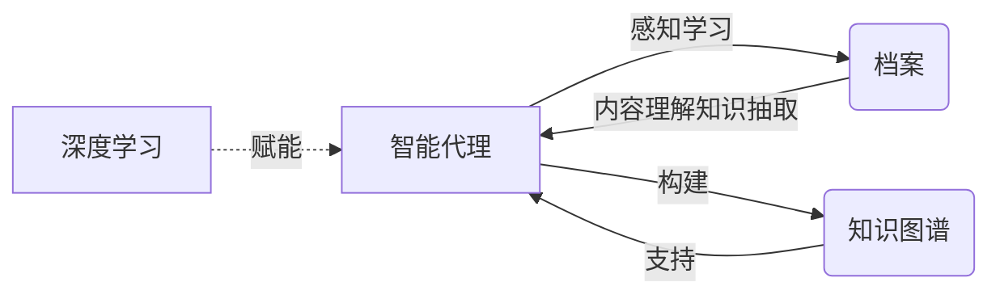

# AI人工智能深度学习算法：智能深度学习代理在档案管理中的应用

## 1.背景介绍
### 1.1 人工智能与深度学习的发展历程
人工智能(Artificial Intelligence, AI)作为计算机科学的一个分支,旨在研究如何让机器模拟人类的智能行为。自1956年达特茅斯会议首次提出"人工智能"的概念以来,AI经历了从早期的符号主义、专家系统,到上世纪80年代的连接主义和神经网络,再到近年来大放异彩的深度学习等多个发展阶段。

深度学习(Deep Learning, DL)是机器学习的一个子集,其本质是通过构建具有多个隐藏层的人工神经网络,并利用大量数据训练网络,使其能够自动学习数据中蕴含的高层次抽象特征。2006年Geoffrey Hinton等人提出了深度信念网络(Deep Belief Network)[1],揭开了深度学习的序幕。此后,DL技术在计算机视觉、语音识别、自然语言处理等领域取得了突破性进展,成为当前AI领域的研究热点。

### 1.2 档案管理中的痛点与挑战
档案是机构或个人在社会活动中直接形成的对国家和社会有保存价值的各种文字、图表、声像等不同形式的历史记录[2]。传统的档案管理工作主要依靠人工方式进行,存在着工作量大、效率低下、差错率高等问题。此外,档案的数字化也给管理工作带来新的挑战,如海量档案数据的存储与检索、非结构化数据的处理、知识的挖掘与利用等。

### 1.3 智能档案管理的意义
将人工智能技术引入档案管理领域,有望突破传统模式的瓶颈,实现档案管理工作的智能化。利用深度学习算法,可以自动对档案进行分类、提取关键信息、构建知识图谱等,大大提高管理效率和档案利用率。智能化的档案管理不仅能节省人力物力,更能充分挖掘档案的历史价值和现实意义,为各行各业的决策提供有力支撑。

## 2.核心概念与联系
### 2.1 智能代理
智能代理(Intelligent Agent)是人工智能领域的一个重要概念,是能够感知环境并作出自主行为以实现特定目标的计算机系统[3]。智能代理通常具有感知、推理、学习、规划等能力,能根据环境的变化做出相应决策。在档案管理中引入智能代理,可赋予档案管理系统感知档案内容、学习档案知识、规划管理策略的能力。

### 2.2 深度学习
深度学习是一类通过多层次抽象对数据进行建模的机器学习方法。其核心是利用人工神经网络(Artificial Neural Network)对海量数据进行表征学习,自动提取数据中的高层语义特征[4]。常见的深度学习模型包括卷积神经网络(CNN)、循环神经网络(RNN)、长短期记忆网络(LSTM)等。将DL应用于档案管理,可以自动学习档案文本、图像等非结构化数据的深层特征,实现智能化的内容理解和处理。

### 2.3 知识图谱 
知识图谱(Knowledge Graph)是用于描述客观世界中事物及其关联的大规模语义网络。通过对实体及其属性、关系的刻画,KG能够将非结构化信息组织为结构化的知识形式,便于存储、检索和推理[5]。在档案领域构建知识图谱,可以揭示档案间的内在联系,挖掘档案的语义信息,实现基于知识的智能化档案管理与利用。

### 2.4 核心概念之间的关系
在智能档案管理中,深度学习为智能代理的感知、学习能力提供了有力的算法支持。智能代理可利用DL模型对档案进行内容理解、知识抽取,进而构建档案知识图谱。知识图谱则为智能代理的推理、规划、决策提供了知识基础。三者相辅相成,共同构成了智能档案管理的核心。

下图展示了智能代理、深度学习、知识图谱在智能档案管理中的关系:

## 3.核心算法原理具体操作步骤
### 3.1 基于CNN的档案图像分类
卷积神经网络在图像识别领域表现出色。将CNN应用于档案图像分类的主要步骤如下:

(1) 数据准备:收集档案图像数据,并进行必要的预处理,如尺寸归一化、数据增强等。

(2) 网络构建:设计CNN网络结构,主要包括卷积层、池化层、全连接层等。卷积层用于提取局部特征,池化层用于特征降维,全连接层用于特征组合分类。

(3) 模型训练:利用已标注的档案图像数据对CNN进行训练,通过前向传播计算损失,再通过反向传播更新网络参数,不断提升模型性能。

(4) 模型评估:在测试集上评估模型的分类准确率,进行超参数调优,优化模型。

(5) 模型应用:利用训练好的CNN模型对新的档案图像进行自动分类。

### 3.2 基于RNN的档案文本信息提取
循环神经网络善于处理序列数据,适用于档案文本的信息提取。主要步骤包括:

(1) 语料构建:收集档案文本语料,进行分词、去停用词等预处理。

(2) 词嵌入:将词映射为稠密向量,作为RNN的输入。常用word2vec、GloVe等词嵌入方法。

(3) 网络搭建:构建RNN网络,常用LSTM、GRU等变种。设置嵌入层、RNN层、全连接层等。

(4) 模型训练:用标注数据训练RNN模型,通过极大似然估计等方法优化模型参数。

(5) 序列标注:用训练好的RNN模型对档案文本进行序列标注,提取关键信息,如人名、地名、时间等。

(6) 关系抽取:在实体识别的基础上,进一步抽取实体间的语义关系,如"人物-职位"、"文件-发布机构"等。

### 3.3 基于KG的档案知识管理
知识图谱可用于组织管理档案知识,实现智能化的档案检索与推荐。主要步骤如下:

(1) 知识抽取:利用自然语言处理技术,如命名实体识别、关系抽取等,从档案文本中提取实体、属性、关系等知识要素。

(2) 本体构建:参考档案领域本体,定义KG的Schema,规范实体类型、关系类型。

(3) 知识融合:将抽取的知识要素按照本体组织起来,构建档案知识图谱。需要进行指代消解、知识去重、知识校验等。

(4) 知识存储:将构建的知识图谱导入图数据库如Neo4j进行存储,以支持高效的图查询与推理。

(5) 知识应用:利用KG支持档案的语义检索、相关档案推荐、档案知识问答等智能应用。

## 4.数学模型和公式详细讲解举例说明
### 4.1 卷积神经网络
卷积神经网络的核心是卷积运算,可提取图像的局部特征。二维卷积的数学描述为:

$$ H(i,j) = \sum_{m=0}^{M-1} \sum_{n=0}^{N-1} I(i+m, j+n) K(m,n) $$

其中,$I$为输入图像,$K$为卷积核,$H$为输出特征图。卷积核在图像上滑动,通过加权求和提取特征。

例如,假设输入图像为:
$$
I=
\begin{bmatrix}
1 & 0 & 1 \\
0 & 1 & 1 \\
0 & 0 & 1
\end{bmatrix}
$$

卷积核为:
$$
K = 
\begin{bmatrix}
1 & 0 \\
0 & 1
\end{bmatrix}
$$

则卷积结果为:
$$
H = 
\begin{bmatrix}
1 & 1 \\
0 & 2
\end{bmatrix}
$$

可见,卷积运算可提取图像的边缘、纹理等局部特征,用于后续的特征组合与分类判别。

### 4.2 循环神经网络
循环神经网络引入了状态向量的概念,能够建模序列数据。以LSTM为例,其前向传播的数学描述为:

$$
\begin{aligned}
f_t &= \sigma(W_f \cdot [h_{t-1}, x_t] + b_f) \\
i_t &= \sigma(W_i \cdot [h_{t-1}, x_t] + b_i) \\ 
o_t &= \sigma(W_o \cdot [h_{t-1}, x_t] + b_o) \\
\tilde{C}_t &= \tanh(W_C \cdot [h_{t-1}, x_t] + b_C) \\
C_t &= f_t * C_{t-1} + i_t * \tilde{C}_t \\
h_t &= o_t * \tanh(C_t)
\end{aligned}
$$

其中,$x_t$为t时刻的输入,$h_t$为t时刻的隐藏状态,$C_t$为t时刻的细胞状态,$f_t,i_t,o_t$分别为遗忘门、输入门、输出门。LSTM通过门控机制,可以选择性地记忆和遗忘信息,缓解了RNN的梯度消失问题。

例如,假设输入序列为"我 爱 中国",对应的词向量为:
$$
\begin{aligned}
x_1 &= [0.1, 0.2, 0.3] \\
x_2 &= [0.2, 0.4, 0.5] \\
x_3 &= [0.3, 0.5, 0.6] 
\end{aligned}
$$

初始化$h_0 = [0,0,0], C_0 = [0,0,0]$,设LSTM的参数为:
$$
\begin{aligned}
W_f &= W_i = W_o = W_C = [0.1, 0.2, 0.3] \\
b_f &= b_i = b_o = b_C = [0.1, 0.1, 0.1]
\end{aligned}
$$

则$t=1$时刻,LSTM的前向传播为:
$$
\begin{aligned}
f_1 &= \sigma([0.1, 0.2, 0.3] \cdot [0, 0, 0, 0.1, 0.2, 0.3] + [0.1, 0.1, 0.1]) \\
    &= [0.5498, 0.5498, 0.5498] \\
i_1 &= [0.5498, 0.5498, 0.5498] \\
o_1 &= [0.5498, 0.5498, 0.5498] \\
\tilde{C}_1 &= \tanh([0.1, 0.2, 0.3] \cdot [0, 0, 0, 0.1, 0.2, 0.3] + [0.1, 0.1, 0.1]) \\
            &= [0.0997, 0.1974, 0.2913] \\
C_1 &= [0.5498, 0.5498, 0.5498] * [0, 0, 0] + [0.5498, 0.5498, 0.5498] * [0.0997, 0.1974, 0.2913] \\
    &= [0.0548, 0.1086, 0.1602] \\
h_1 &= [0.5498, 0.5498, 0.5498] * \tanh([0.0548, 0.1086, 0.1602]) \\
    &= [0.0301, 0.0596, 0.0880]
\end{aligned}
$$

以此类推,可得到整个序列在LSTM中的表示。可见,LSTM在每个时间步通过门控单元选择性地更新隐藏状态,记忆序列的长期依赖,实现了对文本语义的建模。

### 4.3 知识图谱嵌入
将知识图谱中的实体和关系嵌入到连续向量空间,可得到低维稠密的语义表示,便于知识的检索、推理等应用。以TransE模型为例,其数学描述为:

$$ h + r \approx t $$

其中,$h,r,t$