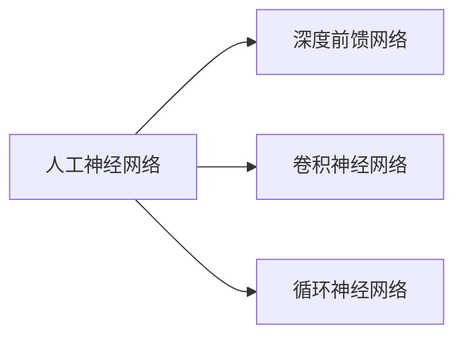

# AI人工智能深度学习算法：构建高效深度学习模型的基础

## 1. 背景介绍
### 1.1 人工智能的发展历程
#### 1.1.1 早期人工智能
#### 1.1.2 专家系统时代  
#### 1.1.3 机器学习崛起
### 1.2 深度学习的兴起
#### 1.2.1 神经网络的复兴
#### 1.2.2 深度学习的突破
#### 1.2.3 深度学习的应用领域
### 1.3 深度学习面临的挑战
#### 1.3.1 模型的可解释性
#### 1.3.2 数据的标注成本
#### 1.3.3 模型的泛化能力

## 2. 核心概念与联系
### 2.1 人工神经网络
#### 2.1.1 神经元模型
#### 2.1.2 激活函数
#### 2.1.3 网络结构
### 2.2 深度前馈网络
#### 2.2.1 前馈网络架构
#### 2.2.2 全连接层
#### 2.2.3 前馈网络的局限性
### 2.3 卷积神经网络
#### 2.3.1 卷积运算
#### 2.3.2 池化运算
#### 2.3.3 卷积神经网络架构
### 2.4 循环神经网络
#### 2.4.1 循环神经网络架构
#### 2.4.2 长短期记忆网络(LSTM)
#### 2.4.3 门控循环单元(GRU)



## 3. 核心算法原理具体操作步骤
### 3.1 反向传播算法
#### 3.1.1 前向传播
#### 3.1.2 损失函数
#### 3.1.3 反向传播
### 3.2 优化算法
#### 3.2.1 梯度下降法
#### 3.2.2 随机梯度下降法
#### 3.2.3 自适应学习率优化算法
### 3.3 正则化方法
#### 3.3.1 L1正则化
#### 3.3.2 L2正则化
#### 3.3.3 Dropout
### 3.4 批量归一化
#### 3.4.1 内部协变量偏移
#### 3.4.2 批量归一化原理
#### 3.4.3 批量归一化的优势

## 4. 数学模型和公式详细讲解举例说明
### 4.1 感知机模型
#### 4.1.1 感知机模型定义
$$ f(x)=sign(w \cdot x+b) $$
其中，$w$为权重向量，$b$为偏置，$sign$为符号函数。
#### 4.1.2 感知机学习算法
#### 4.1.3 感知机的局限性
### 4.2 多层感知机
#### 4.2.1 多层感知机模型定义
$$ \begin{aligned} h_i &= f(\sum_{j=1}^{n} w_{ij}^{(1)} x_j + b_i^{(1)}) \\ y_k &= g(\sum_{i=1}^{m} w_{ki}^{(2)} h_i + b_k^{(2)}) \end{aligned} $$
其中，$f$和$g$为激活函数，$w^{(1)}$和$w^{(2)}$为权重矩阵，$b^{(1)}$和$b^{(2)}$为偏置向量。
#### 4.2.2 多层感知机的表达能力
#### 4.2.3 多层感知机的训练方法
### 4.3 卷积神经网络
#### 4.3.1 卷积运算的数学定义
二维卷积运算定义为：
$$ S(i,j) = (I * K)(i,j) = \sum_m \sum_n I(i+m,j+n) K(m,n) $$
其中，$I$为输入，$K$为卷积核。
#### 4.3.2 池化运算的数学定义 
最大池化运算定义为：
$$ y = \max_{i=1}^{k} x_i $$
其中，$x_i$为池化窗口内的元素。
#### 4.3.3 卷积神经网络的前向传播

## 5. 项目实践：代码实例和详细解释说明
### 5.1 数据预处理
#### 5.1.1 数据归一化
```python
from sklearn.preprocessing import StandardScaler

scaler = StandardScaler()
X_train = scaler.fit_transform(X_train)
X_test = scaler.transform(X_test)
```
StandardScaler对数据进行标准化，使数据均值为0，方差为1。
#### 5.1.2 独热编码
```python
from tensorflow.keras.utils import to_categorical

y_train = to_categorical(y_train)
y_test = to_categorical(y_test)
```
to_categorical将类别标签转换为独热编码形式。
### 5.2 模型构建
#### 5.2.1 序贯模型
```python
from tensorflow.keras.models import Sequential
from tensorflow.keras.layers import Dense

model = Sequential([
    Dense(128, activation='relu', input_shape=(784,)),
    Dense(64, activation='relu'),
    Dense(10, activation='softmax')
])
```
Sequential用于构建序贯模型，Dense表示全连接层。
#### 5.2.2 函数式API
```python
from tensorflow.keras.models import Model
from tensorflow.keras.layers import Input, Dense

inputs = Input(shape=(784,))
x = Dense(128, activation='relu')(inputs)
x = Dense(64, activation='relu')(x)
outputs = Dense(10, activation='softmax')(x)
model = Model(inputs=inputs, outputs=outputs)
```
函数式API提供了更灵活的方式来构建模型。
### 5.3 模型训练
```python
model.compile(optimizer='adam',
              loss='categorical_crossentropy',
              metrics=['accuracy'])

model.fit(X_train, y_train, 
          batch_size=32, epochs=10, verbose=1,
          validation_data=(X_test, y_test))
```
compile方法配置模型的优化器、损失函数和评估指标。fit方法用于训练模型，指定训练数据、批量大小、训练轮数等参数。
### 5.4 模型评估
```python
score = model.evaluate(X_test, y_test, verbose=0)
print('Test loss:', score[0])
print('Test accuracy:', score[1])
```
evaluate方法用于在测试集上评估模型的性能。

## 6. 实际应用场景
### 6.1 图像分类
#### 6.1.1 物体识别
#### 6.1.2 人脸识别
#### 6.1.3 医学图像诊断
### 6.2 自然语言处理
#### 6.2.1 情感分析
#### 6.2.2 机器翻译
#### 6.2.3 文本分类
### 6.3 语音识别
#### 6.3.1 语音转文本
#### 6.3.2 说话人识别
#### 6.3.3 语音合成

## 7. 工具和资源推荐
### 7.1 深度学习框架
#### 7.1.1 TensorFlow
#### 7.1.2 PyTorch
#### 7.1.3 Keras
### 7.2 数据集
#### 7.2.1 ImageNet
#### 7.2.2 COCO
#### 7.2.3 Penn Treebank
### 7.3 预训练模型
#### 7.3.1 VGGNet
#### 7.3.2 ResNet
#### 7.3.3 BERT

## 8. 总结：未来发展趋势与挑战
### 8.1 模型压缩与加速
#### 8.1.1 模型剪枝
#### 8.1.2 知识蒸馏
#### 8.1.3 低精度计算
### 8.2 自监督学习
#### 8.2.1 对比学习
#### 8.2.2 生成式预训练
#### 8.2.3 半监督学习
### 8.3 图神经网络
#### 8.3.1 图卷积网络
#### 8.3.2 图注意力网络
#### 8.3.3 图自编码器
### 8.4 联邦学习
#### 8.4.1 横向联邦学习
#### 8.4.2 纵向联邦学习
#### 8.4.3 联邦迁移学习

## 9. 附录：常见问题与解答
### 9.1 如何选择合适的激活函数？
sigmoid适用于二分类问题，tanh适用于数据中心化后的情况，ReLU是目前最常用的激活函数，可以有效缓解梯度消失问题。
### 9.2 如何解决过拟合问题？
增加训练数据、使用正则化方法（如L1/L2正则化、Dropout）、早停法等都可以缓解过拟合。
### 9.3 Batch Normalization的作用是什么？
Batch Normalization可以加速模型收敛、提高模型泛化能力，还可以一定程度上缓解梯度消失问题和减少对初始化的依赖。
### 9.4 深度学习需要大量标注数据吗？
尽管深度学习在大规模标注数据上表现优异，但近年来半监督学习、自监督学习、小样本学习、零样本学习等方法的进展使得我们可以利用无监督数据和少量监督数据训练模型，在一定程度上缓解了对大量标注数据的依赖。

深度学习是人工智能领域的重要分支，近年来在计算机视觉、自然语言处理等领域取得了瞩目的成就。掌握深度学习算法的基本原理和实现，对于构建高效的深度学习模型至关重要。本文从背景介绍、核心概念、算法原理、数学模型、代码实践等多个角度对深度学习算法进行了详细阐述，并对深度学习的应用场景、常用工具、未来趋势等进行了探讨。希望本文能够成为读者了解和入门深度学习的有益参考。

作者：禅与计算机程序设计艺术 / Zen and the Art of Computer Programming