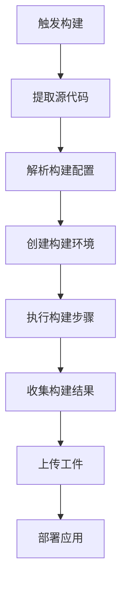

# AI代码管理：GoogleCloudBuild持续部署平台的搭建与使用

## 1.背景介绍

### 1.1 软件开发生命周期

在当今快节奏的软件开发环境中,高效、可靠的持续集成和持续交付(CI/CD)实践变得越来越重要。随着应用程序复杂性的增加和发布周期的缩短,手动构建、测试和部署过程已经变得效率低下且容易出错。因此,采用自动化的CI/CD流程来加速软件交付、确保质量并降低风险变得至关重要。

### 1.2 CI/CD的重要性

CI/CD实践可以帮助开发团队:

- 更快地交付高质量的软件
- 减少手动错误和重复性工作
- 提高团队协作效率
- 缩短从代码提交到生产部署的时间
- 提高软件质量和可靠性

### 1.3 GoogleCloudBuild简介

Google Cloud Build 是谷歌云平台提供的完全托管的持续集成和持续交付(CI/CD)平台。它允许开发人员构建、测试和部署基于源代码的应用程序。Cloud Build 与其他谷歌云服务紧密集成,如 Kubernetes 引擎、容器注册表和源代码存储库。

## 2.核心概念与联系

### 2.1 构建触发器(Build Triggers)

构建触发器定义了何时以及如何启动构建过程。有三种主要的触发器类型:

1. **源代码存储库触发器**: 当代码推送到关联的源代码存储库时触发构建。支持 Cloud Source Repositories、GitHub 和 Bitbucket。

2. **手动触发器**: 用户手动触发构建,通常用于测试目的。

3. **Webhook触发器**: 通过向特定URL发送HTTP请求来触发构建。

### 2.2 构建配置(Build Config)

构建配置定义了如何构建、测试和部署您的应用程序。它是一个 yaml 或 json 格式的文件,包含以下主要部分:

- **步骤(Steps)**: 定义了一系列命令来构建、测试和部署应用程序。
- **替代(Substitutions)**: 允许在构建时替换配置文件中的变量值。
- **可用性(Availibility)**: 控制构建是公共的还是仅限于项目内部使用。

### 2.3 构建步骤(Build Steps)

构建步骤是构建配置中最重要的部分,它定义了一系列命令来构建、测试和部署应用程序。每个步骤都运行在一个容器中,可以是预定义的构建器映像(如 maven 或 gradle),也可以是自定义的 Docker 映像。

```yaml
steps:
- name: 'gcr.io/cloud-builders/docker'
  args: ['build', '-t', 'gcr.io/$PROJECT_ID/$REPO_NAME:$COMMIT_SHA', '.']
- name: 'gcr.io/cloud-builders/docker'
  args: ['push', 'gcr.io/$PROJECT_ID/$REPO_NAME:$COMMIT_SHA']
```

上面的示例定义了两个步骤:第一步构建 Docker 映像,第二步将映像推送到容器注册表。

### 2.4 构建结果(Build Results)

构建结果包括构建日志、成功/失败状态以及任何生成的工件(如 Docker 映像)。您可以将工件上传到 Google 云存储或其他存储位置。构建结果可用于进一步分析、测试或部署。

## 3.核心算法原理具体操作步骤

GoogleCloudBuild 的核心工作原理可以概括为以下几个步骤:



1. **触发构建(Trigger Build)**: 通过源代码存储库更改、手动触发或 Webhook 触发来启动构建过程。

2. **提取源代码(Fetch Source)**: 从关联的源代码存储库(如 Cloud Source Repository、GitHub 或 Bitbucket)获取最新代码。

3. **解析配置(Parse Config)**: 解析构建配置文件(cloudbuild.yaml 或 cloudbuild.json),以确定构建步骤和其他设置。

4. **创建环境(Create Environment)**: 为每个构建步骤创建独立的构建环境,通常是一个 Docker 容器。

5. **执行步骤(Execute Steps)**: 按顺序在各个构建环境中执行配置的构建步骤,如编译代码、运行测试、构建 Docker 映像等。

6. **收集结果(Collect Results)**: 收集构建日志、成功/失败状态以及任何生成的工件。

7. **上传工件(Upload Artifacts)**: 将生成的工件(如 Docker 映像)上传到指定位置,如 Google 容器注册表或云存储。

8. **部署应用(Deploy App)** (可选): 如果配置了部署步骤,则将应用程序部署到目标环境,如 Google Kubernetes 引擎或 Google App Engine。

GoogleCloudBuild 的强大之处在于其灵活性和可扩展性。您可以使用预定义的构建步骤,也可以创建自定义的构建步骤来满足特定需求。此外,它与其他谷歌云服务紧密集成,使得端到端的 CI/CD 管道变得更加无缝。

## 4.数学模型和公式详细讲解举例说明

在 CI/CD 过程中,通常需要对构建时间、并行任务数、资源利用率等指标进行优化,以提高效率和降低成本。这些问题可以使用数学模型和公式来描述和求解。

### 4.1 构建时间优化

假设一个构建过程包含 n 个序列步骤,每个步骤的执行时间分别为 $t_1, t_2, ..., t_n$,则整个构建的总时间 $T_{total}$ 为:

$$T_{total} = \sum_{i=1}^{n}t_i$$

如果某些步骤可以并行执行,假设有 m 个并行组,每个组内的步骤为 $S_1, S_2, ..., S_m$,其中 $S_j$ 包含 $n_j$ 个步骤,则总时间为:

$$T_{total} = \max\limits_{1 \leq j \leq m}\left(\sum_{i=1}^{n_j}t_i^{(j)}\right)$$

其中 $t_i^{(j)}$ 表示第 j 个并行组中第 i 个步骤的执行时间。

我们的目标是找到最优的并行组合,使总时间 $T_{total}$ 最小化。这可以通过动态规划或其他优化算法来实现。

### 4.2 资源利用率优化

在并行执行构建步骤时,需要考虑可用资源的限制,如 CPU 和内存。假设有 m 个可用的执行节点,每个节点的 CPU 和内存资源分别为 $C_1, C_2, ..., C_m$ 和 $M_1, M_2, ..., M_m$。对于第 j 个并行组中的第 i 个步骤,其 CPU 和内存需求分别为 $c_i^{(j)}$ 和 $m_i^{(j)}$。

我们需要找到一种步骤分配方案,使得每个节点的资源利用率最大化,同时不超过节点的资源限制。这可以建模为一个整数线性规划问题:

$$\max \sum_{j=1}^{m}\sum_{i=1}^{n_j}x_{ij}^{(j)}$$
subject to:
$$\sum_{j=1}^{m}\sum_{i=1}^{n_j}c_i^{(j)}x_{ij}^{(j)} \leq C_k, \quad \forall k=1,2,...,m$$
$$\sum_{j=1}^{m}\sum_{i=1}^{n_j}m_i^{(j)}x_{ij}^{(j)} \leq M_k, \quad \forall k=1,2,...,m$$
$$\sum_{k=1}^{m}x_{ij}^{(j)} = 1, \quad \forall j=1,2,...,m, \quad \forall i=1,2,...,n_j$$

其中 $x_{ij}^{(j)}$ 是一个二进制变量,表示第 j 个并行组中的第 i 个步骤是否被分配到第 k 个节点上执行。

通过求解这个优化问题,我们可以得到资源利用最大化的步骤分配方案。

上述数学模型只是 CI/CD 优化中的一个示例,在实际应用中还可以根据具体需求构建更加复杂的模型,并使用各种优化算法和工具进行求解。

## 5.项目实践:代码实例和详细解释说明

### 5.1 设置 Google Cloud Build

要开始使用 Google Cloud Build,首先需要在 Google Cloud Console 中启用 Cloud Build API。然后,您可以创建一个新项目或使用现有项目。

### 5.2 创建构建触发器

接下来,创建一个构建触发器,将其连接到您的源代码存储库。以 GitHub 为例:

1. 转到 Cloud Build 触发器页面,点击"创建触发器"。
2. 选择"连接新的存储库"。
3. 选择"GitHub"并授权访问您的 GitHub 帐户。
4. 选择要连接的存储库。
5. 配置触发器设置,如分支和触发类型。
6. 点击"创建触发器"。

### 5.3 编写构建配置文件

在您的项目根目录下,创建一个名为 `cloudbuild.yaml` 的文件,用于定义构建步骤。以下是一个简单的示例,用于构建和推送 Docker 映像:

```yaml
steps:
- name: 'gcr.io/cloud-builders/docker'
  args: ['build', '-t', 'gcr.io/$PROJECT_ID/$REPO_NAME:$COMMIT_SHA', '.']
- name: 'gcr.io/cloud-builders/docker'
  args: ['push', 'gcr.io/$PROJECT_ID/$REPO_NAME:$COMMIT_SHA']
```

这个配置文件定义了两个步骤:

1. 使用 `gcr.io/cloud-builders/docker` 构建器映像构建 Docker 映像,标记为 `gcr.io/$PROJECT_ID/$REPO_NAME:$COMMIT_SHA`。
2. 将构建的映像推送到 Google 容器注册表。

### 5.4 触发构建

现在,每当您向连接的存储库推送代码更改时,Cloud Build 就会自动触发构建。您也可以手动触发构建,以测试配置。

在构建过程中,您可以在 Google Cloud Console 中查看构建日志和状态。成功构建后,您可以在容器注册表中找到新的 Docker 映像。

### 5.5 高级配置示例

上面的示例非常简单,实际场景中的配置通常更加复杂。以下是一个更高级的 `cloudbuild.yaml` 示例:

```yaml
substitutions:
  _DEPLOY_REGION: us-central1

steps:
- name: 'gcr.io/cloud-builders/go'
  args: ['test', './...']
- name: 'gcr.io/cloud-builders/docker'
  args: ['build', '-t', 'gcr.io/$PROJECT_ID/$REPO_NAME:$COMMIT_SHA', '.']
- name: 'gcr.io/cloud-builders/docker'
  args: ['push', 'gcr.io/$PROJECT_ID/$REPO_NAME:$COMMIT_SHA']
- name: 'gcr.io/google.com/cloudsdktool/cloud-sdk'
  entrypoint: gcloud
  args:
    - 'run'
    - 'deploy'
    - '$REPO_NAME'
    - '--image'
    - 'gcr.io/$PROJECT_ID/$REPO_NAME:$COMMIT_SHA'
    - '--region'
    - '$_DEPLOY_REGION'
    - '--platform'
    - 'managed'
    - '--allow-unauthenticated'

images:
- 'gcr.io/$PROJECT_ID/$REPO_NAME:$COMMIT_SHA'
```

这个配置执行以下操作:

1. 使用 Go 构建器运行测试。
2. 构建 Docker 映像并推送到容器注册表。
3. 使用 Google Cloud SDK 将映像部署到 Cloud Run。

它还定义了一个替代变量 `_DEPLOY_REGION`用于指定部署区域,以及一个映像资源用于后续步骤引用。

通过编写合理的构建配置文件,您可以轻松地自定义和扩展 CI/CD 流程,以满足项目的具体需求。

## 6.实际应用场景

Google Cloud Build 可以广泛应用于各种软件开发项目,尤其是那些需要频繁发布和部署的项目。以下是一些常见的应用场景:

### 6.1 Web 应用程序

对于基于 Web 的应用程序,Cloud Build 可以与 Google Kubernetes 引擎或 Google App Engine 等服务相结合,实现自动构建、测试和部