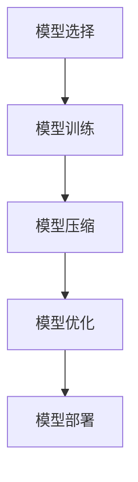

# AI模型部署到移动端原理与代码实战案例讲解

## 1.背景介绍

随着人工智能技术的迅猛发展，AI模型在各个领域的应用越来越广泛。然而，如何将这些复杂的AI模型部署到资源有限的移动设备上，成为了一个重要的研究课题。移动端AI模型的部署不仅可以提升用户体验，还能实现实时数据处理和个性化服务。本文将深入探讨AI模型部署到移动端的原理与实战案例，帮助读者理解并掌握这一技术。

## 2.核心概念与联系

### 2.1 AI模型

AI模型是通过机器学习算法训练得到的数学模型，用于解决特定任务，如图像识别、语音识别、自然语言处理等。常见的AI模型包括卷积神经网络（CNN）、循环神经网络（RNN）、生成对抗网络（GAN）等。

### 2.2 移动端设备

移动端设备主要指智能手机和平板电脑，这些设备具有便携性强、用户基数大等特点，但其计算资源和存储空间相对有限。

### 2.3 模型压缩

模型压缩是指通过剪枝、量化、蒸馏等技术，减少AI模型的参数量和计算量，以适应移动端设备的资源限制。

### 2.4 模型优化

模型优化是指通过硬件加速、软件优化等手段，提高AI模型在移动端设备上的运行效率。

### 2.5 边缘计算

边缘计算是指在靠近数据源的地方进行数据处理和分析，以减少延迟和带宽消耗。将AI模型部署到移动端设备上，可以视为一种边缘计算的实现。

## 3.核心算法原理具体操作步骤

### 3.1 模型选择

选择适合移动端部署的AI模型，通常需要考虑模型的准确性、复杂度和资源消耗。轻量级模型如MobileNet、SqueezeNet等，常被用于移动端部署。

### 3.2 模型训练

在高性能计算环境中训练AI模型，使用大规模数据集进行训练，以确保模型的准确性和泛化能力。

### 3.3 模型压缩

#### 3.3.1 剪枝

剪枝是通过移除不重要的神经元或连接，减少模型的参数量和计算量。常见的剪枝方法包括权重剪枝、结构剪枝等。

#### 3.3.2 量化

量化是通过将模型参数从浮点数表示转换为低精度表示（如8位整数），减少模型的存储空间和计算量。常见的量化方法包括静态量化、动态量化等。

#### 3.3.3 蒸馏

蒸馏是通过训练一个小模型（学生模型）来模仿一个大模型（教师模型）的行为，从而获得一个轻量级且高效的模型。

### 3.4 模型优化

#### 3.4.1 硬件加速

利用移动端设备的硬件加速功能，如GPU、NPU等，提高AI模型的运行效率。

#### 3.4.2 软件优化

通过优化代码、使用高效的计算库（如TensorFlow Lite、ONNX Runtime等），提高AI模型的运行效率。

### 3.5 模型部署

将优化后的AI模型部署到移动端设备上，通常需要将模型转换为适合移动端运行的格式（如TensorFlow Lite模型、ONNX模型等），并集成到移动应用中。



## 4.数学模型和公式详细讲解举例说明

### 4.1 卷积神经网络（CNN）

卷积神经网络（CNN）是一种常用于图像处理的深度学习模型，其核心操作是卷积运算。卷积运算的数学公式如下：

$$
Y(i, j) = \sum_{m=0}^{M-1} \sum_{n=0}^{N-1} X(i+m, j+n) \cdot K(m, n)
$$

其中，$X$ 是输入图像，$K$ 是卷积核，$Y$ 是输出特征图，$M$ 和 $N$ 分别是卷积核的高度和宽度。

### 4.2 量化

量化是将模型参数从浮点数表示转换为低精度表示的过程。假设 $W$ 是一个浮点数权重，$W_q$ 是量化后的权重，量化过程可以表示为：

$$
W_q = \text{round}(W / S)
$$

其中，$S$ 是量化比例因子，$\text{round}$ 表示四舍五入操作。

### 4.3 蒸馏

蒸馏是通过训练一个小模型（学生模型）来模仿一个大模型（教师模型）的行为。假设 $T$ 是教师模型的输出，$S$ 是学生模型的输出，蒸馏损失函数可以表示为：

$$
L = \alpha L_{\text{hard}} + \beta L_{\text{soft}}
$$

其中，$L_{\text{hard}}$ 是学生模型与真实标签之间的交叉熵损失，$L_{\text{soft}}$ 是学生模型与教师模型输出之间的均方误差损失，$\alpha$ 和 $\beta$ 是权重系数。

## 5.项目实践：代码实例和详细解释说明

### 5.1 环境准备

首先，确保已安装以下工具和库：

- Python
- TensorFlow
- TensorFlow Lite

### 5.2 模型训练

以下是一个简单的卷积神经网络（CNN）模型训练示例：

```python
import tensorflow as tf
from tensorflow.keras import datasets, layers, models

# 加载数据集
(train_images, train_labels), (test_images, test_labels) = datasets.cifar10.load_data()

# 数据预处理
train_images, test_images = train_images / 255.0, test_images / 255.0

# 构建模型
model = models.Sequential([
    layers.Conv2D(32, (3, 3), activation='relu', input_shape=(32, 32, 3)),
    layers.MaxPooling2D((2, 2)),
    layers.Conv2D(64, (3, 3), activation='relu'),
    layers.MaxPooling2D((2, 2)),
    layers.Conv2D(64, (3, 3), activation='relu'),
    layers.Flatten(),
    layers.Dense(64, activation='relu'),
    layers.Dense(10)
])

# 编译模型
model.compile(optimizer='adam',
              loss=tf.keras.losses.SparseCategoricalCrossentropy(from_logits=True),
              metrics=['accuracy'])

# 训练模型
model.fit(train_images, train_labels, epochs=10, 
          validation_data=(test_images, test_labels))
```

### 5.3 模型压缩

以下是模型量化的示例：

```python
import tensorflow as tf

# 加载训练好的模型
model = tf.keras.models.load_model('path_to_model')

# 转换为TensorFlow Lite模型
converter = tf.lite.TFLiteConverter.from_keras_model(model)
converter.optimizations = [tf.lite.Optimize.DEFAULT]
tflite_model = converter.convert()

# 保存量化后的模型
with open('model.tflite', 'wb') as f:
    f.write(tflite_model)
```

### 5.4 模型部署

将量化后的模型集成到移动应用中，以Android为例：

```java
import org.tensorflow.lite.Interpreter;

public class MyModel {
    private Interpreter tflite;

    public MyModel(Context context) {
        try {
            // 加载模型
            tflite = new Interpreter(loadModelFile(context));
        } catch (Exception e) {
            e.printStackTrace();
        }
    }

    private MappedByteBuffer loadModelFile(Context context) throws IOException {
        AssetFileDescriptor fileDescriptor = context.getAssets().openFd("model.tflite");
        FileInputStream inputStream = new FileInputStream(fileDescriptor.getFileDescriptor());
        FileChannel fileChannel = inputStream.getChannel();
        long startOffset = fileDescriptor.getStartOffset();
        long declaredLength = fileDescriptor.getDeclaredLength();
        return fileChannel.map(FileChannel.MapMode.READ_ONLY, startOffset, declaredLength);
    }

    public float[] predict(float[] input) {
        float[] output = new float[10];
        tflite.run(input, output);
        return output;
    }
}
```

## 6.实际应用场景

### 6.1 图像识别

在移动端设备上部署图像识别模型，可以实现实时的物体检测、人脸识别等功能。例如，智能相机应用可以通过AI模型识别拍摄对象，并自动调整拍摄参数。

### 6.2 语音识别

在移动端设备上部署语音识别模型，可以实现语音助手、语音输入等功能。例如，智能手机可以通过语音助手实现语音拨号、语音搜索等操作。

### 6.3 自然语言处理

在移动端设备上部署自然语言处理模型，可以实现文本分类、情感分析等功能。例如，社交媒体应用可以通过AI模型分析用户的情感状态，并提供个性化的内容推荐。

## 7.工具和资源推荐

### 7.1 开发工具

- TensorFlow Lite：用于在移动端设备上运行TensorFlow模型的轻量级库。
- ONNX Runtime：用于在多种平台上运行ONNX模型的高性能推理引擎。

### 7.2 学习资源

- [TensorFlow官方文档](https://www.tensorflow.org/lite/guide)
- [ONNX官方文档](https://onnxruntime.ai/docs/)

### 7.3 开源项目

- [TensorFlow Lite示例项目](https://github.com/tensorflow/examples/tree/master/lite)
- [ONNX Runtime示例项目](https://github.com/microsoft/onnxruntime)

## 8.总结：未来发展趋势与挑战

### 8.1 未来发展趋势

随着移动设备性能的不断提升和AI技术的不断进步，AI模型在移动端的应用前景广阔。未来，更多的AI模型将被部署到移动端设备上，实现更加智能化和个性化的服务。

### 8.2 挑战

尽管AI模型在移动端的应用前景广阔，但仍面临一些挑战，如模型压缩和优化的技术难度、移动端设备的资源限制等。解决这些挑战需要不断的技术创新和实践探索。

## 9.附录：常见问题与解答

### 9.1 如何选择适合移动端部署的AI模型？

选择适合移动端部署的AI模型，通常需要考虑模型的准确性、复杂度和资源消耗。轻量级模型如MobileNet、SqueezeNet等，常被用于移动端部署。

### 9.2 如何进行模型压缩？

模型压缩可以通过剪枝、量化、蒸馏等技术，减少模型的参数量和计算量。具体方法可以参考本文第3.3节的内容。

### 9.3 如何优化模型在移动端的运行效率？

可以通过硬件加速、软件优化等手段，提高AI模型在移动端设备上的运行效率。具体方法可以参考本文第3.4节的内容。

### 9.4 如何将模型部署到移动端设备上？

将优化后的AI模型部署到移动端设备上，通常需要将模型转换为适合移动端运行的格式（如TensorFlow Lite模型、ONNX模型等），并集成到移动应用中。具体方法可以参考本文第5.4节的内容。

---

作者：禅与计算机程序设计艺术 / Zen and the Art of Computer Programming