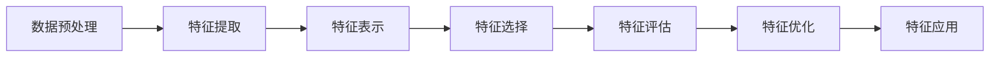

# AI特征工程原理与代码实战案例讲解

## 1. 背景介绍

### 1.1 特征工程的重要性

在机器学习和数据挖掘中,特征工程是一个非常关键的步骤。它直接影响了模型的性能表现。好的特征可以让机器学习算法更容易学到数据中蕴含的规律,从而提高模型的准确率和泛化能力。相反,如果特征质量差,再好的算法也难以训练出高质量的模型。可以说,特征工程在很大程度上决定了机器学习项目的成败。

### 1.2 特征工程的挑战

尽管特征工程如此重要,但它往往是机器学习中最耗时、最考验经验和创造力的环节。面对一个全新的问题,我们往往很难确定应该构建哪些特征。即使有了一些思路,实际构建特征、验证特征效果的过程也十分繁琐。特别是在处理非结构化数据如文本、图像时,特征工程更是难上加难。如何从海量的原始数据中,提炼出信息量大、区分度高的特征,是每一位机器学习工程师都必须攻克的难题。

### 1.3 自动化特征工程的兴起 

近年来,随着深度学习的发展,自动化特征工程开始受到越来越多的关注。与传统的人工特征工程不同,自动化特征工程希望借助机器自身的力量,从原始数据中自动学习出有效的特征表示。这不仅大大减轻了人力成本,也有望找到人工难以发掘的特征。当前,自动化特征工程已经在计算机视觉、自然语言处理等领域取得了瞩目的成绩,成为AI技术的重要分支之一。

## 2. 核心概念与联系

### 2.1 特征的定义与分类

在机器学习中,特征(Feature)指的是样本的某种可观测的属性或性质。通过这些属性,我们可以刻画样本的特点,进而预测样本的标签或行为。根据特征的获取方式,可以将其分为原始特征和衍生特征两大类:

- 原始特征:直接从数据中获得,无需人工处理。如文本中的词频、图像中的像素等。 
- 衍生特征:在原始特征的基础上,经过一定的变换或组合而得到。如TF-IDF、图像的SIFT特征等。

### 2.2 特征表示与特征选择

为了让机器能够理解和学习特征,我们需要将特征表示为数值形式。常见的特征表示方法有:

- 向量表示:将每个特征映射为一个实数,样本由多个特征组成向量。
- 矩阵表示:每个样本对应一个矩阵,矩阵元素为样本的特征。如图像可表示为像素矩阵。
- 张量表示:每个样本对应一个高维张量,张量各维分别对应不同的特征。如视频可表示为帧-高-宽-通道的四维张量。

在特征表示的基础上,我们还需要从众多候选特征中选出一个最优子集,这就是特征选择的任务。通过特征选择,我们可以去除冗余或无关的特征,减少数据维度,提高模型的训练效率和泛化能力。常见的特征选择方法包括:

- 过滤法:基于特征本身的统计指标(如方差、信息增益等),独立评估每个特征的重要性,选出得分最高的特征。
- 包裹法:将特征选择看作一个子集搜索问题,用模型的性能评估特征子集的好坏,选出使模型性能最优的特征子集。
- 嵌入法:将特征选择与模型训练融为一体,在模型训练过程中自动学习特征的重要性权重,最终得到特征排序。

### 2.3 特征工程流程

完整的特征工程一般包括以下几个步骤:



- 数据预处理:对原始数据进行清洗、集成、变换、归一化等处理,为特征提取做准备。
- 特征提取:从预处理后的数据中提取各类原始特征,如统计特征、文本特征、图像特征等。  
- 特征表示:将提取出的特征转化为数值形式,生成特征矩阵或张量。
- 特征选择:运用过滤、包裹、嵌入等方法,从候选特征中选出最优特征子集。
- 特征评估:利用训练集评估所选特征的有效性,必要时进一步调优特征。
- 特征优化:探索特征组合、变换等优化手段,生成高阶交叉特征、深度学习特征等。
- 特征应用:将优化后的特征输入机器学习模型,完成训练和预测任务。

## 3. 核心算法原理具体操作步骤

本节重点介绍几种常见的特征工程算法,包括它们的原理、公式推导和代码实现。

### 3.1 文本特征提取之TF-IDF

TF-IDF是一种广泛使用的文本特征提取算法。它的基本思想是:如果某个词在一篇文档中出现的频率高,且在其他文档中出现的频率低,则这个词对该文档的重要性高。其中TF(Term Frequency)表示词频,IDF(Inverse Document Frequency)表示逆文档频率。二者相乘得到TF-IDF值。

#### 3.1.1 TF-IDF公式推导

设$t$为一个词,$d$为一篇文档。令$f_{t,d}$表示词$t$在文档$d$中出现的频数,$N$为语料库中文档总数,$n_t$为包含词$t$的文档数。则TF-IDF定义为:

$$
tfidf_{t,d} = tf_{t,d} \times idf_t
$$

其中,TF部分可以直接用词频$f_{t,d}$表示,也可以用词频除以文档总词数的归一化形式:

$$
tf_{t,d} = \frac{f_{t,d}}{\sum_{t' \in d} f_{t',d}}
$$

IDF部分的定义为:

$$
idf_t = \log \frac{N}{n_t + 1}
$$

分母加1是为了避免$n_t=0$时的除零错误。

#### 3.1.2 TF-IDF代码实现

Python中可以利用sklearn库快速实现TF-IDF特征提取:

```python
from sklearn.feature_extraction.text import TfidfVectorizer

# 构建TF-IDF特征提取器
tfidf_vectorizer = TfidfVectorizer(norm='l2', min_df=0, use_idf=True, smooth_idf=True, sublinear_tf=True)

# 输入文本语料
corpus = [
    'This is the first document.',
    'This document is the second document.',
    'And this is the third one.',
    'Is this the first document?',
]

# 提取TF-IDF特征
tfidf_matrix = tfidf_vectorizer.fit_transform(corpus)

# 查看特征词列表
print(tfidf_vectorizer.get_feature_names())

# 查看TF-IDF矩阵
print(tfidf_matrix.toarray())
```

输出结果:

```
['and', 'document', 'first', 'is', 'one', 'second', 'the', 'third', 'this']
[[0.         0.46979139 0.58028582 0.38408524 0.         0.         0.38408524 0.         0.38408524]
 [0.         0.6876236  0.         0.28108867 0.         0.53864762 0.28108867 0.         0.28108867]
 [0.51184851 0.         0.         0.26710379 0.51184851 0.         0.26710379 0.51184851 0.26710379]
 [0.         0.46979139 0.58028582 0.38408524 0.         0.         0.38408524 0.         0.38408524]]
```

可以看到,TF-IDF特征矩阵刻画了每个词在每篇文档中的重要程度。越重要的词,权重越高。

### 3.2 图像特征提取之SIFT

SIFT(Scale-Invariant Feature Transform)是一种用于提取图像局部特征的算法。它通过寻找图像的关键点,并计算关键点周围的梯度信息,生成具有尺度和旋转不变性的特征描述子。SIFT特征对光照、仿射变换等干扰具有很好的鲁棒性,在物体识别、图像拼接等任务中得到了广泛应用。

#### 3.2.1 SIFT算法流程

SIFT算法主要分为以下四个步骤:

1. 尺度空间极值检测:通过高斯差分(DoG)金字塔,在多个尺度下检测局部极值点,获得潜在的关键点。
2. 关键点定位:通过泰勒展开拟合局部极值点,并剔除低对比度和不稳定的极值点,精确定位关键点。  
3. 方向赋值:以关键点为中心取邻域,计算梯度方向直方图,选择主方向作为该关键点的方向。
4. 关键点描述:以关键点为中心取16x16邻域,划分为4x4个子区域,每个子区域计算8个方向的梯度直方图,生成128维SIFT描述子。

#### 3.2.2 SIFT特征提取代码

Python中可以利用OpenCV库实现SIFT特征提取:

```python
import cv2

# 读取图像
img = cv2.imread('image.jpg') 
gray = cv2.cvtColor(img, cv2.COLOR_BGR2GRAY)

# 创建SIFT特征提取器 
sift = cv2.xfeatures2d.SIFT_create()

# 检测关键点并计算描述子
keypoints, descriptor = sift.detectAndCompute(gray, None)

# 绘制关键点
img = cv2.drawKeypoints(gray, keypoints, img)

# 显示结果
cv2.imshow('SIFT Features', img)
cv2.waitKey(0)
cv2.destroyAllWindows()
```

代码首先读取图像并转为灰度图,然后创建SIFT特征提取器。`detectAndCompute`函数可以同时完成关键点检测和描述子计算。最后将检测到的关键点绘制在图像上显示。

需要注意的是,SIFT算法受专利保护,从OpenCV 3.0后就从默认发行版中移除了。如果要使用SIFT,需要自行编译OpenCV的contrib模块。或者可以使用其他替代品如ORB、SURF等。

### 3.3 特征选择之Relief

Relief是一种著名的特征选择算法,尤其适用于二分类问题。它的基本思想是:好的特征应该使得同类样本的特征值相近,异类样本的特征值相异。Relief通过随机采样样本,比较其最近的同类样本和异类样本,来评估每个特征的重要性。

#### 3.3.1 Relief算法步骤

Relief的具体步骤如下:

1. 随机选择一个样本$X$,找到其在所有样本中最近的同类样本$X_{nh}$和异类样本$X_{nm}$。
2. 对每个特征$f$,更新其权重:
$$
W_f = W_f - \frac{(x_f-x_{nhf})^2}{m} + \frac{(x_f-x_{nmf})^2}{m}
$$
其中$m$为随机采样次数。直观上,如果$X$与$X_{nh}$在特征$f$上的差异小于$X$与$X_{nm}$的差异,则说明$f$是个好特征,权重应增大。
3. 重复以上两步$m$次,最终得到每个特征的权重。将权重按降序排列,选出权重最大的$k$个特征。

#### 3.3.2 Relief代码实现

下面是Relief算法的Python实现:

```python
import numpy as np

def relief(X, y, m, k):
    """
    Relief特征选择算法
    :param X: 数据集,shape为(n_samples, n_features)
    :param y: 标签,shape为(n_samples,)
    :param m: 随机采样次数
    :param k: 选择的特征数
    :return: 选出的特征索引
    """
    n_samples, n_features = X.shape
    weights = np.zeros(n_features)

    for i in range(m):
        # 随机选择一个样本
        idx = np.random.randint(0, n_samples)
        x = X[idx]
        label = y[idx]

        # 找到最近的同类样本和异类样本
        dist = np.sum((X - x)**2, axis=1)
        dist[idx] = np.inf
        nh_idx =