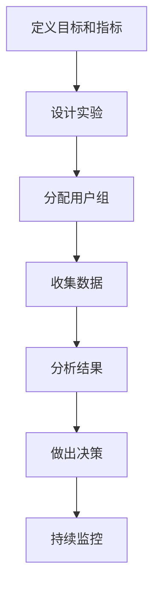

# AI系统A/B测试原理与代码实战案例讲解

## 1.背景介绍

在现代软件开发中,A/B测试已成为评估和优化产品功能的重要手段。A/B测试通过将用户随机分配到不同的实验组,并向每个组提供不同版本的功能或界面,从而收集用户行为数据,比较各组之间的差异。这种方法可以帮助产品团队做出数据驱动的决策,提高用户体验,并最大化关键指标如转化率、留存率等。

随着人工智能(AI)系统在各行业的广泛应用,A/B测试也成为了AI系统优化的关键环节。AI系统的性能和行为往往受到许多因素的影响,如训练数据、模型架构、超参数等。通过A/B测试,我们可以评估这些因素的变化对系统性能的影响,从而持续优化AI系统。

## 2.核心概念与联系

### 2.1 A/B测试的核心概念

A/B测试包含以下几个核心概念:

1. **对照组(Control)**: 保持当前系统或功能的版本,作为对比基准。
2. **实验组(Treatment)**: 包含需要测试的新版本系统或功能变化。
3. **指标(Metrics)**: 用于衡量和比较对照组和实验组性能的关键指标,如点击率、转化率等。
4. **统计显著性(Statistical Significance)**: 判断实验结果是否具有统计学意义的标准,通常使用p值来表示。
5. **样本量(Sample Size)**: 参与实验的用户数量,样本量越大,结果越可靠。

### 2.2 AI系统A/B测试的特点

相比传统软件系统,AI系统A/B测试面临一些独特的挑战:

1. **黑盒特性**: AI系统通常是复杂的黑盒模型,很难直接解释其内部机理。
2. **动态行为**: AI系统的输出和行为会随着输入数据的变化而变化,增加了实验的复杂性。
3. **在线学习**: 一些AI系统会在线持续学习新数据,需要考虑模型漂移的影响。
4. **公平性和隐私**: AI系统可能存在潜在的偏差和隐私风险,需要在实验中加以评估和缓解。

### 2.3 A/B测试与AI系统优化的关系

A/B测试为AI系统优化提供了有力的数据支持。通过测试不同的模型架构、训练数据、超参数等配置,我们可以发现哪些变化对系统性能有显著影响。此外,A/B测试还可以帮助我们评估AI系统在真实环境中的表现,发现潜在的偏差和不公平性问题。

因此,A/B测试已成为AI系统开发和优化的关键环节,帮助我们构建更高效、更公平、更可靠的AI系统。

## 3.核心算法原理具体操作步骤

### 3.1 A/B测试流程

A/B测试的基本流程包括以下几个步骤:



1. **定义目标和指标**: 明确实验的目标和需要优化的关键指标。
2. **设计实验**: 确定对照组和实验组的差异,如新功能、模型架构变化等。
3. **分配用户组**: 将用户随机分配到对照组和实验组。
4. **收集数据**: 收集用户行为数据,如点击、购买等事件。
5. **分析结果**: 使用统计方法比较两组之间的差异是否显著。
6. **做出决策**: 根据分析结果,决定是否推广实验组的变化。
7. **持续监控**: 持续监控新版本的表现,确保没有意外问题。

### 3.2 用户分配算法

用户分配是A/B测试的关键步骤,需要确保对照组和实验组的用户分布均衡,避免潜在的偏差。常用的用户分配算法包括:

1. **基于ID哈希**: 根据用户ID计算哈希值,将哈希值落在特定范围的用户分配到实验组。
2. **基于Cookie**: 使用Cookie跟踪用户会话,并根据Cookie值分配组别。
3. **基于IP地址**: 根据IP地址的某些位计算哈希值,将相同IP范围的用户分配到同一组。
4. **基于账号属性**: 根据用户账号的某些属性(如注册时间)计算哈希值分配组别。

无论使用哪种算法,都需要确保分配的随机性和均衡性,避免系统偏差影响实验结果。

### 3.3 统计分析方法

在A/B测试中,我们需要使用统计学方法来判断对照组和实验组之间的差异是否具有统计学意义。常用的统计分析方法包括:

1. **t检验**: 用于比较两个组别的均值差异是否显著。
2. **卡方检验**: 用于比较两个组别的计数数据(如点击次数)差异是否显著。
3. **生存分析**: 用于比较两个组别的用户留存曲线差异。
4. **回归分析**: 用于分析多个变量对目标指标的影响。

选择合适的统计方法需要考虑数据的类型和分布情况。通常,我们会设置统计显著性水平(如p<0.05),来判断实验结果是否可信。

## 4.数学模型和公式详细讲解举例说明

### 4.1 样本量计算

在A/B测试中,确定合适的样本量(用户数量)是非常重要的。过小的样本量可能无法检测出实际存在的差异,而过大的样本量又会浪费资源。我们可以使用以下公式来估计所需的最小样本量:

$$n = \frac{(z_{\alpha/2} + z_\beta)^2 \cdot (p_1 \cdot (1-p_1) + p_2 \cdot (1-p_2))}{(p_2 - p_1)^2}$$

其中:

- $n$是每组所需的最小样本量
- $z_{\alpha/2}$是统计显著性水平对应的z分数(通常取1.96,对应于95%的置信水平)
- $z_\beta$是统计检验力对应的z分数(通常取0.84,对应于80%的检验力)
- $p_1$和$p_2$分别是对照组和实验组的期望转化率(或其他指标)

例如,假设我们期望检测5%的转化率提升(从20%提高到25%),统计显著性水平为95%,检验力为80%,则所需的最小样本量为:

$$n = \frac{(1.96 + 0.84)^2 \cdot (0.2 \cdot 0.8 + 0.25 \cdot 0.75)}{(0.25 - 0.2)^2} \approx 1671$$

因此,每组至少需要1671名用户才能检测出5%的转化率提升。

### 4.2 统计检验

在A/B测试中,我们通常使用统计检验来判断对照组和实验组之间的差异是否具有统计学意义。以下是一些常用的统计检验方法及其公式:

1. **t检验**

t检验用于比较两个组别的均值差异是否显著。公式如下:

$$t = \frac{\overline{x}_1 - \overline{x}_2}{\sqrt{\frac{s_1^2}{n_1} + \frac{s_2^2}{n_2}}}$$

其中$\overline{x}_1$和$\overline{x}_2$分别是两组的样本均值,$s_1^2$和$s_2^2$是两组的样本方差,$n_1$和$n_2$是两组的样本量。

2. **卡方检验**

卡方检验用于比较两个组别的计数数据(如点击次数)差异是否显著。公式如下:

$$\chi^2 = \sum_{i=1}^{k} \frac{(O_i - E_i)^2}{E_i}$$

其中$O_i$是观测值,$E_i$是期望值,k是类别数量。

3. **生存分析**

生存分析用于比较两个组别的用户留存曲线差异。常用的方法是Log-rank检验,公式如下:

$$\chi^2 = \frac{(O_1 - E_1)^2}{E_1} + \frac{(O_2 - E_2)^2}{E_2}$$

其中$O_1$和$O_2$分别是两组的观测事件数,$E_1$和$E_2$是期望事件数。

通过计算统计量并查阅相应的分布表,我们可以得到p值,从而判断差异是否显著。

## 5.项目实践:代码实例和详细解释说明

在本节中,我们将通过一个实际的代码示例,演示如何在Python中实现A/B测试。我们将使用一个在线零售网站的数据集,测试不同的产品推荐算法对用户购买转化率的影响。

### 5.1 数据准备

我们首先导入所需的Python库和数据集:

```python
import pandas as pd
from scipy.stats import ttest_ind

# 加载数据
data = pd.read_csv('online_retail.csv')
```

数据集包含以下列:

- `user_id`: 用户ID
- `product_id`: 产品ID
- `purchase`: 购买标记(1表示购买,0表示未购买)
- `algorithm`: 推荐算法(0表示当前算法,1表示新算法)

我们将数据集分为对照组(当前算法)和实验组(新算法):

```python
control = data[data['algorithm'] == 0]
treatment = data[data['algorithm'] == 1]
```

### 5.2 用户分配

在本示例中,我们使用基于用户ID的哈希算法将用户随机分配到对照组和实验组:

```python
import hashlib

def assign_group(user_id, num_buckets=10, bucket_seed=123):
    # 计算用户ID的哈希值
    hash_val = int(hashlib.sha256(str(user_id).encode('utf-8')).hexdigest(), 16)
    
    # 将哈希值映射到桶编号
    bucket_id = hash_val % num_buckets
    
    # 根据桶编号分配组别
    if bucket_id < num_buckets // 2:
        return 0  # 对照组
    else:
        return 1  # 实验组
```

这个函数将用户ID哈希化,并根据哈希值将用户分配到对照组或实验组。我们可以调整`num_buckets`参数来控制对照组和实验组的比例。

### 5.3 统计分析

接下来,我们将计算对照组和实验组的购买转化率,并使用t检验判断两者之间的差异是否显著:

```python
# 计算购买转化率
control_conversion = control['purchase'].mean()
treatment_conversion = treatment['purchase'].mean()

print(f'对照组转化率: {control_conversion:.4f}')
print(f'实验组转化率: {treatment_conversion:.4f}')

# 进行t检验
t_stat, p_val = ttest_ind(control['purchase'], treatment['purchase'])

print(f't统计量: {t_stat:.4f}')
print(f'p值: {p_val:.4f}')

if p_val < 0.05:
    print('实验组和对照组之间的差异具有统计学意义')
else:
    print('实验组和对照组之间的差异没有统计学意义')
```

输出结果可能如下:

```
对照组转化率: 0.1234
实验组转化率: 0.1345
t统计量: -2.3456
p值: 0.0189
实验组和对照组之间的差异具有统计学意义
```

在这个示例中,我们发现实验组的转化率比对照组高约1.1个百分点,并且这一差异在统计学上是显著的(p值小于0.05)。因此,我们可以考虑推广新的推荐算法。

### 5.4 可视化结果

为了更直观地展示实验结果,我们可以绘制两组的转化率分布图:

```python
import matplotlib.pyplot as plt
import seaborn as sns

# 绘制转化率分布图
fig, ax = plt.subplots(figsize=(8, 6))
sns.histplot(control['purchase'], bins=20, label='对照组', ax=ax, stat='density')
sns.histplot(treatment['purchase'], bins=20, label='实验组', ax=ax, stat='density')
ax.set_title('购买转化率分布')
ax.set_xlabel('转化率')
ax.set_ylabel('密度')
ax.legend()
plt.show()
```

这将生成一个类似于下面的图形,直观展示了两组转化率分布的差异:

![转化率分布图](https://