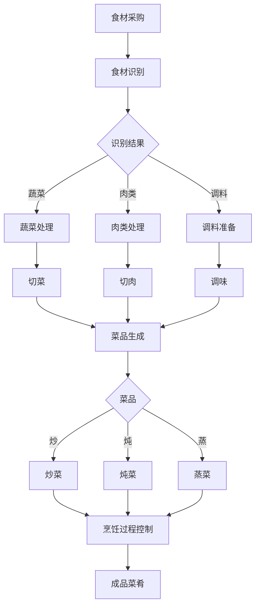

# AI系统Chef原理与代码实战案例讲解

## 1.背景介绍
### 1.1 人工智能在烹饪领域的应用现状
### 1.2 AI系统Chef的诞生背景
### 1.3 AI系统Chef的发展历程和里程碑

## 2.核心概念与联系
### 2.1 AI系统Chef的定义与特点
### 2.2 AI系统Chef的关键技术
#### 2.2.1 机器学习
#### 2.2.2 计算机视觉
#### 2.2.3 自然语言处理
#### 2.2.4 机器人技术
### 2.3 AI系统Chef与传统烹饪系统的区别

## 3.核心算法原理具体操作步骤
### 3.1 食材识别算法
#### 3.1.1 图像预处理
#### 3.1.2 特征提取
#### 3.1.3 分类器训练与预测
### 3.2 菜品生成算法
#### 3.2.1 食材组合优化
#### 3.2.2 菜品口味生成
#### 3.2.3 菜品卖相设计
### 3.3 烹饪过程控制算法
#### 3.3.1 烹饪步骤规划
#### 3.3.2 火候控制
#### 3.3.3 调味决策

## 4.数学模型和公式详细讲解举例说明
### 4.1 食材识别的数学模型
#### 4.1.1 卷积神经网络模型
#### 4.1.2 ResNet网络结构
#### 4.1.3 交叉熵损失函数
### 4.2 菜品生成的数学模型 
#### 4.2.1 马尔可夫决策过程
#### 4.2.2 强化学习算法
#### 4.2.3 DDPG模型
### 4.3 烹饪过程控制的数学模型
#### 4.3.1 有限状态机模型
#### 4.3.2 PID控制算法
#### 4.3.3 模糊控制算法

## 5.项目实践：代码实例和详细解释说明
### 5.1 食材识别模块代码实例
#### 5.1.1 数据集准备
#### 5.1.2 模型训练
#### 5.1.3 模型评估与优化
### 5.2 菜品生成模块代码实例
#### 5.2.1 环境搭建
#### 5.2.2 智能体设计
#### 5.2.3 训练与测试
### 5.3 烹饪过程控制模块代码实例
#### 5.3.1 硬件连接
#### 5.3.2 控制策略实现
#### 5.3.3 系统集成与测试

## 6.实际应用场景
### 6.1 智能餐厅
### 6.2 智能食堂
### 6.3 私人定制

## 7.工具和资源推荐
### 7.1 开源数据集
### 7.2 开发框架与库
### 7.3 硬件设备选型

## 8.总结：未来发展趋势与挑战
### 8.1 个性化定制趋势
### 8.2 多模态感知融合
### 8.3 人机协作烹饪
### 8.4 面临的技术挑战

## 9.附录：常见问题与解答
### 9.1 AI系统Chef的安全性如何保证？
### 9.2 AI系统Chef能否满足不同口味需求？
### 9.3 AI系统Chef的成本如何？
### 9.4 AI系统Chef的未来发展空间有多大？

人工智能技术正在深刻影响着我们生活的方方面面，烹饪领域也不例外。AI系统Chef的出现，标志着人工智能开始走进厨房，用智能算法来掌勺烹饪。本文将从AI系统Chef的原理出发，结合代码实战案例，全面讲解这一烹饪界的"智能大厨"。

AI系统Chef的核心在于利用机器学习、计算机视觉、自然语言处理等人工智能技术，实现从食材识别、菜品生成到烹饪过程控制的全流程自动化。首先，通过卷积神经网络等算法对食材进行识别和分类，得到食材的种类、新鲜程度等信息。识别结果将作为后续菜品生成的输入。

菜品生成是AI系统Chef的关键一环。这里用到了马尔可夫决策过程、强化学习等数学模型，通过海量菜谱数据的学习，AI系统Chef掌握了各种食材的搭配规律、烹饪技巧，再根据用户的口味偏好，智能生成各种菜品。同时，还会考虑菜品的营养搭配、色香味俱全等因素，力求生成的菜品既美味又健康。

当菜品生成后，就进入了烹饪执行阶段。AI系统Chef根据菜品的烹饪步骤，自动控制各种厨具的工作，比如控制炉火大小、调节烹饪时间、投放调料等。PID控制、模糊控制等算法在这个过程中发挥着重要作用，确保每一道工序都在智能算法的精准控制下完成。

本文还提供了AI系统Chef各个模块的代码实例，从食材识别、菜品生成到烹饪控制，读者可以看到人工智能技术在其中的实际应用。通过这些代码，读者不仅可以深入理解AI系统Chef的技术原理，还能一窥智能算法是如何在烹饪领域大显身手的。

展望未来，AI系统Chef有望进一步推动烹饪智能化的发展。个性化定制菜品、多模态感知融合、人机协作烹饪等，将成为AI系统Chef的发展方向。当然，实现这些愿景仍面临诸多技术挑战，需要研究者们持续攻坚。

总之，AI系统Chef代表了人工智能在烹饪领域的重要探索。通过本文的讲解，相信读者对这一领域会有更深刻的认识。在人工智能的赋能下，智能化烹饪必将大有可为，我们拭目以待！

作者：禅与计算机程序设计艺术 / Zen and the Art of Computer Programming