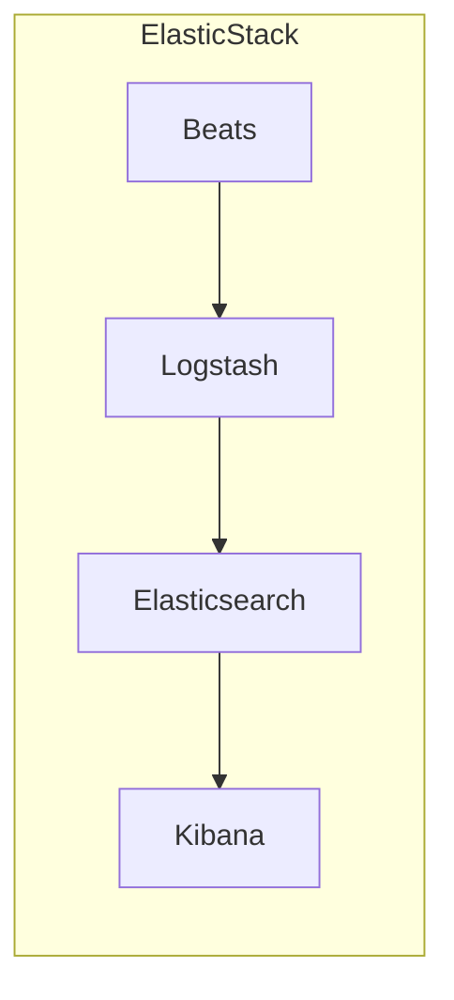

# AI系统Kibana原理与代码实战案例讲解

## 1.背景介绍

在当今数据驱动的时代,大数据分析和可视化已经成为各行业不可或缺的关键技术。Kibana作为ElasticStack中的一个重要组件,为用户提供了强大的数据探索、可视化和操作功能,使其成为管理和分析大规模数据的理想选择。

Kibana最初是为了与Elasticsearch一起使用而设计的,但随着时间的推移,它已经发展成为一个独立的数据分析和可视化平台。它提供了一个直观的Web界面,允许用户轻松地探索和分析来自各种数据源的数据,包括Elasticsearch、Logstash和Beats。

Kibana的核心优势在于其灵活性和可扩展性。它支持各种自定义可视化效果,如折线图、柱状图、饼图、地理地图等,并允许用户创建自定义仪表板来满足特定的业务需求。此外,Kibana还提供了强大的搜索和过滤功能,使用户能够快速查找感兴趣的数据。

随着人工智能(AI)和机器学习(ML)技术的不断发展,Kibana也在不断演进,以支持更复杂的数据分析和可视化需求。例如,Kibana现在可以与Elasticsearch的机器学习功能无缝集成,允许用户构建和部署ML模型,并在Kibana中可视化模型结果。

总的来说,Kibana是一个功能强大且易于使用的数据分析和可视化工具,在大数据和AI领域扮演着越来越重要的角色。本文将深入探讨Kibana的核心原理和架构,并通过实际案例讲解其在AI系统中的应用。

## 2.核心概念与联系

在深入探讨Kibana的原理和实践之前,我们需要先了解一些核心概念和它们之间的关系。

### 2.1 ElasticStack

ElasticStack是一个开源的数据分析和可视化平台,由Elasticsearch、Logstash、Kibana和Beats四个核心组件组成。

- Elasticsearch: 一个分布式、RESTful的搜索和分析引擎,用于存储和索引结构化和非结构化数据。
- Logstash: 一个数据收集管道,用于从各种数据源收集数据,并将其传输到Elasticsearch进行索引和存储。
- Kibana: 一个开源的数据可视化和探索工具,与Elasticsearch无缝集成,提供了丰富的可视化功能和操作界面。
- Beats: 一组轻量级数据发送器,用于从不同的源(如服务器、容器或虚拟机)收集数据,并将其发送到Logstash或Elasticsearch进行进一步处理。

这四个组件紧密协作,构成了一个强大的数据处理和分析平台。数据首先由Beats或Logstash收集,然后存储在Elasticsearch中。Kibana与Elasticsearch集成,提供了可视化和探索存储在Elasticsearch中的数据的界面和工具。



### 2.2 Kibana架构

Kibana采用了基于Web的架构,由多个功能模块组成,包括:

- **Discover**: 用于探索和搜索存储在Elasticsearch中的数据。
- **Visualize**: 用于创建各种自定义可视化效果,如折线图、柱状图、饼图等。
- **Dashboard**: 用于组合多个可视化效果,创建自定义仪表板。
- **Canvas**: 一个新的数据呈现工具,允许用户创建更丰富的数据故事。
- **Machine Learning**: 与Elasticsearch的机器学习功能集成,支持构建和部署ML模型。
- **Dev Tools**: 提供了一个控制台界面,用于直接与Elasticsearch进行交互。

```mermaid
graph LR
    subgraph Kibana架构
        Discover
        Visualize
        Dashboard
        Canvas
        "Machine Learning"
        "Dev Tools"
    end
```

这些模块共同为用户提供了一个强大的数据分析和可视化平台,满足了各种需求。

## 3.核心算法原理具体操作步骤

虽然Kibana本身不是一个算法或机器学习系统,但它与Elasticsearch的机器学习功能紧密集成,支持构建和部署ML模型。在这一节,我们将探讨Elasticsearch机器学习的核心算法原理和具体操作步骤。

### 3.1 Elasticsearch机器学习概述

Elasticsearch机器学习是一个基于Apache的开源机器学习库,它提供了一系列算法和工具,用于构建和部署机器学习模型。其核心算法包括:

- **异常检测**: 用于检测时间序列数据中的异常模式。
- **回归**: 用于预测连续值的目标变量。
- **分类**: 用于将数据实例分配到离散类别。
- **聚类**: 用于将相似的数据实例分组到同一个簇。

Elasticsearch机器学习采用了分布式架构,可以在多个节点上并行执行机器学习任务,从而提高计算效率和可扩展性。

### 3.2 异常检测算法原理

异常检测是Elasticsearch机器学习中最常用的算法之一。它基于时间序列建模,通过学习数据的正常模式,来识别异常或偏离正常模式的数据点。

Elasticsearch机器学习采用了一种称为"单指数平滑"的算法来建模时间序列数据。该算法的核心思想是,对于每个新的数据点,将其与之前的预测值进行加权平均,得到新的预测值。具体公式如下:

$$
level_{t+1} = \alpha \times y_t + (1 - \alpha) \times level_t
$$

其中:

- $level_{t+1}$是下一个时间点的预测值
- $y_t$是当前时间点的实际值
- $level_t$是前一个时间点的预测值
- $\alpha$是平滑参数,取值范围为0到1,控制着新数据对预测值的影响程度

通过不断迭代计算,算法可以动态地学习时间序列的模式,并预测未来的值。当实际值与预测值之间的差异超过一定阈值时,就会被标记为异常。

### 3.3 构建异常检测作业

在Kibana中,我们可以通过以下步骤构建一个异常检测作业:

1. 在Kibana的"Machine Learning"模块中,选择"创建新的数据帧分析"。
2. 选择要分析的索引模式和时间字段。
3. 配置作业的设置,如检测间隔、结果索引等。
4. 选择要分析的字段,并指定它们是否为时间序列字段。
5. 选择异常检测作为分析类型,并配置相关参数。
6. 启动分析作业。

作业启动后,Elasticsearch机器学习将开始构建时间序列模型,并持续监测数据中的异常情况。我们可以在Kibana中查看作业的状态、进度和结果。

## 4.数学模型和公式详细讲解举例说明

在前一节中,我们介绍了Elasticsearch机器学习中异常检测算法的核心原理。在这一节,我们将更深入地探讨其中涉及的数学模型和公式,并通过具体示例进行说明。

### 4.1 单指数平滑模型

单指数平滑模型是一种广泛应用于时间序列预测的模型。它假设时间序列的未来值可以通过对过去观测值的加权平均来预测。具体公式如下:

$$
\hat{y}_{t+1} = \alpha y_t + (1 - \alpha) \hat{y}_t
$$

其中:

- $\hat{y}_{t+1}$是时间t+1的预测值
- $y_t$是时间t的实际观测值
- $\hat{y}_t$是时间t的预测值
- $\alpha$是平滑参数,取值范围为0到1

平滑参数$\alpha$控制着新数据对预测值的影响程度。当$\alpha$接近1时,模型更多地依赖于最新的观测值;当$\alpha$接近0时,模型更多地依赖于历史预测值。通常情况下,$\alpha$的值需要根据具体的时间序列数据进行调整。

### 4.2 异常分数计算

在异常检测中,Elasticsearch机器学习会计算每个数据点的异常分数,以衡量其与预测值的偏离程度。异常分数的计算公式如下:

$$
异常分数 = \frac{|实际值 - 预测值|}{标准差}
$$

标准差是根据历史数据计算得出的,用于量化预测误差的典型范围。通常,异常分数越高,表示该数据点越有可能是异常。

### 4.3 示例说明

假设我们正在分析一个Web服务器的日志数据,其中包含每分钟的请求数量。我们希望检测异常的流量峰值,以便采取相应的措施。

设定平滑参数$\alpha=0.2$,初始预测值$\hat{y}_0=100$。观测到的前五个时间点的实际请求数量如下:

```
t=0: 100
t=1: 110
t=2: 95
t=3: 120
t=4: 105
```

根据单指数平滑模型,我们可以计算出每个时间点的预测值和异常分数:

1. $t=1$:
   $\hat{y}_1 = 0.2 \times 110 + 0.8 \times 100 = 102$
   异常分数 = $\frac{|110 - 102|}{标准差} = 1.6$

2. $t=2$:
   $\hat{y}_2 = 0.2 \times 95 + 0.8 \times 102 = 100.4$
   异常分数 = $\frac{|95 - 100.4|}{标准差} = 1.08$

3. $t=3$:
   $\hat{y}_3 = 0.2 \times 120 + 0.8 \times 100.4 = 104.08$
   异常分数 = $\frac{|120 - 104.08|}{标准差} = 3.18$

4. $t=4$:
   $\hat{y}_4 = 0.2 \times 105 + 0.8 \times 104.08 = 104.22$
   异常分数 = $\frac{|105 - 104.22|}{标准差} = 0.16$

我们可以看到,在$t=3$时,请求数量出现了异常峰值,异常分数达到了3.18,远高于其他时间点。通过设置合适的异常分数阈值,我们就可以检测到这种异常情况,并采取相应的措施。

## 5.项目实践:代码实例和详细解释说明

在本节中,我们将通过一个实际项目案例,演示如何使用Kibana和Elasticsearch机器学习进行异常检测。我们将使用一个开源的Web服务器日志数据集,并构建一个异常检测作业来监测Web流量。

### 5.1 数据准备

我们将使用来自NASA的一个Web服务器日志数据集,该数据集包含了1995年7月1日至1995年7月31日期间的所有HTTP请求记录。每条记录包含以下字段:

- `host`: 发出请求的主机名或IP地址
- `timestamp`: 请求的时间戳
- `request`: 请求的详细信息,包括HTTP方法、URL和协议版本
- `status`: HTTP响应状态码
- `bytes`: 响应的字节数

我们将使用Logstash将这些日志数据导入到Elasticsearch中。下面是一个示例Logstash配置文件:

```conf
input {
  file {
    path => "/path/to/access_log"
    start_position => "beginning"
  }
}

filter {
  grok {
    match => { "message" => "%{COMBINEDAPACHELOG}" }
  }
  date {
    match => [ "timestamp", "dd/MMM/yyyy:HH:mm:ss Z" ]
  }
}

output {
  elasticsearch {
    hosts => ["http://localhost:9200"]
    index => "web-logs"
  }
}
```

这个配置文件指定了日志文件的路径,使用Grok过滤器解析日志格式,并将解析后的数据发送到Elasticsearch的`web-logs`索引中。

### 5.2 构建异常检测作业

在数据导入Elasticsearch后,我们可以在Kibana中构建一个异常检测作业。具体步骤如下:

1. 在Kibana的"Machine Learning"模块中,选择"创建新的数据帧分析"。
2. 选择`web-logs`索引模式和`timestamp`时间字段。
3. 配置作业的设置,如检测间隔为1小时,结果索引为`web-logs-results`。
4. 选择`bytes`字段作为时间序列字段进行分析。
5. 选择异常检测作为分析类型,并配置相关参数,如