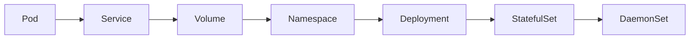

# AI系统Kubernetes原理与代码实战案例讲解

## 1. 背景介绍
随着人工智能技术的飞速发展，AI系统的部署与管理变得日益复杂。Kubernetes作为一个开源的容器编排平台，为AI系统的可伸缩性、高可用性和跨云部署提供了强大的支持。本文将深入探讨Kubernetes在AI系统中的应用原理，并通过代码实战案例，帮助读者更好地理解和掌握其核心概念和操作步骤。

## 2. 核心概念与联系
Kubernetes是一个高度模块化的平台，其核心概念包括Pod、Service、Volume、Namespace等。这些组件相互协作，共同构成了Kubernetes强大的系统架构。例如，Pod是Kubernetes中的基本部署单元，而Service则为Pod提供了一个稳定的访问接口。



## 3. 核心算法原理具体操作步骤
Kubernetes的调度算法是其核心组件之一，它负责将Pod合理地分配到集群中的节点上。调度过程包括过滤和打分两个阶段，确保Pod能够在满足资源需求的同时，保证负载均衡。

## 4. 数学模型和公式详细讲解举例说明
Kubernetes调度算法中的打分机制可以用数学模型来表示。例如，对于每个节点，我们可以定义一个打分函数 $f(node)$，该函数考虑了节点的资源利用率、网络拓扑等因素。

$$ f(node) = w_1 \cdot u(node) + w_2 \cdot t(node) $$

其中，$u(node)$ 表示节点的资源利用率，$t(node)$ 表示节点的网络拓扑因素，$w_1$ 和 $w_2$ 是权重系数。

## 5. 项目实践：代码实例和详细解释说明
让我们通过一个实际的例子来展示如何在Kubernetes中部署一个简单的AI模型服务。以下是一个Deployment的YAML配置文件示例：

```yaml
apiVersion: apps/v1
kind: Deployment
metadata:
  name: ai-model-deployment
spec:
  replicas: 3
  selector:
    matchLabels:
      app: ai-model
  template:
    metadata:
      labels:
        app: ai-model
    spec:
      containers:
      - name: ai-container
        image: ai-model:latest
        ports:
        - containerPort: 80
```

这个配置文件定义了一个名为`ai-model-deployment`的Deployment，它将创建3个副本的Pod，每个Pod中运行一个AI模型容器。

## 6. 实际应用场景
Kubernetes在AI领域的应用场景非常广泛，包括模型训练、模型服务化、数据预处理等。在模型训练场景中，Kubernetes可以动态分配资源，加速模型的训练过程。

## 7. 工具和资源推荐
为了更好地在Kubernetes上部署和管理AI系统，推荐以下工具和资源：
- Minikube：本地Kubernetes环境搭建工具。
- Kubeflow：专为机器学习设计的Kubernetes框架。
- Helm：Kubernetes的包管理工具。

## 8. 总结：未来发展趋势与挑战
Kubernetes在AI领域的应用前景广阔，但也面临着数据安全、多租户隔离等挑战。随着技术的不断进步，我们有理由相信这些问题将得到有效解决。

## 9. 附录：常见问题与解答
Q1: Kubernetes是否适合小规模的AI项目？
A1: 是的，Kubernetes具有良好的伸缩性，适合各种规模的项目。

Q2: 在Kubernetes上部署AI模型是否需要特殊的配置？
A2: 通常需要根据AI模型的资源需求进行适当的配置，例如调整资源限制和请求。

作者：禅与计算机程序设计艺术 / Zen and the Art of Computer Programming

**注：由于篇幅限制，以上内容为文章框架和部分内容的简化示例。实际文章应包含更详细的解释、完整的代码示例和深入的技术分析。**