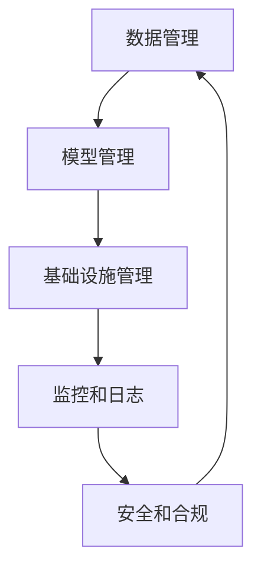

# AI系统PlatformOps原理与代码实战案例讲解

## 1.背景介绍

随着人工智能(AI)技术的快速发展,AI系统已经广泛应用于各个领域,包括金融、医疗、制造业等。然而,AI系统的复杂性和动态性给其运维和管理带来了巨大挑战。传统的IT运维方式已经无法满足AI系统的需求,因此出现了一种新的运维模式:AI系统PlatformOps。

PlatformOps(Platform Operations)是指对AI平台的全生命周期进行统一管理和运维,包括AI模型的训练、部署、监控、更新等环节。它旨在提高AI系统的可靠性、可维护性和可扩展性,确保AI系统能够高效、安全地运行。

### 1.1 AI系统运维挑战

AI系统运维面临以下主要挑战:

1. **数据质量**:AI模型的性能高度依赖于训练数据的质量,因此需要持续监控和改进数据质量。
2. **模型漂移**:随着时间推移,AI模型可能会出现性能下降,需要及时发现并更新模型。
3. **资源管理**:AI训练和推理需要大量计算资源,需要合理规划和调度资源。
4. **版本控制**:AI系统涉及多个组件(模型、数据、代码等),需要严格的版本控制。
5. **安全合规**:AI系统需要满足各种安全和合规要求,如数据隐私、公平性等。

### 1.2 PlatformOps的重要性

PlatformOps可以帮助企业有效应对上述挑战,提高AI系统的可靠性和效率。它的主要优势包括:

1. **标准化流程**:统一AI系统的生命周期管理流程,提高效率和一致性。
2. **自动化**:通过自动化工具减少人工干预,降低出错风险。
3. **可观测性**:全面监控AI系统的各个组件,及时发现和解决问题。
4. **版本控制**:严格的版本控制机制,确保系统的可追溯性和可重复性。
5. **安全合规**:内置安全和合规机制,保护数据隐私和公平性。

## 2.核心概念与联系

### 2.1 PlatformOps架构

PlatformOps架构通常包括以下几个核心组件:

1. **数据管理**:负责数据采集、清洗、标注、版本控制等。
2. **模型管理**:负责模型训练、评估、部署、版本控制等。
3. **基础设施管理**:负责计算资源的调度和管理。
4. **监控和日志**:监控系统的各个组件,收集和分析日志数据。
5. **安全和合规**:实施各种安全和合规策略。

这些组件通过标准化的API和工作流程进行集成,形成一个统一的AI系统管理平台。



### 2.2 关键概念

PlatformOps涉及以下几个关键概念:

1. **CI/CD**:持续集成和持续部署,确保AI系统的自动化构建、测试和部署。
2. **GitOps**:将基础设施作为代码进行版本控制和自动化部署。
3. **ModelOps**:AI模型的生命周期管理,包括训练、评估、部署、监控等。
4. **MLOps**:机器学习系统的端到端生命周期管理。
5. **AIOps**:利用AI技术实现IT运维的自动化和智能化。

这些概念相互关联,共同构建了PlatformOps的核心理念和实践。

## 3.核心算法原理具体操作步骤

PlatformOps涉及多种算法和技术,本节将介绍其中几个核心算法的原理和具体操作步骤。

### 3.1 AI模型版本控制

AI模型的版本控制是PlatformOps的一个关键环节。常用的版本控制算法包括:

1. **Git**:将模型文件存储在Git仓库中,利用Git的版本控制功能。
2. **DVC(Data Version Control)**:专门为机器学习项目设计的版本控制系统,可以跟踪数据、模型、代码等多种类型的文件。

以DVC为例,其核心操作步骤如下:

1. 初始化DVC项目:`dvc init`
2. 将数据文件添加到DVC管理:`dvc add data.csv`
3. 创建模型文件:`train_model.py`
4. 将模型文件添加到DVC管理:`dvc add model.pkl`
5. 创建版本:`dvc push`

DVC会自动计算文件的哈希值,并将文件存储在远程存储(如S3、GCS等)中,同时在本地保留元数据。这样可以实现高效的版本控制和共享。

### 3.2 AI模型评估

在PlatformOps中,需要持续评估AI模型的性能,以发现模型漂移等问题。常用的评估算法包括:

1. **机器学习评估指标**:如准确率、精确率、召回率、F1分数等。
2. **A/B测试**:将模型分为A/B两个版本,在线上环境进行对比测试。
3. **监测统计量**:监测模型输出的统计量(如均值、方差等),发现异常情况。

以监测统计量为例,其核心操作步骤如下:

1. 收集模型输出数据,计算统计量(如均值、方差等)。
2. 建立统计量的正常范围,可以使用历史数据或者领域知识。
3. 持续监测统计量,如果超出正常范围,则发出警报。
4. 分析异常原因,如果是模型漂移,则需要重新训练或更新模型。

这种方法可以及时发现模型性能下降,从而触发相应的修复措施。

### 3.3 AI系统资源调度

AI系统通常需要大量的计算资源,如GPU、TPU等。PlatformOps需要合理调度这些资源,以提高资源利用率。常用的资源调度算法包括:

1. **基于规则的调度**:根据预定义的规则(如优先级、公平性等)进行调度。
2. **基于优化的调度**:将资源调度建模为优化问题,使用优化算法求解。
3. **基于机器学习的调度**:利用机器学习技术(如强化学习)自动学习调度策略。

以基于优化的调度为例,其核心操作步骤如下:

1. 建立资源调度模型,包括作业、资源、约束条件等。
2. 将资源调度问题转化为优化问题,如最小化作业完成时间。
3. 使用优化算法(如整数规划、启发式算法等)求解最优调度方案。
4. 根据调度方案分配资源,执行AI任务。

这种方法可以充分利用资源,提高系统吞吐量和效率。

## 4.数学模型和公式详细讲解举例说明

PlatformOps中涉及多种数学模型和公式,本节将详细讲解其中几个核心模型。

### 4.1 AI模型评估指标

AI模型的评估指标是衡量模型性能的重要依据。常用的评估指标包括:

1. **准确率(Accuracy)**:正确预测的样本数占总样本数的比例。

   $$Accuracy = \frac{TP + TN}{TP + TN + FP + FN}$$

   其中,TP(True Positive)表示正确预测为正例的样本数,TN(True Negative)表示正确预测为负例的样本数,FP(False Positive)表示错误预测为正例的样本数,FN(False Negative)表示错误预测为负例的样本数。

2. **精确率(Precision)**:正确预测为正例的样本数占所有预测为正例的样本数的比例。

   $$Precision = \frac{TP}{TP + FP}$$

3. **召回率(Recall)**:正确预测为正例的样本数占所有真实正例样本数的比例。

   $$Recall = \frac{TP}{TP + FN}$$

4. **F1分数**:准确率和召回率的调和平均数。

   $$F1 = 2 \times \frac{Precision \times Recall}{Precision + Recall}$$

根据具体任务的需求,可以选择合适的评估指标。在PlatformOps中,需要持续监控这些指标,发现模型性能下降的情况。

### 4.2 资源调度优化模型

资源调度是PlatformOps中的一个核心问题,可以建立数学优化模型来求解最优调度方案。

假设有$n$个作业$J = \{j_1, j_2, \dots, j_n\}$,需要在$m$个资源节点$R = \{r_1, r_2, \dots, r_m\}$上执行。每个作业$j_i$需要占用$c_i$个CPU核心和$g_i$个GPU,执行时间为$t_i$。每个资源节点$r_k$拥有$C_k$个CPU核心和$G_k$个GPU。

目标是最小化所有作业的完成时间,即:

$$\min \max_{1 \leq i \leq n} (C_i + t_i)$$

其中,$C_i$表示作业$j_i$的开始时间。

约束条件包括:

1. 每个作业只能被分配到一个资源节点。
2. 每个资源节点的CPU和GPU资源不能被超分。

可以将该问题建模为整数规划问题,使用求解器(如CPLEX、Gurobi等)求解最优调度方案。

该模型可以确保资源的高效利用,提高整个AI系统的吞吐量和响应时间。

## 5.项目实践:代码实例和详细解释说明

为了更好地理解PlatformOps的实践,本节将提供一个基于Kubeflow的AI模型训练和部署示例,并详细解释相关代码。

### 5.1 Kubeflow简介

[Kubeflow](https://www.kubeflow.org/)是一个基于Kubernetes的开源AI平台,提供了完整的AI工作流程支持,包括数据准备、模型训练、模型服务等。它具有以下主要特点:

1. **可移植性**:基于Kubernetes,可在任何支持Kubernetes的环境中运行。
2. **可扩展性**:可以轻松扩展计算资源,满足大规模AI工作负载。
3. **标准化**:提供标准化的API和工作流程,方便集成和自动化。
4. **生态系统**:与TensorFlow、PyTorch等主流AI框架无缝集成。

Kubeflow是实现PlatformOps的一个优秀选择,本示例将基于Kubeflow构建一个端到端的AI模型训练和部署流程。

### 5.2 示例代码

#### 5.2.1 数据准备

```python
import kfp
from kfp import dsl

# 定义数据准备组件
def data_prep_op(dataset_url):
    # 下载数据集
    # ...

    # 数据清洗和预处理
    # ...

    # 输出处理后的数据
    # ...

# 构建Kubeflow Pipeline
@dsl.pipeline(
    name='Data Preparation Pipeline',
    description='Download and preprocess data for model training.'
)
def data_prep_pipeline(dataset_url):
    data_prep = data_prep_op(dataset_url)

# 编译Pipeline包
compiler.Compiler().compile(data_prep_pipeline, 'data_prep_pipeline.yaml')
```

该代码定义了一个Kubeflow Pipeline,用于下载数据集、进行数据清洗和预处理。Pipeline由一个`data_prep_op`组件组成,接收数据集URL作为输入,输出处理后的数据。最后,将Pipeline编译为YAML文件,以便部署到Kubeflow平台上运行。

#### 5.2.2 模型训练

```python
import kfp
from kfp import dsl, components

# 定义模型训练组件
def train_op(data_path, model_path):
    # 加载数据
    # ...

    # 定义模型
    # ...

    # 训练模型
    # ...

    # 保存模型
    # ...

# 构建Kubeflow Pipeline
@dsl.pipeline(
    name='Model Training Pipeline',
    description='Train machine learning model.'
)
def train_pipeline(data_path, model_path):
    train = train_op(data_path, model_path)

# 编译Pipeline包
compiler.Compiler().compile(train_pipeline, 'train_pipeline.yaml')
```

该代码定义了一个Kubeflow Pipeline,用于训练机器学习模型。Pipeline由一个`train_op`组件组成,接收处理后的数据路径和模型保存路径作为输入。组件内部加载数据、定义模型、进行训练,并将训练好的模型保存到指定路径。最后,将