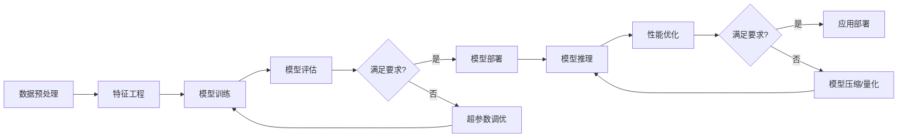

# AI系统性能优化原理与代码实战案例讲解

## 1.背景介绍
### 1.1 AI系统性能优化的重要性
### 1.2 当前AI系统面临的性能挑战
### 1.3 性能优化对AI系统的影响

## 2.核心概念与联系
### 2.1 AI系统的核心组成部分
#### 2.1.1 数据预处理与特征工程
#### 2.1.2 模型训练与优化
#### 2.1.3 模型部署与推理
### 2.2 性能指标与评估方法
#### 2.2.1 时间复杂度与空间复杂度
#### 2.2.2 吞吐量与延迟
#### 2.2.3 精度与召回率
### 2.3 性能优化的关键因素
#### 2.3.1 算法选择与优化
#### 2.3.2 硬件加速与并行计算
#### 2.3.3 系统架构与资源调度

## 3.核心算法原理具体操作步骤
### 3.1 数据预处理优化
#### 3.1.1 数据清洗与归一化
#### 3.1.2 特征选择与降维
#### 3.1.3 数据增强与平衡
### 3.2 模型训练优化
#### 3.2.1 梯度下降优化算法
#### 3.2.2 正则化与早停法
#### 3.2.3 超参数调优
### 3.3 模型推理优化
#### 3.3.1 模型压缩与量化
#### 3.3.2 模型剪枝与蒸馏
#### 3.3.3 低精度计算

## 4.数学模型和公式详细讲解举例说明
### 4.1 损失函数与优化目标
#### 4.1.1 均方误差损失
$$ L(y, \hat{y}) = \frac{1}{n} \sum_{i=1}^{n} (y_i - \hat{y}_i)^2 $$
#### 4.1.2 交叉熵损失
$$ L(y, \hat{y}) = -\frac{1}{n} \sum_{i=1}^{n} [y_i \log(\hat{y}_i) + (1-y_i) \log(1-\hat{y}_i)] $$
#### 4.1.3 L1与L2正则化
$$ L(w) = \alpha \sum_{i=1}^{n} |w_i| \quad \text{(L1)} $$
$$ L(w) = \alpha \sum_{i=1}^{n} w_i^2 \quad \text{(L2)} $$
### 4.2 优化算法推导与比较
#### 4.2.1 随机梯度下降(SGD)
$$ w := w - \eta \cdot \nabla_w J(w; x^{(i)}; y^{(i)}) $$
#### 4.2.2 Adam优化器
$$ \begin{aligned} m_t &:= \beta_1 m_{t-1} + (1 - \beta_1) g_t \\ v_t &:= \beta_2 v_{t-1} + (1 - \beta_2) g_t^2 \end{aligned} $$
$$ \hat{m}_t = \frac{m_t}{1 - \beta_1^t} \quad \hat{v}_t = \frac{v_t}{1 - \beta_2^t} $$  
$$ w_t := w_{t-1} - \frac{\eta}{\sqrt{\hat{v}_t} + \epsilon} \hat{m}_t $$

## 5.项目实践：代码实例和详细解释说明
### 5.1 使用TensorFlow优化卷积神经网络
```python
import tensorflow as tf

# 定义卷积层
def conv2d(x, W, b, strides=1):
    x = tf.nn.conv2d(x, W, strides=[1, strides, strides, 1], padding='SAME')
    x = tf.nn.bias_add(x, b)
    return tf.nn.relu(x)

# 定义池化层  
def maxpool2d(x, k=2):
    return tf.nn.max_pool(x, ksize=[1, k, k, 1], strides=[1, k, k, 1], padding='SAME')

# 定义模型架构
def conv_net(x, weights, biases):
    conv1 = conv2d(x, weights['wc1'], biases['bc1']) 
    conv1 = maxpool2d(conv1, k=2)
    
    conv2 = conv2d(conv1, weights['wc2'], biases['bc2'])
    conv2 = maxpool2d(conv2, k=2)

    fc1 = tf.reshape(conv2, [-1, weights['wd1'].get_shape().as_list()[0]])
    fc1 = tf.add(tf.matmul(fc1, weights['wd1']), biases['bd1'])
    fc1 = tf.nn.relu(fc1)
    
    out = tf.add(tf.matmul(fc1, weights['out']), biases['out'])
    return out

# 初始化权重和偏置
weights = {
    'wc1': tf.Variable(tf.random.normal([5, 5, 1, 32])),
    'wc2': tf.Variable(tf.random.normal([5, 5, 32, 64])),
    'wd1': tf.Variable(tf.random.normal([7*7*64, 1024])),
    'out': tf.Variable(tf.random.normal([1024, 10]))
}

biases = {
    'bc1': tf.Variable(tf.random.normal([32])),
    'bc2': tf.Variable(tf.random.normal([64])),
    'bd1': tf.Variable(tf.random.normal([1024])),
    'out': tf.Variable(tf.random.normal([10]))
}

# 构建模型
pred = conv_net(x, weights, biases)

# 定义损失函数和优化器
cost = tf.reduce_mean(tf.nn.softmax_cross_entropy_with_logits(logits=pred, labels=y))
optimizer = tf.train.AdamOptimizer(learning_rate=learning_rate).minimize(cost)
```

以上代码定义了一个简单的卷积神经网络，包含两个卷积层、两个池化层和两个全连接层。在卷积层中使用了ReLU激活函数，在池化层中使用了最大池化。最后使用softmax交叉熵作为损失函数，并使用Adam优化器进行训练。通过合理设计网络结构和选择适当的超参数，可以有效提高模型的性能和训练效率。

### 5.2 使用PyTorch实现模型剪枝
```python
import torch
import torch.nn as nn
import torch.nn.utils.prune as prune

# 定义模型
class Net(nn.Module):
    def __init__(self):
        super(Net, self).__init__()
        self.conv1 = nn.Conv2d(1, 32, 3, 1)
        self.conv2 = nn.Conv2d(32, 64, 3, 1)
        self.fc1 = nn.Linear(9216, 128)
        self.fc2 = nn.Linear(128, 10)

    def forward(self, x):
        x = F.relu(self.conv1(x))
        x = F.max_pool2d(x, 2, 2)
        x = F.relu(self.conv2(x))
        x = F.max_pool2d(x, 2, 2)
        x = x.view(-1, 9216)
        x = F.relu(self.fc1(x))
        x = self.fc2(x)
        return F.log_softmax(x, dim=1)

# 加载预训练模型
model = Net()
model.load_state_dict(torch.load("model.pth"))

# 对卷积层进行剪枝
prune.l1_unstructured(model.conv1, name="weight", amount=0.3)
prune.l1_unstructured(model.conv2, name="weight", amount=0.3)

# 对全连接层进行剪枝
prune.l1_unstructured(model.fc1, name="weight", amount=0.4)
prune.l1_unstructured(model.fc2, name="weight", amount=0.4)

# 剪枝后重新训练
optimizer = optim.Adam(model.parameters(), lr=0.001)
for epoch in range(10):
    train(model, device, train_loader, optimizer, epoch)
    test(model, device, test_loader)
```

以上代码展示了如何使用PyTorch对一个简单的卷积神经网络进行模型剪枝。首先加载预训练的模型，然后使用`prune`模块对卷积层和全连接层进行剪枝，设置剪枝的比例。剪枝后，需要重新对模型进行训练，以恢复部分性能损失。通过剪枝可以有效减小模型的大小和计算量，加快推理速度。

## 6.实际应用场景
### 6.1 智能语音助手中的性能优化
### 6.2 自动驾驶系统中的实时推理
### 6.3 医疗影像分析中的高效诊断

## 7.工具和资源推荐
### 7.1 深度学习框架
#### 7.1.1 TensorFlow
#### 7.1.2 PyTorch
#### 7.1.3 Keras
### 7.2 性能分析与优化工具
#### 7.2.1 NVIDIA Nsight Systems
#### 7.2.2 Intel VTune Amplifier
#### 7.2.3 Valgrind
### 7.3 相关学习资源
#### 7.3.1 在线课程
#### 7.3.2 技术博客
#### 7.3.3 学术论文

## 8.总结：未来发展趋势与挑战
### 8.1 AI芯片与专用加速器的发展
### 8.2 新型计算范式的探索
### 8.3 自动化性能优化的可能性

## 9.附录：常见问题与解答
### 9.1 如何权衡模型性能和计算效率？
### 9.2 不同硬件平台上的优化策略有何差异？
### 9.3 如何进行模型的可解释性分析？



以上是AI系统性能优化的一般流程图。首先对原始数据进行预处理和特征工程，然后进行模型训练和评估，如果模型性能满足要求则进行部署，否则需要进行超参数调优并重新训练。在模型部署后，还需要对推理过程进行性能优化，如果优化后的性能仍不满足要求，可以考虑对模型进行压缩或量化，以进一步提高推理速度和减小资源消耗。最终将优化后的模型应用到实际场景中。

AI系统的性能优化是一个复杂的过程，需要在模型精度、计算效率、资源消耗等多个方面进行权衡。优化的策略也需要根据具体的应用场景和硬件平台来定制。未来随着AI芯片和专用加速器的发展，以及新型计算范式的出现，AI系统的性能优化将迎来新的机遇和挑战。自动化的性能优化工具和方法也可能成为一个重要的研究方向。

作者：禅与计算机程序设计艺术 / Zen and the Art of Computer Programming