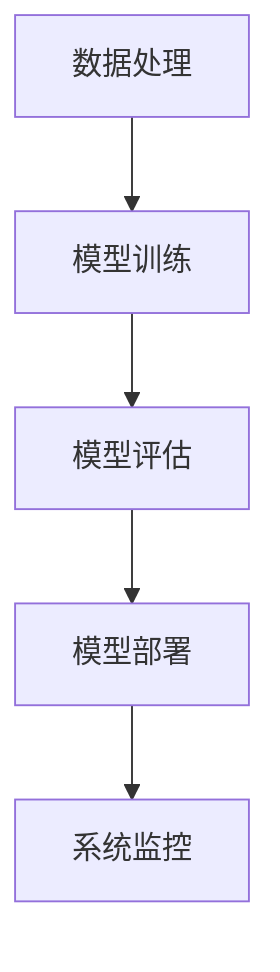

# AI系统架构原理与代码实战案例讲解

## 1.背景介绍

人工智能（AI）已经成为现代科技的核心驱动力之一，从自动驾驶汽车到智能语音助手，AI的应用无处不在。随着AI技术的不断发展，构建高效、可扩展的AI系统架构变得尤为重要。本文将深入探讨AI系统架构的核心原理，并通过实际代码案例来展示如何实现这些原理。

## 2.核心概念与联系

在构建AI系统架构时，有几个核心概念需要理解：

### 2.1 数据处理

数据是AI系统的基础。数据处理包括数据收集、清洗、预处理和特征工程等步骤。数据的质量直接影响模型的性能。

### 2.2 模型训练

模型训练是AI系统的核心部分。通过使用训练数据，模型可以学习到数据中的模式和规律。常见的模型包括线性回归、决策树、神经网络等。

### 2.3 模型评估

模型评估用于衡量模型的性能。常见的评估指标包括准确率、精确率、召回率和F1分数等。

### 2.4 模型部署

模型部署是将训练好的模型应用到实际环境中的过程。部署方式可以是本地部署、云部署或边缘部署。

### 2.5 系统监控

系统监控用于实时监控AI系统的运行状态，确保系统的稳定性和可靠性。

以下是AI系统架构的Mermaid流程图：



## 3.核心算法原理具体操作步骤

### 3.1 数据处理

数据处理的具体步骤如下：

1. **数据收集**：从各种来源收集数据，如数据库、API、传感器等。
2. **数据清洗**：处理缺失值、异常值和重复数据。
3. **数据预处理**：标准化、归一化和数据转换。
4. **特征工程**：提取和选择有用的特征。

### 3.2 模型训练

模型训练的具体步骤如下：

1. **选择模型**：根据问题类型选择合适的模型，如回归、分类或聚类模型。
2. **划分数据集**：将数据集划分为训练集、验证集和测试集。
3. **训练模型**：使用训练集训练模型，调整超参数。
4. **验证模型**：使用验证集评估模型性能，进行超参数调优。

### 3.3 模型评估

模型评估的具体步骤如下：

1. **选择评估指标**：根据问题类型选择合适的评估指标。
2. **计算评估指标**：使用测试集计算评估指标。
3. **分析结果**：分析评估结果，判断模型是否满足需求。

### 3.4 模型部署

模型部署的具体步骤如下：

1. **选择部署方式**：根据应用场景选择本地部署、云部署或边缘部署。
2. **准备环境**：配置部署环境，安装必要的依赖。
3. **部署模型**：将模型部署到目标环境中。
4. **测试部署**：测试部署的模型，确保其正常运行。

### 3.5 系统监控

系统监控的具体步骤如下：

1. **设置监控指标**：选择需要监控的指标，如响应时间、错误率等。
2. **配置监控工具**：使用监控工具配置监控规则。
3. **实时监控**：实时监控系统运行状态，及时发现和处理问题。

## 4.数学模型和公式详细讲解举例说明

### 4.1 线性回归

线性回归是一种简单而常用的回归模型，其数学公式如下：

$$
y = \beta_0 + \beta_1 x_1 + \beta_2 x_2 + \cdots + \beta_n x_n + \epsilon
$$

其中，$y$ 是目标变量，$x_1, x_2, \ldots, x_n$ 是特征变量，$\beta_0, \beta_1, \ldots, \beta_n$ 是回归系数，$\epsilon$ 是误差项。

### 4.2 逻辑回归

逻辑回归是一种用于分类问题的模型，其数学公式如下：

$$
P(y=1|x) = \frac{1}{1 + e^{-(\beta_0 + \beta_1 x_1 + \beta_2 x_2 + \cdots + \beta_n x_n)}}
$$

其中，$P(y=1|x)$ 是样本属于类别1的概率，$x_1, x_2, \ldots, x_n$ 是特征变量，$\beta_0, \beta_1, \ldots, \beta_n$ 是回归系数。

### 4.3 神经网络

神经网络是一种复杂的模型，由多个层组成。每一层的输出是上一层的输入，数学公式如下：

$$
a^{(l)} = f(W^{(l)} a^{(l-1)} + b^{(l)})
$$

其中，$a^{(l)}$ 是第$l$层的激活值，$W^{(l)}$ 是第$l$层的权重矩阵，$b^{(l)}$ 是第$l$层的偏置向量，$f$ 是激活函数。

## 5.项目实践：代码实例和详细解释说明

### 5.1 数据处理代码实例

```python
import pandas as pd
from sklearn.preprocessing import StandardScaler

# 数据收集
data = pd.read_csv('data.csv')

# 数据清洗
data = data.dropna()

# 数据预处理
scaler = StandardScaler()
data_scaled = scaler.fit_transform(data)

# 特征工程
features = data_scaled[:, :-1]
target = data_scaled[:, -1]
```

### 5.2 模型训练代码实例

```python
from sklearn.model_selection import train_test_split
from sklearn.linear_model import LinearRegression

# 划分数据集
X_train, X_test, y_train, y_test = train_test_split(features, target, test_size=0.2, random_state=42)

# 训练模型
model = LinearRegression()
model.fit(X_train, y_train)
```

### 5.3 模型评估代码实例

```python
from sklearn.metrics import mean_squared_error

# 预测
y_pred = model.predict(X_test)

# 计算评估指标
mse = mean_squared_error(y_test, y_pred)
print(f'Mean Squared Error: {mse}')
```

### 5.4 模型部署代码实例

```python
import joblib

# 保存模型
joblib.dump(model, 'model.pkl')

# 加载模型
loaded_model = joblib.load('model.pkl')

# 测试部署
y_pred_deployed = loaded_model.predict(X_test)
```

### 5.5 系统监控代码实例

```python
import psutil

# 设置监控指标
cpu_usage = psutil.cpu_percent(interval=1)
memory_usage = psutil.virtual_memory().percent

# 实时监控
print(f'CPU Usage: {cpu_usage}%')
print(f'Memory Usage: {memory_usage}%')
```

## 6.实际应用场景

### 6.1 医疗诊断

AI系统可以用于医疗诊断，通过分析患者的病历数据和医学影像，辅助医生进行诊断，提高诊断的准确性和效率。

### 6.2 自动驾驶

自动驾驶汽车依赖于AI系统来感知环境、规划路径和控制车辆。通过使用深度学习和计算机视觉技术，自动驾驶汽车可以实现自主导航。

### 6.3 智能客服

智能客服系统可以通过自然语言处理技术，理解用户的问题并提供相应的回答，提高客户服务的效率和质量。

### 6.4 金融风控

AI系统可以用于金融风控，通过分析用户的交易数据和行为数据，识别潜在的风险，防范金融欺诈。

## 7.工具和资源推荐

### 7.1 编程语言

- **Python**：Python是AI开发的首选编程语言，拥有丰富的库和工具支持。
- **R**：R语言在数据分析和统计建模方面具有优势。

### 7.2 开发框架

- **TensorFlow**：谷歌开发的开源深度学习框架，支持大规模分布式训练。
- **PyTorch**：Facebook开发的开源深度学习框架，易于使用和调试。

### 7.3 数据库

- **MySQL**：开源关系型数据库，适用于结构化数据存储。
- **MongoDB**：开源文档型数据库，适用于非结构化数据存储。

### 7.4 云服务

- **AWS**：亚马逊提供的云计算服务，支持AI模型的训练和部署。
- **Google Cloud**：谷歌提供的云计算服务，支持大规模数据处理和AI模型的训练。

## 8.总结：未来发展趋势与挑战

### 8.1 发展趋势

- **自动化**：AI系统将越来越多地实现自动化，从数据处理到模型训练和部署，减少人工干预。
- **可解释性**：随着AI系统的应用越来越广泛，模型的可解释性变得尤为重要，未来将有更多的研究致力于提高模型的可解释性。
- **边缘计算**：随着物联网的发展，边缘计算将成为AI系统的重要组成部分，实现实时数据处理和决策。

### 8.2 挑战

- **数据隐私**：AI系统需要大量的数据来训练模型，如何保护用户的数据隐私是一个重要的挑战。
- **模型偏见**：AI模型可能会存在偏见，如何消除模型的偏见，确保公平性是一个重要的研究方向。
- **计算资源**：AI模型的训练和部署需要大量的计算资源，如何高效利用计算资源是一个重要的挑战。

## 9.附录：常见问题与解答

### 9.1 如何选择合适的模型？

选择合适的模型需要根据具体问题的类型和数据的特点来决定。对于回归问题，可以选择线性回归或决策树回归；对于分类问题，可以选择逻辑回归或支持向量机；对于复杂的非线性问题，可以选择神经网络。

### 9.2 如何处理数据缺失值？

处理数据缺失值的方法有多种，可以选择删除包含缺失值的样本，或者使用均值、中位数或众数填补缺失值。此外，还可以使用插值法或预测模型来填补缺失值。

### 9.3 如何提高模型的泛化能力？

提高模型的泛化能力可以通过以下几种方法：增加训练数据量、使用正则化技术、进行交叉验证、选择合适的模型复杂度等。

### 9.4 如何监控AI系统的运行状态？

可以使用监控工具（如Prometheus、Grafana等）来实时监控AI系统的运行状态，设置监控指标（如CPU使用率、内存使用率、响应时间等），及时发现和处理问题。

### 9.5 如何处理模型的偏见问题？

处理模型的偏见问题可以通过以下几种方法：在数据收集阶段确保数据的多样性和代表性、在模型训练阶段使用公平性约束、在模型评估阶段使用公平性指标等。

---

作者：禅与计算机程序设计艺术 / Zen and the Art of Computer Programming