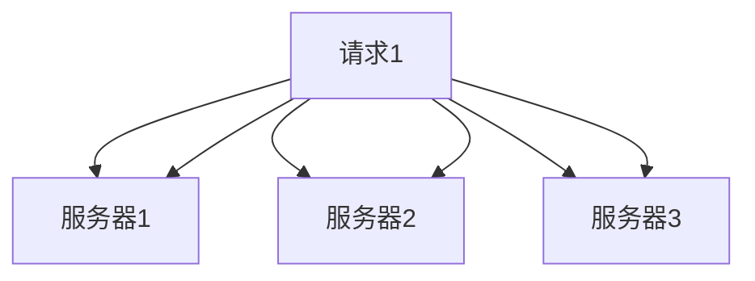
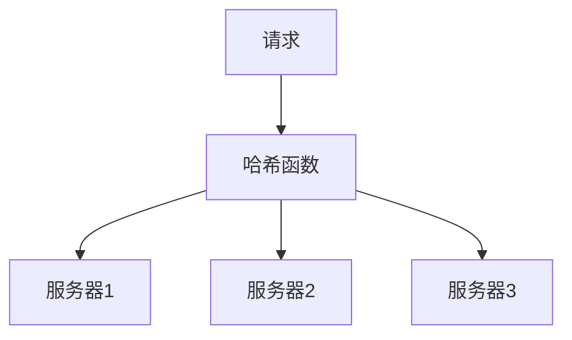

# AI系统负载均衡原理与代码实战案例讲解

## 1.背景介绍

在现代计算机系统中，负载均衡是确保系统高效运行和稳定性的关键技术之一。随着人工智能（AI）技术的迅猛发展，AI系统的负载均衡变得尤为重要。AI系统通常需要处理大量的数据和复杂的计算任务，这对系统的性能和可靠性提出了更高的要求。负载均衡技术通过将任务分配到多个计算节点上，确保系统资源的充分利用，避免单点故障，提高系统的整体性能。

## 2.核心概念与联系

### 2.1 负载均衡的定义

负载均衡（Load Balancing）是指将工作负载分配到多个计算资源（如服务器、处理器、存储设备等）上，以提高系统的效率和可靠性。负载均衡可以在不同层次上实现，包括网络层、应用层和数据层。

### 2.2 AI系统中的负载均衡

在AI系统中，负载均衡主要涉及以下几个方面：

- **数据处理**：将大规模数据集分配到多个计算节点进行并行处理。
- **模型训练**：将训练任务分配到多个GPU或TPU上，以加速模型训练过程。
- **推理服务**：将推理请求分配到多个服务器上，以提高响应速度和服务可用性。

### 2.3 负载均衡与高可用性

负载均衡不仅可以提高系统的性能，还可以增强系统的高可用性。通过将任务分配到多个节点，即使某个节点发生故障，系统仍然可以继续运行，从而提高系统的可靠性。

## 3.核心算法原理具体操作步骤

### 3.1 轮询算法

轮询算法（Round Robin）是最简单的负载均衡算法之一。它将请求依次分配给每个服务器，循环往复。该算法的优点是实现简单，但在服务器性能不均衡的情况下，可能导致负载分配不均。



### 3.2 加权轮询算法

加权轮询算法（Weighted Round Robin）在轮询算法的基础上，为每个服务器分配一个权重，根据权重分配请求。权重越高的服务器，分配到的请求越多。

### 3.3 最小连接数算法

最小连接数算法（Least Connections）将请求分配给当前连接数最少的服务器，以实现负载均衡。该算法适用于长连接的场景，如数据库连接。

### 3.4 一致性哈希算法

一致性哈希算法（Consistent Hashing）通过哈希函数将请求映射到特定的服务器上，确保同一请求总是分配到同一服务器。该算法在节点动态增减时，能够最小化数据迁移量。



## 4.数学模型和公式详细讲解举例说明

### 4.1 轮询算法的数学模型

轮询算法的数学模型可以表示为：

$$
S_i = (i \mod N) + 1
$$

其中，$S_i$ 表示第 $i$ 个请求分配到的服务器，$N$ 表示服务器的总数。

### 4.2 加权轮询算法的数学模型

加权轮询算法的数学模型可以表示为：

$$
W_i = \frac{w_i}{\sum_{j=1}^{N} w_j}
$$

其中，$W_i$ 表示第 $i$ 个服务器的权重，$w_i$ 表示第 $i$ 个服务器的实际权重。

### 4.3 最小连接数算法的数学模型

最小连接数算法的数学模型可以表示为：

$$
S_i = \arg \min_{j} C_j
$$

其中，$S_i$ 表示第 $i$ 个请求分配到的服务器，$C_j$ 表示第 $j$ 个服务器的当前连接数。

### 4.4 一致性哈希算法的数学模型

一致性哈希算法的数学模型可以表示为：

$$
H(k) = \text{hash}(k) \mod N
$$

其中，$H(k)$ 表示请求 $k$ 映射到的服务器，$\text{hash}(k)$ 表示请求 $k$ 的哈希值，$N$ 表示服务器的总数。

## 5.项目实践：代码实例和详细解释说明

### 5.1 轮询算法的实现

```python
class RoundRobin:
    def __init__(self, servers):
        self.servers = servers
        self.index = 0

    def get_server(self):
        server = self.servers[self.index]
        self.index = (self.index + 1) % len(self.servers)
        return server

# 示例
servers = ['server1', 'server2', 'server3']
rr = RoundRobin(servers)
for _ in range(6):
    print(rr.get_server())
```

### 5.2 加权轮询算法的实现

```python
class WeightedRoundRobin:
    def __init__(self, servers, weights):
        self.servers = servers
        self.weights = weights
        self.index = 0
        self.current_weight = 0

    def get_server(self):
        while True:
            self.index = (self.index + 1) % len(self.servers)
            if self.index == 0:
                self.current_weight -= 1
                if self.current_weight <= 0:
                    self.current_weight = max(self.weights)
            if self.weights[self.index] >= self.current_weight:
                return self.servers[self.index]

# 示例
servers = ['server1', 'server2', 'server3']
weights = [5, 1, 1]
wrr = WeightedRoundRobin(servers, weights)
for _ in range(7):
    print(wrr.get_server())
```

### 5.3 最小连接数算法的实现

```python
class LeastConnections:
    def __init__(self, servers):
        self.servers = servers
        self.connections = {server: 0 for server in servers}

    def get_server(self):
        server = min(self.connections, key=self.connections.get)
        self.connections[server] += 1
        return server

    def release_server(self, server):
        self.connections[server] -= 1

# 示例
servers = ['server1', 'server2', 'server3']
lc = LeastConnections(servers)
for _ in range(6):
    server = lc.get_server()
    print(server)
    lc.release_server(server)
```

### 5.4 一致性哈希算法的实现

```python
import hashlib

class ConsistentHashing:
    def __init__(self, servers):
        self.servers = servers
        self.ring = {}
        self._hash_servers()

    def _hash_servers(self):
        for server in self.servers:
            hash_value = self._hash(server)
            self.ring[hash_value] = server

    def _hash(self, key):
        return int(hashlib.md5(key.encode()).hexdigest(), 16)

    def get_server(self, key):
        hash_value = self._hash(key)
        sorted_hashes = sorted(self.ring.keys())
        for h in sorted_hashes:
            if hash_value <= h:
                return self.ring[h]
        return self.ring[sorted_hashes[0]]

# 示例
servers = ['server1', 'server2', 'server3']
ch = ConsistentHashing(servers)
for key in ['key1', 'key2', 'key3']:
    print(ch.get_server(key))
```

## 6.实际应用场景

### 6.1 数据处理

在大数据处理场景中，负载均衡可以将数据分片分配到多个计算节点进行并行处理，从而提高数据处理的效率。例如，Hadoop和Spark等大数据处理框架都采用了负载均衡技术。

### 6.2 模型训练

在AI模型训练过程中，负载均衡可以将训练任务分配到多个GPU或TPU上，以加速模型训练过程。例如，TensorFlow和PyTorch等深度学习框架都支持分布式训练。

### 6.3 推理服务

在AI推理服务中，负载均衡可以将推理请求分配到多个服务器上，以提高响应速度和服务可用性。例如，Kubernetes和Docker等容器编排工具可以实现推理服务的负载均衡。

## 7.工具和资源推荐

### 7.1 负载均衡工具

- **Nginx**：一个高性能的HTTP和反向代理服务器，支持多种负载均衡算法。
- **HAProxy**：一个开源的高可用性负载均衡器和代理服务器，支持TCP和HTTP协议。
- **Kubernetes**：一个开源的容器编排平台，支持服务的自动负载均衡。

### 7.2 资源推荐

- **《负载均衡技术详解》**：一本详细介绍负载均衡技术的书籍，适合初学者和进阶读者。
- **Coursera上的《Scalable Web Applications》课程**：一个关于可扩展Web应用程序的在线课程，涵盖了负载均衡的相关内容。

## 8.总结：未来发展趋势与挑战

随着AI技术的不断发展，AI系统的负载均衡技术也在不断演进。未来，负载均衡技术将更加智能化和自动化，能够根据系统的实时状态和负载情况，动态调整负载分配策略。此外，随着边缘计算和物联网的发展，负载均衡技术将在分布式计算环境中发挥更重要的作用。

然而，AI系统的负载均衡也面临一些挑战。例如，如何在保证系统性能的同时，降低负载均衡的开销；如何在动态环境中，快速响应负载变化；如何在多租户环境中，实现公平的负载分配等。这些问题都需要进一步的研究和探索。

## 9.附录：常见问题与解答

### 9.1 负载均衡是否会增加系统的延迟？

负载均衡本身会引入一定的延迟，但通过合理的负载均衡策略，可以显著提高系统的整体性能和响应速度。

### 9.2 如何选择合适的负载均衡算法？

选择负载均衡算法需要根据具体的应用场景和系统需求来确定。例如，对于短连接的Web请求，可以选择轮询算法；对于长连接的数据库请求，可以选择最小连接数算法。

### 9.3 负载均衡是否需要专门的硬件设备？

负载均衡可以通过软件实现，也可以通过专门的硬件设备实现。软件负载均衡具有灵活性和可扩展性，而硬件负载均衡具有高性能和高可靠性。

### 9.4 如何监控和优化负载均衡的效果？

可以通过监控系统的性能指标（如响应时间、吞吐量、错误率等），来评估负载均衡的效果。根据监控结果，调整负载均衡策略，以优化系统性能。

### 9.5 负载均衡是否适用于所有类型的系统？

负载均衡适用于大多数类型的系统，但对于一些特殊的应用场景（如实时性要求极高的系统），需要根据具体情况进行评估和调整。

---

作者：禅与计算机程序设计艺术 / Zen and the Art of Computer Programming