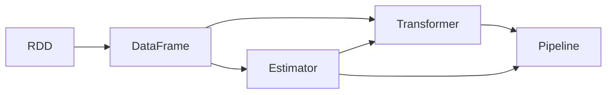

## 1. 背景介绍

在大数据时代，数据分析和机器学习成为了推动商业智能和科学研究的关键技术。Apache Spark，作为一个强大的开源集群计算框架，因其高效的分布式计算能力而广受欢迎。Spark的一个重要组件是MLlib，它是一个构建在Spark之上的机器学习库，提供了一系列高效的算法实现，以及易于使用的API，使得在大规模数据集上进行机器学习变得更加容易和快捷。

## 2. 核心概念与联系

在深入探讨MLlib之前，我们需要理解一些核心概念及其相互之间的联系：

- **RDD（弹性分布式数据集）**：Spark的基本数据结构，能够高效地进行分布式计算。
- **DataFrame**：以RDD为基础，提供了更高级的数据抽象，支持Spark SQL。
- **Transformer**：转换器，能够将一个DataFrame转换为另一个DataFrame。
- **Estimator**：估计器，通过fit方法对DataFrame进行训练，产生一个Transformer。
- **Pipeline**：管道，将多个步骤（如数据预处理、特征提取、模型训练）串联起来，简化机器学习工作流程。



## 3. 核心算法原理具体操作步骤

MLlib提供了多种机器学习算法，包括分类、回归、聚类、协同过滤等。以线性回归为例，其操作步骤如下：

1. 数据准备：加载数据，转换为DataFrame。
2. 数据预处理：特征工程，如标准化、归一化。
3. 初始化Estimator：创建线性回归估计器对象。
4. 训练模型：调用fit方法，传入训练数据。
5. 模型评估：使用测试数据评估模型性能。

## 4. 数学模型和公式详细讲解举例说明

以线性回归为例，其数学模型可以表示为：

$$
y = \beta_0 + \beta_1 x_1 + \beta_2 x_2 + ... + \beta_n x_n + \epsilon
$$

其中，$y$ 是响应变量，$x_1, x_2, ..., x_n$ 是解释变量，$\beta_0, \beta_1, ..., \beta_n$ 是模型参数，$\epsilon$ 是误差项。

在Spark MLlib中，线性回归的参数估计通常使用最小二乘法：

$$
\hat{\beta} = (X^TX)^{-1}X^Ty
$$

其中，$X$ 是设计矩阵，$y$ 是响应向量。

## 5. 项目实践：代码实例和详细解释说明

以下是一个使用Spark MLlib进行线性回归的简单示例：

```scala
import org.apache.spark.ml.regression.LinearRegression
import org.apache.spark.sql.SparkSession

val spark = SparkSession.builder.appName("LinearRegressionExample").getOrCreate()
val data = spark.read.format("libsvm").load("data/mllib/sample_linear_regression_data.txt")

val lr = new LinearRegression().setMaxIter(10).setRegParam(0.3).setElasticNetParam(0.8)
val lrModel = lr.fit(data)

println(s"Coefficients: ${lrModel.coefficients} Intercept: ${lrModel.intercept}")
spark.stop()
```

在这个示例中，我们首先创建了一个SparkSession对象，然后加载了数据，接着初始化了一个线性回归估计器，并设置了迭代次数、正则化参数和弹性网络参数。最后，我们调用fit方法训练模型，并打印出模型的系数和截距。

## 6. 实际应用场景

MLlib在多个领域都有广泛的应用，例如：

- 金融领域：信用评分、风险管理。
- 电商：推荐系统、客户细分。
- 医疗：疾病预测、药物发现。
- 能源：需求预测、设备维护。

## 7. 工具和资源推荐

为了更好地使用Spark MLlib，以下是一些有用的工具和资源：

- **Apache Zeppelin**：一个基于Web的笔记本，支持交互式数据分析。
- **Databricks**：一个基于Spark的商业平台，提供了更多的工具和服务。
- **MLlib官方文档**：提供了详细的API文档和用户指南。

## 8. 总结：未来发展趋势与挑战

随着机器学习技术的不断进步，MLlib也在不断地发展。未来的趋势可能包括更多的算法集成、性能优化、以及更好的云服务支持。同时，挑战也存在，如处理更大规模的数据、提高算法的准确性和可解释性。

## 9. 附录：常见问题与解答

Q1: MLlib支持哪些机器学习算法？
A1: MLlib支持多种算法，包括分类、回归、聚类、协同过滤等。

Q2: 如何在Spark中进行模型的持久化？
A2: 可以使用MLlib的save和load方法将模型保存到文件系统，并在需要时加载。

Q3: MLlib和其他机器学习库相比有何优势？
A3: MLlib的优势在于其分布式计算能力，能够在大规模数据集上高效地运行机器学习算法。

作者：禅与计算机程序设计艺术 / Zen and the Art of Computer Programming