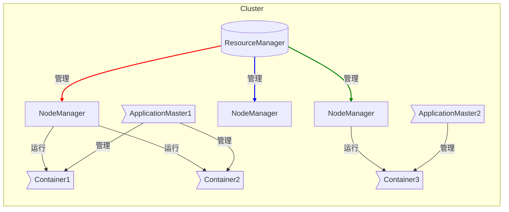
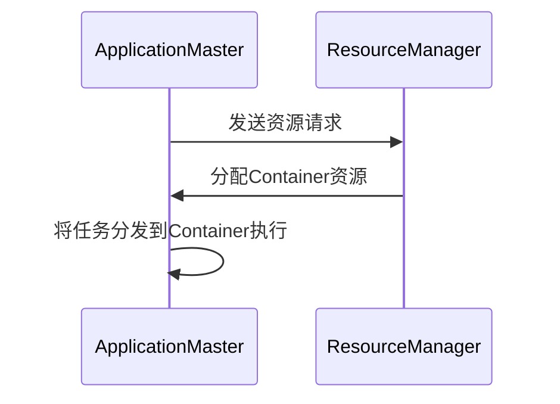
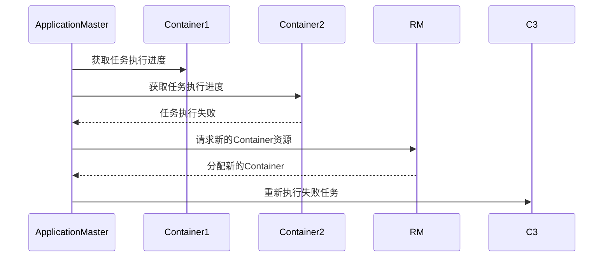
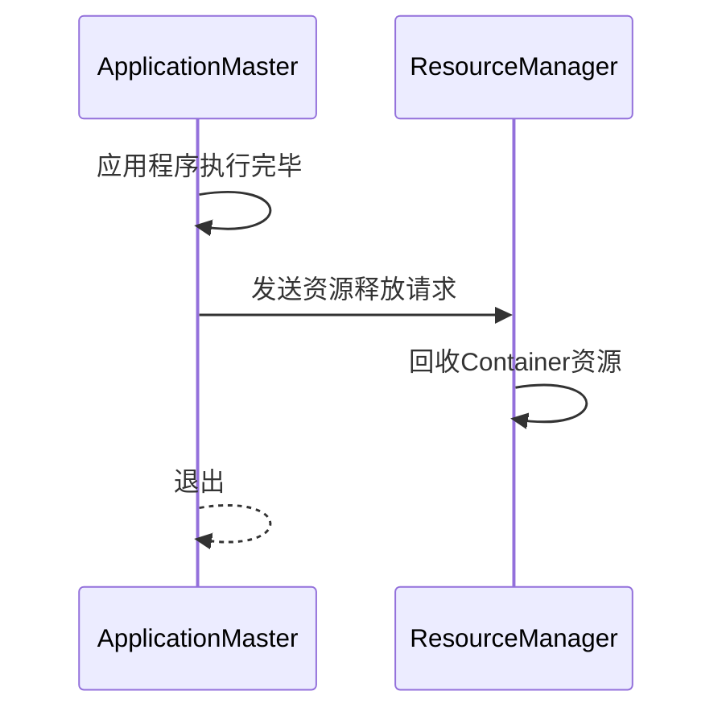

# ApplicationMaster 原理与代码实例讲解

## 1.背景介绍

在大数据时代,Apache Hadoop作为一个分布式系统基础架构,已经广泛应用于企业级数据处理领域。Hadoop集群由许多计算机(节点)组成,能够并行处理大量数据。YARN(Yet Another Resource Negotiator)作为Hadoop的资源管理和任务调度核心,负责集群资源管理和作业调度。

ApplicationMaster(AM)是YARN中的一个关键组件,负责管理和监控特定应用程序的执行过程。每个应用程序在YARN上运行时,都会启动一个专用的ApplicationMaster进程。ApplicationMaster扮演着应用管理器的角色,协调应用程序的资源需求,并与YARN资源管理器(ResourceManager)协商获取资源。

## 2.核心概念与联系

### 2.1 YARN架构

YARN的核心架构由ResourceManager、ApplicationMaster、NodeManager和Container等组件组成,它们协同工作以实现资源管理和任务调度。



- **ResourceManager**：整个YARN集群的资源管理和调度核心,负责处理来自各个ApplicationMaster的资源请求,并为之分配Container。
- **NodeManager**：运行在每个节点上的资源和容器管理器,负责管理节点上的资源使用情况,并监控运行在该节点上的Container。
- **ApplicationMaster**：应用程序的"大脑",负责与ResourceManager协商获取资源,并启动和监控特定应用程序的任务执行。
- **Container**：YARN中的资源抽象,表示一个可以在节点上运行的容器,封装了一定数量的资源(CPU、内存等)。

### 2.2 ApplicationMaster作用

ApplicationMaster在YARN中扮演着至关重要的角色:

1. **资源协商**:ApplicationMaster会根据应用程序的需求向ResourceManager请求资源,并获取Container用于运行任务。
2. **任务管理**:ApplicationMaster负责将应用程序的任务分发到分配的Container中执行,并监控任务的执行状态。
3. **容错处理**:当某个任务失败时,ApplicationMaster可以重新启动或重新分配任务,提高应用程序的容错能力。
4. **资源释放**:应用程序执行完毕后,ApplicationMaster会释放占用的资源,以供其他应用程序使用。

## 3.核心算法原理具体操作步骤

ApplicationMaster的核心算法原理涉及以下几个方面:

### 3.1 资源请求

ApplicationMaster通过与ResourceManager进行资源协商来获取Container。具体步骤如下:

1. ApplicationMaster向ResourceManager发送资源请求,包括所需CPU、内存等资源量。
2. ResourceManager根据集群的资源使用情况,为ApplicationMaster分配合适的Container资源。
3. ApplicationMaster获取到Container后,将任务分发到这些Container中执行。



### 3.2 任务监控与容错

ApplicationMaster需要持续监控分发到各个Container中的任务执行状态,并进行容错处理:

1. ApplicationMaster周期性地从各个Container获取任务执行进度。
2. 如果发现某个任务执行失败,ApplicationMaster会重新为该任务请求资源并重新执行。
3. 如果某个Container发生故障,ApplicationMaster会释放该Container的资源,并为相关任务重新请求资源。



### 3.3 资源释放

应用程序执行完毕后,ApplicationMaster需要释放占用的资源:

1. ApplicationMaster向ResourceManager发送资源释放请求。
2. ResourceManager回收ApplicationMaster占用的Container资源。
3. ApplicationMaster进程退出,应用程序执行完成。



## 4.数学模型和公式详细讲解举例说明

在ApplicationMaster的资源请求过程中,需要根据应用程序的需求合理地估计所需资源量。常用的资源估计模型包括:

### 4.1 基于历史数据的资源估计

基于应用程序的历史执行情况,估计当前所需的资源量。设应用程序需要执行 $n$ 个任务,第 $i$ 个任务的资源需求为 $r_i$,则应用程序的总资源需求 $R$ 可以表示为:

$$R = \sum_{i=1}^{n}r_i$$

其中, $r_i$ 可以根据历史执行时间、资源使用情况等数据进行估计。

### 4.2 基于任务类型的资源估计

不同类型的任务通常具有不同的资源需求。设应用程序包含 $m$ 种不同类型的任务,第 $j$ 种任务的数量为 $n_j$,每个该类型任务的资源需求为 $r_j$,则应用程序的总资源需求 $R$ 可以表示为:

$$R = \sum_{j=1}^{m}n_j \cdot r_j$$

其中, $r_j$ 可以根据任务类型的特点进行估计。

### 4.3 基于数据量的资源估计

对于数据处理类应用程序,资源需求通常与输入数据量相关。设应用程序的输入数据量为 $D$,每单位数据的资源需求为 $c$,则应用程序的总资源需求 $R$ 可以表示为:

$$R = D \cdot c$$

其中, $c$ 可以根据应用程序的算法复杂度、数据特征等因素进行估计。

以上模型仅为示例,在实际应用中,可以根据具体场景和需求,结合多种因素构建更加精确的资源估计模型。

## 5.项目实践:代码实例和详细解释说明

下面是一个简单的ApplicationMaster示例代码,用于说明其基本工作原理:

```java
import org.apache.hadoop.yarn.api.records.*;
import org.apache.hadoop.yarn.client.api.AMRMClient;
import org.apache.hadoop.yarn.client.api.async.AMRMClientAsync;

public class MyApplicationMaster {
    private AMRMClientAsync<AMRMClient.ContainerRequest> rmClient;
    private List<Container> containers = new ArrayList<>();

    public static void main(String[] args) {
        MyApplicationMaster appMaster = new MyApplicationMaster();
        appMaster.run();
    }

    private void run() {
        // 1. 初始化资源管理器客户端
        rmClient = AMRMClientAsync.createAMRMClientAsync(1000, false);
        rmClient.init(new MyAMRMClientAsync());
        rmClient.start();

        // 2. 请求资源
        requestResources();

        // 3. 监控任务执行
        monitorTasks();

        // 4. 释放资源并退出
        releaseResources();
    }

    private void requestResources() {
        // 向ResourceManager请求资源
        Resource capability = Resource.newInstance(1024, 1);
        for (int i = 0; i < 5; i++) {
            AMRMClient.ContainerRequest containerAsk = new AMRMClient.ContainerRequest(
                capability, null, null, RM_REQUEST_PRIORITY);
            rmClient.addContainerRequest(containerAsk);
        }
    }

    private void monitorTasks() {
        // 监控分发到Container中的任务执行状态
        // ...
    }

    private void releaseResources() {
        // 应用程序执行完毕后,释放占用的资源
        rmClient.unregisterApplicationMaster(FinalApplicationStatus.SUCCEEDED, "", "");
    }

    private class MyAMRMClientAsync extends AMRMClientAsync.AbstractCallbackHandler {
        @Override
        public void onContainersCompleted(List<ContainerStatus> statuses) {
            // 处理Container完成的任务
        }

        @Override
        public void onContainersAllocated(List<Container> containers) {
            // 获取分配的Container资源
            for (Container container : containers) {
                launchTask(container);
            }
        }

        private void launchTask(Container container) {
            // 在Container中启动任务
            // ...
        }
    }
}
```

上述示例代码主要包括以下几个部分:

1. **初始化资源管理器客户端**:创建AMRMClientAsync实例,用于与ResourceManager进行通信。

2. **请求资源**:向ResourceManager发送资源请求,包括所需CPU、内存等资源量。

3. **监控任务执行**:周期性地获取分发到各个Container中的任务执行状态,并进行容错处理。

4. **释放资源**:应用程序执行完毕后,通过调用`unregisterApplicationMaster`方法释放占用的资源。

5. **处理回调事件**:实现`AMRMClientAsync.AbstractCallbackHandler`接口,处理ResourceManager分配的Container资源以及任务执行完成的事件。

该示例代码仅展示了ApplicationMaster的基本工作流程,在实际应用中还需要考虑更多的细节和边界情况,如任务重试策略、资源过度使用处理等。

## 6.实际应用场景

ApplicationMaster在Hadoop生态系统中广泛应用于各种大数据处理场景,例如:

### 6.1 MapReduce作业

在MapReduce作业中,ApplicationMaster负责协调Map和Reduce任务的执行,根据输入数据量动态请求资源,并监控任务进度。

### 6.2 Spark作业

在Spark on YARN模式下,Spark Driver进程扮演ApplicationMaster的角色,负责向YARN请求Executor资源,并将Spark作业分发到这些Executor中执行。

### 6.3 Flink作业

Flink on YARN模式下,Flink JobManager进程作为ApplicationMaster,负责向YARN请求TaskManager资源,并将Flink作业分发到TaskManager中执行。

### 6.4 Hive on Tez

在Hive on Tez模式下,Tez ApplicationMaster负责协调Hive查询的执行,根据查询计划动态请求资源,并监控任务进度。

### 6.5 自定义应用程序

除了上述常见的大数据应用程序,开发者也可以基于YARN框架开发自定义的分布式应用程序,并实现自己的ApplicationMaster来管理应用程序的执行。

## 7.工具和资源推荐

在开发和调试ApplicationMaster相关应用程序时,以下工具和资源可能会有所帮助:

### 7.1 YARN Web UI

YARN提供了Web UI界面,可以方便地查看集群资源使用情况、应用程序执行状态等信息,对于调试ApplicationMaster非常有帮助。

### 7.2 YARN日志

YARN的各个组件都会生成日志文件,其中包含了ApplicationMaster的运行日志,可以通过分析日志信息来排查问题。

### 7.3 Apache Hadoop官方文档

Apache Hadoop官方文档提供了YARN架构、ApplicationMaster开发指南等详细信息,是学习和开发ApplicationMaster应用程序的重要参考资源。

### 7.4 开源社区和论坛

像Apache Hadoop用户邮件列表、Stack Overflow等开源社区和论坛,是获取最新信息、解决问题的好去处。

### 7.5 第三方工具

一些第三方工具如Apache Slider、Apache Twill等,提供了简化ApplicationMaster开发和部署的功能,可以考虑使用。

## 8.总结:未来发展趋势与挑战

ApplicationMaster作为YARN核心组件,在大数据处理领域扮演着重要角色。随着大数据技术的不断发展,ApplicationMaster也面临一些新的挑战和发展趋势:

### 8.1 资源隔离和安全性

随着多租户场景的增多,ApplicationMaster需要提供更好