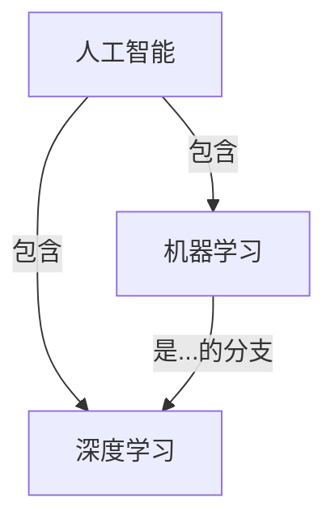

# Artificial Intelligence 原理与代码实战案例讲解

## 1.背景介绍

人工智能(Artificial Intelligence, AI)是当代科技发展的前沿领域,其影响力已经渗透到我们生活的方方面面。从语音助手到自动驾驶汽车,从医疗诊断到金融投资,AI技术都发挥着越来越重要的作用。然而,AI并非一蹴而就的成果,它是源于多个学科的交叉融合,包括计算机科学、数学、统计学、认知科学等。本文将探讨AI的核心原理和实践案例,帮助读者深入了解这一颠覆性技术。

## 2.核心概念与联系

### 2.1 人工智能定义

人工智能是一门致力于研究和开发能够模拟人类智能行为的理论、方法、技术及应用系统的学科。简单来说,AI旨在赋予机器"智能",使其能够感知环境、学习知识、推理判断、规划行动,并完成特定任务。

### 2.2 机器学习

机器学习(Machine Learning, ML)是AI的核心支柱,它赋予了系统从数据中自动学习和改进的能力。机器学习算法可以从大量数据中发现隐藏的模式和规律,并基于这些规律对新数据进行预测或决策。常见的机器学习算法包括监督学习、无监督学习、强化学习等。

### 2.3 深度学习

深度学习(Deep Learning)是机器学习的一个分支,它通过构建深层神经网络模型来模拟人脑的工作原理。深度学习在计算机视觉、自然语言处理等领域取得了突破性进展,推动了AI技术的飞速发展。

### 2.4 核心概念关系

人工智能是一个宏观的概念,机器学习和深度学习是其核心技术手段。机器学习为AI提供了从数据中学习和改进的能力,而深度学习则是机器学习的一种强大技术,能够有效处理高维复杂数据。三者相辅相成,共同推动着AI技术的发展和应用。



## 3.核心算法原理具体操作步骤

### 3.1 监督学习

监督学习是机器学习中最常见的一种范式,它的目标是从已标注的训练数据中学习一个模型,然后应用于新的未标注数据进行预测或决策。监督学习算法包括分类和回归两大类。

1. **分类算法**
   - 原理:基于训练数据中的特征和标签,构建一个分类模型,对新数据进行分类预测。
   - 算法:逻辑回归、决策树、支持向量机、朴素贝叶斯等。
   - 步骤:
     1) 收集并预处理训练数据
     2) 选择合适的算法和模型
     3) 训练模型
     4) 评估模型性能
     5) 应用模型进行预测

2. **回归算法**
   - 原理:基于训练数据中的特征和连续目标值,构建一个回归模型,对新数据进行数值预测。
   - 算法:线性回归、多项式回归、决策树回归等。
   - 步骤:
     1) 收集并预处理训练数据
     2) 选择合适的算法和模型
     3) 训练模型
     4) 评估模型性能
     5) 应用模型进行预测

### 3.2 无监督学习

无监督学习旨在从未标注的数据中发现隐藏的模式和结构,常用于聚类和降维等任务。

1. **聚类算法**
   - 原理:将相似的数据点划分到同一个簇,使得簇内数据相似度高,簇间相似度低。
   - 算法:K-Means、层次聚类、DBSCAN等。
   - 步骤:
     1) 收集并预处理数据
     2) 选择合适的算法和参数
     3) 执行聚类算法
     4) 评估聚类结果

2. **降维算法**
   - 原理:将高维数据映射到低维空间,同时保留数据的主要特征和结构。
   - 算法:主成分分析(PCA)、t-SNE等。
   - 步骤:
     1) 收集并预处理数据
     2) 选择合适的算法和参数
     3) 执行降维算法
     4) 可视化和分析低维数据

### 3.3 强化学习

强化学习是一种基于环境交互的学习范式,Agent通过试错和累积经验,学习采取最优策略以maximiz获得的奖励。

1. **强化学习原理**
   - Agent与环境交互,观测当前状态,执行行动,获得奖励或惩罚,转移到新状态。
   - 目标是学习一个策略,使得在给定状态下采取的行动能够maximiz累积奖励。

2. **算法和步骤**
   - 算法:Q-Learning、Sarsa、策略梯度等。
   - 步骤:
     1) 定义环境、状态空间、行动空间和奖励函数
     2) 初始化Agent和策略
     3) 与环境交互,收集经验
     4) 根据经验更新策略
     5) 评估策略性能,重复3)和4)直到收敛

强化学习在游戏AI、机器人控制、资源调度等领域有广泛应用。

## 4.数学模型和公式详细讲解举例说明

### 4.1 线性回归

线性回归是一种常用的监督学习算法,用于预测连续目标值。其数学模型如下:

$$y = \theta_0 + \theta_1x_1 + \theta_2x_2 + ... + \theta_nx_n$$

其中:
- $y$是预测目标值
- $x_1, x_2, ..., x_n$是特征值
- $\theta_0, \theta_1, ..., \theta_n$是模型参数

通过最小化损失函数(如均方误差)来学习模型参数:

$$J(\theta) = \frac{1}{2m}\sum_{i=1}^m(h_\theta(x^{(i)}) - y^{(i)})^2$$

其中:
- $m$是训练样本数量
- $h_\theta(x^{(i)})$是对第$i$个样本的预测值
- $y^{(i)}$是第$i$个样本的真实目标值

可以使用梯度下降等优化算法来minimiz损失函数,从而获得最优参数。

### 4.2 逻辑回归

逻辑回归是一种常用的分类算法,用于预测二分类问题。其数学模型如下:

$$h_\theta(x) = g(\theta^Tx) = \frac{1}{1 + e^{-\theta^Tx}}$$

其中:
- $h_\theta(x)$是预测为正例的概率
- $g(z)$是Sigmoid函数,将线性函数的输出映射到(0,1)范围
- $\theta$是模型参数向量

引入对数损失函数(Log Loss):

$$J(\theta) = -\frac{1}{m}\sum_{i=1}^m[y^{(i)}\log(h_\theta(x^{(i)})) + (1 - y^{(i)})\log(1 - h_\theta(x^{(i)}))]$$

同样可以使用梯度下降等优化算法来minimiz损失函数,获得最优参数。

逻辑回归虽然名字中有"回归"一词,但实际上是一种分类算法。

### 4.3 支持向量机

支持向量机(Support Vector Machine, SVM)是一种强大的监督学习算法,可用于分类和回归任务。以线性可分的二分类问题为例,SVM试图找到一个超平面,将两类样本分开,且两类样本到超平面的距离maximiz。

对于线性可分的二分类问题,超平面方程为:

$$w^Tx + b = 0$$

其中:
- $w$是超平面的法向量
- $b$是偏移量

SVM的目标是maximiz两类样本到超平面的最小距离(即间隔maximiz):

$$\begin{align*}
& \underset{w,b}{\text{maximize}}
& & \gamma \\
& \text{subject to}
& & y^{(i)}(w^Tx^{(i)} + b) \geq \gamma, \quad i=1,...,m
\end{align*}$$

这是一个二次规划问题,可以通过拉格朗日乘数法求解。对于非线性问题,可以引入核技巧将数据映射到高维空间,从而使用线性SVM求解。

SVM在小样本情况下表现优异,是一种常用的分类和回归算法。

### 4.4 K-Means聚类

K-Means是一种常用的无监督学习聚类算法,其目标是将$n$个样本划分到$K$个簇中,使得簇内样本相似度高,簇间相似度低。

算法步骤:

1. 随机初始化$K$个聚类中心
2. 对每个样本,计算它与各个聚类中心的距离,将其分配到最近的那一个簇
3. 对每个簇,重新计算聚类中心(所有簇内样本的均值向量)
4. 重复步骤2和3,直至聚类中心不再发生变化

K-Means的目标是minimiz以下目标函数:

$$J(c^{(1)},...,c^{(K)}) = \sum_{i=1}^{K}\sum_{x\in C_i}||x - c^{(i)}||^2$$

其中:
- $c^{(i)}$是第$i$个簇的聚类中心
- $C_i$是第$i$个簇中的所有样本
- $||x - c^{(i)}||^2$是样本$x$到聚类中心$c^{(i)}$的欧几里得距离平方

K-Means算法简单高效,但需要预先指定簇数$K$,并且对异常值敏感。

## 5.项目实践:代码实例和详细解释说明

以下是一个使用Python和scikit-learn库实现线性回归的示例:

```python
from sklearn.linear_model import LinearRegression
import numpy as np

# 生成样本数据
X = np.array([[1, 1], [1, 2], [2, 2], [2, 3]])
y = np.dot(X, np.array([1, 2])) + 3

# 创建线性回归模型
reg = LinearRegression()

# 训练模型
reg.fit(X, y)

# 预测新数据
print(reg.predict([[3, 5]]))
```

代码解释:

1. 导入线性回归模型和NumPy库
2. 生成样本数据`X`和目标值`y`
3. 创建线性回归模型实例`reg`
4. 使用`fit()`方法训练模型,输入样本数据`X`和目标值`y`
5. 使用`predict()`方法对新数据`[3, 5]`进行预测

线性回归是一种简单而有效的算法,广泛应用于回归任务。scikit-learn库提供了高效且易用的API,大大简化了算法的实现和使用。

以下是一个使用PyTorch实现多层感知机(MLP)的示例:

```python
import torch
import torch.nn as nn

# 定义MLP模型
class MLP(nn.Module):
    def __init__(self, input_size, hidden_size, output_size):
        super(MLP, self).__init__()
        self.fc1 = nn.Linear(input_size, hidden_size)
        self.relu = nn.ReLU()
        self.fc2 = nn.Linear(hidden_size, output_size)

    def forward(self, x):
        out = self.fc1(x)
        out = self.relu(out)
        out = self.fc2(out)
        return out

# 创建模型实例
model = MLP(input_size=10, hidden_size=20, output_size=5)

# 定义损失函数和优化器
criterion = nn.CrossEntropyLoss()
optimizer = torch.optim.SGD(model.parameters(), lr=0.01)

# 训练循环
for epoch in range(100):
    # 前向传播
    outputs = model(inputs)
    loss = criterion(outputs, labels)
    
    # 反向传播和优化
    optimizer.zero_grad()
    loss.backward()
    optimizer.step()
    
    # 打印损失
    if (epoch+1) % 10 == 0:
        print(f'Epoch [{epoch+1}/100], Loss: {loss.item():.4f}')
```

代码解释:

1. 导入PyTorch和nn模块
2. 定义MLP模型类,包含一个隐藏层和ReLU激活函数
3. 创建MLP模型实例
4. 定义交叉熵损失函数和SGD优化器
5. 训练循环:
   - 前向传播计算输出
   - 计算损失
   - 反向传播计算梯度
   - 优化器更新模型参数
   