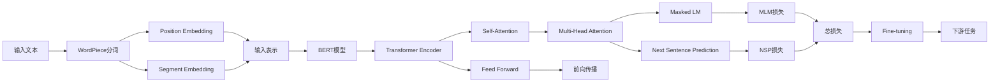

# BERT原理与代码实战案例讲解

## 1. 背景介绍
### 1.1 自然语言处理的发展历程
### 1.2 BERT的诞生背景
### 1.3 BERT的重要意义

## 2. 核心概念与联系
### 2.1 Transformer架构
#### 2.1.1 Transformer的提出
#### 2.1.2 Transformer的基本结构
#### 2.1.3 Self-Attention机制
### 2.2 预训练语言模型
#### 2.2.1 语言模型概述
#### 2.2.2 预训练的优势
#### 2.2.3 BERT的预训练任务
### 2.3 迁移学习
#### 2.3.1 迁移学习的定义
#### 2.3.2 BERT在下游任务中的应用
#### 2.3.3 Fine-tuning技术

## 3. 核心算法原理具体操作步骤
### 3.1 BERT的输入表示
#### 3.1.1 WordPiece分词
#### 3.1.2 Position Embedding
#### 3.1.3 Segment Embedding
### 3.2 BERT的预训练任务
#### 3.2.1 Masked Language Model (MLM)
#### 3.2.2 Next Sentence Prediction (NSP)
### 3.3 BERT的Fine-tuning过程
#### 3.3.1 下游任务的输入表示
#### 3.3.2 Fine-tuning的损失函数
#### 3.3.3 Fine-tuning的优化策略

## 4. 数学模型和公式详细讲解举例说明
### 4.1 Self-Attention的数学表示
#### 4.1.1 Query, Key, Value的计算
#### 4.1.2 Scaled Dot-Product Attention
#### 4.1.3 Multi-Head Attention
### 4.2 Transformer的前向传播过程
#### 4.2.1 Encoder的计算过程
#### 4.2.2 Decoder的计算过程
### 4.3 BERT的损失函数
#### 4.3.1 MLM的损失函数
#### 4.3.2 NSP的损失函数

## 5. 项目实践：代码实例和详细解释说明 
### 5.1 使用BERT进行文本分类
#### 5.1.1 数据准备与预处理
#### 5.1.2 模型构建与训练
#### 5.1.3 模型评估与预测
### 5.2 使用BERT进行命名实体识别
#### 5.2.1 数据准备与预处理
#### 5.2.2 模型构建与训练
#### 5.2.3 模型评估与预测
### 5.3 使用BERT进行问答系统
#### 5.3.1 数据准备与预处理
#### 5.3.2 模型构建与训练
#### 5.3.3 模型评估与预测

## 6. 实际应用场景
### 6.1 智能客服
### 6.2 情感分析
### 6.3 文本摘要
### 6.4 机器翻译
### 6.5 知识图谱构建

## 7. 工具和资源推荐
### 7.1 BERT的开源实现
#### 7.1.1 Google BERT
#### 7.1.2 Hugging Face Transformers
#### 7.1.3 PyTorch-Transformers
### 7.2 预训练模型的资源
#### 7.2.1 BERT-Base与BERT-Large
#### 7.2.2 多语言BERT
#### 7.2.3 RoBERTa与ALBERT
### 7.3 数据集资源
#### 7.3.1 GLUE基准测试
#### 7.3.2 SQuAD问答数据集
#### 7.3.3 CoNLL命名实体识别数据集

## 8. 总结：未来发展趋势与挑战
### 8.1 BERT的局限性
### 8.2 预训练模型的发展方向
### 8.3 知识增强的语言模型
### 8.4 模型压缩与加速技术
### 8.5 跨模态语言理解

## 9. 附录：常见问题与解答
### 9.1 如何选择合适的BERT模型？
### 9.2 BERT的训练需要多少计算资源？
### 9.3 如何处理BERT的过拟合问题？
### 9.4 BERT在实际应用中的部署方式？
### 9.5 BERT与传统机器学习方法的比较？

BERT（Bidirectional Encoder Representations from Transformers）是近年来自然语言处理领域最具革命性的突破之一。自从2018年由Google AI团队提出以来，BERT凭借其强大的语言理解能力和出色的下游任务表现，迅速成为NLP研究和应用的热点。

BERT的核心在于其独特的预训练方式和Transformer架构。与传统的语言模型不同，BERT采用了双向的训练策略，通过Masked Language Model和Next Sentence Prediction两个任务，让模型能够同时利用上下文信息，从而获得更加全面和准确的语义表示。

在Transformer架构中，Self-Attention机制发挥了关键作用。它允许模型在编码每个单词时，都能够关注输入序列中的其他位置，捕捉单词之间的依赖关系和交互信息。多头注意力机制进一步增强了模型的表达能力，使其能够从不同的子空间中学习到丰富的语义特征。

BERT在预训练阶段学习到的语言知识，可以通过Fine-tuning的方式迁移到下游任务中。这种迁移学习的范式极大地简化了NLP任务的训练流程，降低了对大规模标注数据的依赖，同时显著提升了模型的性能表现。

在数学原理方面，BERT涉及了大量的矩阵运算和概率计算。Self-Attention的计算过程可以用Query, Key, Value三个矩阵的乘积来表示，并通过Scaled Dot-Product Attention和Multi-Head Attention的方式进行归一化和线性变换。Transformer的前向传播过程则涉及了Encoder和Decoder两个部分，分别完成输入序列的编码和输出序列的生成。

在实践应用中，BERT已经被广泛用于文本分类、命名实体识别、问答系统等任务。通过在预训练模型的基础上Fine-tuning，可以快速构建出高质量的NLP应用。以文本分类为例，我们可以将BERT的输出接入一个全连接层，并使用交叉熵损失函数进行训练，即可获得一个性能优异的分类器。

除了学术研究外，BERT也在工业界得到了大规模应用。谷歌、微软、华为等科技巨头纷纷推出了基于BERT的智能对话系统、搜索引擎、语音助手等产品。开源社区也涌现出了大量优秀的BERT实现，如Hugging Face的Transformers库和PyTorch-Transformers等。

展望未来，尽管BERT已经取得了巨大成功，但它仍然存在一些局限性，如模型参数量大、推理速度慢、难以处理长文本等。为了进一步提升语言模型的性能和效率，研究人员提出了一系列改进方案，如知识增强、模型压缩、跨模态建模等。这些新的探索方向有望推动NLP技术的持续发展，使机器能够更加智能地理解和处理人类语言。

总之，BERT为NLP领域带来了革命性的变革，它的出现标志着语言理解技术进入了一个新的时代。作为NLP研究者和从业者，深入理解BERT的原理和应用，对于我们掌握前沿技术、解决实际问题至关重要。让我们一起探索这个充满魅力和挑战的领域，用人工智能的力量去理解和改变世界。

作者：禅与计算机程序设计艺术 / Zen and the Art of Computer Programming