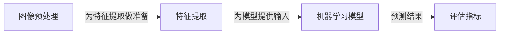
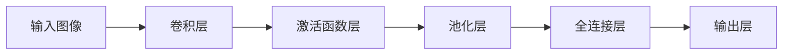
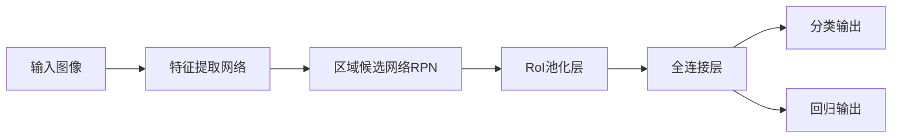

# Computer Vision Techniques 原理与代码实战案例讲解

## 1.背景介绍

计算机视觉(Computer Vision)是人工智能领域的一个重要分支,旨在使计算机能够像人类一样理解和解释数字图像或视频中所包含的信息。随着深度学习技术的快速发展,计算机视觉已经取得了令人瞩目的进步,广泛应用于各个领域,如自动驾驶、医疗影像分析、人脸识别、机器人视觉等。

计算机视觉技术的核心任务包括图像分类、目标检测、语义分割、实例分割、3D重建等。这些任务的实现需要综合运用多种算法和技术,包括图像预处理、特征提取、机器学习模型等。近年来,受益于大数据和强大的并行计算能力,基于深度学习的计算机视觉模型取得了突破性进展,在许多任务上超越了人类水平。

## 2.核心概念与联系

计算机视觉涉及多个核心概念,它们相互关联、相辅相成,构成了完整的计算机视觉技术体系。以下是一些关键概念及其联系:

### 2.1 图像预处理

图像预处理是计算机视觉的基础步骤,旨在提高图像质量、消除噪声、标准化数据等,为后续处理做好准备。常见的预处理操作包括去噪、锐化、几何变换、颜色空间转换等。

### 2.2 特征提取

特征提取是从原始图像数据中提取出对任务有意义的特征表示,是计算机视觉的核心环节。传统方法包括手工设计的特征提取算子,如SIFT、HOG等。而深度学习则能自动从数据中学习到更加强大的特征表示。

### 2.3 机器学习模型

机器学习模型是计算机视觉任务的核心部分,根据输入的特征进行预测和决策。常见的模型包括支持向量机、随机森林、神经网络等。近年来,基于卷积神经网络(CNN)的深度学习模型在多个视觉任务上取得了领先的性能表现。

### 2.4 评估指标

评估指标用于衡量模型在特定任务上的表现,如分类任务的准确率、检测任务的平均精度(mAP)、分割任务的交并比(IoU)等。选择合适的评估指标对于模型优化和算法比较至关重要。

上述核心概念相互关联、环环相扣,构成了完整的计算机视觉技术体系。图像预处理为特征提取做好准备,特征提取为机器学习模型提供输入,模型根据特征进行预测,最终使用评估指标衡量模型性能。



## 3.核心算法原理具体操作步骤

### 3.1 卷积神经网络

卷积神经网络(CNN)是计算机视觉领域最成功的深度学习模型之一,其核心思想是通过卷积、池化等操作自动从图像数据中学习特征表示。CNN一般由多个卷积层、池化层、全连接层组成,层与层之间通过权重参数连接。

CNN的具体操作步骤如下:

1. **输入层**: 接收原始图像数据,通常需要进行预处理,如归一化、标准化等。

2. **卷积层**: 通过滑动卷积核在输入特征图上进行卷积操作,提取局部特征。卷积层的参数包括卷积核的权重和偏置。
   $$
   y_{i,j} = \sum_{m}\sum_{n}w_{m,n}x_{i+m,j+n} + b
   $$
   其中 $y_{i,j}$ 为输出特征图的元素, $x_{i,j}$ 为输入特征图的元素, $w_{m,n}$ 为卷积核的权重, $b$ 为偏置项。

3. **激活函数层**: 对卷积层的输出应用非线性激活函数,如ReLU、Sigmoid等,增加模型的表达能力。

4. **池化层**: 通过对输入的特征图进行下采样操作,如最大池化、平均池化等,实现了平移不变性和降低计算复杂度。

5. **全连接层**: 将前面卷积层和池化层的输出特征图展平,并与全连接层的权重相乘,得到最终的分类或回归输出。

6. **输出层**: 根据任务的不同,输出层可以是分类概率(Softmax)或回归值。

在训练过程中,CNN通过反向传播算法和优化器(如SGD、Adam等)不断调整卷积核权重和偏置,使模型在训练数据上的损失函数最小化。训练完成后,CNN可以对新的输入图像进行预测。



### 3.2 目标检测算法

目标检测是计算机视觉的一个核心任务,旨在定位图像中感兴趣的目标并对其进行分类。常见的目标检测算法包括基于候选区域的方法(如Faster R-CNN)和基于密集预测的方法(如YOLO、SSD)。

以Faster R-CNN为例,其具体操作步骤如下:

1. **特征提取网络**: 使用预训练的CNN(如VGG、ResNet等)作为特征提取器,从输入图像中提取特征图。

2. **区域候选网络(RPN)**: 在特征图上滑动窗口,生成一系列矩形候选框,并对每个候选框进行二分类(前景或背景)和边界框回归。

3. **区域of Interest(RoI)池化层**: 从特征图中提取出对应于候选框的区域特征,并对其进行归一化处理。

4. **全连接层**: 将归一化后的区域特征输入到全连接层,进行目标分类和边界框精细化。

5. **分类和回归输出**: 输出每个候选框的类别概率和精细化后的边界框坐标。

在训练过程中,Faster R-CNN同时优化RPN和全连接层的损失函数,包括分类损失、回归损失和proposal损失。通过反向传播和梯度下降,不断调整网络参数,使模型在训练数据上的损失最小化。



## 4.数学模型和公式详细讲解举例说明

### 4.1 卷积运算

卷积运算是CNN中最核心的操作之一,它通过在输入特征图上滑动卷积核,提取局部特征并生成输出特征图。卷积运算的数学表达式如下:

$$
y_{i,j} = \sum_{m}\sum_{n}w_{m,n}x_{i+m,j+n} + b
$$

其中:
- $y_{i,j}$ 为输出特征图的元素
- $x_{i,j}$ 为输入特征图的元素
- $w_{m,n}$ 为卷积核的权重
- $b$ 为偏置项

举例说明:

假设输入特征图大小为 $5 \times 5$,卷积核大小为 $3 \times 3$,步长为1,无填充。则输出特征图的大小为 $3 \times 3$。

输入特征图:
$$
\begin{bmatrix}
1 & 2 & 3 & 4 & 5\\
6 & 7 & 8 & 9 & 10\\
11 & 12 & 13 & 14 & 15\\
16 & 17 & 18 & 19 & 20\\
21 & 22 & 23 & 24 & 25
\end{bmatrix}
$$

卷积核权重:
$$
\begin{bmatrix}
1 & 1 & 1\\
1 & 1 & 1\\
1 & 1 & 1
\end{bmatrix}
$$

偏置 $b = 0$

计算输出特征图第一个元素:
$$
\begin{aligned}
y_{1,1} &= 1 \times 1 + 1 \times 2 + 1 \times 3 + 1 \times 6 + 1 \times 7 + 1 \times 8 + 1 \times 11 + 1 \times 12 + 1 \times 13 + 0\\
&= 54
\end{aligned}
$$

依此类推,可以得到完整的输出特征图:
$$
\begin{bmatrix}
54 & 72 & 90\\
126 & 144 & 162\\
198 & 216 & 234
\end{bmatrix}
$$

通过调整卷积核的权重和偏置,CNN可以学习到不同的特征检测器,从而提取出对任务有意义的特征表示。

### 4.2 非线性激活函数

非线性激活函数在神经网络中扮演着至关重要的角色,它引入了非线性,使得神经网络能够拟合复杂的函数。常见的激活函数包括Sigmoid、Tanh、ReLU等。

**ReLU(Rectified Linear Unit)激活函数**

ReLU是目前最常用的激活函数之一,它的数学表达式为:

$$
f(x) = \max(0, x)
$$

即对输入值进行截断,小于0的值置为0,大于等于0的值保持不变。

ReLU的优点包括:
- 计算简单高效
- 避免了梯度消失问题
- 提供了稀疏表示,有利于模型的泛化能力

但ReLU也存在一些缺点,如死亡神经元问题(当输入为负值时,神经元永远不会被激活)。因此,也出现了一些改进的ReLU变体,如Leaky ReLU、PReLU等。

**Sigmoid激活函数**

Sigmoid激活函数的数学表达式为:

$$
f(x) = \frac{1}{1 + e^{-x}}
$$

它将输入值映射到 $(0, 1)$ 区间,常用于二分类问题的输出层。

Sigmoid函数的优点是输出值在 $(0, 1)$ 区间内,便于概率解释。但它也存在梯度消失问题,当输入值较大或较小时,梯度接近于0,会导致权重更新缓慢。

**Tanh激活函数**

Tanh(双曲正切)激活函数的数学表达式为:

$$
f(x) = \frac{e^x - e^{-x}}{e^x + e^{-x}}
$$

它将输入值映射到 $(-1, 1)$ 区间,是一种零均值的激活函数。

Tanh函数的优点是输出值中心对称于0,梯度较大,收敛速度较快。但它同样存在梯度消失问题,当输入值较大或较小时,梯度接近于0。

通过合理选择激活函数,可以赋予神经网络更强的非线性表达能力,从而更好地拟合复杂的数据分布。

## 5.项目实践:代码实例和详细解释说明

在本节中,我们将通过一个实际的计算机视觉项目,演示如何使用Python和深度学习框架(如PyTorch或TensorFlow)实现图像分类任务。

### 5.1 数据准备

我们将使用CIFAR-10数据集进行图像分类任务。CIFAR-10是一个常用的计算机视觉基准数据集,包含10个类别的32x32彩色图像,每个类别有6000张图像,总共60000张图像。

```python
import torchvision.datasets as datasets
import torchvision.transforms as transforms

# 定义数据预处理方式
transform = transforms.Compose([
    transforms.ToTensor(),
    transforms.Normalize((0.5, 0.5, 0.5), (0.5, 0.5, 0.5))
])

# 加载CIFAR-10数据集
train_dataset = datasets.CIFAR10(root='./data', train=True, download=True, transform=transform)
test_dataset = datasets.CIFAR10(root='./data', train=False, download=True, transform=transform)
```

### 5.2 构建CNN模型

接下来,我们将定义一个简单的CNN模型,用于图像分类任务。

```python
import torch.nn as nn

class CNN(nn.Module):
    def __init__(self):
        super(CNN, self).__init__()
        self.conv1 = nn.Conv2d(3, 32, kernel_size=3, padding=1)
        self.pool = nn.MaxPool2d(2, 2)