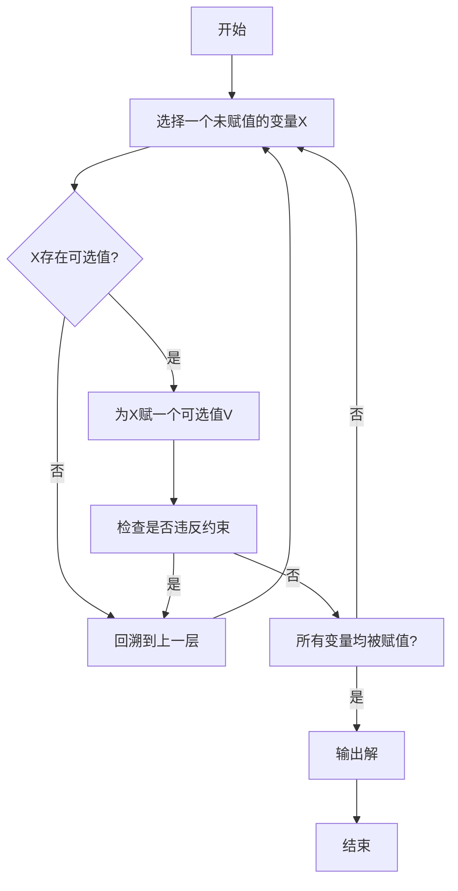
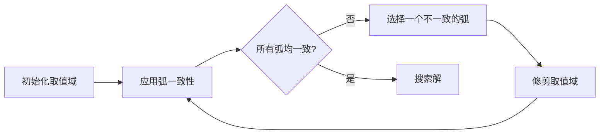

# ConstraintSatisfactionProblems算法原理与代码实现

## 1.背景介绍

约束满足问题(Constraint Satisfaction Problems, CSP)是人工智能和运筹学领域中一个重要的研究课题。它广泛应用于规划、排序、资源分配、机器人运动规划、电路布线、时间表安排等众多领域。CSP的目标是在给定一组约束条件的情况下,寻找一组可行的解决方案,使得所有约束条件均得到满足。

CSP问题可以形式化地描述为:给定一组变量及其对应的有限取值域,以及定义在变量之间的一组约束条件。求解CSP问题就是寻找一种为每个变量指定一个值的方式,使得所有约束条件均被满足。如果存在这样一种指派,那么该问题就是可满足的;否则就是不可满足的。

## 2.核心概念与联系

### 2.1 CSP形式化定义

一个CSP问题可以用一个三元组来形式化定义:

$$
CSP = (X, D, C)
$$

其中:

- $X$ 是问题的变量集合,即 $X = \{x_1, x_2, ..., x_n\}$
- $D$ 是每个变量的取值域的集合,即 $D = \{D_1, D_2, ..., D_n\}$,其中 $D_i$ 是变量 $x_i$ 的取值域
- $C$ 是定义在变量之间的约束条件的集合

### 2.2 约束条件

约束条件是CSP问题中的核心部分,它规定了变量之间的关系。约束条件可以分为不等式约束、等式约束和逻辑约束等多种形式。

常见的约束条件包括:

- 不等式约束:例如 $x_1 + x_2 \leq 10$
- 等式约束:例如 $x_1 = x_2 + 3$
- 逻辑约束:例如 $x_1 \vee x_2$,表示 $x_1$ 和 $x_2$ 至少有一个为真
- 全局约束:涉及多个变量的复杂约束,如alldifferent约束要求所有变量取值不同

### 2.3 CSP的复杂性

CSP问题属于NP完全问题,即在最坏情况下,求解一个CSP问题需要检查所有可能的解,其时间复杂度为指数级别。因此,对于大规模CSP问题,通常采用启发式搜索算法或者约束传播技术来获得满意的解。

## 3.核心算法原理具体操作步骤  

解决CSP问题的常用算法主要有:

1. 回溯搜索算法(Backtracking)
2. 冲突驱动的回溯搜索算法
3. 约束传播算法

### 3.1 回溯搜索算法

回溯搜索算法是最直观和最基本的CSP求解算法,其基本思想是:

1) 为第一个变量指定一个可能的值
2) 基于这个值,为下一个变量指定一个可能的值,如果无法指定则回溯到上一步
3) 重复上述过程,直到所有变量都被指定值或者搜索空间被耗尽



回溯搜索算法的优点是思路简单直观,但缺点是效率低下,尤其在解空间较大时表现不佳。

### 3.2 冲突驱动的回溯搜索算法

为了提高回溯搜索的效率,可以采用冲突驱动机制。其基本思想是:在发生冲突(即违反约束)时,通过分析冲突的原因,从而剪枝并引导搜索朝有解的方向前进。

冲突驱动机制的关键步骤包括:

1. 冲突检测:检测是否存在违反约束的情况
2. 冲突诊断:分析冲突的原因
3. 无关值剪枝:剪掉那些必然导致冲突的值
4. 有关值推理:推导出必须赋予某些值才能避免冲突

通过上述步骤,可以大幅减小搜索空间,提高算法效率。

### 3.3 约束传播算法

约束传播算法的核心思想是:在搜索的同时,利用已有的约束条件对变量的取值域进行逐步缩减,从而剪枝并缩小搜索空间。

常见的约束传播算法包括:

- 节点一致性(Node Consistency)
- 弧一致性(Arc Consistency) 
- 路径一致性(Path Consistency)
- K一致性(K-Consistency)

其中,弧一致性是最常用的一种,它要求对于每一个变量,其取值域中的每一个值都必须有至少一个与之相邻的变量的值与之相容。



约束传播算法可以在搜索之前过滤掉大量无解的情况,从而极大地减小搜索空间,但其缺点是在密集约束问题上可能效率较低。

## 4.数学模型和公式详细讲解举例说明

### 4.1 CSP的数学模型

CSP问题可以用一个三元组 $(X, D, C)$ 来形式化描述,其中:

- $X = \{x_1, x_2, ..., x_n\}$ 是问题的变量集合
- $D = \{D_1, D_2, ..., D_n\}$ 是每个变量的取值域的集合,其中 $D_i$ 是变量 $x_i$ 的取值域
- $C = \{c_1, c_2, ..., c_m\}$ 是定义在变量之间的约束条件的集合

求解CSP问题就是寻找一个赋值函数 $f: X \rightarrow \bigcup_{i=1}^n D_i$,使得对于所有的约束条件 $c_j \in C$,都有 $c_j(f(x_1), f(x_2), ..., f(x_n)) = true$。

### 4.2 约束条件的数学表示

约束条件是CSP问题中的核心部分,它规定了变量之间的关系。常见的约束条件包括:

1. 不等式约束

不等式约束可以用不等式来表示,例如:

$$
x_1 + x_2 \leq 10
$$

2. 等式约束

等式约束可以用等式来表示,例如:

$$
x_1 = x_2 + 3
$$

3. 逻辑约束

逻辑约束可以用逻辑表达式来表示,例如:

$$
x_1 \vee x_2
$$

表示 $x_1$ 和 $x_2$ 至少有一个为真。

4. 全局约束

全局约束涉及多个变量的复杂关系,例如alldifferent约束要求所有变量取值不同,可以用集合表示:

$$
\{x_1, x_2, ..., x_n\} = D_1 \cup D_2 \cup ... \cup D_n
$$

### 4.3 CSP求解的数学建模

对于一个特定的CSP问题,我们可以用数学模型来描述它的求解过程。假设我们要求解的CSP问题为 $(X, D, C)$,其中 $X = \{x_1, x_2, ..., x_n\}$, $D = \{D_1, D_2, ..., D_n\}$, $C = \{c_1, c_2, ..., c_m\}$。

我们可以引入一个决策变量 $y_{ij}$,表示变量 $x_i$ 是否取值 $d_j \in D_i$,即:

$$
y_{ij} = \begin{cases}
1, & \text{if } x_i = d_j\\
0, & \text{otherwise}
\end{cases}
$$

那么求解CSP问题就等价于求解如下数学规划问题:

$$
\begin{aligned}
& \text{find } \boldsymbol{y} = (y_{11}, y_{12}, ..., y_{1|D_1|}, y_{21}, ..., y_{n|D_n|})\\
& \text{s.t. } \sum_{j=1}^{|D_i|} y_{ij} = 1, \quad \forall i = 1, 2, ..., n\\
& \qquad c_k(\boldsymbol{y}) = \text{true}, \quad \forall k = 1, 2, ..., m
\end{aligned}
$$

其中第一个约束条件保证每个变量只取一个值,第二个约束条件保证所有的约束条件均被满足。

通过上述数学建模,我们可以将CSP问题转化为一个数学规划问题,从而可以应用各种数学优化算法来求解。

### 4.4 示例:N皇后问题

N皇后问题是一个经典的CSP问题,它的目标是在 $N \times N$ 的国际象棋棋盘上放置 $N$ 个皇后,使得任何两个皇后都不在同一行、同一列或同一条对角线上。

对于 $N = 4$ 的情况,我们可以构造如下CSP模型:

- 变量集合 $X = \{x_1, x_2, x_3, x_4\}$,表示4个皇后的位置
- 取值域 $D_1 = D_2 = D_3 = D_4 = \{1, 2, 3, 4\}$,表示每个皇后可以放在第几行
- 约束条件集合 $C$ 包括:
  - 不等式约束:$x_i \neq x_j, \forall i \neq j$,表示任意两个皇后不能在同一行
  - 不等式约束:$|x_i - x_j| \neq |i - j|, \forall i \neq j$,表示任意两个皇后不能在同一条对角线上

求解该CSP问题就可以得到一个满足所有约束条件的解,即4个皇后的合理放置方案。

## 5.项目实践:代码实例和详细解释说明

这里我们给出一个使用Python实现的CSP求解器的代码示例,它采用了回溯搜索算法和约束传播(AC-3算法)相结合的方式。

### 5.1 CSP类定义

```python
class CSP:
    def __init__(self, variables, domains, constraints):
        self.variables = variables
        self.domains = domains
        self.constraints = constraints
        self.curr_domains = None
        self.assignments = None

    def add_constraint(self, constraint):
        self.constraints.append(constraint)

    def get_all_arcs(self):
        arcs = []
        for constraint in self.constraints:
            for var1 in constraint.variables:
                for var2 in constraint.variables:
                    if var1 != var2:
                        arcs.append((var1, var2))
        return arcs
```

`CSP`类用于表示一个CSP问题实例,它包含了变量集合、取值域和约束条件集合。`get_all_arcs()`方法用于获取所有变量对之间的弧(arc)集合,这对于后续的约束传播很有用。

### 5.2 AC-3算法实现

```python
def revise(csp, var1, var2, constraint):
    revised = False
    for x in csp.curr_domains[var1]:
        if not any([constraint.is_satisfied(x, y) for y in csp.curr_domains[var2]]):
            csp.curr_domains[var1].remove(x)
            revised = True
    return revised

def AC3(csp):
    arcs = csp.get_all_arcs()
    while arcs:
        var1, var2 = arcs.pop(0)
        constraint = None
        for c in csp.constraints:
            if var1 in c.variables and var2 in c.variables:
                constraint = c
                break
        if constraint and revise(csp, var1, var2, constraint):
            if len(csp.curr_domains[var1]) == 0:
                return False
            arcs = arcs + [(var2, var3) for var3 in csp.variables
                            if var3 != var1 and (var2, var3) not in arcs]
    return True
```

`AC3`算法是一种常见的约束传播算法,它通过不断修剪变量的取值域来保持弧一致性(Arc Consistency)。`revise()`函数用于修剪两个变量之间的取值域,如果有修改则返回True。`AC3()`函数则是完整的AC-3算法实现,它不断选择一条弧