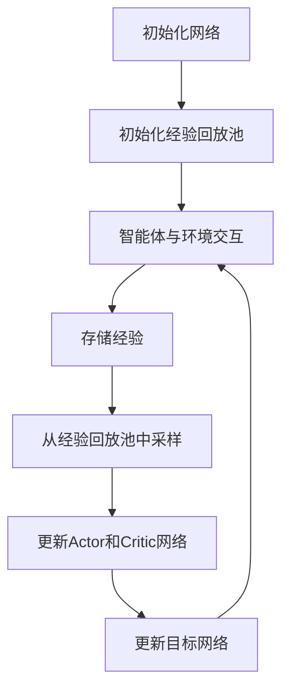

# DDPG原理与代码实例讲解

## 1.背景介绍

深度确定性策略梯度（Deep Deterministic Policy Gradient，简称DDPG）是一种用于解决连续动作空间问题的强化学习算法。它结合了深度学习和强化学习的优势，能够在高维度的状态和动作空间中进行有效的学习。DDPG算法由Google DeepMind团队提出，并在多种复杂任务中展示了其强大的性能。

在传统的强化学习算法中，Q-learning和策略梯度方法是两种主要的技术路线。Q-learning适用于离散动作空间，而策略梯度方法则可以处理连续动作空间。DDPG算法通过结合这两种方法的优点，使用深度神经网络来逼近策略和Q值函数，从而实现了在连续动作空间中的高效学习。

## 2.核心概念与联系

### 2.1 强化学习基本概念

在深入了解DDPG之前，我们需要先回顾一些强化学习的基本概念：

- **状态（State, s）**：环境在某一时刻的具体情况。
- **动作（Action, a）**：智能体在某一状态下可以采取的行为。
- **奖励（Reward, r）**：智能体在某一状态下采取某一动作后得到的反馈。
- **策略（Policy, π）**：智能体在每一状态下选择动作的规则。
- **值函数（Value Function, V）**：在某一状态下，智能体未来能够获得的期望奖励。
- **Q值函数（Q-Function, Q）**：在某一状态下采取某一动作后，智能体未来能够获得的期望奖励。

### 2.2 DDPG的核心概念

DDPG算法结合了深度Q网络（DQN）和策略梯度方法的优点，主要包括以下几个核心概念：

- **Actor-Critic架构**：DDPG使用了Actor-Critic架构，其中Actor负责选择动作，Critic负责评估动作的价值。
- **目标网络（Target Network）**：为了稳定训练过程，DDPG引入了目标网络，用于计算目标Q值。
- **经验回放（Experience Replay）**：DDPG使用经验回放技术，通过从存储的经验中随机抽取样本进行训练，打破数据相关性，提高训练效率。

## 3.核心算法原理具体操作步骤

DDPG算法的核心操作步骤如下：

1. **初始化网络**：初始化Actor网络和Critic网络，以及对应的目标网络。
2. **经验回放池**：初始化一个经验回放池，用于存储智能体的经验。
3. **交互环境**：智能体与环境进行交互，收集状态、动作、奖励和下一个状态。
4. **存储经验**：将收集到的经验存储到经验回放池中。
5. **采样训练**：从经验回放池中随机采样一批经验，使用这些经验更新Actor和Critic网络。
6. **更新目标网络**：定期更新目标网络的参数，使其逐渐逼近当前网络的参数。

以下是DDPG算法的Mermaid流程图：



## 4.数学模型和公式详细讲解举例说明

### 4.1 策略网络和Q值网络

在DDPG中，策略网络（Actor）和Q值网络（Critic）分别表示为 $\mu(s|\theta^\mu)$ 和 $Q(s, a|\theta^Q)$，其中 $\theta^\mu$ 和 $\theta^Q$ 是网络的参数。

### 4.2 策略更新

策略网络的目标是最大化Q值函数的期望值，更新公式为：

$$
\nabla_{\theta^\mu} J \approx \mathbb{E}_{s \sim \mathcal{D}} \left[ \nabla_a Q(s, a|\theta^Q) |_{a=\mu(s|\theta^\mu)} \nabla_{\theta^\mu} \mu(s|\theta^\mu) \right]
$$

### 4.3 Q值更新

Q值网络的目标是最小化Bellman误差，更新公式为：

$$
L(\theta^Q) = \mathbb{E}_{(s, a, r, s') \sim \mathcal{D}} \left[ \left( Q(s, a|\theta^Q) - y \right)^2 \right]
$$

其中，$y$ 是目标Q值，计算公式为：

$$
y = r + \gamma Q'(s', \mu'(s'|\theta^{\mu'})|\theta^{Q'})
$$

### 4.4 目标网络更新

目标网络的参数更新采用软更新策略，更新公式为：

$$
\theta^{Q'} \leftarrow \tau \theta^Q + (1 - \tau) \theta^{Q'}
$$

$$
\theta^{\mu'} \leftarrow \tau \theta^\mu + (1 - \tau) \theta^{\mu'}
$$

## 5.项目实践：代码实例和详细解释说明

### 5.1 环境设置

首先，我们需要设置环境和导入必要的库：

```python
import gym
import numpy as np
import torch
import torch.nn as nn
import torch.optim as optim
from collections import deque
import random
```

### 5.2 定义网络结构

接下来，我们定义Actor和Critic网络：

```python
class Actor(nn.Module):
    def __init__(self, state_dim, action_dim, max_action):
        super(Actor, self).__init__()
        self.l1 = nn.Linear(state_dim, 400)
        self.l2 = nn.Linear(400, 300)
        self.l3 = nn.Linear(300, action_dim)
        self.max_action = max_action

    def forward(self, x):
        x = torch.relu(self.l1(x))
        x = torch.relu(self.l2(x))
        x = torch.tanh(self.l3(x))
        return x * self.max_action

class Critic(nn.Module):
    def __init__(self, state_dim, action_dim):
        super(Critic, self).__init__()
        self.l1 = nn.Linear(state_dim + action_dim, 400)
        self.l2 = nn.Linear(400, 300)
        self.l3 = nn.Linear(300, 1)

    def forward(self, x, u):
        x = torch.relu(self.l1(torch.cat([x, u], 1)))
        x = torch.relu(self.l2(x))
        x = self.l3(x)
        return x
```

### 5.3 定义DDPG算法

然后，我们定义DDPG算法的主要部分：

```python
class DDPG:
    def __init__(self, state_dim, action_dim, max_action):
        self.actor = Actor(state_dim, action_dim, max_action).to(device)
        self.actor_target = Actor(state_dim, action_dim, max_action).to(device)
        self.actor_target.load_state_dict(self.actor.state_dict())
        self.actor_optimizer = optim.Adam(self.actor.parameters(), lr=1e-4)

        self.critic = Critic(state_dim, action_dim).to(device)
        self.critic_target = Critic(state_dim, action_dim).to(device)
        self.critic_target.load_state_dict(self.critic.state_dict())
        self.critic_optimizer = optim.Adam(self.critic.parameters(), lr=1e-3)

        self.replay_buffer = deque(maxlen=1000000)
        self.max_action = max_action
        self.batch_size = 64
        self.discount = 0.99
        self.tau = 0.005

    def select_action(self, state):
        state = torch.FloatTensor(state.reshape(1, -1)).to(device)
        return self.actor(state).cpu().data.numpy().flatten()

    def train(self):
        if len(self.replay_buffer) < self.batch_size:
            return

        batch = random.sample(self.replay_buffer, self.batch_size)
        state, action, reward, next_state, done = zip(*batch)

        state = torch.FloatTensor(np.array(state)).to(device)
        action = torch.FloatTensor(np.array(action)).to(device)
        reward = torch.FloatTensor(np.array(reward)).to(device)
        next_state = torch.FloatTensor(np.array(next_state)).to(device)
        done = torch.FloatTensor(np.array(done)).to(device)

        target_Q = self.critic_target(next_state, self.actor_target(next_state))
        target_Q = reward + ((1 - done) * self.discount * target_Q).detach()

        current_Q = self.critic(state, action)

        critic_loss = nn.MSELoss()(current_Q, target_Q)
        self.critic_optimizer.zero_grad()
        critic_loss.backward()
        self.critic_optimizer.step()

        actor_loss = -self.critic(state, self.actor(state)).mean()
        self.actor_optimizer.zero_grad()
        actor_loss.backward()
        self.actor_optimizer.step()

        for param, target_param in zip(self.critic.parameters(), self.critic_target.parameters()):
            target_param.data.copy_(self.tau * param.data + (1 - self.tau) * target_param.data)

        for param, target_param in zip(self.actor.parameters(), self.actor_target.parameters()):
            target_param.data.copy_(self.tau * param.data + (1 - self.tau) * target_param.data)

    def store_transition(self, state, action, reward, next_state, done):
        self.replay_buffer.append((state, action, reward, next_state, done))
```

### 5.4 训练过程

最后，我们定义训练过程：

```python
env = gym.make("Pendulum-v0")
state_dim = env.observation_space.shape[0]
action_dim = env.action_space.shape[0]
max_action = float(env.action_space.high[0])

ddpg = DDPG(state_dim, action_dim, max_action)

episodes = 1000
for episode in range(episodes):
    state = env.reset()
    episode_reward = 0
    for t in range(200):
        action = ddpg.select_action(state)
        next_state, reward, done, _ = env.step(action)
        ddpg.store_transition(state, action, reward, next_state, done)
        ddpg.train()
        state = next_state
        episode_reward += reward
        if done:
            break
    print(f"Episode: {episode}, Reward: {episode_reward}")
```

## 6.实际应用场景

DDPG算法在许多实际应用场景中表现出色，以下是一些典型的应用场景：

### 6.1 机器人控制

DDPG算法可以用于机器人控制任务，例如机械臂的运动控制和无人机的飞行控制。通过学习最优策略，机器人可以在复杂环境中执行精确的操作。

### 6.2 自动驾驶

在自动驾驶领域，DDPG算法可以用于车辆的路径规划和决策控制。通过与环境的交互，自动驾驶系统可以学习如何在不同的交通状况下做出最佳决策。

### 6.3 游戏AI

DDPG算法也可以用于游戏AI的开发，例如在复杂的策略游戏中，AI可以通过学习最优策略来击败人类玩家。

## 7.工具和资源推荐

### 7.1 开源库

- **OpenAI Gym**：一个用于开发和比较强化学习算法的工具包，提供了多种环境。
- **PyTorch**：一个流行的深度学习框架，支持动态计算图，适合强化学习算法的开发。
- **TensorFlow**：另一个流行的深度学习框架，提供了丰富的工具和资源。

### 7.2 书籍和教程

- **《深度强化学习》**：一本详细介绍深度强化学习算法的书籍，适合初学者和进阶读者。
- **《强化学习：原理与实践》**：一本系统介绍强化学习理论和实践的书籍，包含丰富的案例和代码示例。

### 7.3 在线课程

- **Coursera上的强化学习课程**：由知名大学和机构提供的在线课程，涵盖强化学习的基础理论和前沿技术。
- **Udacity的深度强化学习纳米学位**：一个全面的深度强化学习课程，包含多个项目和实践机会。

## 8.总结：未来发展趋势与挑战

DDPG算法在解决连续动作空间问题方面表现出色，但仍然存在一些挑战和未来发展方向：

### 8.1 稳定性和收敛性

尽管DDPG算法引入了目标网络和经验回放技术，但在训练过程中仍然可能出现不稳定和不收敛的情况。未来的研究可以进一步改进算法的稳定性和收敛性。

### 8.2 高维度问题

在高维度状态和动作空间中，DDPG算法的训练效率可能会下降。未来的研究可以探索更高效的网络结构和训练方法，以应对高维度问题。

### 8.3 多智能体系统

在多智能体系统中，每个智能体的决策会影响其他智能体的行为。未来的研究可以探索如何在多智能体系统中应用和改进DDPG算法。

## 9.附录：常见问题与解答

### 9.1 DDPG算法适用于哪些类型的问题？

DDPG算法适用于连续动作空间的问题，例如机器人控制、自动驾驶和游戏AI等。

### 9.2 如何选择DDPG算法的超参数？

DDPG算法的超参数包括学习率、折扣因子、目标网络更新系数等。可以通过实验和调参工具（如网格搜索和贝叶斯优化）来选择合适的超参数。

### 9.3 如何处理DDPG算法中的过拟合问题？

可以通过增加经验回放池的大小、使用正则化技术和数据增强方法来减轻过拟合问题。

### 9.4 DDPG算法与其他强化学习算法相比有哪些优势？

DDPG算法结合了深度Q网络和策略梯度方法的优点，能够在连续动作空间中进行高效学习。与传统的Q-learning算法相比，DDPG算法可以处理更复杂的任务。

### 9.5 如何在实际项目中应用DDPG算法？

在实际项目中应用DDPG算法时，可以先选择合适的环境和任务，然后根据具体需求调整算法的网络结构和超参数，最后进行训练和评估。

---

作者：禅与计算机程序设计艺术 / Zen and the Art of Computer Programming