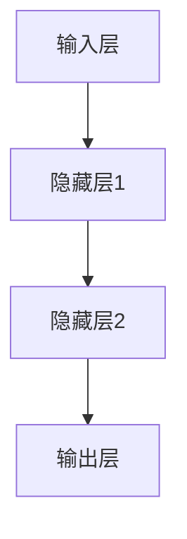

# Deep Learning (DL) 原理与代码实战案例讲解

## 1. 背景介绍

### 1.1 深度学习的发展历程
#### 1.1.1 人工智能的起源与发展
#### 1.1.2 机器学习的兴起
#### 1.1.3 深度学习的崛起

### 1.2 深度学习的应用领域
#### 1.2.1 计算机视觉
#### 1.2.2 自然语言处理
#### 1.2.3 语音识别
#### 1.2.4 其他应用领域

## 2. 核心概念与联系

### 2.1 人工神经网络
#### 2.1.1 生物神经元与人工神经元
#### 2.1.2 感知机
#### 2.1.3 多层感知机（MLP）

### 2.2 深度学习的核心概念
#### 2.2.1 深度神经网络
#### 2.2.2 前向传播与反向传播
#### 2.2.3 激活函数
#### 2.2.4 损失函数
#### 2.2.5 优化算法

### 2.3 深度学习模型架构
#### 2.3.1 卷积神经网络（CNN）
#### 2.3.2 循环神经网络（RNN）
#### 2.3.3 长短期记忆网络（LSTM）
#### 2.3.4 生成对抗网络（GAN）

## 3. 核心算法原理具体操作步骤

### 3.1 反向传播算法
#### 3.1.1 前向传播
#### 3.1.2 计算损失函数
#### 3.1.3 反向传播计算梯度
#### 3.1.4 更新模型参数

### 3.2 梯度下降优化算法
#### 3.2.1 批量梯度下降（BGD）
#### 3.2.2 随机梯度下降（SGD）
#### 3.2.3 小批量梯度下降（Mini-batch GD）
#### 3.2.4 动量优化（Momentum）
#### 3.2.5 自适应学习率优化（AdaGrad、RMSProp、Adam）

## 4. 数学模型和公式详细讲解举例说明

### 4.1 神经元模型
$$ y = f(\sum_{i=1}^{n} w_i x_i + b) $$

其中，$y$ 为神经元输出，$f$ 为激活函数，$w_i$ 为权重，$x_i$ 为输入，$b$ 为偏置。

### 4.2 损失函数
#### 4.2.1 均方误差损失（MSE）
$$ L(y, \hat{y}) = \frac{1}{n} \sum_{i=1}^{n} (y_i - \hat{y}_i)^2 $$

#### 4.2.2 交叉熵损失（Cross-entropy）
$$ L(y, \hat{y}) = -\sum_{i=1}^{n} y_i \log(\hat{y}_i) $$

### 4.3 优化算法
#### 4.3.1 梯度下降
$$ \theta := \theta - \alpha \nabla_{\theta} J(\theta) $$

其中，$\theta$ 为模型参数，$\alpha$ 为学习率，$\nabla_{\theta} J(\theta)$ 为损失函数对参数的梯度。

## 5. 项目实践：代码实例和详细解释说明

### 5.1 手写数字识别（MNIST）
#### 5.1.1 数据集介绍
#### 5.1.2 模型构建
#### 5.1.3 训练与评估
#### 5.1.4 代码实现与解释

### 5.2 情感分析（IMDB电影评论）
#### 5.2.1 数据集介绍
#### 5.2.2 文本预处理
#### 5.2.3 模型构建
#### 5.2.4 训练与评估
#### 5.2.5 代码实现与解释

## 6. 实际应用场景

### 6.1 医学影像分析
#### 6.1.1 肿瘤检测与分割
#### 6.1.2 疾病诊断与预测

### 6.2 自动驾驶
#### 6.2.1 目标检测与跟踪
#### 6.2.2 语义分割
#### 6.2.3 行为预测

### 6.3 推荐系统
#### 6.3.1 协同过滤
#### 6.3.2 深度学习推荐模型

## 7. 工具和资源推荐

### 7.1 深度学习框架
#### 7.1.1 TensorFlow
#### 7.1.2 PyTorch
#### 7.1.3 Keras

### 7.2 数据集资源
#### 7.2.1 ImageNet
#### 7.2.2 COCO
#### 7.2.3 Wikipedia

### 7.3 学习资源
#### 7.3.1 在线课程
#### 7.3.2 书籍推荐
#### 7.3.3 博客与社区

## 8. 总结：未来发展趋势与挑战

### 8.1 深度学习的发展趋势
#### 8.1.1 模型的轻量化与高效化
#### 8.1.2 无监督学习与自监督学习
#### 8.1.3 跨模态学习与多任务学习

### 8.2 深度学习面临的挑战
#### 8.2.1 可解释性与可信赖性
#### 8.2.2 数据隐私与安全
#### 8.2.3 模型的公平性与伦理

## 9. 附录：常见问题与解答

### 9.1 如何选择合适的深度学习框架？
### 9.2 如何处理过拟合问题？
### 9.3 如何加速模型训练？
### 9.4 如何进行超参数调优？
### 9.5 如何解释深度学习模型的决策过程？

作者：禅与计算机程序设计艺术 / Zen and the Art of Computer Programming