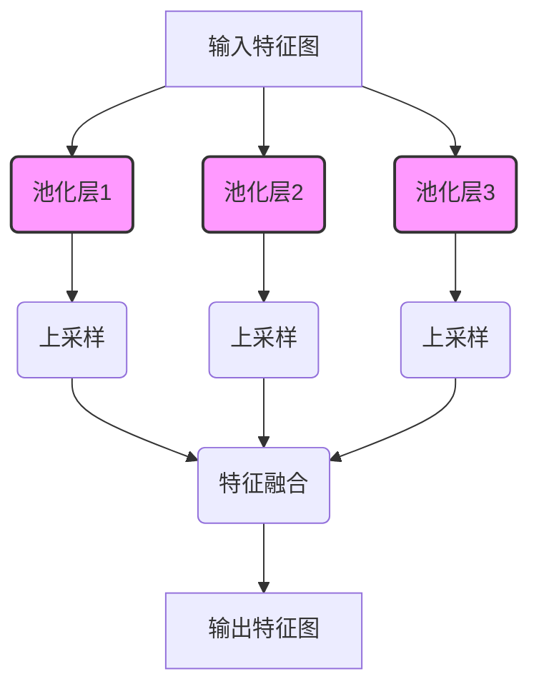
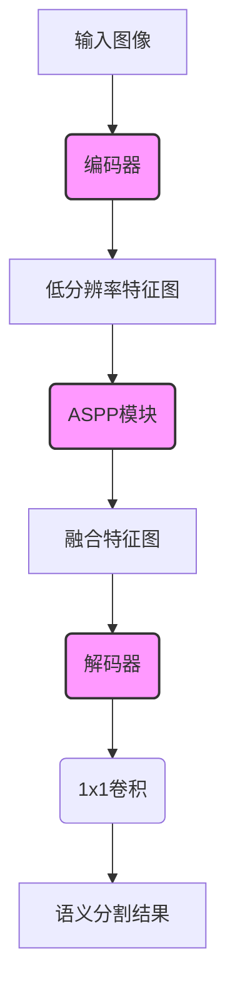
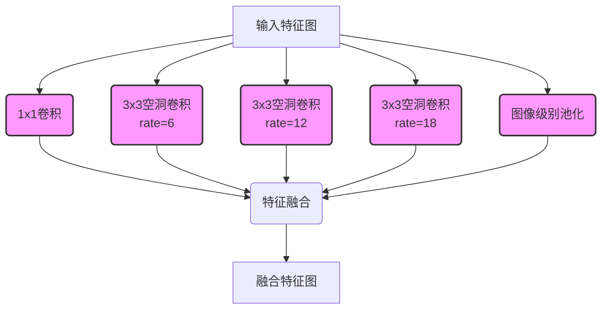
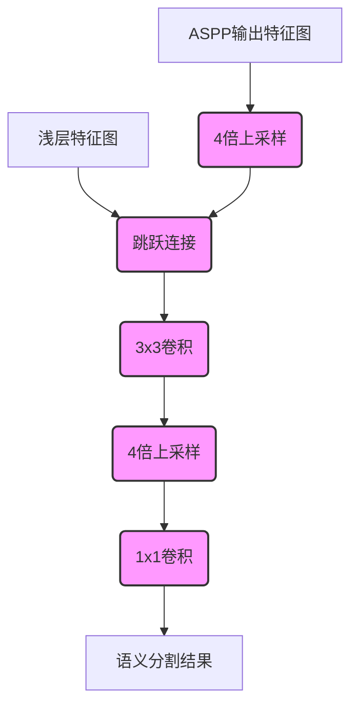

# DeepLab系列原理与代码实例讲解

## 1.背景介绍

### 1.1 语义分割的重要性

在计算机视觉领域,语义分割是一项基础且极具挑战性的任务。它旨在将图像中的每个像素精确地分配给对应的类别,例如人、车辆、树木等。语义分割广泛应用于无人驾驶、增强现实、医疗影像分析等领域,对于机器理解复杂场景至关重要。

### 1.2 DeepLab系列的发展历程

为了解决语义分割问题,谷歌于2014年提出了DeepLab系列模型。DeepLab最初基于VGG-16骨干网络,通过空洞卷积(atrous convolution)和空间金字塔池化(spatial pyramid pooling)提高了分割精度。随后,DeepLabv2引入了编码器-解码器结构,DeepLabv3则采用了级联和并行的方式组合不同的编码器。DeepLabv3+进一步加入了编码器的深度可分离卷积和解码器模块,取得了更优的性能。

## 2.核心概念与联系

### 2.1 空洞卷积(Atrous Convolution)

空洞卷积是DeepLab系列的核心创新之一。传统卷积在每个位置只关注相邻的小区域,而空洞卷积通过在卷积核中引入空洞率(atrous rate),可以扩大感受野,获取更广泛的上下文信息。这对于像素级别的精确分割至关重要。


### 2.2 空间金字塔池化(Spatial Pyramid Pooling)

空间金字塔池化是另一个关键创新,它通过在多个尺度上进行并行池化,捕获不同尺度的上下文信息,从而提高了对物体及其环境的表示能力。



### 2.3 编码器-解码器架构

从DeepLabv2开始,DeepLab系列采用了编码器-解码器架构。编码器用于提取语义特征,而解码器则将低分辨率的特征图逐步上采样至原始输入分辨率,以产生精细的分割结果。


## 3.核心算法原理具体操作步骤

### 3.1 DeepLabv3+算法流程

DeepLabv3+是DeepLab系列中表现最优秀的版本,我们将重点介绍其核心算法流程:

1. **编码器**: 采用带有深度可分离卷积的Xception模型作为编码器,提取丰富的语义特征。
2. **ASPP(Atrous Spatial Pyramid Pooling)**: 在不同尺度的并行空洞卷积后,将多尺度特征融合,增强对物体及环境的理解能力。
3. **解码器**: 通过上采样和跳跃连接,将低分辨率的ASPP特征图逐步放大至输入图像分辨率,并融合浅层特征,保留精细的细节信息。
4. **最后一步**: 对上一步输出的特征图施加1x1卷积,产生每个像素的类别预测,得到最终的语义分割结果。



### 3.2 ASPP模块详解

ASPP(Atrous Spatial Pyramid Pooling)模块是DeepLabv3+的核心部分,它通过并行应用多个采样率的空洞卷积,提取多尺度的特征表示。具体来说,ASPP包含以下几个并行分支:

1. **1x1卷积**: 用于捕获全局信息。
2. **3x3空洞卷积(rate=6)**: 用于捕获对象级别的特征。
3. **3x3空洞卷积(rate=12)**: 用于捕获一些小物体的特征。
4. **3x3空洞卷积(rate=18)**: 用于捕获更大物体的特征。
5. **图像级别的池化**: 通过全局平均池化捕获图像级别的上下文信息。

所有分支的特征图最后通过级联的方式进行融合,产生具有多尺度语义表示的特征图。



### 3.3 解码器模块

DeepLabv3+的解码器模块通过上采样和跳跃连接,将ASPP模块输出的低分辨率特征图逐步放大至输入图像分辨率。具体流程如下:

1. 对ASPP输出的特征图进行4倍双线性上采样。
2. 将上一步的特征图与浅层特征图(低级特征)进行跳跃连接,融合低级和高级特征。
3. 对融合后的特征图施加3x3卷积,进一步整合特征。
4. 再次进行4倍上采样,得到与输入图像相同分辨率的特征图。
5. 最后通过1x1卷积得到每个像素的类别预测,生成最终的语义分割结果。



## 4.数学模型和公式详细讲解举例说明

### 4.1 空洞卷积(Atrous Convolution)

空洞卷积是DeepLab系列的核心创新之一。它通过在卷积核中引入空洞率(atrous rate),可以扩大感受野,获取更广泛的上下文信息,对于像素级别的精确分割至关重要。

对于一个二维输入特征图 $X$,标准卷积的计算公式为:

$$
Y(i,j) = \sum_{k,l} X(i+k, j+l) \cdot K(k,l)
$$

其中 $K$ 为卷积核, $k$ 和 $l$ 分别表示卷积核的行和列索引。

而对于空洞卷积,我们引入了一个新的超参数空洞率 $r$,公式变为:

$$
Y(i,j) = \sum_{k,l} X(i+r \cdot k, j+r \cdot l) \cdot K(k,l)
$$

可以看出,当 $r=1$ 时,空洞卷积就等价于标准卷积。但当 $r>1$ 时,卷积核中的值会被"分散开",从而扩大了感受野。下图展示了不同空洞率下的卷积核示例:


通过在不同层使用不同的空洞率,我们可以有效地融合多尺度的上下文信息,提高分割精度。

### 4.2 ASPP模块损失函数

ASPP模块的输出特征图 $F$ 是通过级联方式融合了多个分支的特征:

$$
F = \bigoplus_{i=1}^{N} F_i
$$

其中 $\bigoplus$ 表示级联操作, $N$ 为分支数量, $F_i$ 为第 $i$ 个分支的输出特征图。

为了训练ASPP模块,我们需要定义损失函数。DeepLabv3+采用的是加权交叉熵损失函数,公式如下:

$$
\mathcal{L}(\theta) = -\frac{1}{|Y|} \sum_{i=1}^{|Y|} w_i \cdot y_i \log p_i
$$

其中 $\theta$ 为模型参数, $Y$ 为真实标签集合, $y_i$ 为第 $i$ 个像素的真实标签, $p_i$ 为模型预测的第 $i$ 个像素属于 $y_i$ 类的概率, $w_i$ 为第 $i$ 个像素的权重。引入权重 $w_i$ 是为了处理不平衡的类别分布问题。

通过最小化上述损失函数,我们可以训练ASPP模块,使其能够更准确地预测每个像素的语义类别。

## 5.项目实践:代码实例和详细解释说明

在这一部分,我们将提供一个使用PyTorch实现DeepLabv3+的代码示例,并对关键部分进行详细解释。完整代码可在GitHub上获取: [DeepLabv3+ PyTorch实现](https://github.com/your-repo/deeplabv3plus-pytorch)

### 5.1 ASPP模块实现

```python
import torch
import torch.nn as nn
import torch.nn.functional as F

class ASPPConv(nn.Sequential):
    def __init__(self, in_channels, out_channels, dilation):
        modules = [
            nn.Conv2d(in_channels, out_channels, 3, padding=dilation, dilation=dilation, bias=False),
            nn.BatchNorm2d(out_channels),
            nn.ReLU()
        ]
        super(ASPPConv, self).__init__(*modules)

class ASPPPooling(nn.Sequential):
    def __init__(self, in_channels, out_channels):
        super(ASPPPooling, self).__init__(
            nn.AdaptiveAvgPool2d(1),
            nn.Conv2d(in_channels, out_channels, 1, bias=False),
            nn.BatchNorm2d(out_channels),
            nn.ReLU())

    def forward(self, x):
        size = x.shape[-2:]
        for mod in self:
            x = mod(x)
        return F.interpolate(x, size=size, mode='bilinear', align_corners=False)

class ASPP(nn.Module):
    def __init__(self, in_channels, atrous_rates, out_channels=256):
        super(ASPP, self).__init__()
        modules = []
        modules.append(nn.Sequential(
            nn.Conv2d(in_channels, out_channels, 1, bias=False),
            nn.BatchNorm2d(out_channels),
            nn.ReLU()))

        rates = tuple(atrous_rates)
        for rate in rates:
            modules.append(ASPPConv(in_channels, out_channels, rate))

        modules.append(ASPPPooling(in_channels, out_channels))

        self.convs = nn.ModuleList(modules)

        self.project = nn.Sequential(
            nn.Conv2d(len(self.convs) * out_channels, out_channels, 1, bias=False),
            nn.BatchNorm2d(out_channels),
            nn.ReLU(),
            nn.Dropout(0.5))

    def forward(self, x):
        _res = []
        for conv in self.convs:
            _res.append(conv(x))
        res = torch.cat(_res, dim=1)
        return self.project(res)