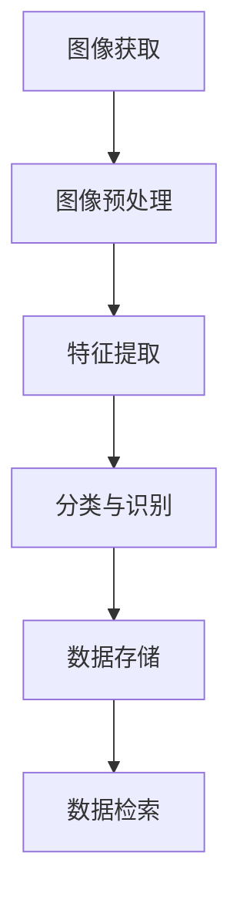

# ES与图像识别与处理的融合

## 1.背景介绍

在当今的数字化时代，图像识别与处理技术已经成为了许多行业的核心技术之一。从医疗影像分析到自动驾驶汽车，从智能监控到社交媒体内容分析，图像识别与处理技术的应用范围广泛且深远。与此同时，Elasticsearch（简称ES）作为一个强大的分布式搜索和分析引擎，已经在大数据处理和实时搜索领域占据了重要地位。将ES与图像识别与处理技术相结合，可以为我们提供更高效、更智能的解决方案。

## 2.核心概念与联系

### 2.1 图像识别与处理

图像识别与处理是计算机视觉的一个重要分支，主要包括图像的获取、预处理、特征提取、分类和识别等步骤。其核心目标是让计算机能够理解和解释图像内容。

### 2.2 Elasticsearch

Elasticsearch是一个基于Lucene的开源搜索引擎，具有分布式、多租户能力，支持全文搜索、结构化搜索和分析。它的强大之处在于其实时搜索和分析能力，能够处理大规模的数据集。

### 2.3 融合的必要性

将图像识别与处理技术与ES结合，可以实现对图像数据的高效存储、搜索和分析。例如，在一个智能监控系统中，我们可以通过图像识别技术检测到异常行为，并将这些信息存储在ES中，方便后续的查询和分析。

## 3.核心算法原理具体操作步骤

### 3.1 图像预处理

图像预处理是图像识别与处理的第一步，主要包括图像的灰度化、去噪、边缘检测等操作。这些操作可以提高图像的质量，增强特征提取的效果。

### 3.2 特征提取

特征提取是图像识别的关键步骤，常用的方法包括SIFT、SURF、HOG等。这些方法可以提取图像中的关键特征点，为后续的分类和识别提供基础。

### 3.3 分类与识别

分类与识别是图像处理的最终目标，常用的算法包括支持向量机（SVM）、卷积神经网络（CNN）等。通过这些算法，我们可以将图像分类到不同的类别中，或者识别出图像中的特定对象。

### 3.4 数据存储与检索

将处理后的图像数据存储到ES中，可以利用其强大的搜索和分析能力，实现对图像数据的高效检索和分析。



## 4.数学模型和公式详细讲解举例说明

### 4.1 图像预处理中的边缘检测

边缘检测是图像预处理中的一个重要步骤，常用的方法包括Sobel算子、Canny算子等。以Sobel算子为例，其数学模型如下：

$$
G_x = \begin{bmatrix}
-1 & 0 & 1 \\
-2 & 0 & 2 \\
-1 & 0 & 1
\end{bmatrix}, \quad
G_y = \begin{bmatrix}
-1 & -2 & -1 \\
0 & 0 & 0 \\
1 & 2 & 1
\end{bmatrix}
$$

通过对图像进行卷积操作，可以得到图像在x方向和y方向的梯度：

$$
G = \sqrt{G_x^2 + G_y^2}
$$

### 4.2 特征提取中的SIFT算法

SIFT（Scale-Invariant Feature Transform）是一种常用的特征提取算法，其核心步骤包括尺度空间极值检测、关键点定位、方向分配和特征描述子生成。其数学模型如下：

1. 尺度空间极值检测：

$$
L(x, y, \sigma) = G(x, y, \sigma) * I(x, y)
$$

其中，$G(x, y, \sigma)$ 是高斯核函数，$I(x, y)$ 是输入图像。

2. 关键点定位：

通过计算尺度空间的DoG（Difference of Gaussian）函数，找到极值点：

$$
D(x, y, \sigma) = (G(x, y, k\sigma) - G(x, y, \sigma)) * I(x, y)
$$

3. 方向分配：

计算关键点的主方向：

$$
\theta = \tan^{-1}\left(\frac{L_y}{L_x}\right)
$$

4. 特征描述子生成：

通过对关键点周围的梯度进行统计，生成特征描述子。

### 4.3 分类与识别中的卷积神经网络

卷积神经网络（CNN）是一种常用的图像分类与识别算法，其核心结构包括卷积层、池化层和全连接层。其数学模型如下：

1. 卷积层：

$$
y_{i,j} = \sum_{m,n} x_{i+m, j+n} \cdot w_{m,n} + b
$$

其中，$x$ 是输入图像，$w$ 是卷积核，$b$ 是偏置。

2. 池化层：

$$
y_{i,j} = \max(x_{i+m, j+n})
$$

3. 全连接层：

$$
y = \sigma(Wx + b)
$$

其中，$W$ 是权重矩阵，$b$ 是偏置，$\sigma$ 是激活函数。

## 5.项目实践：代码实例和详细解释说明

### 5.1 图像预处理代码示例

```python
import cv2
import numpy as np

# 读取图像
image = cv2.imread('image.jpg', cv2.IMREAD_GRAYSCALE)

# 边缘检测
edges = cv2.Canny(image, 100, 200)

# 显示图像
cv2.imshow('Edges', edges)
cv2.waitKey(0)
cv2.destroyAllWindows()
```

### 5.2 特征提取代码示例

```python
import cv2

# 读取图像
image = cv2.imread('image.jpg')

# SIFT特征提取
sift = cv2.SIFT_create()
keypoints, descriptors = sift.detectAndCompute(image, None)

# 绘制关键点
image_with_keypoints = cv2.drawKeypoints(image, keypoints, None)

# 显示图像
cv2.imshow('SIFT Keypoints', image_with_keypoints)
cv2.waitKey(0)
cv2.destroyAllWindows()
```

### 5.3 分类与识别代码示例

```python
import tensorflow as tf
from tensorflow.keras import layers, models

# 构建卷积神经网络
model = models.Sequential()
model.add(layers.Conv2D(32, (3, 3), activation='relu', input_shape=(28, 28, 1)))
model.add(layers.MaxPooling2D((2, 2)))
model.add(layers.Conv2D(64, (3, 3), activation='relu'))
model.add(layers.MaxPooling2D((2, 2)))
model.add(layers.Conv2D(64, (3, 3), activation='relu'))
model.add(layers.Flatten())
model.add(layers.Dense(64, activation='relu'))
model.add(layers.Dense(10, activation='softmax'))

# 编译模型
model.compile(optimizer='adam',
              loss='sparse_categorical_crossentropy',
              metrics=['accuracy'])

# 训练模型
model.fit(train_images, train_labels, epochs=5)

# 评估模型
test_loss, test_acc = model.evaluate(test_images, test_labels)
print(f'Test accuracy: {test_acc}')
```

### 5.4 数据存储与检索代码示例

```python
from elasticsearch import Elasticsearch

# 连接到Elasticsearch
es = Elasticsearch([{'host': 'localhost', 'port': 9200}])

# 创建索引
es.indices.create(index='images', ignore=400)

# 存储数据
doc = {
    'image_id': '1',
    'features': descriptors.tolist()
}
es.index(index='images', id=1, body=doc)

# 检索数据
res = es.search(index='images', body={'query': {'match_all': {}}})
print(res)
```

## 6.实际应用场景

### 6.1 医疗影像分析

在医疗影像分析中，图像识别与处理技术可以用于检测和诊断疾病。例如，通过对X光片、CT扫描图像进行处理，可以检测出肿瘤、骨折等病变。将这些数据存储在ES中，可以方便医生进行查询和分析，提高诊断的准确性和效率。

### 6.2 自动驾驶汽车

在自动驾驶汽车中，图像识别与处理技术用于检测道路、车辆、行人等信息。通过将这些信息存储在ES中，可以实现对驾驶环境的实时监控和分析，提高自动驾驶的安全性。

### 6.3 智能监控

在智能监控系统中，图像识别与处理技术可以用于检测异常行为、识别嫌疑人等。将这些信息存储在ES中，可以实现对监控数据的高效检索和分析，提高公共安全。

### 6.4 社交媒体内容分析

在社交媒体内容分析中，图像识别与处理技术可以用于识别图像中的人物、物体、场景等。将这些信息存储在ES中，可以实现对社交媒体内容的深入分析，帮助企业了解用户行为和偏好。

## 7.工具和资源推荐

### 7.1 图像处理工具

- OpenCV：一个开源的计算机视觉库，提供了丰富的图像处理和计算机视觉算法。
- PIL：Python Imaging Library，一个强大的图像处理库，支持多种图像格式。

### 7.2 机器学习框架

- TensorFlow：一个开源的机器学习框架，支持深度学习和其他机器学习算法。
- PyTorch：一个开源的深度学习框架，提供了灵活的动态计算图。

### 7.3 Elasticsearch工具

- Kibana：一个开源的分析和可视化平台，与Elasticsearch无缝集成，提供强大的数据可视化功能。
- Logstash：一个开源的数据收集引擎，可以将数据从多种来源收集到Elasticsearch中。

## 8.总结：未来发展趋势与挑战

### 8.1 未来发展趋势

随着人工智能和大数据技术的不断发展，图像识别与处理技术将会越来越智能化和高效化。将ES与图像识别与处理技术相结合，可以实现对图像数据的实时搜索和分析，提供更智能的解决方案。

### 8.2 挑战

尽管图像识别与处理技术已经取得了显著的进展，但仍然面临一些挑战。例如，如何提高图像识别的准确性和鲁棒性，如何处理大规模的图像数据，如何保护用户隐私等。这些问题需要我们在未来的研究和实践中不断探索和解决。

## 9.附录：常见问题与解答

### 9.1 如何提高图像识别的准确性？

提高图像识别的准确性可以从以下几个方面入手：

- 数据增强：通过对训练数据进行旋转、缩放、翻转等操作，增加数据的多样性。
- 模型优化：选择合适的模型结构和超参数，使用更先进的优化算法。
- 特征提取：使用更有效的特征提取方法，如深度学习中的卷积神经网络。

### 9.2 如何处理大规模的图像数据？

处理大规模的图像数据可以使用分布式计算和存储技术，如Hadoop、Spark等。同时，可以将数据存储在ES中，利用其强大的搜索和分析能力，实现对大规模数据的高效处理。

### 9.3 如何保护用户隐私？

在处理图像数据时，需要注意保护用户隐私。可以使用数据匿名化、加密等技术，确保用户数据的安全。同时，需要遵守相关的法律法规，确保数据处理的合法性。

---

作者：禅与计算机程序设计艺术 / Zen and the Art of Computer Programming