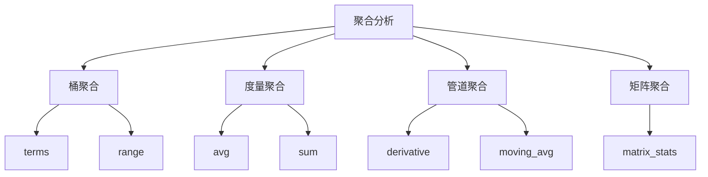

# ES聚合分析原理与代码实例讲解

## 1.背景介绍

Elasticsearch（简称ES）是一个分布式搜索和分析引擎，广泛应用于日志分析、全文搜索、实时数据分析等领域。其强大的聚合分析功能使得用户能够从海量数据中快速提取有价值的信息。本文将深入探讨ES的聚合分析原理，并通过具体的代码实例来帮助读者理解和应用这些技术。

## 2.核心概念与联系

### 2.1 聚合分析的定义

聚合分析是指对数据进行分组、统计和计算，以便从中提取有意义的统计信息。ES的聚合分析功能类似于SQL中的`GROUP BY`和聚合函数（如`SUM`、`AVG`等），但其功能更为强大和灵活。

### 2.2 聚合类型

ES提供了多种聚合类型，主要包括：

- **桶聚合（Bucket Aggregations）**：用于将文档分组，如`terms`、`range`等。
- **度量聚合（Metric Aggregations）**：用于计算统计值，如`avg`、`sum`、`min`、`max`等。
- **管道聚合（Pipeline Aggregations）**：用于对其他聚合的结果进行再处理，如`derivative`、`moving_avg`等。
- **矩阵聚合（Matrix Aggregations）**：用于处理多维数据，如`matrix_stats`。

### 2.3 聚合的层次结构

聚合可以嵌套使用，形成层次结构。例如，可以在一个`terms`聚合中嵌套一个`avg`聚合，以计算每个分组的平均值。



## 3.核心算法原理具体操作步骤

### 3.1 数据分片与分布

ES将数据分片存储，每个分片可以分布在不同的节点上。聚合分析时，首先在每个分片上进行局部计算，然后将结果汇总。

### 3.2 聚合执行流程

1. **初始请求**：客户端发送聚合请求到ES集群。
2. **分片计算**：每个分片独立计算聚合结果。
3. **结果汇总**：将各分片的结果汇总，进行全局计算。
4. **返回结果**：将最终结果返回给客户端。

### 3.3 并行计算与优化

ES利用并行计算和分布式架构，能够高效处理大规模数据。通过合理设置分片数和副本数，可以进一步优化聚合性能。

## 4.数学模型和公式详细讲解举例说明

### 4.1 平均值计算

假设我们有一组数据 $x_1, x_2, \ldots, x_n$，其平均值计算公式为：

$$
\text{avg} = \frac{1}{n} \sum_{i=1}^{n} x_i
$$

在ES中，可以使用`avg`聚合来计算某个字段的平均值。

### 4.2 标准差计算

标准差用于衡量数据的离散程度，其计算公式为：

$$
\sigma = \sqrt{\frac{1}{n} \sum_{i=1}^{n} (x_i - \mu)^2}
$$

其中，$\mu$为数据的平均值。在ES中，可以使用`extended_stats`聚合来计算标准差。

### 4.3 直方图计算

直方图用于将数据分组，其计算过程如下：

1. 确定分组区间（桶）。
2. 统计每个桶中的数据数量。

在ES中，可以使用`histogram`聚合来实现直方图计算。

## 5.项目实践：代码实例和详细解释说明

### 5.1 环境准备

首先，确保已安装并运行Elasticsearch。可以使用以下命令启动ES：

```bash
./bin/elasticsearch
```

### 5.2 数据准备

假设我们有一组用户数据，包含用户ID、年龄和收入。可以使用以下命令将数据索引到ES中：

```json
PUT /users/_bulk
{ "index": { "_id": 1 } }
{ "user_id": 1, "age": 25, "income": 50000 }
{ "index": { "_id": 2 } }
{ "user_id": 2, "age": 30, "income": 60000 }
{ "index": { "_id": 3 } }
{ "user_id": 3, "age": 35, "income": 70000 }
```

### 5.3 聚合查询示例

#### 5.3.1 计算平均收入

```json
GET /users/_search
{
  "size": 0,
  "aggs": {
    "average_income": {
      "avg": {
        "field": "income"
      }
    }
  }
}
```

#### 5.3.2 按年龄分组并计算平均收入

```json
GET /users/_search
{
  "size": 0,
  "aggs": {
    "age_groups": {
      "terms": {
        "field": "age"
      },
      "aggs": {
        "average_income": {
          "avg": {
            "field": "income"
          }
        }
      }
    }
  }
}
```

### 5.4 结果解释

上述查询将返回每个年龄组的平均收入。通过这种方式，可以快速了解不同年龄段用户的收入分布情况。

## 6.实际应用场景

### 6.1 日志分析

在日志分析中，可以使用ES的聚合功能统计错误日志的数量、按时间分布的请求量等。例如，可以按小时统计请求量：

```json
GET /logs/_search
{
  "size": 0,
  "aggs": {
    "requests_per_hour": {
      "date_histogram": {
        "field": "timestamp",
        "interval": "hour"
      }
    }
  }
}
```

### 6.2 电商数据分析

在电商平台中，可以使用聚合分析用户行为数据，如统计每个商品的销售量、计算用户的平均购买金额等。例如，统计每个商品的销售量：

```json
GET /sales/_search
{
  "size": 0,
  "aggs": {
    "sales_per_product": {
      "terms": {
        "field": "product_id"
      }
    }
  }
}
```

### 6.3 实时监控

在实时监控系统中，可以使用聚合分析实时计算系统指标，如CPU使用率、内存使用量等。例如，计算平均CPU使用率：

```json
GET /metrics/_search
{
  "size": 0,
  "aggs": {
    "average_cpu_usage": {
      "avg": {
        "field": "cpu_usage"
      }
    }
  }
}
```

## 7.工具和资源推荐

### 7.1 官方文档

Elasticsearch官方文档是学习和参考的最佳资源，详细介绍了各类聚合的使用方法和示例。

### 7.2 开源项目

可以参考一些开源项目，如Kibana，它是一个开源的分析和可视化平台，专为Elasticsearch设计。

### 7.3 社区资源

参与Elasticsearch社区，加入相关的论坛和讨论组，可以获取最新的技术动态和最佳实践。

## 8.总结：未来发展趋势与挑战

### 8.1 发展趋势

随着大数据和人工智能技术的发展，Elasticsearch的聚合分析功能将变得更加智能和高效。未来，可能会引入更多的机器学习算法，进一步提升数据分析的能力。

### 8.2 挑战

尽管ES的聚合分析功能强大，但在处理超大规模数据时，仍然面临性能和资源消耗的挑战。如何优化聚合查询、合理配置集群资源，将是未来需要解决的重要问题。

## 9.附录：常见问题与解答

### 9.1 聚合查询性能优化

**问题**：聚合查询性能较差，如何优化？

**解答**：可以通过以下方法优化聚合查询性能：
- 合理设置分片数和副本数。
- 使用过滤器减少数据量。
- 使用预聚合索引。

### 9.2 聚合结果不准确

**问题**：聚合结果不准确，可能的原因是什么？

**解答**：可能的原因包括：
- 数据分片不均匀。
- 数据更新未及时同步。
- 使用了近似算法。

### 9.3 如何处理大规模数据聚合

**问题**：如何处理大规模数据的聚合分析？

**解答**：可以通过以下方法处理大规模数据的聚合分析：
- 使用分布式计算框架，如Spark。
- 分批次处理数据。
- 使用预计算和缓存技术。

---

作者：禅与计算机程序设计艺术 / Zen and the Art of Computer Programming