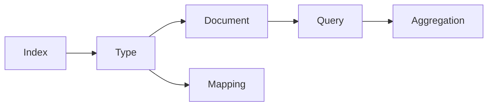
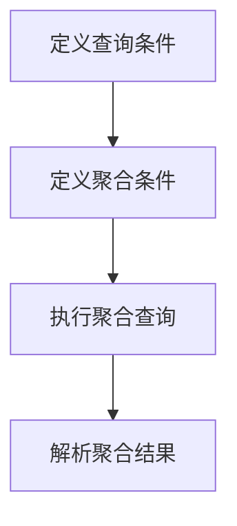

# ElasticSearch Aggregation原理与代码实例讲解

## 1. 背景介绍

### 1.1 ElasticSearch简介

ElasticSearch是一个基于Lucene的搜索和分析引擎，提供了分布式、支持多租户的全文搜索功能。它不仅仅是一个全文搜索引擎，还提供了强大的聚合分析(Aggregation)功能，可以实时地对大规模数据进行复杂的分析操作。

### 1.2 聚合分析的重要性

在大数据时代，随着数据量的快速增长，对数据进行实时分析和挖掘变得越来越重要。ElasticSearch的聚合分析功能为我们提供了一种高效、灵活的方式来分析和探索数据，帮助我们快速洞察数据背后的价值，为业务决策提供有力支撑。

### 1.3 聚合分析的应用场景

聚合分析在很多领域都有广泛应用，例如：

- 电商平台：分析商品销量、用户行为等数据，优化营销策略和推荐算法
- 日志分析：分析应用系统日志，监控系统运行状况，及时发现和定位问题
- 金融风控：分析交易数据，评估风险，预防欺诈行为
- 社交网络：分析用户社交关系，挖掘社区结构和影响力
- 物联网：分析传感器数据，优化设备运行，预测故障

## 2. 核心概念与关联

要深入理解ElasticSearch的聚合分析，需要先了解一些核心概念：

### 2.1 索引(Index)

索引是ElasticSearch存储数据的地方，类似于关系型数据库中的database。一个索引可以包含多个文档类型。

### 2.2 类型(Type) 

一个索引可以定义一个或多个类型，类似于关系型数据库的表结构。注意：ElasticSearch 7.x已经移除了多类型支持。

### 2.3 文档(Document)

文档是ElasticSearch中的最小数据单元，由一个或多个字段组成，采用JSON格式表示，类似于关系型数据库中的一行记录。

### 2.4 映射(Mapping)

Mapping定义了文档中字段的类型以及这些字段如何分词等相关属性，类似于关系型数据库中的表结构定义。

### 2.5 查询(Query) 

Query是查询文档的语句，ElasticSearch提供了基于JSON的Query DSL来定义查询。

### 2.6 聚合(Aggregation)

Aggregation即聚合分析，是ElasticSearch提供的一种基于查询结果进行分析和统计的功能。

下图展示了这些核心概念之间的关系：



## 3. 核心算法原理与操作步骤

### 3.1 聚合分析的类型

ElasticSearch提供了四种类型的聚合分析：

#### 3.1.1 Bucket Aggregation

类似于SQL中的GROUP BY，按照一定的规则将文档分配到不同的桶(bucket)中，从而达到分组的目的。常见的Bucket Aggregation包括：

- Terms Aggregation：按照字段的值进行分组 
- Range Aggregation：按照指定的范围进行分组
- Date Histogram Aggregation：按照日期阶梯分组
- Histogram Aggregation：按照数值阶梯分组

#### 3.1.2 Metric Aggregation 

对桶内的文档进行计算，得出一个数值。常见的Metric Aggregation包括：

- Avg Aggregation：求平均值
- Max Aggregation：求最大值 
- Min Aggregation：求最小值
- Sum Aggregation：求和
- Stats Aggregation：同时返回avg、max、min、sum、count等
- Cardinality Aggregation：求基数，即不同值的个数

#### 3.1.3 Matrix Aggregation

支持对多个字段进行操作，而且字段可以是数值、日期、地理坐标等。目前支持的Matrix Aggregation只有一个：

- Matrix Stats：输入多个数值类型的字段，输出这些字段的统计信息

#### 3.1.4 Pipeline Aggregation

Pipeline Aggregation 可以对其他Aggregation的结果进行二次聚合。常见的Pipeline Aggregation包括：

- Derivative：求导数
- Moving Average：滑动平均
- Cumulative Sum：累计求和

### 3.2 聚合分析的基本步骤

使用ElasticSearch进行聚合分析通常包括以下步骤：

#### 3.2.1 定义查询条件

使用Query DSL定义文档的过滤条件，确定要参与聚合分析的文档范围。

#### 3.2.2 定义聚合条件 

使用Aggregation DSL定义聚合分析的具体条件，包括聚合的类型、涉及的字段、桶的划分规则等。

#### 3.2.3 执行聚合查询

将Query和Aggregation合并成一个完整的请求，发送给ElasticSearch执行。

#### 3.2.4 解析聚合结果

ElasticSearch返回的聚合结果是一个嵌套的JSON对象，需要遍历解析其中的桶和指标信息，转换成便于显示和使用的格式。

整个聚合分析的过程可以用下面的流程图表示：



## 4. 数学模型和公式详解

虽然我们在使用ElasticSearch进行聚合分析时无需关注内部的数学实现，但了解其背后的一些数学原理有助于我们更好地理解聚合的工作机制。下面以Metric Aggregation中的Avg Aggregation为例进行说明。

### 4.1 Avg Aggregation

Avg Aggregation用于计算一组数值的平均值。假设有一组数值${x_1, x_2, ..., x_n}$，其平均值可以表示为：

$$\bar{x} = \frac{1}{n}\sum_{i=1}^n x_i$$

其中，$\bar{x}$表示平均值，$n$表示数值的个数，$x_i$表示第$i$个数值。

### 4.2 增量计算平均值

在ElasticSearch中，为了提高聚合性能，Avg Aggregation采用了增量计算的方式。即每当有新的文档被添加到桶中时，不需要重新遍历所有数值，只需要根据当前的sum和count计算新的平均值即可。

设第$i$个文档的字段值为$x_i$，在第$i$个文档被添加到桶之前，桶内已有$n$个文档，sum为$S$，则添加第$i$个文档后的平均值为：

$$\bar{x}' = \frac{S + x_i}{n + 1}$$

由于$S = n\bar{x}$，代入上式得：

$$\begin{aligned}
\bar{x}' &= \frac{n\bar{x} + x_i}{n+1} \\
&= \frac{n}{n+1}\bar{x} + \frac{1}{n+1}x_i
\end{aligned}$$

这个公式展示了增量计算的过程，即新的平均值可以根据旧的平均值$\bar{x}$和新添加的值$x_i$快速计算得到，而无需对所有数值重新求和再除以$n+1$，从而大大提高了计算效率。ElasticSearch正是利用这个特性实现了高性能的Avg Aggregation。

## 5. 项目实践：代码实例详解

下面通过一个实际的例子来演示如何使用ElasticSearch的Java客户端进行聚合分析。

### 5.1 准备测试数据

首先，我们要准备一些测试数据。这里我们使用一组虚构的销售数据，包括销售时间、销售区域、产品类别、销售额等信息。

```json
PUT /sales/_doc/1
{
  "date": "2020-01-01",
  "region": "East",
  "product": "A",
  "amount": 1000
}

PUT /sales/_doc/2
{
  "date": "2020-01-02",
  "region": "East",  
  "product": "B",
  "amount": 1500
}

PUT /sales/_doc/3
{  
  "date": "2020-01-03",
  "region": "West",
  "product": "A", 
  "amount": 800
}

PUT /sales/_doc/4
{
  "date": "2020-01-04", 
  "region": "West",
  "product": "B",
  "amount": 2000
}
```

### 5.2 导入依赖

在Java项目中，我们需要导入ElasticSearch的Java客户端依赖：

```xml
<dependency>
  <groupId>org.elasticsearch.client</groupId>
  <artifactId>elasticsearch-rest-high-level-client</artifactId>
  <version>7.6.2</version>
</dependency>
```

### 5.3 创建客户端

然后，创建ElasticSearch客户端：

```java
RestHighLevelClient client = new RestHighLevelClient(
  RestClient.builder(new HttpHost("localhost", 9200, "http"))
);
```

### 5.4 定义聚合条件

接下来，使用QueryBuilders和AggregationBuilders定义聚合条件。这里我们要实现一个需求：按照区域分组，计算每个区域的总销售额、平均销售额、最大单笔销售额。

```java
// 1. 定义查询条件
SearchSourceBuilder sourceBuilder = new SearchSourceBuilder();
sourceBuilder.query(QueryBuilders.matchAllQuery());
sourceBuilder.size(0); 

// 2. 定义聚合条件
sourceBuilder.aggregation(
  AggregationBuilders.terms("region_sales").field("region")
  .subAggregation(AggregationBuilders.sum("total_sales").field("amount"))  
  .subAggregation(AggregationBuilders.avg("avg_sales").field("amount"))
  .subAggregation(AggregationBuilders.max("max_sales").field("amount"))
);
```

这段代码首先定义了一个match_all查询，表示选择所有文档参与聚合。然后，使用terms aggregation按照region字段进行分组，并且对每个分组执行三个子聚合：sum、avg、max，分别计算总销售额、平均销售额、最大单笔销售额。

### 5.5 执行聚合查询

定义好查询和聚合条件后，就可以发起聚合请求了：

```java
SearchRequest searchRequest = new SearchRequest("sales"); 
searchRequest.source(sourceBuilder);
SearchResponse searchResponse = client.search(searchRequest, RequestOptions.DEFAULT);
```

### 5.6 解析聚合结果

最后，我们需要从响应中解析出聚合的结果：

```java
Terms region_sales = searchResponse.getAggregations().get("region_sales");

for (Terms.Bucket bucket : region_sales.getBuckets()) {
  String region = bucket.getKeyAsString();
  long total_sales = ((Sum) bucket.getAggregations().get("total_sales")).getValue(); 
  double avg_sales = ((Avg) bucket.getAggregations().get("avg_sales")).getValue();
  long max_sales = (long) ((Max) bucket.getAggregations().get("max_sales")).getValue();
  
  System.out.println("Region: " + region);
  System.out.println("Total sales: " + total_sales); 
  System.out.println("Average sales: " + avg_sales);
  System.out.println("Max sales: " + max_sales);
  System.out.println("-----------------------------");
}
```

这段代码先获取名为"region_sales"的terms aggregation，然后遍历其中的每个桶。对于每个桶，我们可以获取到桶的key（即region名称），以及桶中的三个子聚合的值。这样就得到了每个区域的销售统计信息。

## 6. 实际应用场景

聚合分析在实际业务中有非常广泛的应用，下面列举几个常见的场景。

### 6.1 电商销售分析

对于电商平台，聚合分析可以帮助商家实现以下功能：

- 统计不同品类的销售额占比，了解哪些品类最受欢迎
- 统计不同时间段（年、月、日、小时）的销量变化趋势
- 统计不同地区的用户消费特征，制定针对性的营销策略
- 统计不同价格区间的订单数量，优化定价和库存

### 6.2 日志分析

对于大规模分布式系统，聚合分析可以帮助运维人员实现以下功能：

- 统计不同等级（ERROR、WARN、INFO）的日志数量，快速发现异常
- 统计不同服务器、不同接口的响应时间，发现性能瓶颈
- 统计不同时间段的请求量变化，了解系统的负载情况
- 统计不同用户的访问频次，识别可疑的爬虫行为

### 6.3 社交网络分析

对于社交网络应用，聚合分析可以帮助实现以下功能：

- 统计不同话题的讨论热度，发现热点事件