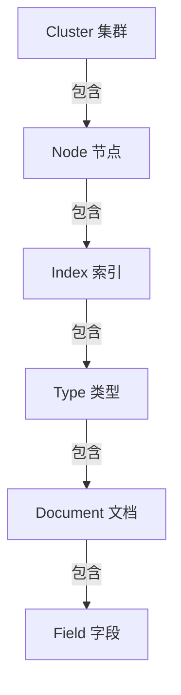

# ElasticSearch原理与代码实例讲解

## 1.背景介绍

### 1.1 什么是ElasticSearch?

ElasticSearch是一个分布式、RESTful风格的搜索和数据分析引擎,它能够快速存储、搜索和分析大量的数据。它基于Apache Lucene库,使用Java开发,并使用Lucene的倒排索引结构进行全文搜索。ElasticSearch不仅仅是一个搜索引擎,它还可以作为一个分布式实时分析和计算框架,能够解决日常应用程序中的大部分数据相关问题。

### 1.2 ElasticSearch的特点

- **分布式**:ElasticSearch可以作为单个节点运行,也可以组成集群运行,支持横向扩展。
- **RESTful**:ElasticSearch提供了RESTful API,使用HTTP协议进行通信,方便与其他系统集成。
- **近实时(NRT)**:ElasticSearch的写入操作是近实时的,数据在1秒内就能被检索到。
- **多租户**:ElasticSearch支持多租户模式,可以隔离多个客户端的数据。
- **集群自动管理**:ElasticSearch集群可以自动发现新加入的节点,自动均衡数据。

### 1.3 ElasticSearch的应用场景

- **全文搜索**:ElasticSearch提供全文检索功能,支持各种文本分析器,适用于网站、文档等全文搜索场景。
- **结构化搜索**:ElasticSearch不仅支持全文搜索,还支持对数值、日期等结构化数据的查询。
- **数据分析**:ElasticSearch提供了对数据进行聚合、分析的能力,可以生成各种统计报表。
- **日志处理**:ElasticSearch可以用于收集、存储并分析大量的日志数据。
- **安全分析**:ElasticSearch可用于检测入侵行为、分析网络流量等安全领域。

## 2.核心概念与联系

### 2.1 核心概念

ElasticSearch中有几个核心概念,理解这些概念对于使用ElasticSearch至关重要。

- **索引(Index)**:相当于关系型数据库中的数据库,用于存储相关的文档数据。
- **类型(Type)**:在索引中,可以定义一个或多个类型,类型就像关系型数据库的表一样。(ElasticSearch 6.x版本开始,一个索引只能包含一个类型)
- **文档(Document)**:相当于关系型数据库的一行记录,ElasticSearch以JSON格式存储文档。
- **字段(Field)**:文档中的属性,相当于关系型数据库的列。
- **映射(Mapping)**:定义文档及其字段的数据类型和其他属性,类似关系型数据库的Schema。
- **节点(Node)**:ElasticSearch集群的一个节点,存储数据和参与集群索引和查询。
- **集群(Cluster)**:由一个或多个节点组成,共同存储整个数据,并提供联合索引和查询。

### 2.2 核心概念关系

ElasticSearch的核心概念之间存在层级关系,如下所示:



- 一个集群可以包含多个节点
- 每个节点可以包含多个索引
- 每个索引可以包含多个类型(6.x版本后只能包含一个类型)
- 每个类型包含多个文档
- 每个文档包含多个字段

## 3.核心算法原理具体操作步骤  

### 3.1 倒排索引原理

ElasticSearch的核心是基于Lucene的倒排索引,通过倒排索引可以快速找到包含特定词条的文档。传统的数据库为每个文档建立一个文档列表,列出该文档包含的所有单词;而倒排索引则是为每个单词建立一个包含该单词的文档列表。

倒排索引的创建过程:

1. **收集文档**:收集需要建立索引的文档数据
2. **分词**:将文档内容按照一定规则分成多个单词(词条/Term)
3. **计算词频**:统计每个单词在文档中出现的频率
4. **创建倒排索引**:为每个单词创建一个倒排列表,记录包含该单词的文档信息

例如有两个文档:

```
文档1: 我是程序员
文档2: 我爱编程
```

对应的倒排索引为:

```
我 -> 文档1, 文档2
是 -> 文档1  
程序员 -> 文档1
爱 -> 文档2
编程 -> 文档2
```

### 3.2 搜索过程

当用户输入查询时,ElasticSearch会对查询进行分词,然后查找倒排索引,获取包含所有查询词条的文档列表,最后根据相关度算分并返回结果。

搜索的具体步骤:

1. **查询分词**:对查询语句进行分词,得到多个查询词条
2. **查找倒排索引**:从倒排索引中查找包含所有查询词条的文档
3. **相关度算分**:计算查询与每个文档的相关度得分
4. **排序输出**:根据相关度算分对结果进行排序,返回相关度最高的文档

### 3.3 分布式集群原理

ElasticSearch可以运行在单节点上,也可以组成分布式集群,提高系统的可用性和处理能力。集群中有一个节点被选举为主节点,其他节点为数据节点,主节点负责集群管理,数据节点负责数据存储和查询。

分布式集群的工作原理:

1. **数据分片**:索引中的数据被分片存储在不同节点上
2. **主分片和副本**:每个分片有一个主分片和多个副本分片,副本用于故障转移和负载均衡
3. **集群发现**:节点通过多播发现对方,自动组成集群
4. **集群状态**:主节点维护集群状态,存储分片路由信息
5. **请求路由**:请求发送到任意节点,由该节点计算分片路由,转发到正确节点处理
6. **副本同步**:主分片对数据进行增删改,副本分片定期与主分片同步数据
7. **集群扩展**:可以动态添加新节点,集群会自动均衡数据

## 4.数学模型和公式详细讲解举例说明

### 4.1 相关度算分

ElasticSearch使用相关度算分来衡量查询与文档的匹配程度。相关度算分越高,文档与查询的匹配度就越高。常用的相关度算分模型有BM25和TF-IDF。

#### 4.1.1 TF-IDF模型

TF-IDF(Term Frequency-Inverse Document Frequency)是一种统计模型,用于评估一个词对于一个文档集或语料库中的其他文档的重要程度。TF-IDF由两部分组成:

- TF(Term Frequency,词频):该词在文档中出现的频率,词频越高,说明该词越重要。

$$
TF(t,d)=\frac{n_{t,d}}{\sum_{t'\in d}n_{t',d}}
$$

其中$n_{t,d}$表示词$t$在文档$d$中出现的次数,$\sum_{t'\in d}n_{t',d}$表示文档$d$中所有词的总数。

- IDF(Inverse Document Frequency,逆向文档频率):该词在整个文档集中出现的频率,IDF值越小,说明该词越常见,权重越低。

$$
IDF(t,D)=\log\frac{|D|}{|\{d\in D:t\in d\}|}
$$

其中$|D|$表示文档集$D$中文档的总数,$|\{d\in D:t\in d\}|$表示包含词$t$的文档数量。

最终,TF-IDF的分数为:

$$
\text{TF-IDF}(t,d,D)=TF(t,d)\times IDF(t,D)
$$

TF-IDF分数越高,表示该词对文档越重要。在搜索时,ElasticSearch会计算查询和文档的TF-IDF分数,作为相关度的一个重要因素。

#### 4.1.2 BM25模型

BM25(Okapi BM25)是一种概率模型,也用于计算查询和文档的相关度分数。BM25算法认为,一个词在文档中出现的次数越多,文档越相关;同时考虑了文档长度的影响。

BM25分数计算公式如下:

$$
\text{Score}(D,Q)=\sum_{q\in Q}\text{IDF}(q)\cdot\frac{f(q,D)\cdot(k_1+1)}{f(q,D)+k_1\cdot\left(1-b+b\cdot\frac{|D|}{avgdl}\right)}
$$

其中:

- $Q$是查询语句,包含多个查询词$q$
- $f(q,D)$是查询词$q$在文档$D$中出现的词频
- $|D|$是文档$D$的长度(字数)
- $avgdl$是文档集的平均文档长度
- $k_1$和$b$是调节因子,通常取$k_1=1.2,b=0.75$

$\text{IDF}(q)$是逆向文档频率,与TF-IDF模型类似,计算公式如下:

$$
\text{IDF}(q)=\log\frac{N-n(q)+0.5}{n(q)+0.5}
$$

其中$N$是文档集的总文档数,$n(q)$是包含词$q$的文档数量。

BM25模型综合考虑了词频、逆向文档频率和文档长度等因素,被认为是目前最有效的相关度算分模型之一。ElasticSearch在计算相关度分数时,默认使用的就是BM25模型。

### 4.2 向量空间模型

向量空间模型(Vector Space Model)是信息检索领域常用的一种代数模型,将文档和查询都表示为向量,通过计算文档向量和查询向量之间的相似度来衡量相关程度。

假设有一个文档集合$D=\{d_1,d_2,...,d_n\}$,包含$m$个不同的词$t_1,t_2,...,t_m$。每个文档$d_i$可以表示为一个$m$维向量:

$$
\vec{d_i}=(w_{i1},w_{i2},...,w_{im})
$$

其中$w_{ij}$表示词$t_j$在文档$d_i$中的权重,通常使用TF-IDF值。

同理,查询$q$也可以表示为一个$m$维向量:

$$
\vec{q}=(q_1,q_2,...,q_m)
$$

其中$q_j$表示查询词$t_j$在查询中的权重。

文档向量$\vec{d_i}$和查询向量$\vec{q}$的相似度可以用余弦相似度来计算:

$$
\text{sim}(\vec{d_i},\vec{q})=\cos(\vec{d_i},\vec{q})=\frac{\vec{d_i}\cdot\vec{q}}{|\vec{d_i}||\vec{q}|}=\frac{\sum_{j=1}^{m}w_{ij}q_j}{\sqrt{\sum_{j=1}^{m}w_{ij}^2}\sqrt{\sum_{j=1}^{m}q_j^2}}
$$

余弦相似度的取值范围为$[0,1]$,值越大表示文档与查询越相关。

在ElasticSearch中,可以使用向量空间模型计算相关度分数,也可以结合BM25等其他模型综合考虑多个因素。

## 5.项目实践:代码实例和详细解释说明

本节将通过一个基于Java的ElasticSearch示例项目,演示如何使用ElasticSearch的Java客户端API进行基本的数据操作。

### 5.1 项目环境准备

1. 安装ElasticSearch和Kibana
2. 安装Java 8或更高版本
3. 添加ElasticSearch Java客户端依赖

```xml
<dependency>
    <groupId>org.elasticsearch.client</groupId>
    <artifactId>elasticsearch-rest-high-level-client</artifactId>
    <version>7.12.1</version>
</dependency>
```

### 5.2 创建索引

```java
RestHighLevelClient client = new RestHighLevelClient(
        RestClient.builder(
                new HttpHost("localhost", 9200, "http")));

CreateIndexRequest request = new CreateIndexRequest("blog");
CreateIndexResponse createIndexResponse = client.indices().create(request, RequestOptions.DEFAULT);
```

上述代码创建了一个名为`blog`的索引。

### 5.3 创建映射

```java
XContentBuilder mappingBuilder = XContentFactory.jsonBuilder()
        .startObject()
            .startObject