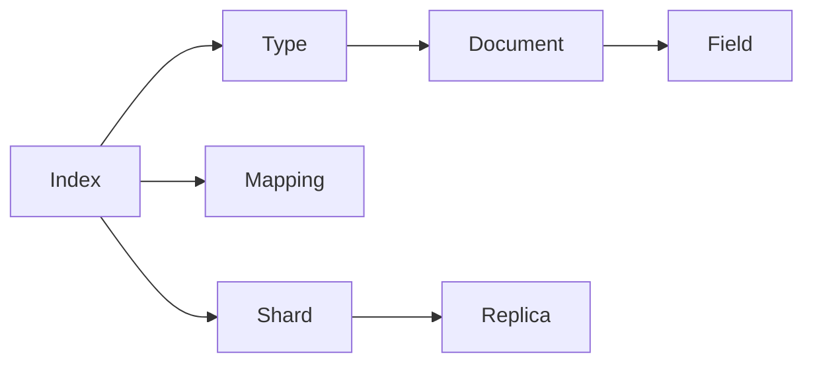

# ElasticSearch原理与代码实例讲解

## 1. 背景介绍
在当今信息爆炸的时代，数据检索已成为我们日常生活和工作中不可或缺的一部分。ElasticSearch作为一个高性能、可伸缩、分布式的搜索和数据分析引擎，广泛应用于各种场景，从日志分析到实时数据监控，再到复杂的搜索需求。它基于Apache Lucene构建，提供了一个分布式多用户能力的全文搜索引擎，具有HTTP web接口和无模式JSON文档的特点。

## 2. 核心概念与联系
ElasticSearch的核心概念包括索引（Index）、类型（Type）、文档（Document）、字段（Field）、映射（Mapping）、分片（Shard）和副本（Replica）。索引是数据存储的地方，类似于数据库中的“数据库”概念。类型是索引中的一个逻辑分类，类似于数据库中的“表”。文档则是可搜索的信息最小单位，相当于数据库中的“行”。字段是文档的属性，类似于数据库表中的“列”。映射定义了文档及其包含的字段如何存储和索引。分片和副本则是ElasticSearch实现高可用性和水平扩展的关键。



## 3. 核心算法原理具体操作步骤
ElasticSearch的核心算法原理包括倒排索引（Inverted Index）、相关性评分（Relevance Scoring）、分布式架构设计等。倒排索引是ElasticSearch快速检索的基础，它将文档中的数据转换为一个个索引项，然后将这些索引项映射到包含它们的文档。相关性评分则是通过一系列算法（如TF/IDF、BM25）来计算文档与查询条件的匹配程度。分布式架构设计使得ElasticSearch可以在多个节点上分布数据和查询负载，从而提高性能和可靠性。

## 4. 数学模型和公式详细讲解举例说明
ElasticSearch的相关性评分算法BM25是基于概率检索模型的，其数学公式如下：

$$
\text{Score}(D,Q) = \sum_{i=1}^{n} \text{IDF}(q_i) \cdot \frac{f(q_i, D) \cdot (k_1 + 1)}{f(q_i, D) + k_1 \cdot (1 - b + b \cdot \frac{|D|}{\text{avgdl}})}
$$

其中，$ \text{Score}(D,Q) $ 表示文档D和查询Q的相关性评分，$ q_i $ 是查询Q中的第i个词，$ \text{IDF}(q_i) $ 是词$ q_i $的逆文档频率，$ f(q_i, D) $ 是词$ q_i $在文档D中的频率，$ |D| $ 是文档D的长度，$ \text{avgdl} $ 是所有文档的平均长度，$ k_1 $ 和$ b $ 是可调参数。

## 5. 项目实践：代码实例和详细解释说明
在实际项目中，我们可以通过ElasticSearch提供的RESTful API来执行各种操作。以下是一个简单的索引创建和文档添加的示例：

```json
PUT /my_index
{
  "settings": {
    "number_of_shards": 1,
    "number_of_replicas": 0
  },
  "mappings": {
    "properties": {
      "title": { "type": "text" },
      "description": { "type": "text" },
      "date": { "type": "date" }
    }
  }
}

POST /my_index/_doc/1
{
  "title": "ElasticSearch Tutorial",
  "description": "This is a tutorial about ElasticSearch.",
  "date": "2023-04-01"
}
```

在这个例子中，我们首先创建了一个名为`my_index`的索引，并定义了其映射和设置。然后，我们向这个索引中添加了一个文档。

## 6. 实际应用场景
ElasticSearch在日志分析、全文搜索、安全情报、数据可视化等多个领域都有广泛的应用。例如，它可以用于电商网站的商品搜索，社交网络的信息流，或者是企业内部的文档检索系统。

## 7. 工具和资源推荐
为了更好地使用ElasticSearch，以下是一些推荐的工具和资源：
- Kibana：ElasticSearch的数据可视化工具。
- Logstash：用于收集、处理和转发日志和事件数据的服务器端数据处理管道。
- Beats：轻量级的单一用途数据采集器。
- ElasticSearch官方文档：提供了全面的指南和API参考。

## 8. 总结：未来发展趋势与挑战
随着数据量的不断增长，ElasticSearch在性能优化、数据安全、跨集群搜索等方面面临着新的挑战和发展趋势。未来，ElasticSearch可能会更加注重云服务的集成，以及机器学习等先进技术的应用。

## 9. 附录：常见问题与解答
Q1: ElasticSearch如何保证数据的一致性？
A1: ElasticSearch通过版本控制和写入时的同步复制机制来保证数据的一致性。

Q2: 如何优化ElasticSearch的查询性能？
A2: 可以通过调整查询结构、使用缓存、优化索引设计等方式来提高查询性能。

作者：禅与计算机程序设计艺术 / Zen and the Art of Computer Programming