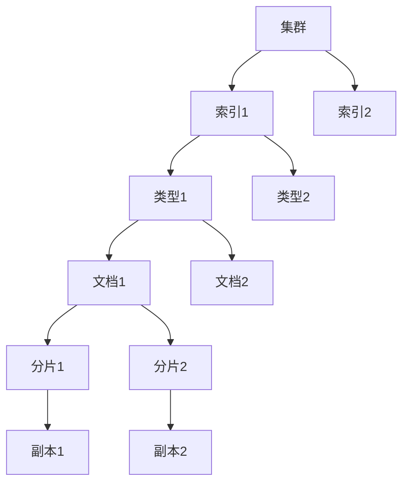

# ElasticSearch原理与代码实例讲解

## 1.背景介绍

在当今大数据时代,海量数据的存储和高效检索成为了一个巨大的挑战。传统的关系型数据库在处理非结构化数据时往往效率低下,难以满足现代应用的需求。这时,ElasticSearch作为一种分布式、RESTful风格的搜索和分析引擎应运而生。

ElasticSearch基于Lucene构建,能够提供分布式的全文搜索引擎,具有高可扩展性、高可用性和近乎实时的搜索能力。它可以快速地存储、搜索和分析大量的数据,广泛应用于许多领域,如电子商务网站、日志数据分析、应用程序监控等。

## 2.核心概念与联系

在深入探讨ElasticSearch的原理之前,有必要先了解一些核心概念:

### 2.1 集群(Cluster)

ElasticSearch可以由多个节点组成一个集群,每个节点都是一个Lucene实例,承担不同的角色,如主节点、数据节点等。集群通过分片和副本机制实现数据的分布式存储和高可用性。

### 2.2 索引(Index)

索引相当于关系型数据库中的数据库,是ElasticSearch存储数据的逻辑命名空间。一个索引可以包含多个类型,每个类型对应一个Lucene索引。

### 2.3 类型(Type)

类型相当于关系型数据库中的表,用于存储具有相同结构的数据。在ElasticSearch 7.x版本中,类型的概念已被移除,取而代之的是根据需求动态创建新索引。

### 2.4 文档(Document)

文档是ElasticSearch中最小的数据单元,相当于关系型数据库中的一行记录。它采用JSON格式进行序列化,可以存储多种类型的数据。

### 2.5 分片(Shard)

为了实现数据的水平扩展,ElasticSearch将索引细分为多个分片,每个分片都是一个Lucene实例,可以分布在不同的节点上。分片的数量在索引创建时指定,后续无法修改。

### 2.6 副本(Replica)

为了提高数据的高可用性和查询吞吐量,ElasticSearch会为每个分片创建一个或多个副本,副本分布在不同的节点上,当主分片出现故障时,副本可以接管查询请求。

这些核心概念相互关联,共同构建了ElasticSearch的分布式架构。下面我们将通过一个流程图来直观地展示它们之间的联系:

## 3.核心算法原理具体操作步骤

ElasticSearch的核心算法主要包括以下几个方面:

### 3.1 倒排索引

倒排索引是ElasticSearch实现全文搜索的关键算法。它将文档中的每个词项与包含该词项的文档列表相关联,从而实现快速查找包含特定词项的文档。

倒排索引的构建过程如下:

1. **分词(Tokenizing)**: 将文档内容拆分为一个个词项(Term)。
2. **词条过滤(Term Filter)**: 过滤掉一些无用的词条,如停用词、数字等。
3. **词条归一化(Term Normalization)**: 对词条进行归一化处理,如小写、去除重音符号等。
4. **建立倒排索引(Inverted Index)**: 为每个归一化后的词条创建一个倒排索引,记录包含该词条的所有文档。

搜索时,ElasticSearch会先对查询进行分词和归一化处理,然后在倒排索引中查找包含这些词条的文档,最后根据相关性算分并返回结果。

### 3.2 分布式架构

ElasticSearch采用分布式架构,实现了数据和查询的水平扩展。具体来说,它将索引划分为多个分片,每个分片都是一个独立的Lucene实例,可以分布在不同的节点上。当有新数据写入时,ElasticSearch会根据路由算法决定数据应该存储在哪个分片上。

查询时,ElasticSearch会将查询请求并行发送到所有相关的分片上,每个分片在本地执行查询并返回结果,最后由协调节点(Coordinating Node)将所有分片的结果进行合并和排序,形成最终的查询结果。

这种分布式架构不仅提高了数据存储和查询的吞吐量,还增强了系统的容错能力和可扩展性。当某个节点发生故障时,ElasticSearch会自动将该节点上的分片迁移到其他节点上,从而保证数据的可用性。

### 3.3 分片和副本管理

ElasticSearch通过分片和副本机制实现了数据的分布式存储和高可用性。

**分片(Shard)**

分片是ElasticSearch中最小的工作单元,每个分片都是一个完整的Lucene实例。当创建一个新索引时,ElasticSearch会自动将索引划分为多个分片,这些分片可以分布在不同的节点上。分片的数量在索引创建时指定,后续无法修改。

分片的作用主要有两个:

1. **水平扩展**: 通过增加分片数量,可以将数据分布在更多的节点上,从而提高系统的吞吐量。
2. **并行查询**: 查询时,ElasticSearch会将查询请求并行发送到所有相关的分片上,从而提高查询效率。

**副本(Replica)**

为了提高数据的高可用性和查询吞吐量,ElasticSearch会为每个分片创建一个或多个副本。副本分布在不同的节点上,当主分片出现故障时,副本可以接管查询请求,从而保证数据的可用性。

副本的作用主要有两个:

1. **高可用性**: 当主分片发生故障时,副本可以接管查询请求,保证数据的可用性。
2. **提高吞吐量**: 查询时,ElasticSearch会将查询请求并行发送到主分片和副本上,从而提高查询吞吐量。

ElasticSearch会自动管理分片和副本的创建、迁移和故障转移,确保数据的可用性和一致性。

### 3.4 路由和重新平衡

ElasticSearch采用哈希算法将数据路由到不同的分片上,以实现数据的均匀分布。当有新数据写入时,ElasticSearch会根据文档的唯一标识(如_id字段)计算出一个哈希值,然后根据这个哈希值将数据路由到对应的分片上。

为了保证集群的均衡和高效运行,ElasticSearch会定期进行重新平衡操作,将分片和副本在不同节点之间进行迁移和重新分布。重新平衡的触发条件包括:

1. 节点加入或离开集群
2.分片或副本发生故障
3.磁盘使用率不均衡

重新平衡过程由主节点(Master Node)协调,它会根据集群的状态和配置,计算出一个全局最优的分片分布方案,然后将分片和副本在节点之间进行迁移,直到达到均衡状态。

### 3.5 查询处理流程

当ElasticSearch接收到一个查询请求时,它会经历以下几个主要步骤:

1. **查询解析**: 将查询语句解析为一个内部的查询对象。
2. **查询重写**: 对查询对象进行重写和优化,如去除无效的查询条件、添加默认字段等。
3. **路由计算**: 根据查询涉及的索引、类型和路由值,计算出需要查询的分片列表。
4. **查询执行**: 将查询请求并行发送到所有相关的分片上,每个分片在本地执行查询并返回结果。
5. **查询合并**: 由协调节点(Coordinating Node)将所有分片的结果进行合并和排序,形成最终的查询结果。
6. **查询优化**: 根据查询结果进行一些优化操作,如高亮、分页等。
7. **返回结果**: 将最终的查询结果返回给客户端。

在这个过程中,ElasticSearch会充分利用分布式架构和倒排索引的优势,实现高效的全文搜索和数据分析。

## 4.数学模型和公式详细讲解举例说明

在ElasticSearch中,相关性算分(Relevance Scoring)是一个非常重要的概念。它决定了搜索结果的排序,直接影响用户的搜索体验。ElasticSearch采用了一种基于TF-IDF(Term Frequency-Inverse Document Frequency)的相关性算分模型,下面我们将详细介绍这个模型的原理和公式。

### 4.1 TF-IDF模型

TF-IDF模型是一种常用的信息检索模型,它将每个词项的重要性与其在文档中出现的频率和在整个文档集中出现的频率相关联。具体来说,TF-IDF由两部分组成:

1. **词频(Term Frequency, TF)**: 表示一个词项在文档中出现的频率。词频越高,说明该词项在文档中越重要。
2. **逆向文档频率(Inverse Document Frequency, IDF)**: 表示一个词项在整个文档集中出现的频率的倒数。IDF越高,说明该词项越稀有,越能区分不同的文档。

TF-IDF的计算公式如下:

$$\text{TF-IDF}(t, d, D) = \text{TF}(t, d) \times \text{IDF}(t, D)$$

其中:

- $t$表示词项
- $d$表示文档
- $D$表示文档集

**词频(TF)的计算公式**:

$$\text{TF}(t, d) = \frac{n_{t,d}}{\sum_{t' \in d} n_{t',d}}$$

其中:

- $n_{t,d}$表示词项$t$在文档$d$中出现的次数
- $\sum_{t' \in d} n_{t',d}$表示文档$d$中所有词项出现的总次数

**逆向文档频率(IDF)的计算公式**:

$$\text{IDF}(t, D) = \log \frac{|D| + 1}{|\{d \in D : t \in d\}| + 1} + 1$$

其中:

- $|D|$表示文档集$D$中文档的总数
- $|\{d \in D : t \in d\}|$表示包含词项$t$的文档数量

可以看出,如果一个词项在整个文档集中出现的频率越高,它的IDF值就越小,反之则越大。

### 4.2 ElasticSearch中的相关性算分

ElasticSearch在TF-IDF模型的基础上,进行了一些扩展和优化,形成了自己的相关性算分模型。ElasticSearch中的相关性算分公式如下:

$$\text{score}(q, d) = \sum_{t \in q} \text{TF}(t, d) \times \text{IDF}(t)^2 \times \text{boost}(t) \times \text{norm}(t, d)$$

其中:

- $q$表示查询
- $d$表示文档
- $\text{TF}(t, d)$表示词项$t$在文档$d$中的词频
- $\text{IDF}(t)$表示词项$t$的逆向文档频率
- $\text{boost}(t)$表示词项$t$的权重因子,用于手动调整词项的重要性
- $\text{norm}(t, d)$表示一个归一化因子,用于平衡文档长度对相关性算分的影响

可以看出,ElasticSearch的相关性算分模型在TF-IDF的基础上,引入了词项权重和归一化因子,以更好地满足实际应用场景的需求。

### 4.3 实例分析

假设我们有一个文档集$D$,包含以下三个文档:

- $d_1$: "ElasticSearch是一个分布式搜索引擎"
- $d_2$: "ElasticSearch基于Lucene构建"
- $d_3$: "Lucene是一个全文搜索库"

现在我们来计算查询"ElasticSearch Lucene"与每个文档的相关性分数。

首先,我们需要计算每个词项的TF和IDF值:

- $\text{TF}(\text{"ElasticSearch"}, d_1) = \frac{1}{4} = 0.25$
- $\text{TF}(\text{"ElasticSearch"}, d_2) = \frac{1}{4} = 0.25$
- $\text{T