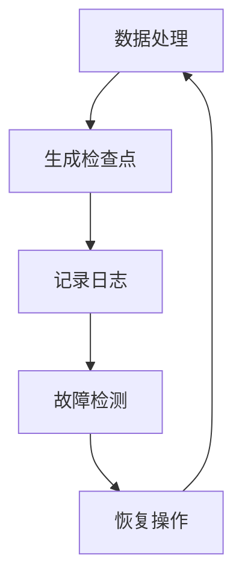

# Exactly-once语义在大数据分析中的挑战与解决方案

## 1. 背景介绍

在大数据分析领域，数据处理的准确性是至关重要的。Exactly-once语义是指在分布式计算环境中，无论数据处理过程中发生何种异常，每条数据都被处理且只被处理一次。这一概念对于确保数据分析结果的准确性和一致性至关重要。然而，由于网络延迟、系统故障以及软件缺陷等因素，实现Exactly-once语义面临着巨大的挑战。

## 2. 核心概念与联系

### 2.1 Exactly-once语义的定义

Exactly-once语义是指在分布式系统中，每条数据只被处理一次且仅一次。它确保在数据处理过程中，即使发生故障或异常，数据不会被重复处理或遗漏。Exactly-once语义是分布式系统中数据处理的最高标准。

### 2.2 分布式系统中的数据处理模型

在分布式系统中，数据处理模型通常包括以下几种：
- **批处理 (Batch Processing)**：数据被分批次处理，每批次的数据在处理前已经全部收集完毕。
- **流处理 (Stream Processing)**：数据在生成后立即被处理，处理过程是连续的、实时的。

### 2.3 Exactly-once、At-least-once和At-most-once的比较

- **Exactly-once**：每条数据只被处理一次且仅一次。
- **At-least-once**：每条数据至少被处理一次，可能会被重复处理。
- **At-most-once**：每条数据最多被处理一次，可能会被遗漏。

## 3. 核心算法原理具体操作步骤

### 3.1 分布式事务的协调

分布式事务用于确保多个节点上的操作要么全部成功，要么全部失败。常用的分布式事务协调协议包括：
- **两阶段提交 (2PC)**：分为准备阶段和提交阶段，确保所有参与节点的一致性。
- **三阶段提交 (3PC)**：在两阶段提交的基础上增加了一个准备确认阶段，进一步提高了系统的可靠性。

### 3.2 幂等性设计

幂等性是指同一操作重复执行多次，结果仍然相同。在实现Exactly-once语义时，设计幂等性操作可以有效避免重复处理带来的问题。

### 3.3 检查点和日志机制

检查点和日志机制用于记录系统的状态和操作历史，以便在发生故障时进行恢复：
- **检查点**：定期保存系统的状态快照。
- **日志**：记录每次操作的详细信息，便于故障恢复。

以下是一个简单的检查点和日志机制的Mermaid流程图：



## 4. 数学模型和公式详细讲解举例说明

### 4.1 分布式系统的可靠性模型

分布式系统的可靠性通常通过故障率和恢复率来衡量。假设系统的故障率为 $\lambda$，恢复率为 $\mu$，系统的可靠性可以表示为：
$$
R(t) = e^{-\lambda t}
$$

### 4.2 Exactly-once实现的概率分析

实现Exactly-once语义的概率可以通过以下公式进行分析：
$$
P_{exactly-once} = P_{success} \times (1 - P_{failure})^{n}
$$
其中，$P_{success}$ 是单次操作成功的概率，$P_{failure}$ 是单次操作失败的概率，$n$ 是操作的次数。

### 4.3 效率与准确性的权衡

在分布式系统中，效率与准确性常常需要权衡。提高准确性通常需要更多的计算资源和时间，而提高效率可能会降低数据处理的准确性。

## 5. 项目实践：代码实例和详细解释说明

### 5.1 Exactly-once语义的实现框架

实现Exactly-once语义的常用框架包括Apache Kafka、Apache Flink等。以下是使用Apache Kafka实现Exactly-once语义的示例代码：

### 5.2 示例代码分析

以下是使用Java和Apache Kafka实现Exactly-once语义的示例代码：

```java
import org.apache.kafka.clients.consumer.KafkaConsumer;
import org.apache.kafka.clients.consumer.ConsumerRecords;
import org.apache.kafka.clients.consumer.ConsumerRecord;
import org.apache.kafka.clients.producer.KafkaProducer;
import org.apache.kafka.clients.producer.ProducerRecord;
import org.apache.kafka.common.serialization.StringDeserializer;
import org.apache.kafka.common.serialization.StringSerializer;
import java.util.Properties;

public class ExactlyOnceExample {
    public static void main(String[] args) {
        // 配置消费者
        Properties consumerProps = new Properties();
        consumerProps.put("bootstrap.servers", "localhost:9092");
        consumerProps.put("group.id", "test-group");
        consumerProps.put("enable.auto.commit", "false");
        consumerProps.put("isolation.level", "read_committed");
        consumerProps.put("key.deserializer", StringDeserializer.class.getName());
        consumerProps.put("value.deserializer", StringDeserializer.class.getName());
        KafkaConsumer<String, String> consumer = new KafkaConsumer<>(consumerProps);

        // 配置生产者
        Properties producerProps = new Properties();
        producerProps.put("bootstrap.servers", "localhost:9092");
        producerProps.put("acks", "all");
        producerProps.put("retries", 0);
        producerProps.put("key.serializer", StringSerializer.class.getName());
        producerProps.put("value.serializer", StringSerializer.class.getName());
        producerProps.put("enable.idempotence", "true");
        KafkaProducer<String, String> producer = new KafkaProducer<>(producerProps);

        consumer.subscribe(List.of("input-topic"));

        while (true) {
            ConsumerRecords<String, String> records = consumer.poll(Duration.ofMillis(100));
            for (ConsumerRecord<String, String> record : records) {
                // 处理消息
                String processedValue = process(record.value());

                // 发送处理后的消息到输出主题
                ProducerRecord<String, String> producerRecord = new ProducerRecord<>("output-topic", record.key(), processedValue);
                producer.send(producerRecord);
            }
            // 手动提交偏移量
            consumer.commitSync();
        }
    }

    private static String process(String value) {
        // 模拟数据处理逻辑
        return value.toUpperCase();
    }
}
```

### 5.3 性能优化实践

在实现Exactly-once语义时，可以通过以下方法进行性能优化：
- **批量处理**：将多条消息批量处理，减少网络通信开销。
- **异步处理**：使用异步方式处理消息，提升系统吞吐量。
- **缓存机制**：在内存中缓存部分数据，减少磁盘I/O操作。

## 6. 实际应用场景

### 6.1 金融交易系统

在金融交易系统中，保证每笔交易只被处理一次且仅一次是至关重要的。Exactly-once语义可以确保交易数据的准确性，避免重复交易或漏交易。

### 6.2 实时数据分析

在实时数据分析中，Exactly-once语义可以确保数据分析结果的准确性。例如，在实时流处理系统中，每条数据只被处理一次，避免了数据重复处理带来的误差。

### 6.3 分布式数据库同步

在分布式数据库同步中，Exactly-once语义可以确保数据的一致性。每条数据在多个数据库节点间只被同步一次，避免了数据不一致的问题。

## 7. 工具和资源推荐

### 7.1 开源框架和库

- **Apache Kafka**：一个分布式流处理平台，支持Exactly-once语义。
- **Apache Flink**：一个流处理框架，提供Exactly-once状态一致性保证。
- **Debezium**：一个开源的分布式平台，用于变更数据捕获，支持Exactly-once语义。

### 7.2 监控和调试工具

- **Prometheus**：一个开源的系统监控和报警工具，可用于监控分布式系统的运行状态。
- **Grafana**：一个开源的可视化工具，可与Prometheus集成，实时展示系统性能指标。
- **Jaeger**：一个开源的分布式追踪系统，用于调试和监控分布式系统。

### 7.3 学习资源和社区

- **Kafka官方文档**：详细介绍了Kafka的使用方法和配置选项。
- **Flink官方文档**：提供了Flink的使用指南和示例代码。
- **Stack Overflow**：一个开发者社区，可以在上面找到与Exactly-once语义相关的问题和答案。

## 8. 总结：未来发展趋势与挑战

### 8.1 新兴技术的影响

新兴技术如边缘计算和物联网的发展，将进一步推动Exactly-once语义的应用和发展。这些技术需要在分布式环境中处理大量数据，Exactly-once语义对于确保数据处理的准确性和一致性至关重要。边缘计算可以将数据处理从中心节点分散到边缘节点，减少延迟，提高效率，而Exactly-once语义则可以确保这些分布式节点间的数据一致性。

### 8.2 业界标准的演进

随着分布式系统和大数据技术的发展，业界对于数据处理准确性的要求越来越高。Exactly-once语义作为数据处理的最高标准，正在逐步成为分布式系统中的重要指标。未来，可能会有更多的标准和协议被制定，以确保不同系统间的数据一致性和可靠性。

### 8.3 面临的主要挑战

尽管Exactly-once语义在理论上非常理想，但在实际应用中实现这一语义仍面临许多挑战：
- **网络延迟和抖动**：分布式系统中网络延迟和抖动是不可避免的，这会影响数据传输的可靠性。
- **系统故障和恢复**：分布式系统中的节点可能会出现故障，如何高效地进行故障恢复是一个重要问题。
- **资源开销**：实现Exactly-once语义需要额外的资源，如日志记录、状态检查点等，这会增加系统的资源开销。

## 9. 附录：常见问题与解答

### 9.1 Exactly-once语义的常见误区

#### 误区1：Exactly-once语义可以完全避免数据丢失
实际上，Exactly-once语义是为了确保每条数据只被处理一次且仅一次，但并不能完全避免数据丢失。系统仍需配合其他机制（如数据备份和恢复）来确保数据的完整性。

#### 误区2：所有分布式系统都能轻松实现Exactly-once语义
Exactly-once语义的实现依赖于具体的系统架构和设计，不是所有分布式系统都能轻松实现。实现过程中需要考虑系统的网络环境、故障恢复机制等多方面因素。

### 9.2 性能调优的常见问题

#### 问题1：如何在保证Exactly-once语义的同时优化系统性能？
可以通过批量处理、异步处理和缓存机制等方法来优化系统性能，同时确保Exactly-once语义。例如，批量处理可以减少网络通信开销，异步处理可以提升系统吞吐量，而缓存机制可以减少磁盘I/O操作。

#### 问题2：如何平衡Exactly-once语义的准确性和系统性能？
在实际应用中，可能需要在准确性和性能之间进行权衡。例如，在某些情况下，可能需要牺牲一些性能来确保数据处理的准确性，反之亦然。

### 9.3 实现Exactly-once语义的常见陷阱

#### 陷阱1：忽视网络延迟和故障
在分布式系统中，网络延迟和故障是不可避免的。如果忽视这些因素，可能会导致数据处理的准确性和一致性问题。

#### 陷阱2：未考虑系统的扩展性
Exactly-once语义的实现需要考虑系统的扩展性。如果系统无法有效扩展，可能会影响数据处理的效率和可靠性。

#### 陷阱3：过度依赖单一技术
在实现Exactly-once语义时，过度依赖单一技术可能会导致系统的脆弱性。应综合使用多种技术和方法，确保系统的可靠性和稳定性。


通过深入探讨Exactly-once语义的定义、核心算法、数学模型、实际应用及其实现方法，我们可以更好地理解和应用这一概念，以确保分布式系统中数据处理的准确性和一致性。希望本文能为读者提供有价值的参考，帮助解决在大数据分析和分布式计算中遇到的实际问题。

## 附：在实际应用中，如何处理网络延迟和抖动对Exactly-once语义的影响？ 


在实际应用中，网络延迟和抖动是分布式系统中不可避免的问题，这些问题会对Exactly-once语义的实现产生影响。为了有效处理这些问题，可以采取以下几种方法：

### 1. 使用分布式事务协调协议

#### 1.1 两阶段提交 (2PC)

两阶段提交协议通过准备阶段和提交阶段来确保所有参与节点的一致性。尽管2PC可以确保数据一致性，但其缺点是存在较高的网络延迟和阻塞风险。

#### 1.2 三阶段提交 (3PC)

三阶段提交协议在两阶段提交的基础上增加了一个准备确认阶段，进一步提高了系统的可靠性和容错性。3PC可以减少网络延迟和抖动对系统的一致性影响。

### 2. 幂等性设计

幂等性是指同一操作重复执行多次，结果仍然相同。通过设计幂等性操作，可以有效避免由于网络延迟和抖动导致的重复处理问题。例如，可以使用唯一标识符来标记每条数据，确保每条数据只被处理一次。

### 3. 检查点和日志机制

#### 3.1 检查点

定期保存系统的状态快照，以便在发生故障时进行恢复。检查点机制可以减少由于网络延迟和抖动导致的数据丢失和重复处理问题。

#### 3.2 日志

记录每次操作的详细信息，便于故障恢复。日志机制可以帮助系统在发生故障时恢复到一致状态，从而减少网络延迟和抖动的影响。

### 4. 超时和重试机制

#### 4.1 超时机制

设置合理的超时时间，当网络延迟超过设定的时间阈值时，自动重试操作。超时机制可以减少由于网络延迟导致的操作失败。

#### 4.2 重试机制

在操作失败时自动重试，以确保操作最终成功。重试机制可以有效应对网络抖动导致的临时故障。

### 5. 使用可靠的消息传递系统

选择可靠的消息传递系统，如Apache Kafka，它提供了端到端的Exactly-once语义保证。Kafka通过事务、幂等性和日志机制确保每条消息只被处理一次且仅一次。

### 6. 网络优化和监控

#### 6.1 网络优化

优化网络配置，减少延迟和抖动。例如，可以选择低延迟、高带宽的网络连接，使用负载均衡器来分配流量，减少拥塞。

#### 6.2 网络监控

使用监控工具实时监控网络状态，及时发现和解决网络延迟和抖动问题。常用的网络监控工具包括Prometheus、Grafana等。

### 7. 分布式系统设计原则

#### 7.1 数据分片

将数据分片存储在不同节点上，减少单个节点的负载，降低网络延迟和抖动的影响。

#### 7.2 副本机制

在多个节点上存储数据副本，确保数据的高可用性和一致性。副本机制可以在网络延迟和抖动导致的节点故障时提供数据恢复支持。

#### 7.3 一致性协议

使用一致性协议（如Paxos、Raft）来确保分布式系统中的数据一致性。这些协议通过多轮通信和投票机制，减少网络延迟和抖动对系统一致性的影响。

### 8. 实例代码示例

以下是一个使用Apache Kafka实现Exactly-once语义的示例代码，展示了如何处理网络延迟和抖动问题：

```java
import org.apache.kafka.clients.consumer.KafkaConsumer;
import org.apache.kafka.clients.consumer.ConsumerRecords;
import org.apache.kafka.clients.consumer.ConsumerRecord;
import org.apache.kafka.clients.producer.KafkaProducer;
import org.apache.kafka.clients.producer.ProducerRecord;
import org.apache.kafka.common.serialization.StringDeserializer;
import org.apache.kafka.common.serialization.StringSerializer;
import java.util.Properties;

public class ExactlyOnceExample {
    public static void main(String[] args) {
        // 配置消费者
        Properties consumerProps = new Properties();
        consumerProps.put("bootstrap.servers", "localhost:9092");
        consumerProps.put("group.id", "test-group");
        consumerProps.put("enable.auto.commit", "false");
        consumerProps.put("isolation.level", "read_committed");
        consumerProps.put("key.deserializer", StringDeserializer.class.getName());
        consumerProps.put("value.deserializer", StringDeserializer.class.getName());
        KafkaConsumer<String, String> consumer = new KafkaConsumer<>(consumerProps);

        // 配置生产者
        Properties producerProps = new Properties();
        producerProps.put("bootstrap.servers", "localhost:9092");
        producerProps.put("acks", "all");
        producerProps.put("retries", 0);
        producerProps.put("key.serializer", StringSerializer.class.getName());
        producerProps.put("value.serializer", StringSerializer.class.getName());
        producerProps.put("enable.idempotence", "true");
        KafkaProducer<String, String> producer = new KafkaProducer<>(producerProps);

        consumer.subscribe(List.of("input-topic"));

        while (true) {
            ConsumerRecords<String, String> records = consumer.poll(Duration.ofMillis(100));
            for (ConsumerRecord<String, String> record : records) {
                // 处理消息
                String processedValue = process(record.value());

                // 发送处理后的消息到输出主题
                ProducerRecord<String, String> producerRecord = new ProducerRecord<>("output-topic", record.key(), processedValue);
                producer.send(producerRecord);
            }
            // 手动提交偏移量
            consumer.commitSync();
        }
    }

    private static String process(String value) {
        // 模拟数据处理逻辑
        return value.toUpperCase();
    }
}
```

通过以上方法和技术，可以有效处理网络延迟和抖动对Exactly-once语义的影响，确保分布式系统中数据处理的准确性和一致性。

## 作者信息

作者：禅与计算机程序设计艺术 / Zen and the Art of Computer Programming