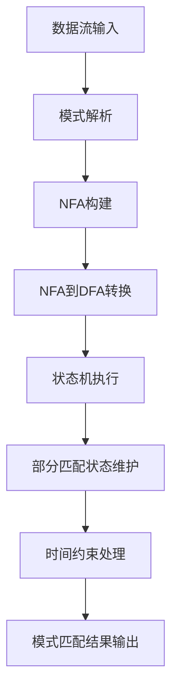

# FlinkCEP的模式匹配与规则引擎

## 1.背景介绍

在当今的大数据时代,实时数据处理和复杂事件处理(CEP)已成为许多企业和组织的关键需求。Apache Flink是一个开源的分布式流处理框架,它提供了强大的流处理能力,包括有状态计算、事件时间语义和高吞吐量。Flink CEP(复杂事件处理)是Flink提供的一个库,用于在无边界的事件流上进行模式匹配,从而检测出复杂的事件序列。

在许多应用场景中,我们需要从大量的事件流中识别出特定的模式或规则,例如:

- 金融领域:检测可能的欺诈交易模式
- 网络安全:识别入侵攻击模式
- 物联网:监测设备故障模式
- 电子商务:分析用户行为模式

Flink CEP提供了一种声明式的API,允许开发人员使用类似SQL的模式语言(如正则表达式)来定义要搜索的模式。一旦检测到匹配的复杂事件,就可以对其进行进一步处理、过滤或转换。

## 2.核心概念与联系

在探讨Flink CEP的模式匹配和规则引擎之前,我们需要了解一些核心概念:

### 2.1 事件(Event)

事件是数据流中的基本单位,可以是任何类型的记录或消息。在Flink CEP中,事件通常是一个POJO(Plain Old Java Object)类的实例。

### 2.2 模式(Pattern)

模式是一个规则或条件的集合,用于描述我们想要检测的复杂事件序列。Flink CEP使用一种类似正则表达式的模式语言来定义模式。

### 2.3 模式序列(Pattern Sequence)

模式序列是指事件按特定顺序出现的模式。例如,我们可以定义一个模式序列来检测"登录 -> 查看个人资料 -> 下单"这样的用户行为序列。

### 2.4 模式组(Pattern Group)

模式组是指一组可替换的模式条件。例如,我们可以定义一个模式组来检测"登录失败3次"或"密码错误5次"这样的安全事件。

### 2.5 时间约束(Time Constraints)

时间约束用于限制模式中事件之间的时间间隔。例如,我们可以设置一个时间窗口,只考虑5分钟内发生的事件序列。

### 2.6 迭代条件(Iteration Conditions)

迭代条件用于指定模式中的事件可以重复出现的次数。例如,我们可以定义一个模式,要求事件A必须出现至少两次。

这些核心概念相互关联,共同构建了Flink CEP的模式匹配和规则引擎的基础。通过组合这些概念,我们可以定义复杂的事件模式,并在实时数据流中进行高效的模式匹配。

## 3.核心算法原理具体操作步骤

Flink CEP的模式匹配算法基于有限状态自动机(Finite State Machine,FSM)。在这个过程中,每个模式都被转换为一个状态机,事件流则作为状态机的输入。当状态机遇到匹配的事件序列时,它就会进入"接受"状态,从而检测到一个复杂事件。

以下是Flink CEP模式匹配的核心算法步骤:

1. **模式解析**: 将用户定义的模式解析为一个有限状态自动机(FSM)。每个模式条件对应状态机中的一个状态,模式序列则对应状态机中的状态转移。

2. **NFA构建**: 根据解析后的FSM,构建一个非确定有限自动机(Non-deterministic Finite Automaton,NFA)。NFA能够高效地处理模式中的选择(模式组)和迭代(重复事件)。

3. **NFA到DFA的转换**: 将NFA转换为确定有限自动机(Deterministic Finite Automaton,DFA),以提高模式匹配的效率。这一步使用子集构造算法(Subset Construction)。

4. **状态机执行**: 将事件流作为输入,在DFA上执行模式匹配。每当状态机进入"接受"状态时,就代表检测到一个匹配的复杂事件。

5. **部分匹配状态维护**: 为了处理乱序事件和延迟数据,Flink CEP维护部分匹配的状态,以便在未来的事件到达时继续匹配。

6. **时间约束处理**: 对于带有时间约束的模式,Flink CEP使用时间窗口和计时器来跟踪事件的时间戳,并根据时间约束过滤掉无效的部分匹配状态。

该算法的优点是高效、可扩展,并且能够处理乱序事件和延迟数据。通过将模式转换为状态机,Flink CEP可以在实时数据流上进行高速模式匹配,满足各种复杂场景的需求。

## 4.数学模型和公式详细讲解举例说明

在探讨Flink CEP的模式匹配算法时,我们需要了解一些相关的数学模型和公式。

### 4.1 有限状态自动机(FSM)

有限状态自动机是一种用于模式匹配的数学模型,由一组有限的状态、一个初始状态、一组输入符号、一个转移函数和一组终止状态组成。

FSM可以用一个5元组来表示:

$$
M = (Q, \Sigma, \delta, q_0, F)
$$

其中:

- $Q$ 是一个有限的状态集合
- $\Sigma$ 是一个有限的输入符号集合
- $\delta: Q \times \Sigma \rightarrow Q$ 是状态转移函数
- $q_0 \in Q$ 是初始状态
- $F \subseteq Q$ 是终止状态的集合

在Flink CEP中,每个模式条件对应FSM中的一个状态,模式序列则对应状态之间的转移。当FSM进入终止状态时,就代表检测到一个匹配的复杂事件。

### 4.2 非确定有限自动机(NFA)

非确定有限自动机是FSM的一种扩展,它允许在同一个输入符号下,从一个状态转移到多个可能的状态。NFA的转移函数可以表示为:

$$
\delta: Q \times \Sigma \rightarrow \mathcal{P}(Q)
$$

其中,$ \mathcal{P}(Q)$ 表示 $Q$ 的幂集,即所有可能的状态集合。

在Flink CEP中,NFA用于高效地处理模式中的选择(模式组)和迭代(重复事件)。例如,对于模式 `(a + b) c*`,NFA可以在接收到 `a` 或 `b` 时进入不同的状态,并允许 `c` 事件重复出现任意次数。

### 4.3 确定有限自动机(DFA)

确定有限自动机是一种特殊的FSM,其转移函数满足确定性:

$$
\delta: Q \times \Sigma \rightarrow Q
$$

也就是说,在给定当前状态和输入符号的情况下,DFA只有一个可能的下一状态。

Flink CEP使用子集构造算法(Subset Construction)将NFA转换为DFA,以提高模式匹配的效率。该算法的基本思想是将NFA中的每个状态集合视为DFA中的一个状态,并根据NFA的转移规则构建DFA的转移函数。

### 4.4 时间约束处理

对于带有时间约束的模式,Flink CEP使用时间窗口和计时器来跟踪事件的时间戳,并根据时间约束过滤掉无效的部分匹配状态。

设定一个时间窗口 $[t_0, t_1]$,对于任意事件 $e$ 及其时间戳 $t(e)$,如果 $t(e) \notin [t_0, t_1]$,则该事件将被过滤掉。

此外,Flink CEP还使用计时器来维护部分匹配状态的生存时间。当一个部分匹配状态的生存时间超过时间约束时,它将被清除。

通过结合时间窗口和计时器,Flink CEP可以高效地处理带有时间约束的模式,确保只考虑有效的事件序列。

以上是Flink CEP模式匹配算法中涉及的一些重要数学模型和公式。通过这些模型和公式,我们可以更好地理解Flink CEP的工作原理,并为复杂事件处理提供理论基础。

## 5.项目实践:代码实例和详细解释说明

为了更好地理解Flink CEP的模式匹配和规则引擎,我们将通过一个实际项目案例来演示其用法和实现。

在这个案例中,我们将构建一个简单的fraud检测系统,用于监测可疑的金融交易活动。我们将定义一些规则,如果检测到匹配的交易模式,就会触发相应的警报。

### 5.1 定义事件类型

首先,我们需要定义表示金融交易的事件类型。在这个例子中,我们将使用一个简单的POJO类:

```java
public class TransactionEvent {
    private String accountId;
    private double amount;
    private String transactionType;
    // 构造函数、getter和setter方法
}
```

### 5.2 定义模式

接下来,我们将定义一些规则,用于检测可疑的交易活动。例如:

1. 同一账户在5分钟内进行3次或更多的大额转账(金额超过10000美元)
2. 同一账户在10分钟内进行5次或更多的小额取款(金额低于100美元)
3. 同一账户在1小时内进行10次或更多的转账或取款操作

我们可以使用Flink CEP的模式语言来定义这些规则:

```java
// 规则1
Pattern<TransactionEvent, ?> largeTransfersPattern =
    Pattern.<TransactionEvent>begin("start")
        .where(event -> event.getTransactionType().equals("TRANSFER")
            && event.getAmount() > 10000)
        .times(3)
        .within(Time.minutes(5));

// 规则2
Pattern<TransactionEvent, ?> smallWithdrawalsPattern =
    Pattern.<TransactionEvent>begin("start")
        .where(event -> event.getTransactionType().equals("WITHDRAWAL")
            && event.getAmount() < 100)
        .times(5)
        .within(Time.minutes(10));

// 规则3
Pattern<TransactionEvent, ?> frequentActivityPattern =
    Pattern.<TransactionEvent>begin("start")
        .where(event -> event.getTransactionType().equals("TRANSFER")
            || event.getTransactionType().equals("WITHDRAWAL"))
        .times(10)
        .within(Time.hours(1));
```

在这些模式定义中,我们使用了`where`条件来过滤事件,`times`条件来指定事件重复出现的次数,以及`within`条件来设置时间约束。

### 5.3 应用模式匹配

接下来,我们需要将定义好的模式应用到实时数据流上,以进行模式匹配。我们将使用Flink CEP提供的`PatternStream`API:

```java
DataStream<TransactionEvent> transactions = env.addSource(...);

PatternStream<TransactionEvent> patternStream = CEP.pattern(
    transactions,
    largeTransfersPattern.or(smallWithdrawalsPattern).or(frequentActivityPattern)
);

DataStream<Alert> alerts = patternStream.process(
    new PatternProcessFunction<TransactionEvent, Alert>() {
        @Override
        public void processMatch(
            Map<String, List<TransactionEvent>> pattern,
            Context ctx,
            Collector<Alert> out) throws Exception {
            // 生成警报
            out.collect(new Alert(...));
        }
    }
);
```

在这段代码中,我们首先从数据源获取`TransactionEvent`的数据流。然后,我们使用`CEP.pattern`方法将之前定义的模式应用到数据流上,生成一个`PatternStream`。

最后,我们使用`process`方法为每个匹配的模式执行自定义的处理逻辑。在这个例子中,我们简单地生成一个`Alert`对象,表示检测到了可疑的交易活动。

### 5.4 Mermaid流程图

下面是Flink CEP模式匹配的核心流程,使用Mermaid流程图进行可视化:



在这个流程中,输入的数据流首先经过模式解析,将用户定义的模式转换为NFA。然后,NFA被转换为DFA,以提高模式匹配的效率。接下来,事件流作为输入