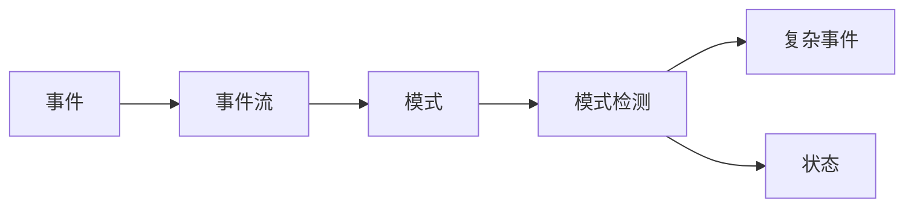

# FlinkCEP的高级特性与未来发展

## 1. 背景介绍
### 1.1 实时数据处理的重要性
在当今数据驱动的世界中,实时数据处理变得越来越重要。企业需要快速响应业务变化,实时洞察客户行为,预测潜在风险等。传统的批处理方式已经无法满足实时性要求。

### 1.2 复杂事件处理(CEP)概述
复杂事件处理(Complex Event Processing, CEP)是一种实时分析多个事件流,检测复杂事件模式的技术。CEP可以帮助企业在海量数据中及时发现有价值的信息,实现自动化决策和快速响应。

### 1.3 Apache Flink与CEP 
Apache Flink是一个高性能、分布式的流处理框架,提供了CEP库FlinkCEP用于在Flink上进行复杂事件处理。FlinkCEP支持灵活的模式匹配、事件时间处理、状态管理等特性,是构建实时CEP应用的理想选择。

## 2. 核心概念与关联
### 2.1 事件(Event)
事件是CEP的基本处理单元,可以是任意数据类型如文本、对象等。每个事件通常包含时间戳和携带的数据。

### 2.2 事件流(Event Stream)  
事件流是一系列按时间顺序排列的事件集合。CEP的目标就是从事件流中检测出感兴趣的事件模式。

### 2.3 模式(Pattern)
模式定义了要从事件流中检测的复杂事件结构,由一系列条件按特定的时序关系组成。FlinkCEP使用类SQL的语法来定义模式。

### 2.4 模式检测(Pattern Detection) 
模式检测就是将输入的事件流与定义的模式进行匹配,输出符合模式的复杂事件。FlinkCEP采用NFA(非确定有限自动机)进行模式检测。

### 2.5 状态(State)
在CEP中,状态用来存储模式匹配过程中的中间结果,如部分匹配的事件、统计信息等。FlinkCEP支持状态的管理与容错。

### 核心概念关联图


## 3. 核心算法原理与步骤
### 3.1 NFA模式匹配算法
FlinkCEP采用NFA(非确定有限自动机)算法进行事件模式匹配。对于每个输入事件,NFA会尝试将其匹配到当前的状态,并进行状态转移。如果到达终止状态则输出匹配的复杂事件。

### 3.2 共享缓存优化
为了避免重复的部分匹配,FlinkCEP使用共享缓存来存储中间结果。相同的部分匹配只存储一次,可以被多个模式匹配路径共享,提高计算效率。

### 3.3 基于时间的窗口聚合
FlinkCEP支持在模式匹配过程中进行基于事件时间或处理时间的窗口聚合计算。这样可以实现如统计一段时间内的匹配次数等需求。

### 3.4 迭代式模式匹配步骤
1. 定义事件模式
2. 将模式转换为共享的NFA 
3. 对于每个输入事件,遍历NFA尝试匹配
4. 匹配成功则根据策略输出复杂事件
5. 超时或窗口结束则清理状态
6. 处理下一个事件,重复3-5

## 4. 数学模型与公式
### 4.1 事件流模型
设事件流为一个时间序列 $E=\{e_1,e_2,...,e_n\}$,其中 $e_i$ 表示第i个事件,包含时间戳 $t_i$ 和数据 $d_i$,即 $e_i=(t_i,d_i)$。

### 4.2 模式匹配的形式化定义
设模式为 $P=\{p_1,p_2,...,p_m\}$,其中 $p_j$ 为一个事件条件。
一个事件序列 $S=\{e_{k1},e_{k2},...,e_{km}\}$ 匹配模式P,当且仅当:

$$
\begin{aligned}
& t_{k1} \leq t_{k2} \leq ... \leq t_{km} \\
& d_{ki} \in p_i, i=1,2,...,m
\end{aligned}
$$

即事件的时间戳满足先后顺序,且事件数据满足各个条件。

### 4.3 NFA匹配时间复杂度
假设事件流有n个事件,定义的模式有m个条件,则NFA匹配的时间复杂度为 $O(nm)$。
共享缓存可以将部分匹配的空间复杂度从指数级优化至多项式级。

### 4.4 窗口聚合计算
设窗口长度为t,聚合函数为f,则窗口聚合可表示为:

$$ agg = f(\{e_i | e_i \in E, t_i \in [t_0,t_0+t)\}) $$

即对落在窗口内的事件子流进行聚合计算。

## 5. 项目实践
### 5.1 环境准备
首先需要准备Flink和FlinkCEP的开发环境,可以使用Maven引入相关依赖:

```xml
<dependency>
  <groupId>org.apache.flink</groupId>
  <artifactId>flink-streaming-java_2.11</artifactId>
  <version>1.12.0</version>
</dependency>
<dependency>
  <groupId>org.apache.flink</groupId>
  <artifactId>flink-cep_2.11</artifactId>
  <version>1.12.0</version>
</dependency>
```

### 5.2 定义事件模式
使用Pattern API定义要检测的复杂事件模式,例如:

```java
Pattern<Event, ?> pattern = Pattern.<Event>begin("start")
    .where(evt -> evt.getId() == 42)
    .next("middle")
    .subtype(SubEvent.class)
    .where(subEvt -> subEvt.getVolume() >= 10.0)
    .followedBy("end")
    .where(evt -> evt.getName().equals("end"));
```

### 5.3 应用模式并处理结果
将定义好的模式应用到事件流上,处理匹配的复杂事件:

```java
PatternStream<Event> patternStream = CEP.pattern(eventStream, pattern);

OutputTag<String> outputTag = new OutputTag<String>("side-output"){};

SingleOutputStreamOperator<ComplexEvent> result = patternStream.select(
    outputTag,
    new PatternTimeoutFunction<Event, String>() {...},
    new PatternSelectFunction<Event, ComplexEvent>() {
        @Override
        public ComplexEvent select(Map<String, List<Event>> pattern) {
            return new ComplexEvent(pattern);
        }
    }
);
```

### 5.4 处理超时事件
通过PatternTimeoutFunction可以处理超时的部分匹配事件,例如报警:

```java
patternStream.select(outputTag,
    (pattern, timestamp, out) -> {
        out.collect("Timeout: " + pattern);
    }, 
    ...
);

result.getSideOutput(outputTag).print();
```

## 6. 应用场景
### 6.1 实时风控
利用CEP可以实时检测用户交易行为中的欺诈模式,如短时间内多次小额转账后大额取现等,实现实时风险预警。

### 6.2 设备故障检测
通过CEP分析设备传感器数据流,定义故障模式如温度过高、压力异常等,及时发现设备故障并自动报警。

### 6.3 用户行为分析
使用CEP可以实时发现用户行为模式,如在电商网站中分析用户的浏览、加购、下单等一系列行为,实现个性化推荐。  

### 6.4 物联网数据监控
CEP可用于海量物联网传感器数据的实时监控与异常检测,如城市交通拥堵预警、智能电网负荷分析等。

## 7. 工具与资源
### 7.1 FlinkCEP官方文档
Flink官网提供了FlinkCEP详细的开发文档与API说明,是学习和使用的权威指南。
https://ci.apache.org/projects/flink/flink-docs-release-1.12/dev/libs/cep.html

### 7.2 Flink SQL CEP
Flink 1.13引入了全新的SQL CEP,支持直接在SQL中定义模式并进行检测,大大简化了CEP应用的开发。
https://ci.apache.org/projects/flink/flink-docs-master/docs/dev/table/sql/queries/match_recognize/

### 7.3 Flink CEP Playground
这是一个在线的CEP模式测试工具,可以交互式地编写CEP模式并对输入事件流进行测试,帮助快速验证CEP逻辑。
https://flink.apache.org/visualizer/

### 7.4 CEP论文与学术资源
CEP涉及事件处理、流数据管理、时态逻辑等多个学术领域,以下是一些重要的论文与综述:

- Complex Event Processing: Challenges and Opportunities. Gianpaolo Cugola, Alessandro Margara. VLDB 2012.
- Event Processing in Action. Opher Etzion, Peter Niblett. Manning 2010.
- Foundations of Complex Event Processing. Alexander Artikis, Opher Etzion, Zohar Feldman, Fabiana Fournier. ACM Computing Surveys 2012.

## 8. 未来发展与挑战
### 8.1 CEP与AI的结合
传统CEP主要依赖预定义的规则,缺乏灵活性与自适应能力。引入机器学习可以从历史数据中自动挖掘事件模式,实现CEP的智能化。同时CEP也为机器学习提供了实时特征。二者结合有望成为智能实时决策的新范式。

### 8.2 CEP的标准化
目前CEP缺乏统一的模式定义语言和处理语义,不同CEP系统间的应用移植成本高。未来需要在学术界和工业界共同推动CEP的标准化,制定通用的CEP语言规范。

### 8.3 更高的性能与可扩展性
随着数据规模和复杂度的增长,CEP系统面临更大的性能压力。需要在算法、架构、执行引擎各个层面进行优化,如更细粒度的状态管理、自适应负载均衡、硬件加速等,提升CEP的处理能力。

### 8.4 面向特定领域的CEP
不同行业领域对CEP有不同的需求,通用的CEP系统难以满足所有场景。未来CEP技术将向垂直行业渗透,提供面向具体领域优化的CEP方案,如金融风控CEP、工业物联网CEP等。

## 9. 常见问题
### Q1: FlinkCEP与Flink SQL CEP的区别?
A1: FlinkCEP是Flink提供的基于DataStream API的CEP库,用Java或Scala代码定义模式并处理匹配事件。Flink SQL CEP是1.13版本引入的新特性,允许直接在SQL中定义MATCH_RECOGNIZE子句进行CEP。SQL CEP简化了CEP应用的定义,但FlinkCEP提供了更强的表达能力和灵活性。

### Q2: FlinkCEP支持哪些时间语义?
A2: FlinkCEP同时支持事件时间(event time)和处理时间(processing time)语义。可以在模式定义中指定时间约束,如限定连续事件的时间间隔。窗口聚合时也可以基于不同的时间属性。

### Q3: FlinkCEP的处理能力如何?
A3: FlinkCEP基于Flink的分布式流处理引擎,可以实现高吞吐、低延迟、exactly-once的CEP处理。通过并行化和状态分片,FlinkCEP可以支持每秒数百万事件的大规模实时处理。

### Q4: FlinkCEP如何保证exactly-once?
A4: FlinkCEP依赖Flink的checkpoint机制实现端到端的exactly-once。通过周期性地将算子状态快照并持久化,在故障恢复时可以将状态恢复到之前的一致点,避免数据丢失或重复。同时Flink采用了一系列措施来保证状态的一致性,如屏障对齐、异步快照等。

### Q5: FlinkCEP能否处理乱序事件?
A5: FlinkCEP支持处理乱序事件。在模式定义时可以设置事件的时间约束,如允许一定范围内的乱序。同时Flink内部的Watermark机制可以容忍有界的延迟事件。对于超过约束的事件,可以通过sideOutput将其输出到侧输出流进行特殊处理。

作者：禅与计算机程序设计艺术 / Zen and the Art of Computer Programming