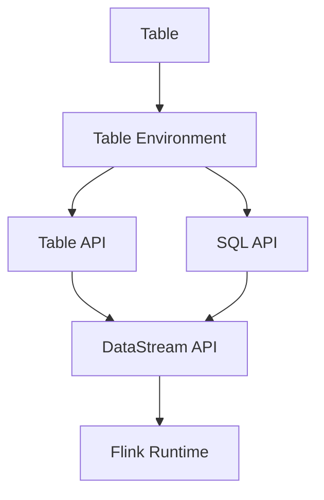

# FlinkTableAPI:数据转换与数据映射

## 1.背景介绍

在当今数据密集型应用程序的世界中,能够高效处理大规模数据流成为了一项关键能力。Apache Flink是一个开源的分布式流处理框架,它提供了强大的流处理引擎,并支持高吞吐量和低延迟的数据处理。Flink Table API作为Flink的重要组成部分,为用户提供了声明式的数据流处理方式,使得数据转换和映射操作变得更加简单和高效。

### 1.1 数据处理的挑战

在传统的数据处理系统中,数据通常以批处理的方式进行处理,这意味着必须先将所有数据加载到内存或磁盘中,然后再对其进行处理。然而,随着数据量的不断增长和实时性需求的提高,这种处理方式已经无法满足现代应用程序的需求。

现代数据处理系统需要能够实时处理持续到来的数据流,并及时产生结果。这对系统的吞吐量、延迟和可伸缩性提出了更高的要求。同时,数据转换和映射操作也变得更加复杂,需要更加灵活和高效的处理方式。

### 1.2 Flink Table API的优势

Flink Table API旨在解决上述挑战,它提供了一种声明式的数据流处理方式,使得数据转换和映射操作变得更加简单和高效。通过Table API,用户可以使用类SQL语法来定义数据转换逻辑,而无需关注底层的流处理细节。

Flink Table API的主要优势包括:

- **统一的批流处理**:Table API支持对批量数据和流式数据进行统一的处理,无需区分处理逻辑。
- **高效的执行引擎**:Table API背后由Flink的高性能流处理引擎提供支持,能够实现高吞吐量和低延迟的数据处理。
- **丰富的数据转换操作**:Table API提供了丰富的数据转换和映射操作,如过滤、投影、聚合、连接等,能够满足复杂的数据处理需求。
- **与外部系统的无缝集成**:Table API支持与各种外部数据源和接收器进行无缝集成,如Apache Kafka、JDBC、文件系统等。

通过利用Flink Table API,开发人员可以更加专注于数据处理逻辑的定义,而将底层的执行细节交给Flink引擎处理,从而提高了开发效率和系统性能。

## 2.核心概念与联系

在深入探讨Flink Table API的数据转换和映射功能之前,让我们先了解一些核心概念及其之间的关系。



### 2.1 Table

在Flink中,`Table`是一个逻辑概念,表示一个数据集合,可以是批量数据或流式数据。`Table`具有schema,用于描述其中包含的字段及其类型。`Table`可以通过各种方式创建,如从外部数据源读取、通过转换操作生成等。

### 2.2 Table Environment

`Table Environment`是Flink中管理`Table`的核心组件。它提供了创建`Table`、执行SQL查询以及注册外部数据源等功能。根据使用的API不同,有两种`Table Environment`:

- `StreamTableEnvironment`:用于流式处理场景,基于`DataStream API`。
- `BatchTableEnvironment`:用于批处理场景,基于`DataSet API`。

### 2.3 Table API

`Table API`是Flink提供的一种基于关系代数的API,用于定义`Table`上的转换操作。它提供了类似SQL的语法,但在Java/Scala/Python等语言中使用。通过`Table API`,开发人员可以组合各种转换操作,构建复杂的数据处理流程。

### 2.4 SQL API

`SQL API`允许开发人员使用标准的SQL语法来定义`Table`上的转换操作。Flink内置了对SQL的支持,并提供了一些扩展功能,如流式SQL等。`SQL API`和`Table API`可以相互转换,开发人员可以根据需求选择使用。

### 2.5 DataStream API

`DataStream API`是Flink的底层API,用于定义流式数据处理逻辑。`Table API`和`SQL API`最终会被转换为`DataStream`程序,并由Flink的流处理引擎执行。

### 2.6 Flink Runtime

`Flink Runtime`是Flink的核心执行引擎,负责调度和执行`DataStream`程序。它采用了分布式架构,能够在集群环境中高效地执行数据处理任务,并提供了容错、恢复等功能。

上述概念相互关联,共同构建了Flink的数据处理生态系统。开发人员可以通过`Table API`或`SQL API`定义数据转换逻辑,而无需关注底层的流处理细节。Flink会自动将这些逻辑转换为`DataStream`程序,并由高性能的`Flink Runtime`执行。

## 3.核心算法原理具体操作步骤

Flink Table API提供了丰富的数据转换和映射操作,下面我们将详细介绍其中的核心算法原理和具体操作步骤。

### 3.1 投影(Projection)

投影操作用于从`Table`中选择特定的列或计算新列。它的核心算法原理是遍历输入数据,并根据指定的列或计算表达式生成新的结果行。

具体操作步骤如下:

1. 调用`Table`对象的`select()`方法,指定要选择的列或计算表达式。
2. Flink会解析这些表达式,并构建一个投影操作符。
3. 在执行时,投影操作符会遍历输入数据,对每一行数据应用指定的表达式,生成新的结果行。
4. 最终得到一个新的`Table`对象,其schema反映了投影操作的结果。

示例:

```java
Table projectedTable = inputTable.select($("name"), $("age"), $("salary").plus(1000));
```

在上面的示例中,我们从`inputTable`中选择了`name`和`age`列,并计算了`salary + 1000`作为新列。

### 3.2 过滤(Filter)

过滤操作用于根据指定的条件从`Table`中过滤出符合条件的行。它的核心算法原理是遍历输入数据,对每一行应用过滤条件,只保留符合条件的行。

具体操作步骤如下:

1. 调用`Table`对象的`filter()`方法,传入一个过滤条件表达式。
2. Flink会解析这个表达式,并构建一个过滤操作符。
3. 在执行时,过滤操作符会遍历输入数据,对每一行应用过滤条件表达式,只保留结果为`true`的行。
4. 最终得到一个新的`Table`对象,其中只包含符合条件的行。

示例:

```java
Table filteredTable = inputTable.filter($("age").isGreaterOrEqual(18));
```

在上面的示例中,我们从`inputTable`中过滤出`age`大于或等于18的行。

### 3.3 聚合(Aggregate)

聚合操作用于对`Table`中的数据进行聚合计算,如求和、计数、最大值等。它的核心算法原理是首先根据指定的键(key)对输入数据进行分组,然后对每个组内的数据应用聚合函数进行计算。

具体操作步骤如下:

1. 调用`Table`对象的`groupBy()`方法,指定分组键。
2. 调用`aggregate()`方法,指定要应用的聚合函数。
3. Flink会解析这些表达式,并构建一个聚合操作符。
4. 在执行时,聚合操作符会首先根据分组键对输入数据进行分组,然后对每个组内的数据应用指定的聚合函数,生成新的结果行。
5. 最终得到一个新的`Table`对象,其中每一行代表一个组及其聚合结果。

示例:

```java
Table aggregatedTable = inputTable
    .groupBy($("department"))
    .aggregate($("salary").sum().as("totalSalary"))
    .select($("department"), $("totalSalary"));
```

在上面的示例中,我们首先根据`department`列对`inputTable`进行分组,然后对每个组内的`salary`列求和,并将结果命名为`totalSalary`。最后,我们选择`department`和`totalSalary`两列作为结果。

### 3.4 连接(Join)

连接操作用于将两个`Table`中的数据进行关联,根据指定的条件将相关的行组合在一起。它的核心算法原理是首先根据连接条件对两个输入`Table`进行分区,然后在每个分区内进行实际的连接操作。

具体操作步骤如下:

1. 调用`Table`对象的`join()`方法,传入另一个`Table`对象和连接条件表达式。
2. Flink会解析连接条件表达式,并构建一个连接操作符。
3. 在执行时,连接操作符会首先根据连接条件对两个输入`Table`进行分区,确保相关的行被分配到同一个分区。
4. 在每个分区内,连接操作符会遍历两个输入`Table`的行,根据连接条件将相关的行组合在一起,生成新的结果行。
5. 最终得到一个新的`Table`对象,其中每一行包含了来自两个输入`Table`的相关数据。

示例:

```java
Table joinedTable = employeeTable
    .join(departmentTable)
    .where($("depId").isEqual($("id")))
    .select($("name"), $("salary"), $("depName"));
```

在上面的示例中,我们将`employeeTable`和`departmentTable`根据`depId`和`id`列的相等条件进行连接,并选择`name`、`salary`和`depName`三列作为结果。

### 3.5 Union

Union操作用于将两个`Table`中的数据进行合并,生成一个新的`Table`。它的核心算法原理是遍历两个输入`Table`的所有行,并将它们合并到一个新的`Table`中。

具体操作步骤如下:

1. 调用`Table`对象的`union()`方法,传入另一个`Table`对象。
2. Flink会检查两个输入`Table`的schema是否兼容,如果不兼容则会抛出异常。
3. 在执行时,Union操作符会遍历两个输入`Table`的所有行,并将它们合并到一个新的`Table`中。
4. 最终得到一个新的`Table`对象,其中包含了来自两个输入`Table`的所有行。

示例:

```java
Table unionedTable = table1.union(table2);
```

在上面的示例中,我们将`table1`和`table2`进行Union操作,生成一个新的`Table`对象`unionedTable`。

### 3.6 窗口操作(Window)

窗口操作用于对`Table`中的数据进行窗口化处理,例如计算滚动平均值、计数等。它的核心算法原理是根据指定的窗口分配器(Window Assigner)对输入数据进行分组,然后对每个窗口内的数据应用聚合函数进行计算。

具体操作步骤如下:

1. 调用`Table`对象的`window()`方法,指定窗口分配器。
2. 调用`aggregate()`方法,指定要应用的聚合函数。
3. Flink会解析这些表达式,并构建一个窗口操作符。
4. 在执行时,窗口操作符会首先根据窗口分配器对输入数据进行分组,形成多个窗口。
5. 对每个窗口内的数据,窗口操作符会应用指定的聚合函数,生成新的结果行。
6. 最终得到一个新的`Table`对象,其中每一行代表一个窗口及其聚合结果。

示例:

```java
Table windowedTable = inputTable
    .window(TumblingEventTimeWindows.of(Time.seconds(10)))
    .aggregate($("value").sum().as("sum"))
    .select($("window"), $("sum"));
```

在上面的示例中,我们使用10秒的滚动事件时间窗口对`inputTable`进行窗口化处理,对每个窗口内的`value`列求和,并选择`window`和`sum`两列作为结果。

通过上述核心算法原理和具体操作步骤,我们可以看到Flink Table API提供了丰富的数据转换和映射操作,能够满足复杂的数据处理需求。这些操作的实现基于Flink的高性能流处理引擎,能够实现高吞吐量和低延迟的数据处理。

## 4.数学模型和公式详细