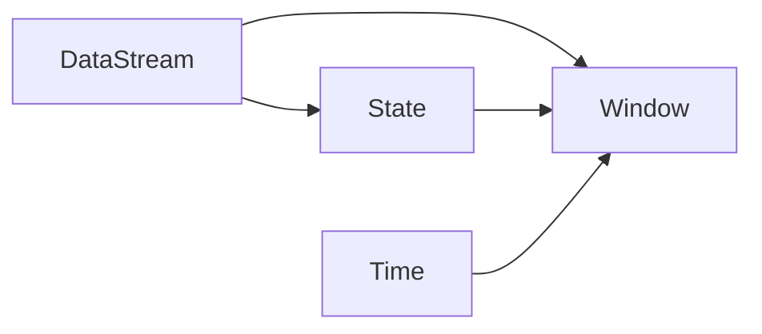

# Flink原理与代码实例讲解

## 1.背景介绍
### 1.1 大数据处理的挑战
在当今大数据时代,海量数据的实时处理和分析已成为众多企业面临的重大挑战。传统的批处理框架如Hadoop MapReduce难以满足实时性要求,而Storm等流处理框架虽然实时性较好,但在exactly-once语义保证、状态管理等方面仍有不足。
### 1.2 Flink的诞生
Apache Flink作为新一代大数据处理引擎应运而生。它是一个开源的分布式流处理和批处理框架,具有低延迟、高吞吐、exactly-once语义保证等优点,并提供了丰富的API和类库,使得开发者能够方便地构建高效可靠的大数据应用。
### 1.3 Flink的应用现状
目前Flink已被广泛应用于电商、金融、物联网、电信等领域,国内外众多知名公司如阿里巴巴、腾讯、优步、华为等都在生产环境中大规模使用Flink。Flink社区也非常活跃,版本迭代快,生态不断完善。

## 2.核心概念与联系
### 2.1 数据流(DataStream)
Flink将数据看作是一个无界的事件流,称为DataStream。事件可以是一条日志、一个传感器读数、一次用户操作等。DataStream API提供了对数据流的转换操作,如map、filter、reduce等。
### 2.2 状态(State)
由于流数据的无界性,Flink引入了状态的概念。算子可以访问和修改状态,状态数据在故障恢复时能够自动恢复。Flink支持ValueState、ListState、MapState等多种状态类型。
### 2.3 时间(Time)
Flink支持三种时间概念:Processing Time、Event Time和Ingestion Time。Processing Time指的是算子处理事件的机器时间,Event Time指的是事件自身携带的生成时间,Ingestion Time指的是事件进入Flink的时间。
### 2.4 窗口(Window) 
为了处理无界流,Flink提供了窗口机制将流切分成有界的数据集。常见的窗口类型有滚动窗口(Tumbling Window)、滑动窗口(Sliding Window)、会话窗口(Session Window)等。窗口可以基于时间(Time Window)或数量(Count Window)来定义。
### 2.5 关系图
下图展示了Flink核心概念之间的关系:


## 3.核心算法原理具体操作步骤
### 3.1 Flink运行架构
Flink采用主从架构,由JobManager和TaskManager组成。JobManager负责任务调度和资源管理,TaskManager负责执行具体的算子任务。
### 3.2 任务提交流程
1. 用户通过Client提交Flink Job;
2. JobManager将Job转换成优化后的执行计划;
3. JobManager向ResourceManager申请资源,将任务分发给TaskManager;
4. TaskManager部署Operator并执行计算。
### 3.3 窗口算子原理
以滚动时间窗口为例:
1. 数据源源不断产生数据并发送到WindowOperator;
2. WindowOperator根据时间边界将数据分配到不同的Window中;
3. 当Window触发计算条件时,执行Window Function,并输出结果。
### 3.4 状态存储与容错
Flink将状态数据持久化在StateBackend中,默认使用内存型的MemoryStateBackend。当TaskManager发生故障时,可以从最近的Checkpoint中恢复状态数据,从而保证exactly-once。

## 4.数学模型和公式详细讲解举例说明
### 4.1 窗口计算公式
对于滚动时间窗口,其数学表达式为:
$$window(i)=[i \times size,(i+1) \times size)$$
其中$i$为窗口的索引,$size$为窗口大小。例如,如果窗口大小为5分钟,那么第一个窗口的时间范围就是$[0,5 \text{min})$,第二个窗口是$[5 \text{min},10 \text{min})$,以此类推。

### 4.2 Watermark计算
Watermark用于处理乱序事件,表示在此之前的数据都已经到达。Watermark的计算公式为:
$$watermark=max(event\_time)-max\_out\_of\_orderness$$
其中$event_time$为事件的时间戳,$max_out_of_orderness$为最大允许的延迟时间。例如,如果最大允许的延迟是5秒,当前最大的事件时间是12:00:00,那么Watermark就是11:59:55。

## 5.项目实践:代码实例和详细解释说明
下面通过一个实际的代码示例,演示如何使用Flink DataStream API进行流式WordCount:
```java
StreamExecutionEnvironment env = StreamExecutionEnvironment.getExecutionEnvironment();

DataStream<String> text = env.socketTextStream("localhost", 9999);

DataStream<Tuple2<String, Integer>> counts = text
    .flatMap(new Tokenizer())
    .keyBy(value -> value.f0)
    .window(TumblingProcessingTimeWindows.of(Time.seconds(5)))
    .sum(1);

counts.print();

env.execute("Streaming WordCount");
```
代码解释:
1. 创建执行环境`StreamExecutionEnvironment`;
2. 通过`socketTextStream`创建数据源,监听本地9999端口;
3. 使用`flatMap`算子将文本按空格切分成单词,并转换成`(word, 1)`的形式;
4. 使用`keyBy`算子按单词进行分组;
5. 使用`window`算子定义5秒的滚动窗口;
6. 使用`sum`算子对每个单词的数量进行累加;
7. 使用`print`算子将结果打印到控制台;
8. 调用`execute`方法启动作业。

## 6.实际应用场景
Flink广泛应用于多个行业,典型的应用场景包括:
### 6.1 实时数据分析
通过Flink可以对用户行为、服务器日志等数据进行实时分析,如实时统计PV/UV、计算访问Top N页面等,为业务决策提供依据。
### 6.2 实时风控
金融领域使用Flink对交易数据进行实时监控和分析,实现欺诈检测、反洗钱等风控功能,降低业务风险。
### 6.3 物联网数据处理
工业互联网、车联网等领域使用Flink对海量传感器数据进行实时处理,如故障实时预警、车辆状态监控等,提升系统的智能化水平。

## 7.工具和资源推荐
### 7.1 Flink官网
Flink官网(https://flink.apache.org/)提供了全面的文档、教程、博客等资源,是学习Flink的权威渠道。
### 7.2 书籍推荐
《Stream Processing with Apache Flink》是O'Reilly出版的Flink权威指南,全面介绍了Flink的架构设计和API使用。
《Flink原理、实战与性能优化》是国内Flink专家撰写的实践指南,深入剖析了Flink原理,并给出了多个实战案例。
### 7.3 社区资源
Flink中文社区(http://flink-china.org/)提供了丰富的技术博客、分享视频、代码示例,覆盖了Flink的方方面面。
Flink Forward大会(https://flink-forward.org/)是Flink社区的年度盛会,分享了众多一线公司的实践经验和未来规划。

## 8.总结:未来发展趋势与挑战
### 8.1 Flink的未来发展趋势
- Flink社区正在大力发展SQL生态,通过Flink SQL简化大数据处理的复杂度;
- Flink正在与机器学习平台(如TensorFlow)进行集成,支持在线学习;
- Flink在云原生方面的建设正在加速,提供更好的云端弹性;
- Flink将与Kafka、Hive等上下游组件进一步融合,打造端到端的流处理解决方案。
### 8.2 面临的挑战
- 流批一体带来的语义和性能挑战;
- 大状态的高效存储与访问;
- 更易用的API设计与开发体验优化;
- 多语言SDK的互通与统一。

## 9.附录:常见问题与解答
### Q1:Flink与Spark Streaming的区别是什么?
A1:二者的主要区别在于数据处理模型。Spark Streaming采用微批次模型,将流数据划分成一个个批次进行处理,而Flink采用纯流模型,以事件为单位进行处理,延迟更低。此外,Flink提供了更丰富的时间语义和窗口机制。
### Q2:Flink支持哪些状态后端?
A2:Flink内置了3种状态后端:MemoryStateBackend、FsStateBackend和RocksDBStateBackend。MemoryStateBackend将状态数据保存在JVM堆内存中,FsStateBackend将状态数据保存在文件系统中,RocksDBStateBackend将状态数据保存在RocksDB数据库中。
### Q3:Flink的容错机制是怎样的?
A3:Flink基于Chandy-Lamport分布式快照算法实现了Checkpoint容错机制。系统会定期对状态数据做快照,当发生故障时,可以从最近的快照进行恢复。同时Flink还提供了Savepoint机制,用户可以自定义保存点,实现任务的停止与恢复。

作者：禅与计算机程序设计艺术 / Zen and the Art of Computer Programming