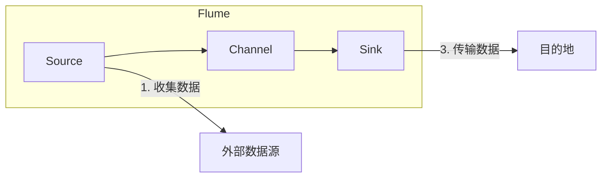
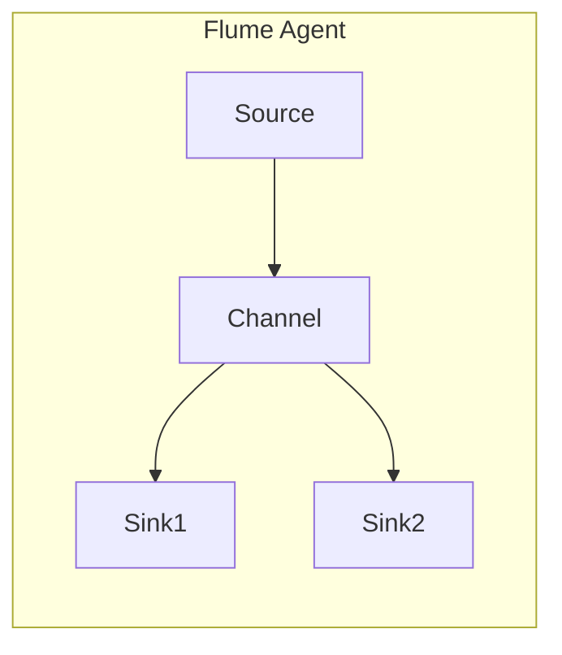
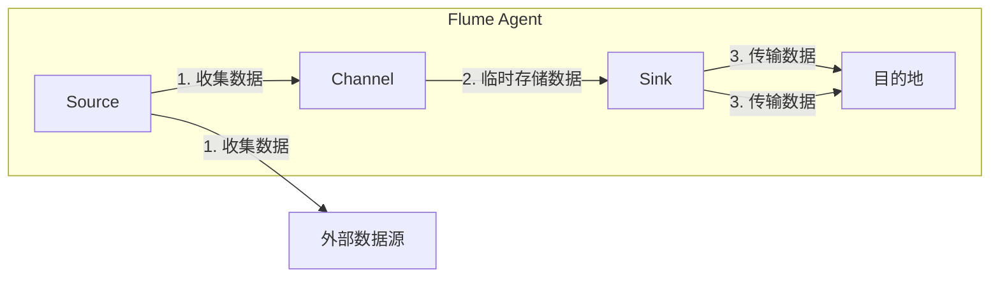

# Flume原理与代码实例讲解

## 1.背景介绍

在当今大数据时代，数据的采集和传输是整个数据处理流程中的关键环节。Apache Flume是一个分布式、可靠、高可用的数据采集系统,旨在高效地从不同的数据源收集数据,并将其传输到集中存储系统中,为后续的数据处理和分析奠定基础。

Flume的设计理念是基于流式数据处理模型,它可以从各种不同的数据源(如Web服务器日志、网络流量数据、社交媒体数据等)收集数据,并将其传输到HDFS、HBase、Kafka等目的地。Flume的架构采用简单、灵活、可扩展的方式,使其能够轻松地集成到现有的数据基础设施中。

## 2.核心概念与联系

### 2.1 Flume的核心组件

Flume由以下三个核心组件组成:

1. **Source(源头)**: 源头是数据进入Flume的入口,它负责从外部数据源(如Web服务器日志、网络流量数据等)收集数据,并将其传输到Channel中。Flume支持多种不同类型的Source,如Avro Source、Syslog Source、Kafka Source等。

2. **Channel(通道)**: Channel是一个可靠的事务性传输通道,它位于Source和Sink之间,用于临时存储从Source传输过来的事件数据,直到Sink将其消费掉。Channel支持多种不同的实现,如Memory Channel、File Channel等。

3. **Sink(下游)**: Sink是Flume的出口,它从Channel中取出事件数据,并将其传输到下一个目的地(如HDFS、HBase、Kafka等)。Flume支持多种不同类型的Sink,如HDFS Sink、Kafka Sink、Hbase Sink等。

这三个组件通过Source->Channel->Sink的方式构成了Flume的数据传输流程。



### 2.2 Flume Agent

Flume Agent是Flume的基本单元,由一个Source、一个Channel和一个或多个Sink组成。每个Flume Agent都是一个独立的进程,可以部署在不同的物理机器上,实现数据的分布式采集和传输。



### 2.3 Flume的可靠性

Flume的可靠性主要体现在以下几个方面:

1. **事务机制**: Flume采用事务机制来保证数据的一致性和可靠性。每个事件数据从Source传输到Channel,再从Channel传输到Sink,都是一个原子性操作,要么全部成功,要么全部失败。

2. **Channel的持久化**: Channel可以选择持久化存储事件数据,如File Channel就将事件数据存储在本地文件系统中,以防止数据丢失。

3. **故障转移和重试机制**: Flume支持故障转移和重试机制,当某个组件(Source、Channel或Sink)发生故障时,Flume会自动切换到备用组件或重试失败的操作,以确保数据的可靠传输。

4. **流控机制**: Flume采用了流控机制来防止数据源过载或Channel溢出,从而避免数据丢失。

## 3.核心算法原理具体操作步骤

### 3.1 Flume的数据传输流程

Flume的数据传输流程如下:

1. Source从外部数据源收集数据,并将其封装成事件(Event)。

2. Source将事件传输到Channel中,并等待Channel的确认。如果Channel确认成功,则Source将事件从内存中移除;否则,Source会重试或将事件写入备份通道。

3. Sink从Channel中取出事件,并将其传输到下一个目的地。如果传输成功,Sink会通知Channel移除相应的事件;否则,事件会保留在Channel中,等待下一次重试。

4. Channel定期执行事务提交或回滚操作,以确保数据的一致性和可靠性。



### 3.2 Flume的故障处理机制

Flume采用了多种机制来处理故障情况,确保数据的可靠传输:

1. **故障转移**: 当某个组件(Source、Channel或Sink)发生故障时,Flume会自动切换到备用组件,以继续数据的传输。

2. **重试机制**: 如果某个操作(如将数据从Source传输到Channel,或从Channel传输到Sink)失败,Flume会自动重试该操作,直到成功或达到重试次数上限。

3. **备份通道**: 如果Channel发生故障或溢出,Source可以将数据写入备份通道,以防止数据丢失。

4. **流控机制**: Flume采用了流控机制来防止数据源过载或Channel溢出,从而避免数据丢失。当Channel的容量达到一定阈值时,Source会暂停数据传输,直到Channel有足够的空间。

5. **事务机制**: Flume的事务机制确保了数据传输的原子性,要么全部成功,要么全部失败,从而保证数据的一致性和可靠性。

## 4.数学模型和公式详细讲解举例说明

在Flume中,流控机制是一个非常重要的特性,它可以防止数据源过载或Channel溢出,从而避免数据丢失。Flume采用了基于令牌桶算法(Token Bucket Algorithm)的流控机制。

### 4.1 令牌桶算法原理

令牌桶算法是一种用于控制数据流量的算法,它通过限制数据的发送速率来实现流量控制。该算法的工作原理如下:

1. 有一个固定大小的令牌桶,用于存储令牌。
2. 令牌以固定的速率(令牌发放速率)向令牌桶中添加。
3. 每次发送数据时,需要从令牌桶中取出一定数量的令牌。如果令牌桶中没有足够的令牌,则需要等待直到有足够的令牌可用。
4. 令牌桶的大小限制了数据的突发发送速率,而令牌发放速率则限制了长期的平均发送速率。

令牌桶算法可以用以下公式表示:

$$
\begin{align}
\text{令牌桶大小} &= \text{burst size} \\
\text{令牌发放速率} &= \text{average rate} \\
\text{可发送数据量} &= \min(\text{令牌桶中的令牌数}, \text{待发送数据量})
\end{align}
$$

其中:

- `burst size`表示令牌桶的大小,决定了数据的突发发送速率。
- `average rate`表示令牌发放速率,决定了数据的长期平均发送速率。
- `可发送数据量`表示在当前时刻可以发送的数据量,取决于令牌桶中的令牌数和待发送数据量的最小值。

### 4.2 Flume中的令牌桶算法实现

在Flume中,令牌桶算法被应用于Source和Sink的流控机制。每个Source和Sink都有一个令牌桶,用于控制数据的发送速率。

对于Source,令牌桶算法的参数如下:

- `source.&lt;source_name&gt;.&lt;instance&gt;.channels = &lt;channel_name&gt;`
- `source.&lt;source_name&gt;.&lt;instance&gt;.channels.&lt;channel_name&gt;.type = memory`
- `source.&lt;source_name&gt;.&lt;instance&gt;.channels.&lt;channel_name&gt;.capacity = &lt;capacity&gt;`
- `source.&lt;source_name&gt;.&lt;instance&gt;.channels.&lt;channel_name&gt;.transactionCapacity = &lt;transaction_capacity&gt;`
- `source.&lt;source_name&gt;.&lt;instance&gt;.channels.&lt;channel_name&gt;.byteCapacityBufferPercentage = &lt;byte_capacity_buffer_percentage&gt;`

其中:

- `capacity`表示Channel的容量,相当于令牌桶的大小。
- `transaction_capacity`表示每个事务可以存储的最大事件数。
- `byte_capacity_buffer_percentage`表示用于缓冲区的字节容量百分比。

对于Sink,令牌桶算法的参数如下:

- `sink.&lt;sink_name&gt;.&lt;instance&gt;.channel = &lt;channel_name&gt;`
- `sink.&lt;sink_name&gt;.&lt;instance&gt;.batchSize = &lt;batch_size&gt;`
- `sink.&lt;sink_name&gt;.&lt;instance&gt;.batchTimeout = &lt;batch_timeout&gt;`

其中:

- `batch_size`表示每个批次可以处理的最大事件数,相当于令牌桶的大小。
- `batch_timeout`表示批次处理的超时时间,如果在该时间内没有达到`batch_size`,则会将已有的事件发送出去。

通过合理配置这些参数,可以有效控制Flume的数据发送速率,防止数据源过载或Channel溢出,从而避免数据丢失。

## 5.项目实践:代码实例和详细解释说明

本节将通过一个实际的代码示例,展示如何使用Flume采集日志数据并将其传输到HDFS中。

### 5.1 环境准备

1. 安装并配置Hadoop和HDFS环境。
2. 下载并解压Flume发行版。
3. 在`$FLUME_HOME/conf`目录下创建一个名为`flume-hdfs.conf`的配置文件。

### 5.2 配置Flume Agent

在`flume-hdfs.conf`文件中,配置一个Flume Agent,包括Source、Channel和Sink:

```properties
# 定义Source
agent1.sources = source1
agent1.sources.source1.type = exec
agent1.sources.source1.command = tail -F /path/to/log/file.log

# 定义Channel
agent1.channels = channel1
agent1.channels.channel1.type = memory
agent1.channels.channel1.capacity = 1000
agent1.channels.channel1.transactionCapacity = 100

# 定义Sink
agent1.sinks = sink1
agent1.sinks.sink1.type = hdfs
agent1.sinks.sink1.hdfs.path = hdfs://namenode:8020/flume/logs/%Y/%m/%d/%H
agent1.sinks.sink1.hdfs.filePrefix = logs-
agent1.sinks.sink1.hdfs.round = true
agent1.sinks.sink1.hdfs.roundValue = 10
agent1.sinks.sink1.hdfs.roundUnit = minute

# 绑定Source和Sink到Channel
agent1.sources.source1.channels = channel1
agent1.sinks.sink1.channel = channel1
```

配置说明:

1. `agent1.sources = source1`定义了一个名为`source1`的Source。
2. `agent1.sources.source1.type = exec`指定Source的类型为`exec`,表示从命令行获取数据。
3. `agent1.sources.source1.command = tail -F /path/to/log/file.log`指定了要执行的命令,即持续监视日志文件的新内容。
4. `agent1.channels = channel1`定义了一个名为`channel1`的Channel。
5. `agent1.channels.channel1.type = memory`指定Channel的类型为内存Channel。
6. `agent1.channels.channel1.capacity = 1000`设置Channel的容量为1000个事件。
7. `agent1.channels.channel1.transactionCapacity = 100`设置每个事务可以存储的最大事件数为100。
8. `agent1.sinks = sink1`定义了一个名为`sink1`的Sink。
9. `agent1.sinks.sink1.type = hdfs`指定Sink的类型为HDFS Sink。
10. `agent1.sinks.sink1.hdfs.path = hdfs://namenode:8020/flume/logs/%Y/%m/%d/%H`指定HDFS的路径,其中`%Y`、`%m`、`%d`和`%H`分别表示年、月、日和小时。
11. `agent1.sinks.sink1.hdfs.filePrefix = logs-`指定HDFS文件的前缀为`logs-`。
12. `agent1.sinks.sink1.hdfs.round = true`启用了滚动写入功能。
13. `agent1.sinks.sink1.hdfs.roundValue = 10`设置滚动写入的时间间隔为10分钟。
14. `agent1.sinks.sink1.hdfs.roundUnit = minute`指定时间单位为分钟。
15. `agent1.sources.source1.channels = channel1`将Source绑定到Channel。
16. `agent1.sinks.sink1.channel = channel1`将Sink绑定到