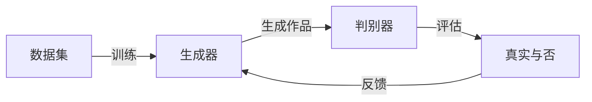

# GAN在艺术创作领域的应用

## 1. 背景介绍
近年来，人工智能技术在艺术创作领域的应用日益广泛，尤其是生成对抗网络（Generative Adversarial Networks，简称GAN）的出现，为艺术创作带来了革命性的变化。GAN通过模拟艺术创作过程中的生成与鉴赏两个环节，能够创造出令人惊叹的艺术作品，这不仅挑战了传统艺术创作的边界，也为艺术家提供了新的工具和灵感来源。

## 2. 核心概念与联系
GAN由生成器（Generator）和判别器（Discriminator）两部分组成。生成器负责产生数据，判别器负责评估数据。两者在一个动态的对抗过程中不断进化，生成器试图产生越来越逼真的作品，而判别器则努力提高鉴别真伪的能力。



## 3. 核心算法原理具体操作步骤
GAN的训练过程包括以下步骤：
1. 从数据集中随机选取真实样本。
2. 生成器接收随机噪声，产生假样本。
3. 判别器评估真实样本和假样本，并给出评分。
4. 生成器根据判别器的评分调整参数，以生成更逼真的样本。
5. 重复步骤1-4，直至生成器产生的假样本无法被判别器区分。

## 4. 数学模型和公式详细讲解举例说明
GAN的核心是一个极小极大问题，其数学表达为：
$$
\min_G \max_D V(D, G) = \mathbb{E}_{x\sim p_{data}(x)}[\log D(x)] + \mathbb{E}_{z\sim p_z(z)}[\log(1 - D(G(z)))]
$$
其中，$D(x)$是判别器对样本$x$为真实样本的评估概率，$G(z)$是生成器根据输入噪声$z$生成的样本。通过优化这个公式，生成器和判别器在对抗中不断提升。

## 5. 项目实践：代码实例和详细解释说明
以TensorFlow为例，以下是一个简单的GAN模型代码片段：

```python
import tensorflow as tf

# 生成器网络结构
def generator(z, reuse=None):
    with tf.variable_scope('gen', reuse=reuse):
        # 网络层代码省略
        return output

# 判别器网络结构
def discriminator(X, reuse=None):
    with tf.variable_scope('dis', reuse=reuse):
        # 网络层代码省略
        return output, logits

# 代码细节省略...

# 训练过程
for epoch in range(epochs):
    for batch in range(n_batches):
        # 训练判别器
        # 代码细节省略...
        
        # 训练生成器
        # 代码细节省略...
```

## 6. 实际应用场景
GAN在艺术创作领域的应用包括但不限于：
- 绘画创作：生成新颖的绘画作品。
- 音乐创作：创作音乐旋律和和声。
- 文学创作：生成诗歌、小说等文学作品。

## 7. 工具和资源推荐
- TensorFlow和PyTorch：两个主流的深度学习框架，适合GAN的开发和训练。
- GANs Zoo：收录了多种GAN变体的代码库。
- Artbreeder：一个基于GAN的在线艺术创作平台。

## 8. 总结：未来发展趋势与挑战
GAN在艺术创作领域的应用前景广阔，但也面临着诸如版权问题、创作伦理等挑战。未来的发展趋势可能包括更加智能化的创作辅助工具，以及更深入的艺术风格和表现形式的探索。

## 9. 附录：常见问题与解答
Q1: GAN生成的艺术作品是否具有版权？
A1: 这是一个复杂的法律问题，目前还没有明确的答案。

Q2: GAN在艺术创作中的应用是否会取代人类艺术家？
A2: GAN更多的是作为一种工具和媒介，它无法取代人类艺术家的创造力和情感表达。

作者：禅与计算机程序设计艺术 / Zen and the Art of Computer Programming