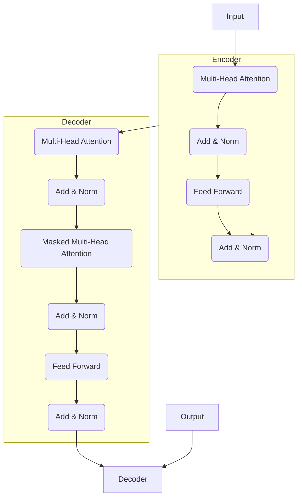

# GLM原理与代码实例讲解

## 1.背景介绍

在自然语言处理(NLP)领域,生成式语言模型(Generative Language Model,GLM)是一种重要的模型架构,广泛应用于机器翻译、文本生成、问答系统等多种任务中。GLM旨在学习文本数据的概率分布,从而能够生成看起来像人类书写的自然语言序列。

传统的语言模型通常基于n-gram统计或神经网络,只能捕捉局部的语义和语法信息。而现代GLM则采用了自注意力(Self-Attention)机制和大规模预训练,从而能够学习全局的上下文语义关系,显著提高了语言生成的质量和一致性。

其中,Transformer模型架构和BERT等预训练模型的出现,标志着GLM进入了一个全新的发展阶段。这些创新方法不仅在学术界引起了广泛关注,同时也推动了行业实践中GLM的大规模应用。

## 2.核心概念与联系

### 2.1 自注意力机制(Self-Attention)

自注意力机制是GLM中的核心创新,它允许模型在计算目标序列的每个位置时,直接关注整个输入序列的所有位置。这种全局关注机制打破了RNN等序列模型的局限性,使得GLM能够更好地捕捉长距离依赖关系。

自注意力的计算过程可以概括为三个步骤:

1. 计算Query、Key和Value向量
2. 计算注意力权重
3. 加权求和得到注意力表示

具体而言,给定一个输入序列$X=(x_1,x_2,...,x_n)$,我们首先将其线性映射到Query($Q$)、Key($K$)和Value($V$)向量:

$$Q=XW^Q,K=XW^K,V=XW^V$$

其中,$W^Q,W^K,W^V$是可学习的权重矩阵。

接下来,我们计算Query和Key之间的点积,得到注意力权重矩阵:

$$\text{Attention}(Q,K,V)=\text{softmax}(\frac{QK^T}{\sqrt{d_k}})V$$

其中,$d_k$是缩放因子,用于防止点积值过大导致梯度消失。

最后,加权求和$V$即可得到注意力表示$\text{Attention}(Q,K,V)$,它融合了输入序列中所有位置的信息。

### 2.2 Transformer

Transformer是第一个完全基于自注意力机制的序列模型,它完全舍弃了RNN,使用多头注意力(Multi-Head Attention)和位置编码(Positional Encoding)来建模序列。

Transformer的核心组件是编码器(Encoder)和解码器(Decoder)。编码器将输入序列映射到中间表示,解码器则基于中间表示生成目标序列。两者都由多层多头注意力和前馈网络组成。

由于计算复杂度较低且并行能力强,Transformer在长序列建模任务中表现出色,成为了GLM的主流模型架构。

### 2.3 BERT及其变体

BERT(Bidirectional Encoder Representations from Transformers)是一种基于Transformer的双向预训练语言模型,在NLP各种下游任务上取得了突破性进展。

BERT的创新之处在于,它使用了Masked Language Model(掩码语言模型)和Next Sentence Prediction(下一句预测)两个预训练目标,从而学习到了双向语义表示。这种双向表示能够更好地融合上下文信息,从而提高了语义理解能力。

自BERT问世以来,研究人员提出了诸多变体模型,如XLNet、RoBERTa、ALBERT等,进一步改进了预训练方法和模型结构,在一定程度上缓解了BERT的一些缺陷,如QA偏差、输入长度限制等。

这些基于Transformer的双向语言模型在各种NLP任务上表现卓越,为GLM的发展奠定了坚实基础。

## 3.核心算法原理具体操作步骤

在了解了GLM的核心概念后,我们来具体分析其算法原理和操作步骤。这里以Transformer模型为例进行介绍。

### 3.1 Transformer模型架构

Transformer模型由编码器(Encoder)和解码器(Decoder)两部分组成,如下图所示:



编码器由多层相同的子层组成,每一层包含两个子层:

1. 多头注意力(Multi-Head Attention)子层
2. 前馈网络(Feed Forward)子层

解码器也由多层相同的子层组成,每一层包含三个子层:

1. 遮掩多头注意力(Masked Multi-Head Attention)子层
2. 多头注意力(Multi-Head Attention)子层,关注编码器输出
3. 前馈网络(Feed Forward)子层

每个子层的输出都会经过残差连接(Residual Connection)和层归一化(Layer Normalization),以帮助模型训练并防止梯度消失。

### 3.2 编码器(Encoder)

编码器的作用是将输入序列映射到中间表示序列,供解码器使用。编码器的具体操作步骤如下:

1. 将输入序列$X=(x_1,x_2,...,x_n)$通过词嵌入层映射为词向量序列。
2. 对词向量序列添加位置编码,赋予每个词向量位置信息。
3. 将位置编码后的序列输入到第一层编码器子层。
4. 在每一层编码器子层中:
    - 计算多头注意力,捕捉输入序列中不同位置间的依赖关系。
    - 通过前馈网络进一步加工注意力表示。
    - 对输出进行残差连接和层归一化。
5. 重复步骤4,直到最后一层编码器子层的输出。
6. 将最后一层编码器子层的输出作为中间表示序列,送入解码器。

### 3.3 解码器(Decoder)

解码器的作用是根据中间表示序列生成目标序列。解码器的具体操作步骤如下:

1. 将目标序列$Y=(y_1,y_2,...,y_m)$通过词嵌入层映射为词向量序列。
2. 对词向量序列添加位置编码。
3. 将位置编码后的序列输入到第一层解码器子层。
4. 在每一层解码器子层中:
    - 计算遮掩多头注意力,只关注当前位置之前的词。
    - 计算多头注意力,关注编码器输出的中间表示序列。
    - 通过前馈网络进一步加工注意力表示。
    - 对输出进行残差连接和层归一化。
5. 重复步骤4,直到最后一层解码器子层的输出。
6. 将最后一层解码器子层的输出通过线性层和softmax,生成概率分布。
7. 根据概率分布采样或选取最大值,得到预测的目标序列。

需要注意的是,在训练时我们使用Teacher Forcing,将上一步的正确目标作为当前步的输入;而在推理时,我们使用贪婪搜索或束搜索等策略,自回归地生成序列。

## 4.数学模型和公式详细讲解举例说明

在上一节中,我们概述了Transformer模型的核心算法原理。现在,我们将更加深入地探讨其中涉及的数学模型和公式。

### 4.1 注意力机制(Attention Mechanism)

注意力机制是Transformer的核心所在,它允许模型在计算目标序列的每个位置时,直接关注整个输入序列的所有位置。

具体来说,给定一个查询向量$q$、键向量$k$和值向量$v$,注意力机制的计算过程如下:

1. 计算查询向量与所有键向量的点积相似度得分:

$$\text{score}(q,k_i)=q^Tk_i$$

2. 对相似度得分进行缩放并应用softmax函数,得到注意力权重:

$$\alpha_i=\text{softmax}(\frac{\text{score}(q,k_i)}{\sqrt{d_k}})=\frac{\exp(\text{score}(q,k_i)/\sqrt{d_k})}{\sum_j\exp(\text{score}(q,k_j)/\sqrt{d_k})}$$

其中,$d_k$是键向量的维度,用于缩放点积值,防止过大的值导致softmax函数梯度消失。

3. 将注意力权重与值向量加权求和,得到注意力表示:

$$\text{attn}(q,K,V)=\sum_i\alpha_iv_i$$

在Transformer中,查询向量$q$、键向量$K$和值向量$V$都是通过线性变换从输入序列中获得的。

### 4.2 多头注意力(Multi-Head Attention)

单一的注意力机制只能从一个表示子空间捕捉序列间的依赖关系,这可能过于简单。为了提高模型的表达能力,Transformer引入了多头注意力机制。

多头注意力将查询向量$q$、键向量$K$和值向量$V$分别线性投影到$h$个子空间,并在每个子空间上并行计算注意力,最后将所有注意力表示拼接起来:

$$\begin{aligned}
\text{head}_i&=\text{attn}(qW_i^Q,KW_i^K,VW_i^V)\\
\text{MultiHead}(q,K,V)&=\text{concat}(\text{head}_1,...,\text{head}_h)W^O
\end{aligned}$$

其中,$W_i^Q,W_i^K,W_i^V$和$W^O$是可学习的线性变换参数。通过多头注意力,模型可以关注输入序列中不同的表示子空间,从而提高建模能力。

### 4.3 位置编码(Positional Encoding)

由于Transformer没有循环或卷积结构,因此无法直接捕捉序列中词元的位置信息。为了解决这个问题,Transformer在输入序列中引入了位置编码。

位置编码是一个将词元位置映射到向量的函数,可以通过不同的方式进行定义。最常用的是基于正弦和余弦函数的位置编码:

$$\begin{aligned}
\text{PE}_{(pos,2i)}&=\sin(pos/10000^{2i/d_\text{model}})\\
\text{PE}_{(pos,2i+1)}&=\cos(pos/10000^{2i/d_\text{model}})
\end{aligned}$$

其中,$pos$是词元的位置索引,而$i$是维度索引。这种位置编码可以被模型直接学习,并且对于不同的位置是不同的,从而赋予了词向量位置信息。

### 4.4 示例:英译中机器翻译

为了更好地理解上述数学模型和公式,我们来看一个英译中机器翻译的具体示例。

假设我们有一个英文输入序列"I love machine learning"和对应的中文目标序列"我爱机器学习"。在Transformer的编码器中,我们首先将输入序列映射为词向量序列,并添加位置编码:

```python
import torch
import torch.nn as nn
import math

# 词嵌入层
embed = nn.Embedding(vocab_size, d_model)

# 位置编码
pos_enc = torch.zeros(max_len, d_model)
pos = torch.arange(0, max_len).unsqueeze(1)
div_term = torch.exp(torch.arange(0, d_model, 2) * (-math.log(10000.0) / d_model))
pos_enc[:, 0::2] = torch.sin(pos * div_term)
pos_enc[:, 1::2] = torch.cos(pos * div_term)

# 输入序列
input_ids = torch.tensor([vocab['I'], vocab['love'], vocab['machine'], vocab['learning']])
input_embeds = embed(input_ids) + pos_enc[:input_ids.size(0)]
```

接下来,我们计算多头注意力:

```python
# 多头注意力
class MultiHeadAttention(nn.Module):
    def __init__(self, heads, 